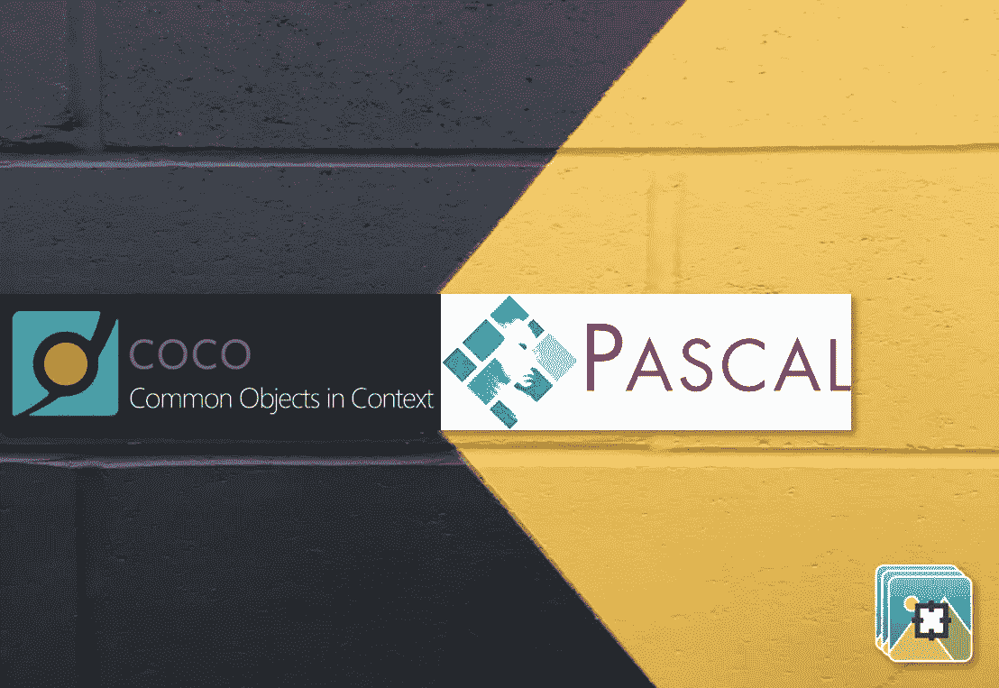
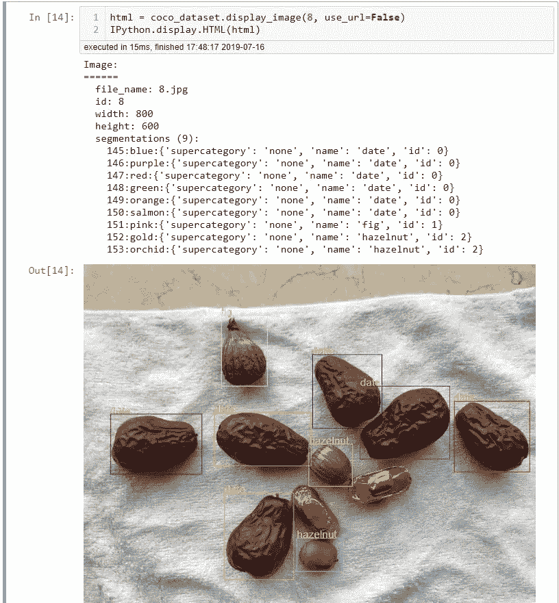

# 如何创建用于对象检测的自定义 COCO 数据集

> 原文：<https://medium.datadriveninvestor.com/how-to-create-custom-coco-data-set-for-object-detection-96ec91958f36?source=collection_archive---------0----------------------->

[](http://www.track.datadriveninvestor.com/1B9E)

[之前](https://www.dlology.com/blog/how-to-train-an-object-detection-model-with-mmdetection/)，我们已经用 Pascal VOC 数据格式的自定义注释数据集训练了一个 mmdetection 模型。如果您的对象检测训练管道需要 COCO 数据格式，您就不太走运了，因为我们使用的标记工具不支持 COCO 注释格式。如果你仍然想继续使用注释工具，然后将注释转换成 COCO 格式，这篇文章是为你准备的。

我们将首先简要介绍两种注释格式，然后介绍将 VOC 转换为 COCO 格式的转换脚本，最后，我们将通过绘制边界框和类标签来验证转换结果。

[](https://www.datadriveninvestor.com/2019/02/07/8-skills-you-need-to-become-a-data-scientist/) [## 成为数据科学家所需的 8 项技能|数据驱动型投资者

### 数字吓不倒你？没有什么比一张漂亮的 excel 表更令人满意的了？你会说几种语言…

www.datadriveninvestor.com](https://www.datadriveninvestor.com/2019/02/07/8-skills-you-need-to-become-a-data-scientist/) 

# Pascal VOC 和 COCO 注释

Pascal VOC 注释保存为 XML 文件，每个图像一个 XML 文件。对于标注工具生成的 XML 文件。它包含了<path>元素中图像的路径。每个边界框存储在一个元素中，示例如下。</path>

```
<object>
	<name>fig</name>
	<pose>Unspecified</pose>
	<truncated>**0**</truncated>
	<difficult>**0**</difficult>
	<bndbox>
		<xmin>**256**</xmin>
		<ymin>**27**</ymin>
		<xmax>**381**</xmax>
		<ymax>**192**</ymax>
	</bndbox>
</object>
```

如你所见，边界框由两个点定义，左上角和右下角。

对于 COCO 数据格式，首先，一个数据集中的所有注释只有一个 JSON 文件，或者数据集的每个分割都有一个 JSON 文件(Train/Val/Test)。

边界框表示为左上角的起始坐标和框的宽度和高度，类似于`"bbox" :[x,y,width,height]`。

下面是 COCO 数据格式 JSON 文件的一个示例，它只包含一个图像(如在顶级“images”元素中看到的)、在顶级“categories”元素中看到的总共 3 个唯一的类别/类以及在顶级“annotations”元素中看到的图像的 2 个带注释的边界框。

```
{
  "type": "instances",
  "images": [
    {
      "file_name": "0.jpg",
      "height": **600**,
      "width": **800**,
      "id": **0**
    }
  ],
  "categories": [
    {
      "supercategory": "none",
      "name": "date",
      "id": **0**
    },
    {
      "supercategory": "none",
      "name": "hazelnut",
      "id": **2**
    },
    {
      "supercategory": "none",
      "name": "fig",
      "id": **1**
    }
  ],
  "annotations": [
    {
      "id": **1**,
      "bbox": [
        **100**,
        **116**,
        **140**,
        **170**
      ],
      "image_id": **0**,
      "segmentation": [],
      "ignore": **0**,
      "area": **23800**,
      "iscrowd": **0**,
      "category_id": **0**
    },
    {
      "id": **2**,
      "bbox": [
        **321**,
        **320**,
        **142**,
        **102**
      ],
      "image_id": **0**,
      "segmentation": [],
      "ignore": **0**,
      "area": **14484**,
      "iscrowd": **0**,
      "category_id": **0**
    }
  ]
}
```

# 将 Pascal VOC 转换为 COCO 注释

一旦有了一些带注释的 XML 和图像文件，就把它们放在类似下面的文件夹结构中，

```
data
 └── VOC2007
 ├── Annotations
 │ ├── 0.xml
 │ ├── ...
 │ └── 9.xml
 └── JPEGImages
 ├── 0.jpg
 ├── ...
 └── 9.jpg
```

然后你可以像这样从我的 GitHub 运行 [voc2coco.py](https://github.com/Tony607/voc2coco/blob/master/voc2coco.py) 脚本，这会为你生成一个 coco 数据格式的 JSON 文件。

```
python voc2coco.py ./data/VOC/Annotations ./data/coco/output.json
```

一旦我们有了 JSON 文件，我们就可以通过在图像上绘制边界框和类标签来可视化 COCO 注释。打开 Jupyter 笔记本中的 [COCO_Image_Viewer.ipynb](https://github.com/Tony607/voc2coco/blob/master/COCO_Image_Viewer.ipynb) 。在笔记本中找到下面的单元格，它调用`display_image`方法在笔记本中生成 SVG 图。

```
html = coco_dataset.display_image(**0**, use_url=False)
IPython.display.HTML(html)
```

第一个参数是图像 id，对于我们的演示数据集，总共有 18 个图像，所以您可以尝试将其设置为 0 到 17。



# 结论和进一步阅读

在这个快速教程中，您已经学习了如何坚持使用流行的[标签](https://tzutalin.github.io/labelImg/)进行自定义数据集注释，然后将 Pascal VOC 转换为 COCO 数据集，以训练需要 COCO 格式数据集的对象检测模型管道。

## 您可能会发现以下链接很有用

如何用 mmdetection 训练一个对象检测模型——我之前的一篇关于创建自定义 Pascal VOC 注释文件和用 PyTorch mmdetection 框架训练一个对象检测模型的帖子。

[COCO 数据格式](http://cocodataset.org/#format-data)

[Pascal VOC 文档](https://pjreddie.com/media/files/VOC2012_doc.pdf)

下载 [labelImg](https://tzutalin.github.io/labelImg/) 用于边界框注释。

获取这篇文章的源代码，查看[我的 GitHub repo](https://github.com/Tony607/voc2coco) 。

[](https://github.com/Tony607/voc2coco) [## Tony607/voc2coco

### 如何创建用于对象检测的自定义 COCO 数据集- Tony607/voc2coco

github.com](https://github.com/Tony607/voc2coco) 

*原载于*[*www.dlology.com*](https://www.dlology.com/blog/how-to-create-custom-coco-data-set-for-object-detection/)*。*