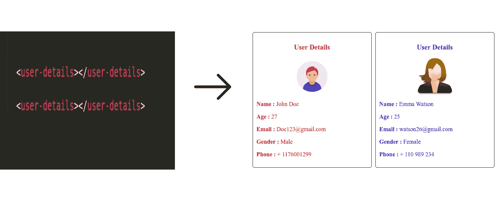

# 如何在不使用任何框架的情况下创建自定义元素

> 原文：<https://medium.datadriveninvestor.com/how-to-create-custom-element-without-using-any-framework-cb502f3795b0?source=collection_archive---------3----------------------->

[](http://www.track.datadriveninvestor.com/1B9E)

custom element example which we will build in the tutorial

当我们使用 HTML 编写用户界面时，有时处理复杂的 HTML(以及相关的样式和脚本)并不容易，有时您必须在应用程序中多次重写相同的代码，如果您不小心，这可能会将页面弄得一团糟。

自定义元素旨在通过为可重用的 web 组件提供封装功能来解决此类问题，这些组件可以在任何地方重用。

## 什么是定制元素—

使用自定义元素开发者可以创建新的 HTML 标签或者可以改进现有的 HTML 标签。定制元素是现代化 HTML 的方法，如果原生 HTML 没有提供您想要的任何定制功能，您可以创建定制元素来完成相同的任务。

例如，如果您想要显示用户的详细信息，您可以创建一个名为`<user-details></user-details>`的自定义元素，并且可以在应用程序中重用。

> [DDI 编辑推荐—网络开发者训练营](http://go.datadriveninvestor.com/WebDevelopment1/matf)

在创建定制元素时，您应该记住以下几点

1.  定制元素的名称必须包含破折号(-)，因此`<my-element>`、`<customer-profile>`、`<journey-details>`都是有效的定制元素名称，而`<myComponent>`、`<fancyButton>`是无效的定制元素名称。这个要求是必要的，因为 HTML 解析器可以区分定制元素和常规元素。
2.  你不能多次注册同一个标签，如果你试图这样做将会抛出一个 DOM 异常。
3.  自定义元素不能自结束，因为 HTML 只允许少数元素自结束，所以总是写一个结束标记。

实现 web 组件的一般方法是—

1.  创建一个用于指定 web 组件功能的类或函数。
2.  使用`customElement.define()`定义您的定制元素，它带有两个参数，第一个参数是标记名，第二个参数是定义功能的类，可选地，一个包含`extends`属性的 options 对象，它指定您的元素继承的内置元素(如果有)。
3.  如果需要，使用`Element.attachShadow()`方法将影子 DOM 附加到自定义元素，使用常规 DOM 方法将所有子元素和事件监听器等附加到影子 DOM。

4.就像使用常规元素一样，可以在页面上任意位置使用自定义元素。

因此，用户详细信息元素可以这样定义—

```
customElements.define('user-details',UserDetails);
```

在上面的例子中，第一个参数是自定义标记名，第二个参数是定义功能的类。

## 定制元素有两种类型

1.  自主定制元素—它是独立的，不从标准 HTML 元素继承。你可以像写普通 HTML 元素一样在页面上使用它们，例如`<user-details></user-details>.`
2.  定制内置元素—它从基本 HTML 元素继承而来，创建现有元素的定制版本。它们可以通过编写基本的 HTML 元素和使用`is`属性指定自定义元素的名称来使用。例如这里的`<button is='fancy-button'></button>``fancy-button`是自定义元素，它将扩展`HTMLButtonElement`。

## 一个元素的不同生命周期挂钩—

元素类定义中有不同的回调，它们在元素的不同生命周期调用

1.  `connectedCallback` *—* 当元素附加到文档 DOM 时调用。
2.  `disconnectedCallback` —每次从文档 DOM 中删除元素时都会调用它。
3.  `adoptedCallback` —每次自定义元素移动到新文档时调用。
4.  `attributeChangedCallback` —每次添加、删除或更改任何属性时调用。在静态 get `observedAttributes`方法中指定了我们必须注意到变化的属性。

## 影子王国—

保持自定义元素的标记结构、样式和行为隐藏并与页面的其他代码分开是非常重要的，这样不同的部分就不会冲突。例如，自定义元素中有一个子元素，其类名与页面上的任何元素相同，那么在这种情况下，如果我们根据类名设计元素样式，可能会与自定义元素样式冲突，但使用影子 DOM 可以避免这种情况。

影子 DOM 允许隐藏的 DOM 树附加到普通 DOM 树中的元素上——这个影子 DOM 树从影子根开始，然后你可以像普通 DOM 一样附加任何你想要的元素。

理论部分已经结束，现在让我们创建一个自定义元素`<user-details></user-details>`。

创建两个名为`index.html`和`index.js`文件。

class which define the functionality of element.

让我们来理解代码—

首先，有一个构造器，它调用必需的超，以便建立正确的原型链。

现在是`observedAttributes()`方法，我们在其中指定属性名称，我们希望得到属性更改的通知。

现在`get`和`set`分别为简单返回和设置属性值的属性。

现在`connectedCallback`调用了当元素附加到文档时的 DOM。其中我们首先创建一个影子 DOM，然后根据需要创建普通的 HTML 元素。然后我们还将`style`元素附加到影子 DOM，最后我们将所有元素附加到影子 DOM 树。

现在`attributeChangedCallback`采用三个参数属性名，旧值和新值。当任何属性被更改、删除或添加到元素中时，它被调用。我们检查旧值是否等于新值，以防止递归调用堆栈溢出。

最后，我们使用`customElements.define()`方法定义自定义元素。

现在使用上述自定义元素到我们的 index.html 页面。

using user details component.

这里我们像普通的 HTML 元素一样传递属性值。

您可以在这里获得完整代码— [Github 链接](https://github.com/satyendrakannaujiya/WebComponent)

感谢阅读😙。

编辑披露:编辑有时会发布有用资源的链接。如果你发现它们有用并购买，我们会赚很多钱。不，我不是说要把我的薯条做大。我说的是超大披萨上的意大利香肠。感谢您一直以来的支持，我们将继续为 p̶e̶p̶p̶e̶r̶o̶n̶i̶出版而努力。