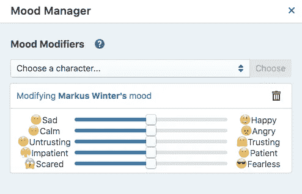

# 如何打造有感召力的情感聊天机器人

> 原文：<https://medium.datadriveninvestor.com/how-to-create-emotional-chatbots-with-charisma-1b9622d04a1c?source=collection_archive---------25----------------------->

**任何一个好故事里，都有一段旅程**。正是这些角色面临的挑战和他们对这一旅程的情感反应，让我们坐在座位的边缘，渴望找到我们接下来会发生什么。

情感感知是[魅力的关键部分。ai](https://charisma.ai) ，因为它让我们的角色更接近观众。反过来，这又会产生共鸣，将整个互动体验带入生活。Charisma.ai 项目具有特色，这是标准呼叫中心聊天机器人之间改变游戏规则的差异，也是互动聊天机器人进化情感的可能性。

要在 Charisma.ai 中做到这一点，第一步是为每个角色设置默认角色状态。这是一个简单的过程，它定义了故事开始时角色的情绪状态。如果一个角色被设定为冷静和幽默，它会做出相应的基本反应。创造一个角色的第二步，也是最后一步，是通过和它聊天来训练它，并尽可能多地给它一些基本对话的样本反应。比如，‘你好吗？迪斯尼人物和汉尼拔·莱克特会有不同的回答，系统需要认识到这一点。

一旦角色被训练完毕(这个过程大约需要 5-10 分钟)，它的基本个性和情绪就已经设定好了。

一旦你处于写作模式，角色的情绪状态可以随着任何一段对话而改变。很自然，如果一个玩家侮辱了房间里的一个角色，房间里的其他角色也应该能够做出反应。为此，单击角色对话节点上的[心形]图标，您将看到一个情感滑块列表，以及一个可供选择的角色下拉列表。使用滑块改变情绪状态，这是自动设置的。

***提示*** *:注意，Charisma.ai 中的情绪状态是递增的而不是绝对的。这意味着，如果一个角色非常生气，然后一段对话上的滑块被设置为非常冷静，这个角色会冷静下来，但不会直接完全冷静下来。重要的是让角色有更多的自然感觉，而不是二元反应，并且让用户与每个角色建立关系。*

最后，你可以在故事画面上看到你的角色的情绪状态。这可以让你看到人物在故事的发展过程中是如何发展的，也可以让你预测在最终版本中哪些故事情节可能会被触发。

总之，处理聊天机器人角色的情绪状态是一个快速发展的新领域，但对于能够为用户创造更真实和沉浸式的体验来说至关重要。Charisma.ai 将这一功能放在了界面的最前面，以促进我们的作者和所有项目对它的使用。

一如既往，我们渴望看到它是如何被使用的，并听到您的反馈，所以请在下面添加关于情感聊天机器人价值的评论，或者直接联系我们。