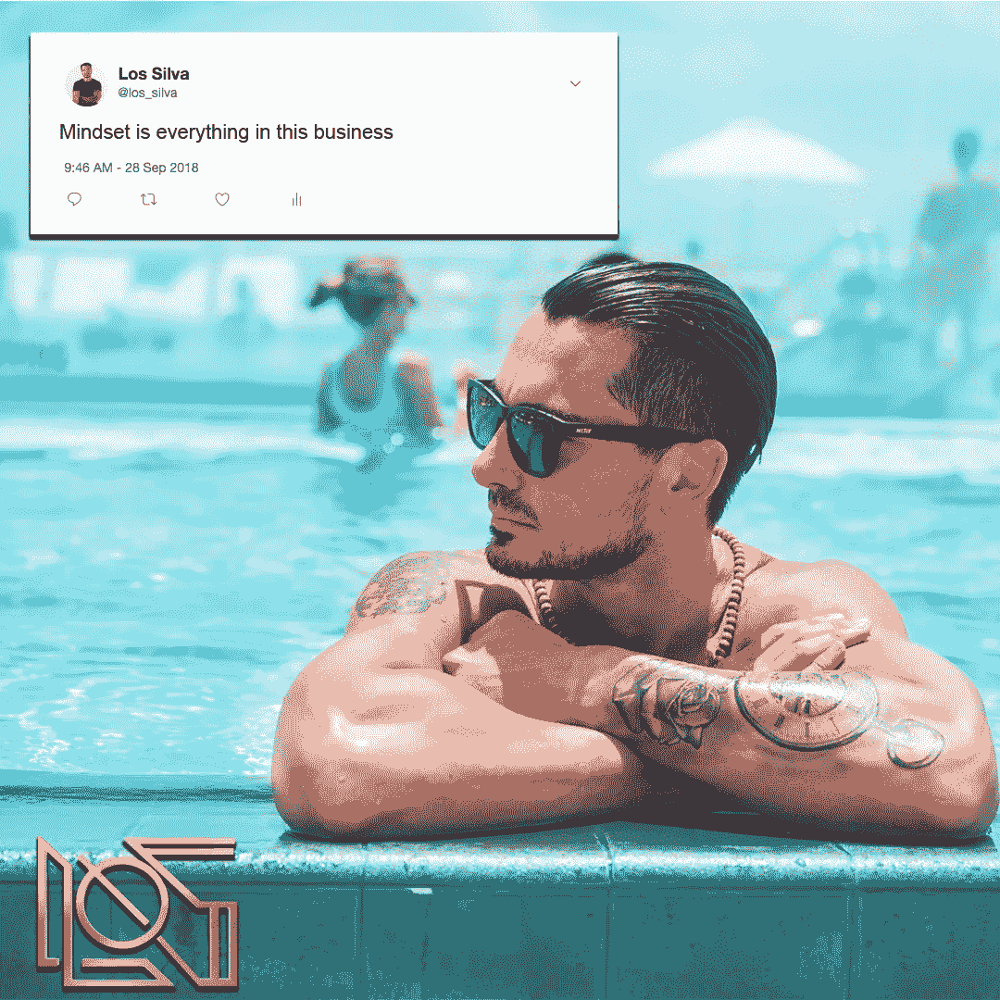

# 如何扩大你的业务

> 原文：<https://medium.datadriveninvestor.com/how-to-create-expansion-with-your-business-49b27f04862a?source=collection_archive---------28----------------------->

今天我想和大家谈谈*资料片*。

我一直在谈论**无处不在，并且在发展我们的业务**。

但我看到的情况是，很多企业家……尤其是在健身行业，以及整个有影响力的行业……他们失败了，后退一步，而不是试图**向前迈出一步，然后扩张。**

让我解释一下。

随着你业务的增长，你倾向于“挖掘”一个机会，或者看到外面有更多的机会。

所以你可以有两种不同的方式。

第一种，也是更受欢迎的方法是遵循“发光物体综合症”,说…

“嘿，我是卖教练的，但现在我要去卖 t 恤了”，“或者我一直在健身空间，但我想开始在美容博主空间推广一些完全不同的东西。”

这与你已经在做的事情非常不协调。

“我要试试这个，或者那个，”因为像每个人一样，我们都有“发光物体综合症”，我们害怕错过。

我们认为它更简单，我们认为它更快，我们认为它可能是世界上最容易的事情，我们将得到更多。

所有这些事情都是错误的，因为当你扩展到某个领域时，你需要找到与你已经在做的事情相符合的途径。

我给你举个例子。

很长一段时间，我关注的都是如何帮助企业家建立和扩大他们的品牌。

然后，我们建立了一个机构，取得这些公司的所有权。这是我们在影响者领域已经创造的的**扩展。**

我们很快意识到，我们不想让太多这样的公司参与进来。我们对此非常挑剔。

所以我们接着**建立了另一个与有影响力的人合作的机构**。我们帮助投资他们的流量，建立他们的渠道，创建他们的内容策略，建立他们与品牌的关系…等等。

然后，我们建立了一个辅导项目，帮助有影响力的人度过精神上的困难和困难时期。

在这一行，心态决定一切。我们发现许多有影响力的人没有正确的心态。

我们建造一样东西。我们只有一次对话。但这可能会从不同的角度打击你，这取决于你在企业中的地位。

> 我们通过**保持相同的内容**进行了扩张，在我们的业务中拥有本质上“不同的部门”,为做相同事情的不同人服务。
> 
> 正如你看到的那样..我们在同一条车道上。同时创造不同的增长空间。

这就是你在扩展产品或服务时需要做的事情。

第二件事是**渠道扩张**。

你们很多人都在 Instagram 上大放异彩。你很兴奋，你有 10 万——100 万粉丝。太神奇了。

但是你在其他平台上什么都没有。如果 Instagram 消失了……或者平台转移了，你会怎么做？

你不能忽视它，它一直在发生。但是没人真的(想)去想。

**你需要专注于创建一个扩展过程**。我们有一个 10 点流程，我们在其中放大内容。

我创建了一个视频内容，这个视频会发生什么呢..

它将被编辑并上传到 YouTube，IGTV，脸书。

它也将被切碎，我的 Instagram feed 将添加边框。然后剪切并上传为播客。

然后我们要把付费广告放在后面。

我们还将把它分解成书面内容。我们创建一篇文章，这篇文章将进入 LinkedIn、Medium、我们的网站等

然后它又被分解了。我们为 Twitter、Instagram、脸书等其他社交平台创建更小的内容。

**我们正在做一个视频，然后我们将它扩展到多种内容、产品和服务。**

这就是你需要创造的。

最后一件事。

一旦你真正在你的产品套件中创造了扩展，你已经用你的内容创建了扩展…你需要**扩展你的利基。**

就像我之前说的，我们在健身领域起步和扩张。

我们做得很好，并且在不断成长。我的目标是成为世界上最大的健身影响者和营销公司。

但是，我知道*那只是一个利基*。

现在我们已经做到了这一点…我们已经扩展到房地产领域，因为我们可以使用相同的系统、流程和程序。

一旦我们的扩张和系统化达到稳定运营的程度，我们将在金融服务领域再次开始同样的过程。

一旦我们完成了金融服务，我们将进入其他领域。

正如你所看到的整个过程所解释的… **我正在做一件事，我正在把这件事扩展成空间内的多件事，这些事是有意义的，是全等的。**

我一次也没有用“发光物体综合症”来打击你。

我从来没有说过这样的话……"然后，我不知道也许我们会做一些其他的事情，可以赚很多钱。"

很多事情可以赚很多钱，但是要非常清楚，所有事情都需要时间、努力和金钱。

你已经为此投入了时间、精力和金钱。

**继续以这些方式展开**。

我保证作为一个有影响力的人，你和你的企业将会变成多个成功的、一致的品牌。