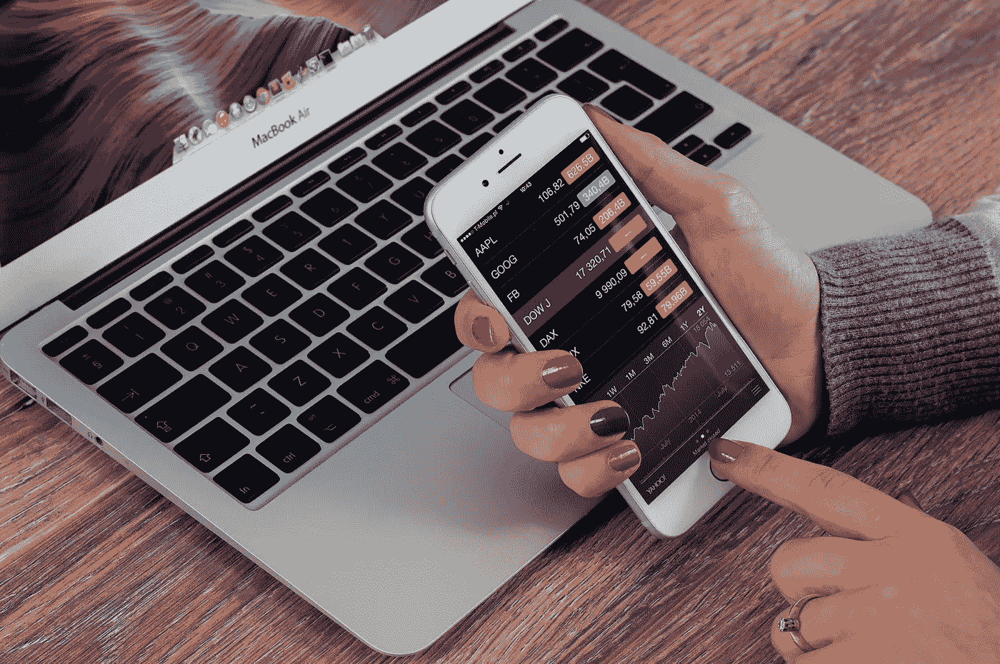

# 如何创造多种收入来源

> 原文：<https://medium.datadriveninvestor.com/how-to-create-multiple-income-streams-49daae999b22?source=collection_archive---------11----------------------->

## 你的钱还来自哪里？第一部分:投资

Getting into the habit of saving and investing: a gift from you now, to your future self. Photograph: Pexels.com

我们生活在一个快速变化的世界，没有什么是确定的。工业几乎每天都在被破坏，传统的工作正在快速消失，现在我们中很少有人能指望一辈子做同一份工作——甚至是同一种工作。

当目标不断变化时，很难感到安全。但是有一个解决方案。

 [## 算法交易的机器学习|数据驱动的投资者

### 当你的一个朋友在脸书上传你的新海滩照，平台建议给你的脸加上标签，这是…

www.datadriveninvestor.com](https://www.datadriveninvestor.com/2019/01/30/machine-learning-for-stock-market-investing/) 

为了建立安全，你需要建立多种收入来源。即使你有一份全职工作。(*尤其是*如果你有一份全职工作，事实上。如果那份工作消失了，现在开始兼职会让你更有弹性。)

有许多创造货币的方法。本系列文章旨在探索其中的一些。这第一个收入流在许多方面都是最容易建立的，因为它是我们许多人最接近的被动收入。

但是它包括检查你对金钱的一些旧的、限制性的[信念。并致力于转变态度，从盲目消费转变为有意识的储蓄。](https://medium.com/the-ascent/your-beliefs-about-money-could-be-costing-you-dearly-39154b3b5a62)

# 多重收入流 1:投资

三十年前，有人送给我一份礼物，现在价值连城。她不知道她给我的是这个。我不认为她真的相信我曾经存在过。但尽管如此，她还是这么做了。

她没花那么多钱。

主要是，这是一个信念的飞跃。那个人就是我，23 岁。刚刚开始我在新闻业的第一份工作，就在伦敦混日子的时候，我决定把微薄收入的 5%存入一个免税储蓄账户，以备未来的自己需要。

我父母希望我有一份稳定可靠的工作。去当秘书，或者护士。相反，我选择了成为一名作家。

## 我知道这很冒险。

我知道，如果我失败了，我的家人就不能保释我了。所以我尽我所能，编织自己脆弱的安全网，以防万一。

几年后，我开始将这些储蓄投资于股票，主要是通过低成本的跟踪基金。在我的职业生涯中，我一直在这样做。

有几次我买不起。我们在买一套公寓。然后装修我们的第一栋房子。我儿子出生了。汽车熄火了。后来，我的父亲突然去世了，我请了一段时间的假去照顾我的母亲。

更罕见的是，有时我能多放一点。解雇费。一篇旧文章的再版。我写的一些东西被选为电影。(它从未被制作出来，但它给了我一笔可观的一次性报酬，完全出乎我的意料。)

## 这不是我曾经错过的钱。

它从没觉得自己是我的。

当我有正式工作的时候，我会安排在每个月发工资的那一天，从我的账户中取出 5%。

当我是自由职业者时，我存入银行的每张支票的 25%直接进入储蓄账户，这样我就可以交税，另外 5%用于投资。

我学会了依靠其他东西生活，不管那是什么。

我们最近才买了我们的第一辆新车(而且只是在那时，因为它的折扣很大，我们无法找到我们想要的二手汽车)。我们几乎所有的家具都是古董，很多都是以低价购买的。我们从来不喜欢外卖或方便食品。

然而，我们也度过了美好的假期，为我们支持的事业捐了很多钱，很少会没有我们真正想要的东西。我们还住在海边一所大得离谱的房子里。

作为一个家庭，我们从来没有为这些储蓄而受苦。

## 我没有做任何复杂或花哨的投资。

我读了报纸的金融版，读了几本书，自学了股票市场的运作方式。但我并没有想多了，也没有自作聪明。

当 iPod 问世时，我知道它会改变一切。所以我买了一些苹果的股票——这被证明是个好主意。

但主要的是，我只是不断地在跟踪基金中存入少量资金，然后就不去管它们了。随着时间的推移，复利的魔力发挥了真正的作用。

股票市场可能会波动。我看着我的储蓄上升，下降，再上升。当它们一夜之间价值缩水一半时(这种情况发生过几次)，我尽量不惊慌。或者在经济持续增长的年代过于沾沾自喜。

很多时候，老实说，我根本没想过这个问题。

## 仅仅知道钱在那里就给了我信心。

有时候，它给了我冒险的自由。(离开一份我不喜欢的工作；拓展写作不同的主题；买我们的第一栋房子，知道它需要大量的工作才能完全适合居住。)

过了 25 年，我的积蓄才赚得比我多。但我清楚地记得我做年度账目，计算出我从写作中赚了多少钱，并意识到我的投资以微弱优势击败了我。

## 那是一种非常非常好的感觉。

我们现在有两个人全职工作:我和我的存款。这种情况还在继续增长，而我却没有尽力去帮助他们。

30 多年后，我可以回头看那个 23 岁的女孩，从各方面来看，她是多么愚蠢。(我当然佩服她的能量。但是我怎么会认为理发是个好主意呢？)

我不确定我是否真的想过我会到这个年纪。

我当然无法想象有一天我会考虑退休，或者至少少写点东西。有时我会选择昂贵的手工制作的东西，因为它耐用，而不是便宜的，不能用的一次性物品。或者当我想要/需要比我在背包客时代更豪华一点的旅行时。

但事情是这样的:愚蠢的 23 岁的我给了未来的我做所有这些事情的方法，如果我想的话。那是她给我的真正礼物，当她开始投资的时候。不是钱，是期权。*选择*。

## 储蓄永远不会太迟。

这是一种习惯，和其他一样。想知道投资是如何运作的，永远都不晚。保持简单，注意隐藏的成本和费用，避免快速致富的计划——因为从中致富的人很少会是你。

*但是真的，越快越好。*

从现在开始，即使只是一点点。建立一个系统，定期增加你的投资。然后，如果你以后带来更多的收入，增加你的储蓄。

在这件事上，时间是你的朋友。伴随着复利的魔力。(你不用相信我。只要玩玩这个[计算器](https://www.thecalculatorsite.com/finance/calculators/compoundinterestcalculator.php)，看看即使是很小的固定金额的储蓄是如何随着时间变成几十年而获得回报的。)

现在就开始储蓄和投资。我保证，将来有一天，你会非常非常高兴你这么做了。

*原载于 2019 年 11 月 18 日*[*https://thecreativelife.net*](https://thecreativelife.net/2019/11/18/creating-multiple-income-streams/)*。*

 [## 你对金钱的信念可能会让你付出高昂的代价

### 改变想法，改变收入？

medium.com](https://medium.com/the-ascent/your-beliefs-about-money-could-be-costing-you-dearly-39154b3b5a62) 

*谢丽尔·加勒特是一名作家，同时也是一名教练，帮助创意人员努力工作并获得报酬。想要我的免费 10 天课程，* ***自由创意者生存技巧*** *？* [*点击这里*](https://www.subscribepage.com/survivalskills) *。*