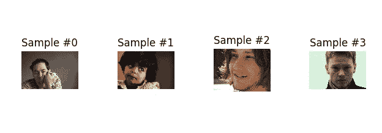
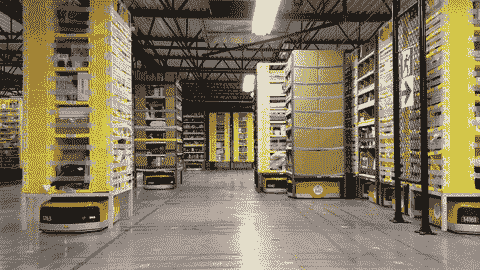

# 如何使用 Pytorch 创建自定义数据集和数据加载器

> 原文：<https://medium.datadriveninvestor.com/how-to-custom-datasets-and-dataloaders-with-pytorch-e27f9e2a9009?source=collection_archive---------0----------------------->

在本文中，我们将了解如何创建自定义 Pytorch 数据集并探索其特性。

credits to facebook

Pytorch 是一个非常健壮和成熟的深度学习框架，它设法捕捉 python 和 Numpy 的精髓，使其几乎与普通的 **python 编程**没有区别。

对于那些不知道的人来说， **Numpy** 是 python 库，它增加了对多维数组和矩阵以及操作它们的高级数学运算的支持。

 [## 2019 年深度学习的终极学习路径及更多...-数据驱动型投资者

### 又一个美好的一周，一些好的教育内容将会到来。我最喜欢的&最受欢迎的帖子之一…

www.datadriveninvestor.com](https://www.datadriveninvestor.com/2019/01/07/the-ultimate-learning-path-for-deep-learning-in-2019-more/) 

此外，Pytorch 与 python 深度集成，使其能够与流行的库和包一起使用和扩展。这意味着，你不会失去所有你喜欢的数据科学工具。

我特别喜欢 Pytorch 的一点是，您可以通过子类化 Dataset 类来构建自定义数据管道，从而可以轻松地加载和预处理数据。让我们来看看

# 数据集类

在 Pytorch 为**深度学习(DL)** 社区提供的众多奇迹中，我相信 Dataset 类是第一个黄金工具，让您能够使用零样板文件和相对较小的学习曲线来建模任何类型的数据集。

数据集是人工智能解决方案的第一要素，没有数据，人工智能模型和人类就没有其他可以学习的东西，我们是一个数据驱动的文明，所以任何形式的人工智能都会继承我们依赖数据学习的自然倾向，这很正常。

> "你可以拥有没有信息的数据，但你不能拥有没有数据的信息."—丹尼尔·凯斯·莫兰

数据管道分为三个主要部分:

*   **数据采集** —收集原始数据(即农田中种子的图片)，从互联网上下载数据等。
*   **数据预处理** —是一种数据挖掘技术，涉及将原始数据转换成可理解的格式。真实世界的数据通常不完整、不一致和/或缺少某些行为或趋势，并且可能包含许多错误。
*   **读取数据** —这是我们将数据输入模型进行训练的阶段。在这一阶段，我们输入大小为 n 的批量数据，这就是数据加载器发挥作用的地方，我们将在本文的最后一节讨论。

让我们看看使用 pytorch 创建自定义数据集的代码:

**数据集子类**由三个方法组成:

*   **__init__** :构造函数
*   **__len__** :返回数据集的长度
*   **__getitem__** :取构造函数读取文件的路径，并对其进行预处理。

正如你所看到的**第一步**我们创建我们的构造函数，并设置我们想要进行的转换和包含所有图像的目录作为构造函数的参数——在构造函数内，以防你键入错误的目录名，我们将创建一个条件语句来捕捉这样的错误。

**第二步**是创建 length 方法，它将返回我们数据集的长度。

**第三步**是创建一个函数，通过 **id** 获取文件并返回它们，因为我们通过不将所有文件加载到内存来节省内存，从而使我们的代码更加高效，并充分利用每一个可用资源。

# 可视化数据集中的样本

在这里，我们将测试我们刚刚创建的数据集类，方法是实例化它并传递一个路径到一个包含图像的文件夹。为了查看图像，我们必须定义一个助手函数来使用 MatplotLib 绘制图像——它将图像和 id**的编号**作为参数。

在函数内部，我们使用 matplotlib 的 subplot 和 tight_layout 函数来并排绘制大量图像。

最终的输出是这样的:

# 创建自定义转换

既然我们已经创建了数据集，作为**深度学习实践者**我们自然希望以某种方式转换我们的数据，例如，我们需要扩大我们的数据集，这样我们就可以通过拍摄一张图像并创建同一张图像的不同变体来获得更多数据。这种技术在对抗**模型过度拟合**时被证明是有效的，通过给它相同数据的不同变化，模型创建了对数据的更一般化的理解，而不是填鸭式的理解。

使用 pytorch，我们还可以创建自定义的转换类，下面是一些例子:

## 重新调节

这个类只包含两个方法: **__init__** 和 **__call__** 。

在我们的**构造函数** (__init__)中，我们**首先**我们确保传递的参数是一个**整数**还是一个**元组**，然后基本上创建一个 **output_size** 对象，它将接受我们的参数。

在我们的**调用函数**中，我们将图像作为参数，然后创建一个变量来保持图像的实际大小。如果图像的**高度**大于**宽度**，我们将**目标尺寸**乘以**当前高度**并除以**宽度**以获得**新高度**并按原样分配新宽度，反之亦然。

如果图像的**高度**和**宽度**相同，我们就直接指定**目标尺寸，**然后我们使用 Pytorch 的 **transform.resize()** 函数来调整图像的大小，最后我们返回图像。

现在，我们可以将此转换传递给 ImageDataset 类的构造函数，每当我们按 id 获取一个项目时，它都会自动获取该项目，并将其重新缩放到目标大小。

还有另一个叫做 Compose 的方法，它让我们堆叠一个转换数组，并将其传递给我们的数据集构造函数，这将在返回最终结果之前对我们的图像应用集合转换。

# 数据加载器

A great example of a Dataloader. credits to Google

仅仅使用 Dataset 类，我们就错过了数据加载器所能提供的奇迹。特别是，我们错过了:

*   批处理数据
*   打乱数据
*   使用`multiprocessing` workers 并行加载数据。

数据加载器是一个迭代器，它提供了所有这些特性。

创建数据加载器就像一行代码一样简单。

# 关键要点

现在，您已经掌握了创建自己的自定义数据集、转换和数据加载器所需的所有知识。这些是为我们的 DL 模型构建数据管道的阶段，在这里，数据加载器是我们想要用来为我们的模型提供数据的，因为它可以一次传入一批数据，并且通过多处理工作器，它可以利用 CPU 中可用的内核数量来更快地加载批数据。

感谢您的阅读。如果你有任何想法，评论或批评，请在下面评论。

在推特上关注我 [**卡努玛王子**](https://twitter.com/CanumaGdt) **，**这样你就可以一直了解 AI 领域的最新动态**。**

如果你喜欢它并与之相关，请给我一个**掌声**👏👏 👏(+50)和**分享给你的朋友**。

# 参考

 [## 数据加载和处理教程- PyTorch 教程 1.0.0.dev20190327 文档

### 解决任何机器学习问题的大量努力都是为了准备数据。PyTorch 提供了许多工具来…

pytorch.org](https://pytorch.org/tutorials/beginner/data_loading_tutorial.html)