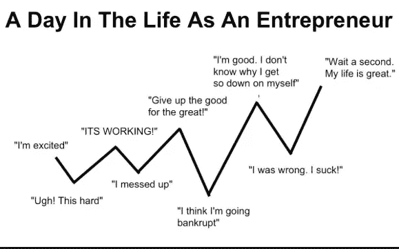

# 第 12 章，如何与 A 型企业家约会

> 原文：<https://medium.datadriveninvestor.com/how-to-date-a-type-a-entrepreneur-1f680c209b81?source=collection_archive---------6----------------------->

我们都是很难约会的人，我真的不知道该怎么和自己约会，年纪越大，越有挑战性。我一直希望有人准备好迎接“挑战”。我一直想在新年前夜在克拉里奇举行婚礼。我希望这个梦想能够实现(克拉里奇的总经理也是如此，他“参与”了这个计划，并友好地举行了未来的约会)。

企业家是他们自己的一种，他们很难约会。他们如此专注于实现自己的目标，在一天中的不同时间经历了一场情绪波动的海啸。当你的大脑在驱动这种持续的活动时，这是很难管理的，更不用说把某人带到你的世界来帮助分享它了。

我有很多和不了解我的错误的人约会的经历，这和错误的公司工作一起，加深了我的感觉。这些工作和这些人都不合适。很明显我是问题所在。几十年后的今天，我觉得是时候对我在二三十岁时约会过的所有错误的男人表达深深的感激之情了，他们结束了和我的关系。谢谢你。

被甩后，他们的理由总是他们跟不上我强烈的、超驱动的寻找我要找的东西的追求(显然是成功，我的意思是，如果他们没有得到，他们真的根本不了解我)。每次分手的分割线总是“我希望你找到你想要的”，代表着双方的悲伤，我很清楚我没有在他们身上找到“它”，也没有在个人层面上达到它。和错误的人约会阻碍了我实现目标。

有一个人特别选择了在我开始第二次创业的前一天结束。他已经看到我不知疲倦地工作了几个月，所以我仍然不确定他在这个糟糕的时机背后的推理。当他和我吻别时，他说他对我的干劲感到敬畏，从未见过如此热情和坚定的人。他开车走了，我再也没见过他(我的选择是因为我从来不明白和前任做朋友是怎么回事)。

我崩溃了。我哭了好几天，但不是因为可能发生的事情，因为我们显然非常不适合，而是因为浪费的时间和不得不“重新开始”。和新认识的人约会感觉像是一件苦差事。当它似乎从来没有工作的时候，多么大的努力。我开始憎恨男人和整个约会游戏，因为他们在情感上分散了我的注意力。

那次经历之后，我变得坚强起来，拒绝让男人分散我的注意力。我承诺把生意放在第一位，发誓绝不让一个男人或一段感情影响我的生意，像离异父母保护孩子一样保护它。

朋友们不断地在网上寻找合适的人，就像我开始有了商业想法也在寻找“那个人”一样。我知道大多数初创企业都会失败，但至少我能控制自己的努力。网上约会似乎太累人了，虽然像网上购物一样高效，但没有质量控制，不知道你最终会得到什么。

对于一个痴迷于工作的企业家来说，证明浪费的时间总是难以接受的。在特威肯汉姆无聊的周六下午橄榄球比赛中，我本可以取得如此多的成就。我模仿所有其他西南伦敦的女人，在她们痴迷于运动的男朋友面前扮演完美的女朋友。作为一个典型的 A 型人格意味着我甚至把女朋友的角色变成了一个尽可能最好的竞争。在六国赛期间，我甚至烤过用糖霜橄榄球装饰的纸杯蛋糕。没人能说这不是超越了。

但我假装对橄榄球感兴趣，假装理解规则，而实际上我冷极了，也不在乎谁赢谁输。我在想赚钱的事情，当其他人欢呼的时候我也在欢呼。不要误会我，我真的很在乎这个人，他也在乎我，但是我们完全不同。两人都无法理解对方的人生目标，他们当然也从未在橄榄球比赛中发生冲突。

如果不是橄榄球，我所有的前任都喜欢骑自行车，似乎认为一个浪漫的周末应该总是包括莱卡和骑自行车，带回所有那些穿错齿轮和卡住防滑鞋的糟糕记忆。然而，为了寻找爱情，我让自己经历了这一切。

爱企业家的最好方式是尽你所能帮助他们实现目标。

我们对成功的渴望超过了我们对氧气的渴望。说真的。帮助我们实现目标，我们将永远爱你。

基于此，我的前任们，希望是无意的，似乎想尽办法来帮助我。A 型企业家希望让事情运转起来，他们总是想方设法不想放弃某件事，希望它会有所改善，同时知道何时减少损失并放弃。

我的前任中没有一个人有资格和企业家约会。他们没有花时间去尝试理解我复杂的大脑，或者尝试了解我看待世界的方式。长期生活在你高度活跃的大脑中，一心想着实现疯狂的大目标，这已经够难的了，过度活跃永远不会停止，而且肯定不会让你睡觉。想象一下，试着和一个不理解你的人分享这些。

你必须是那种想和有组织的、激烈的混乱约会的人。企业家希望与某个特别的人分享这种快感，但随之而来的总是沮丧和绝望的低落情绪，但这必须与正确的人分享。

我们热爱自然。我们讨厌银行假日(它们真的完全是浪费时间)。我们绝对不想要工作与生活的平衡，也不想放慢脚步放松。放松感觉是我还没有得到的奢侈的标志，是一个建议我需要“停止”的弱点。有这么多事情要做，而时间却这么少，为什么我要“放松”呢？一个聪明的伴侣，深刻理解他们的企业家另一半的心理，可以将“放松”重新定义为“思考时间”，在这一点上你已经赢得了我的心。我绝对同意。

我喜欢工作，我想象不出还有什么能让我找到如此大的乐趣。我在将想法推向市场的各个方面都表现出色。我每天不工作的时候都会感到极度的内疚，即使是在瑜伽课上。我睡觉的时候真的会想它。我真的很难理解为什么人们不能每天都像这样兴奋。

难怪男朋友觉得我很讨厌。

我总是在想。即使当男朋友和我说话的时候，我看起来也在听，但是除非和生意有关，否则没什么用。这可能看起来很自私，但我没有足够的心智能力去想太多其他的事情，因为我害怕我的大脑会短路。

企业家在周末完成他们最好的工作。当员工停下来享受休息时间，愉快地唱着“星期五快乐”的时候，我们正在加速前进。周六是最好的时间(我下意识地反对在雨中观看橄榄球比赛的浪费时间)。我在看书、听音频、看销售视频和角色扮演销售场景，以确保我总能成交。我一直在学习。没有时间看电视或网飞。只要我们能谈生意，我愿意吃晚饭。

事实是，我们总是想着生意。

那么，你如何和这种类型的人约会呢？

我不确定我找到了答案。我不确定我可以约会。当我向多年没联系的朋友讲述生意上的努力时，他们总是会问约会进展如何。**什么约会？**你难道没听说过我为了给这家初创公司拉动力而搬去的山吗，我在哪里适合约会？

对我来说，生意比约会更重要。我已经说过了。你可能不明白，但我有太多的项目要完成，我宁愿孤独终老，也不愿和一个不是我灵魂伴侣的人建立关系。

但是说起来，我不想一个人。我想和一个能理解这有多难的人共度余生。我不想为了一个男人的财富而嫁给他，我想创造我自己的，甚至更好的是一起建立一个帝国。

现在连埃隆都有时间谈恋爱了(尽管他没有睡觉)，我觉得我需要提高自己的水平。

但我不能证明花时间漫无目的地“寻找”那个合适的人是正确的。这些时间本可以更好地花在我的初创企业上，因为它迫切需要像新生儿一样受到关注。我没时间休息。随着时间的安排，以最大限度地提高性能，我不知道如何在一段关系的因素。我喜欢在 4:30 醒来，因为我在早上更有效率。如果真命天子不是早起的鸟儿，我们现在就有了昼夜节律问题要解决。如果你是一个夜猫子(除非你睡在一个单独的房间里)，我们永远不会在一起。

男人不能把我变成一个不那么激烈，更有可塑性的人。我不会是他们爱上的那个“我”。但我不想撒谎，这是一项艰巨的工作。目标是巨大的，动力是巨大的。

有人告诉我要温柔一些，更女性化一些。显然，我需要更多的阴来平衡我的睾丸激素驱动的阳。我的哥哥温和而亲切地指导我努力变得更有弹性，像柳树一样，而不是实心的橡树。我喜欢这些想法的声音，但我不知道如何处理这些信息。任何起步都是一场漫长的心理斗争，在任何其他情况下，似乎注定要失败。

我不知道如何成为一名企业家，除了拼命把我的想法推向世界。奇怪的是，这种日常的创业之战似乎吸引了许多中年男性的注意力，他们发现这种竞争非常有吸引力。他们是蜜罐里的蜜蜂。所以也许男人会被有动力的女人所吸引。

我知道我很紧张，也很吓人，但是如果你想和我约会，帮我建立一个帝国。带上化学反应，加上共同的愿景和愿意尽一切努力帮助我成功的意愿，我就加入了。

就像汤姆·克鲁斯在我最喜欢的电影之一《骑士与日》中对卡梅隆·迪亚兹说的那样；

“你跟我在一起还是不跟我在一起？”

我需要让克拉里奇的总经理知道。