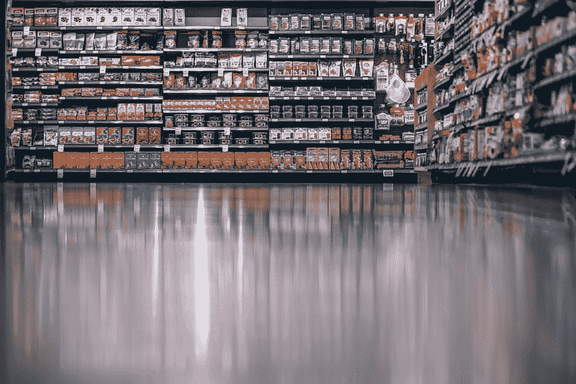
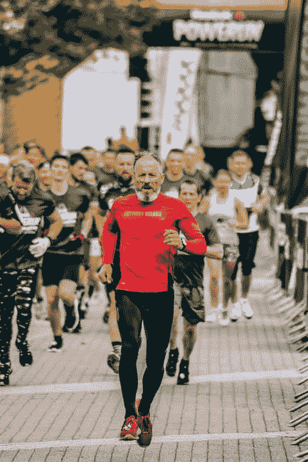

# 如何避免信息过载

> 原文：<https://medium.datadriveninvestor.com/how-to-deal-with-information-overload-cb86586d2360?source=collection_archive---------8----------------------->

互联网充满了丰富的信息。不可能完全消化掉，原始信息，不管准确与否，通常会让我们这些最优秀的人不知所措。在利用网络的同时，我们能做些什么来保持生产力呢？我们怎样才能过滤掉所有不必要的、只会拖累我们的不同材料呢？

无论我们在看什么:新闻、纪录片、视频、股票或加密货币、商业知识、概念、观点或指南……总有大量的材料需要过滤。如果我们试图把它全部消耗掉，我们会浪费太多的时间，以至于从消耗中获得的生产力几乎为零。

以下是需要记住的重要事项:

**有品种**

变化是非常重要的。这可能是好的也可能是坏的。如果你能接受两种不同的观点，并据此做出决定，那将是有益的。如果你听到两种不同的观点，不知道该遵循哪一种，那么选择一种，永远不要回头……然而，这种冲突对很多人来说太多了。保持简单的多样性，尽量不要让自己被过多的多样性淹没。如果我听以商业和动机为导向的播客，那么拥有七个不同的最爱就不是我最感兴趣的了。相反，找到最能激励我的前三个，并与这些一起前进，似乎更有益。综艺过载是一件事，尽量避免！

**时间限制很重要**

这一点怎么强调都不为过。这看起来很简单，但是很多人都失败了。试着把你花在一个主题上的时间减到最少。我最好的例子就是整天看加里·维纳查克的视频，或者类似的东西。这可能是一个激励因素，但你真正在做的是一次将一堆概念引入你的大脑。毕竟，不是每一个视频都是关于同一件事的。相反，把这些概念保持在一个可控的范围内，用时间作为一种有效的方式来衡量你消耗了多少，然后根据这些概念采取行动。同样的事情也可能发生在任何试图学习新材料的人身上，不管这些材料是什么。太多的概念在太短的时间内会产生负面影响。

**保持轻松**

不是所有东西都必须很重。这看起来很简单，但在我们的社会中，有一些真正沉重的事情正在发生。互联网充满了沉重感，有时我们举不起来。保持轻松，不要因为处理别人的沉重而耗尽自己的精力。

一次只关注一个话题

单一焦点模型在某些方面可能与多样性相矛盾，但它可以被证明是有效的。有时候事情太多了，所以如果我们深入了解我们真正想看到和关心的事情，那么我们更有可能有效地完成一些事情。效率是从焦点来衡量的，如果没有方向感，肯定会有一些信息超载。如果不关注互联网，人们会倾向于让自己处于易受压力影响的境地。这与使用互联网在你想要的时候得到你想要的东西，以及当你专注于一个特定的话题时学习如何利用它是并列的。

**筋疲力尽时休息一下**

不用动脑筋……避免让自己再次精疲力竭。还需要我多说吗？

**退订垃圾**

我无法相信有多少人每天都收到来自供应商的广告邮件，他们只是把它们扔掉，而不是退订。从你的一天中抽出 10 秒钟，一次性取消订阅，而不是每天花 2 秒钟删除它们。这个时间加起来。如果我每天删除 30 封垃圾邮件到我的主收件箱，每天花 60 秒，那么我每年都要浪费数百分钟来查看垃圾邮件，并在删除之前确定它是垃圾邮件。如果我马上退订，我甚至不会收到这封垃圾邮件。更不用说有多少垃圾邮件供应商转卖邮件了。如果我现在每天收到 30 封垃圾邮件，到明年这个时候，这个数字至少会翻一番，如果不是三倍的话。

(附注——iphone 有一个退订功能，有助于加快退订速度！)

**鼓励积极——忽略消极**

我们倾向于消极是正常的。它发生了。不过，互联网上较轻松的内容更容易消费，也更容易在心理上处理。如果知识就是力量，那么积极的知识就是积极的力量。负面信息大量存在，包括虚假信息。我们都知道互联网上的笑话都是真的。为什么要在消极上浪费时间、精力和宝贵的精力呢？这肯定会导致更快的疲劳和一些信息超载。

**互联网是一场马拉松，而不是短跑**

互联网上充斥着如此多的好材料。有一些真正伟大的贡献者，有大量的信息可以消费，有如此多的力量可以通过吸收互联网上的东西来加以利用。请记住，完美是盈利的大敌，所以如果你在网上搜寻某个话题的每一个细节，那么你可能做错了，并导致自己走上信息超载的道路。