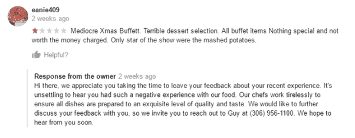

# 如何应对负面评论？

> 原文：<https://medium.datadriveninvestor.com/how-to-deal-with-negative-reviews-855b41221fdd?source=collection_archive---------33----------------------->

Image — Google(Negative Review)

信不信由你，同样的前提也适用于负面评价和正面评价。你对负面评价的反应不仅会影响评价者，还会影响之后所有人的眼光。看到一个企业在网上处理一个特别具有挑战性的评论表明，管理层为他们的企业感到自豪，并愿意付出额外的努力来维护他们的声誉！

用这四个步骤让潜在客户看到光明:道歉、推广、下线、保持简单。

**如何回应负面评论**

*   **道歉和同情**

解决问题的第一步是承认问题的存在。不管发生了什么，一个简单的道歉和对你客户经历的同情会大有帮助。

*   **推广**

所以在这位顾客来访的那天，著名的蟹饼并没有达到标准。如果他们是你所知道的，为什么不重申一下呢？我们的蟹肉饼通常很受欢迎，当你来访时，我们很遗憾地听说它们没有达到标准

*   **将对话移至离线**

不要打开一罐蠕虫。通过电话、电子邮件或两者都用，给评审者一个联系的机会，让他们保守秘密。

*   **保持简单**

避免细节，不要问问题。这些对话在远离窥探的公众的地方进行会更好。

**最后一个专业建议:**不要写你的企业名称、地点和类别。你不希望你的负面评论出现在搜索中！

现在这还不算太糟，是吗？你可以用软件从网上收集你的评论，这样你就可以快速回复。如果你没有时间，就找数字代理服务公司来帮你做。