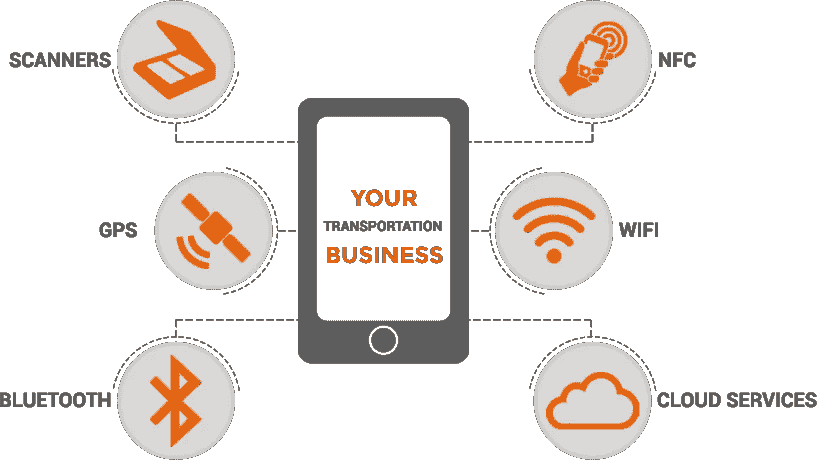
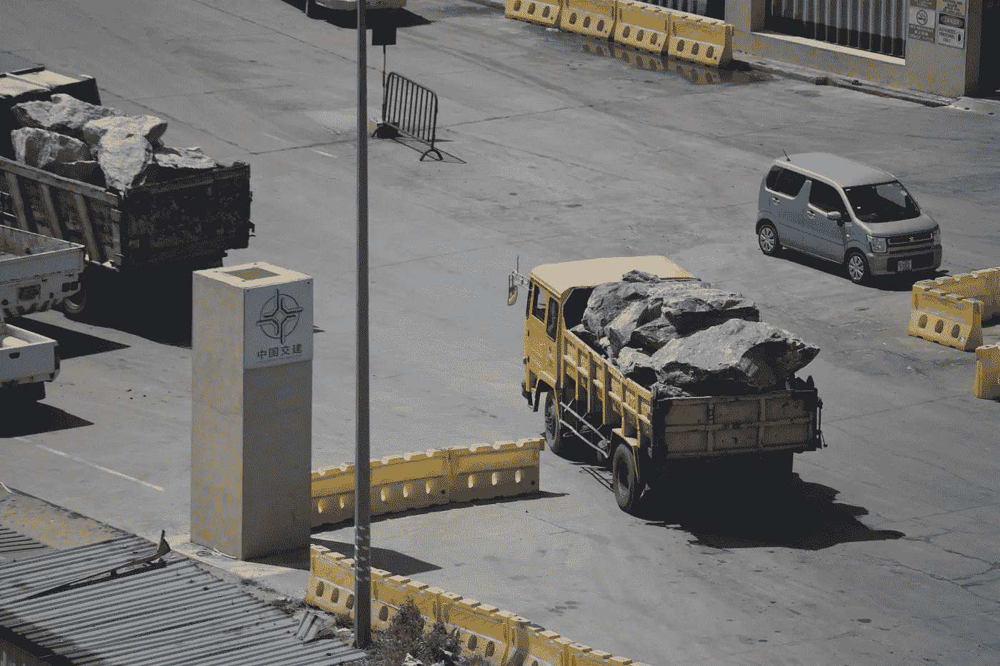
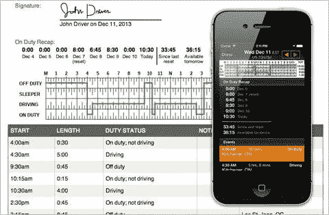
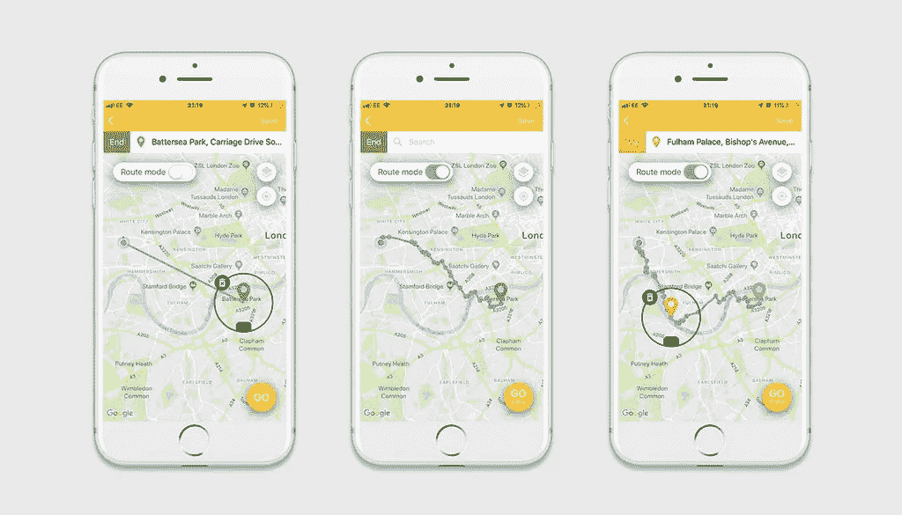
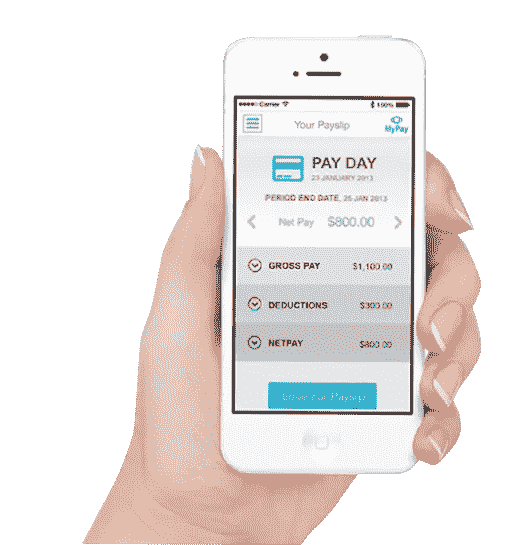
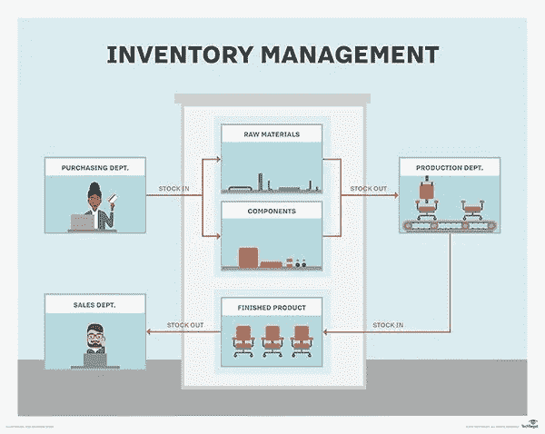
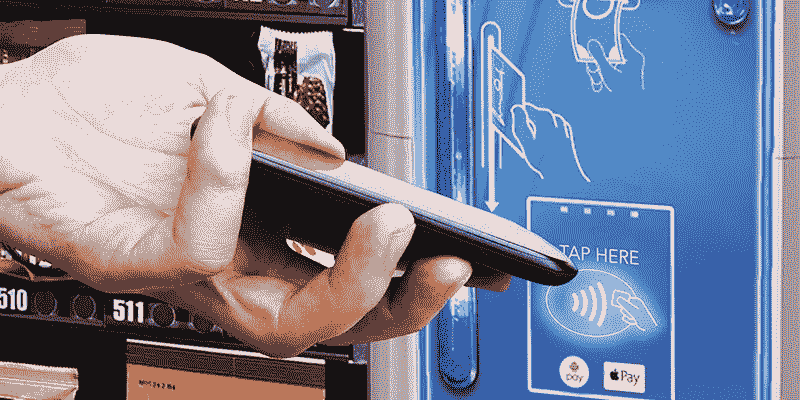

# 如何开发一款交通手机 App

> 原文：<https://medium.datadriveninvestor.com/how-to-develop-a-transportation-mobile-app-f97666398c09?source=collection_archive---------3----------------------->

运输行业总是在移动，跨越广阔的地理区域，通常分散在全球各地。

根据定义，他们的工作性质是移动的。

移动技术的最新发展使这些公司能够创建[定制解决方案来满足他们的特定需求](https://medium.com/datadriveninvestor/8-benefits-of-a-custom-mobile-app-for-your-business-485c07031925)。

在早期，交通部门主要使用基于移动应用的导航和定位服务。但截至最近，运输公司的移动应用包括[交通数据采集](https://medium.com/goodvision/the-development-of-traffic-data-collection-cd87cc65aaab)，出行信息[，路线规划](https://www.sciencedirect.com/topics/engineering/route-planning)，拼车等。

智能手机有几项内置技术(*高分辨率摄像头、扫描仪、GPS 功能、内存电源、RFID、Wi-Fi、蓝牙等*)可以与其他技术集成，因此今天的手机可以完全支持运输业务的现代应用程序。

[大多数商业部门](https://mlsdev.com/blog/top-industries-that-can-benefit-from-mobile-apps)已经利用移动应用程序开展业务，交通部门也不落后。如今，运输公司可以在移动应用程序的帮助下运行一个成功而高效的组织。

要创建一个成功的交通应用程序，您需要考虑以下特性:

# **离线支持**

这是一个互联网的世界，今天没有互联网似乎几乎是不可能的。

然而，您的公司需要为最终没有互联网连接做好准备，尤其是许多运输业务都是在路上进行的。

如果你的应用程序不提供离线支持，它在某些位置将是无用的。运输工作流程中的问题，如[最后一英里问题](https://en.wikipedia.org/wiki/Last_mile_(transportation))会影响最终用户和业务。

然而，如果你在你的应用程序中包含[离线支持](https://www.infoq.com/articles/mobile-apps-offline-support/)，它可以帮助员工在他们能够的时候将数据输入到应用程序中；是否在线。

离线支持可自动上传信息，确保您的员工在要求的时间内完成分配给他们的任务。

# **驾驶员和车辆跟踪**

货运行业最重要的事情是定位车辆、司机和货物的位置。

今天的智能手机可以使 it 部门利用诸如 [GPS](https://en.wikipedia.org/wiki/Global_Positioning_System) 、[基于位置的服务 LBS](https://en.wikipedia.org/wiki/Location-based_service) 和[远程信息处理](https://en.wikipedia.org/wiki/Telematics)等技术，通过实时更新的数据、历史和通信来跟踪全球移动的车辆。

通过这种方式，您的首席管理员可以在[谷歌地图](https://www.google.com/maps)或[其他地图服务](https://en.wikipedia.org/wiki/List_of_online_map_services)上监控您车辆的活动，以跟踪路线并将其与您的主系统同步。

作为管理员，您可以为您的员工分配任务，而您的司机将会收到一个带有说明的推送通知。在整个工作过程中，司机、[车辆](https://en.wikipedia.org/wiki/Vehicle_tracking_system)和货物的位置都可以在智能手机的地图上看到。

这种增强的可见性肯定会提高生产率和工作效率，以及您的员工的安全。

Source: mindinventory.com

# **装运跟踪**

货件跟踪功能允许您记录承运人和交货信息，通常有助于跟踪货件。这可以手动完成，或者您可以根据需要启用自动上传选项。

当货物到达管理员处时，它会比较信息是否与分配给司机时提供的初始输入相匹配。

运输公司面临的问题是找到支持所有这些功能的移动应用，这也是为运输公司开发定制移动应用成为必要的主要原因。

随着[物联网](https://en.wikipedia.org/wiki/Internet_of_things)的兴起，这些公司需要一个物流管理应用程序，允许员工附上照片、文档甚至条形码，从而简化数据收集过程。

# **驱动程序/作业日志**

这一功能有助于司机或员工保持[每日活动日志](http://templatelab.com/drivers-daily-log/)——记录行驶里程、取货和送货次数及其细节、完成工作的总时间、车辆健康状况等。

您的员工可以通过[移动表格](https://en.wikipedia.org/wiki/Mobile_forms)或其他功能实时记录这些信息，而无需做过多的数据录入。

使用定制的应用程序，司机和其他工作人员可以获得实时数据，并更新管理面板以进行进一步分析，这将有助于工作问责制和效率。它还支持透明的工作流程，包括值班/下班、卧铺、任何备注等。

[这一功能](https://www.thebalancecareers.com/how-to-fill-out-a-paper-daily-truck-drivers-log-1361592)是保持你所处理的货物以及公司资产完整性的实用方法。

Source: fleettrax.net

# **路线规划**

过去，车队经理必须将任务分配给司机和其他员工，通过电话或网络信息(如果启用的话)与他们保持联系。从今天的角度来看，这一切似乎很复杂。

现在，有了支持 GPS 的移动应用程序，[整个流程](https://www.sciencedirect.com/topics/engineering/route-planning)由具有地图显示功能的实时界面更新。

您可以在实时地图上显示您的整个路线，并为每个目的地指定时间线。[即时通知](https://hackernoon.com/5-best-push-notification-services-to-consider-for-your-next-mobile-app-project-9b4c2e8dd1db)可以向您发送有关路线或任务中的变化或更新的消息。

如果你关注交通和公路铁路当局的预测，你可以很容易地改变你的路线，以避免任何延误，提高生产力和节省额外的燃料成本。

日常活动中的整体效率得到了提高，并处理了沿途可能出现的任何紧急情况。

Source: ridebeeline.zendesk.com

# **工资管理**

移动化可以极大地帮助运输行业的其他部门——用移动时间表取代老式的手动数据输入似乎是一个突破。

移动应用程序可以记录登录和注销输入、工作时间和数据条目。

[GPS 定位标记](https://en.wikipedia.org/wiki/Geotagging)简化工作和加班时间的计算——您的员工可以在移动应用程序的帮助下自动化整个工资单和费用，避免不必要的差异或错误。

Source: smartpayroll.co.nz

# 交通移动应用的优势:

*   您可以更好地**管理您的车队** —您可以跟踪您车队的移动，这有助于自动化整个[车队管理流程](https://en.wikipedia.org/wiki/Fleet_management)。再也不用来回打电话了，而且你可以更好地管理你的员工。您的业务供应链得到了改善，可以轻松跟踪实时车辆，并与员工进行即时沟通。
*   **时间管理**在运输业中，时间就是一切——因为交通是送货延误的主要原因之一，所以运输公司需要时刻关注交通状况的原因显而易见。因为我们可以全天候连接到互联网，所以移动应用程序能够传递此类信息，并**提供关于实时交通状况的** **实际数据更新**[**，这有助于您在路上的员工。**](https://www.techopedia.com/definition/31256/real-time-data)
*   **长期在运输行业工作的人还记得 [**管理库存**](https://www.investopedia.com/terms/i/inventory-management.asp) 时令人头疼的事情——旧的库存方式既昂贵又极其耗时，这就是移动应用的用武之地。有了移动应用程序，您可以简单方便地跟踪您公司的资产，此外，您将有更多的时间专注于业务的重要部分，并减少需要担心的事情。**

****

**Source: techtarget.com**

*   ****追踪货物** —首先你要知道的是，你必须监控你的货物动向，也就是说，用哪辆卡车运输什么类型的货物。手机应用程序通过使用[二维码](https://en.wikipedia.org/wiki/QR_code)或 [RFID](https://en.wikipedia.org/wiki/Radio-frequency_identification) 或 [NFC 技术](https://en.wikipedia.org/wiki/Near-field_communication)简化了这一过程。二维码是最简单的方法，因为你只需要用智能手机扫描每件商品的代码——你所需要的只是智能手机上的一个摄像头。另一种技术，RFID ( [射频识别](https://en.wikipedia.org/wiki/Radio-frequency_identification))利用频率或无线电波扫描货物。有了 RFID，你就有了[有源和无源标签](https://blog.atlasrfidstore.com/active-rfid-vs-passive-rfid)(标签固定在芯片或天线上)，有源标签的跟踪能力约为 100 米，而无源标签只有 25 米。 [NFC 或近场技术](http://nearfieldcommunication.org/)基于与 RFID 相同的技术，但区别在于距离。NFC 标签必须放在离扫描仪非常近的地方，这样它就无法扫描所有商品。**
*   ****更少的文书工作**——一个移动应用程序通过[数字表格](https://en.wikipedia.org/wiki/Mobile_forms)填写、提交和轻松访问文档，将文书工作减少到最低限度，而不是花费数小时来做文书工作。数据很容易输入到应用程序中，然后进一步提交，而不是以前的好方法'*蜗牛方式'*。你可以在这样的移动应用中添加更多功能，如丰富的仪表盘、数字报告、订单交付确认、任务调度等。它不仅节省了大量的时间，而且还消除了重要文件被放错地方甚至丢失的风险。**

****

**Source: fr.123rf.com**

*   ****在线预订** —从前，如果你想把东西运出去，你需要做大量的工作来完成任务。能够完成[在线预订](https://www.checkfront.com/what-is-an-online-booking-system)对于您的运输或货运公司来说是一笔巨大的资产，因为它已经输入到移动应用程序中，并可以轻松地与您的主系统同步——正如我们已经多次说过的，我们的世界是移动的，人们更倾向于使用智能手机来完成任何任务，无论是业务还是私人任务。在设计应用程序时，请记住这一点。**
*   ****送货后信息** —使用手机应用程序，送货成为一个轻松的过程。不再有最后一英里的问题,因为你需要做的只是扫描货物的 ID 并输入细节，如交货时间、地点和数量。送货人员对输入和输出的监控得到了简化，他们可以通过发送送货提醒来更新应用程序中的信息。**
*   ****无现金系统** —由于[在线支付系统](https://en.wikipedia.org/wiki/E-commerce_payment_system)可以在跟踪和交付应用中实现，因此不再需要纸质发票或计算现金金额，从而简化整个流程。您可以根据您用户的喜好选择最合适的[支付系统](https://en.wikipedia.org/wiki/Alternative_payments)，因为[有不同的支付类型](https://www.mobiletransaction.org/different-types-of-mobile-payments/)。**

****

**Source: vendnatural.com**

# ****最后一句话****

**运输行业的移动应用程序的成本不如没有移动应用程序的成本高，使用移动应用程序不仅可以让您的公司和员工更轻松地履行职责，还可以让您的客户建立信任，从而提高您公司的可信度。**

> **移动应用是一项投资，它将使你从竞争对手中脱颖而出。**