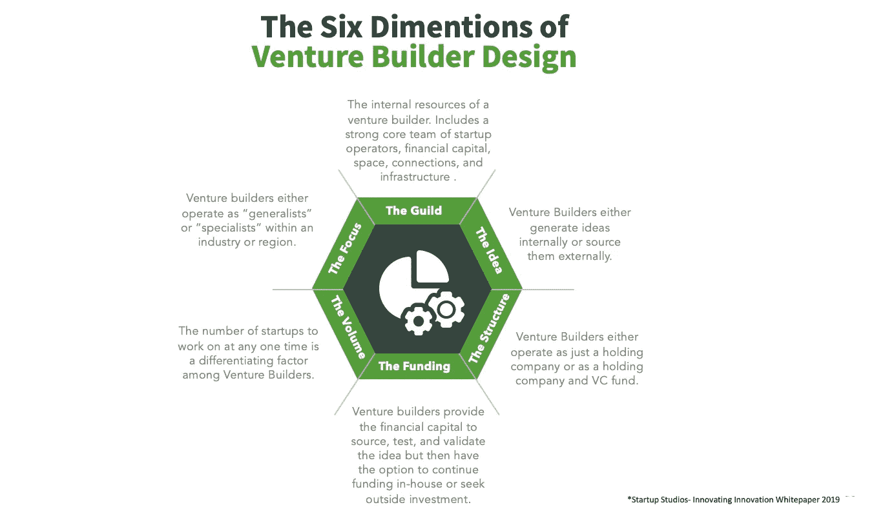
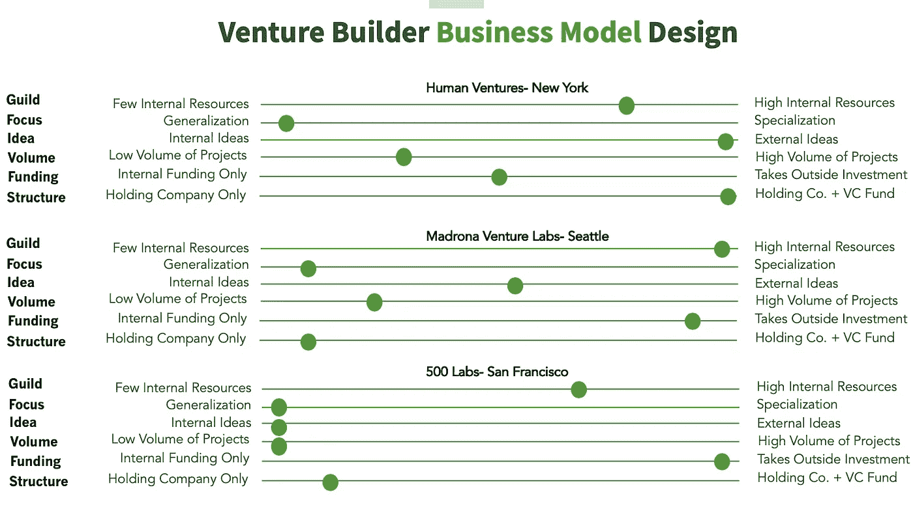

# 如何区分创业工作室

> 原文：<https://medium.datadriveninvestor.com/how-to-differentiate-startup-studios-d3cb394e3ecf?source=collection_archive---------2----------------------->

## 一个系统的(本质上是主观的)模型。

创业工作室已经成为我的魅力所在，因为它们在这十年里不断发展。然而，由于传统的原因，我对它们不感兴趣。我并不认为它们令人信服，因为它们具有很高的独角兽潜力，甚至因为它们释放出令人难以置信的创新。我对他们非常感兴趣，因为他们的商业模式非常独特。

我一直对事物的“大局”很着迷。正如海洋最深处的植物产生的氧气为漂浮在地球上方保护我们免受太阳攻击的臭氧层提供动力一样，创业公司的每一个微小元素都与其生态系统中的其他元素有着独特的联系。

 [## 动荡迫使暴风雨中的平静|数据驱动的投资者

### 自然界中很少有东西是直线行进的，尤其是经济。当投资者和消费者希望平静时…

www.datadriveninvestor.com](https://www.datadriveninvestor.com/2019/03/25/volatility-compels-calm-amid-the-storm/) 

## 商业模式

商业模式很难定义，但很容易区分。例如，你可能不知道如何描述亚马逊的商业模式，也不知道好市多商业模式的内部运作方式——但你可以毫无疑问地说，它们以两种不同的方式运作。一个只在网上卖，另一个只在网下卖。一个卖单品，一个卖批量。人们在亚马逊上冲动购物，在好市多购物。有更多的具体差异，但在大多数情况下，商业模式是非常简单的。

## 创业工作室商业模式

创业工作室，也被称为风险建设者，对我来说很有吸引力，因为它们在核心方面都很相似，但几乎每个实体都有独特的商业模式。

一些差异是主要的，比如工作室在一个特定的空间运营，而不是向各种行业开放他们的机会，但其他差异是次要的，比如为每个里程碑提供特定金额的资金，或者将资金限制在一个大型投资上，供创始人在必要时使用。

在思考创业工作室的商业模式时，我发现使用“杠杆系统”模式非常有帮助。这个杠杆系统模型中使用的类别是从创业工作室(由 [Enhance](https://medium.com/u/340c7edf39aa?source=post_page-----d3cb394e3ecf--------------------------------) 创始团队 Alper Celen & Ritesh Tilani 撰写的名为 [**创业工作室-创新创新**】T3)上最有影响力的论文之一中借用的。本文对创业工作室的“成功公式”进行了分解。](https://www.linkedin.com/pulse/startup-studios-innovating-innovation-white-paper-alper-celen/)

我将这些因素及其定义绘制在下图中:

知道成功的创业工作室需要哪些要素只是第一步。我喜欢用一个烘焙的比喻来思考这些元素是如何组合在一起的。例如，如果你以某种方式混合同样的 5 种原料，你会得到一个蛋糕。如果你以不同的方式混合它们，你会得到一块饼干。这同样适用于创业工作室。

如果你放入大量的一种元素，你会得到一个不同的实体，如果你提取了该元素的重要部分或者添加了大量的另一种元素。

为了更好地理解这一点，让我们假设一个初创工作室非常重视“公会”元素，而缺乏“资金”因素——这个工作室将会非常注重实践，但不会提供太多的金融资本。相反，如果工作室很重视“资金”因素，但不重视“行业协会”因素，他们看起来更像一个风险投资公司，而不是一个创业工作室。

以下是该杠杆系统工作时的直观演示:

Using my best judgment and research, these are the levels of each element for each Studio analyzed

一旦你看到对生态系统中起作用的成分及其度量的直观理解，你就会真正感觉到每个 Startup Studio 模型彼此之间有多么不同。

一些工作室只从内部团队获取创意。这意味着，如果你是一个初创公司的创始人，有一个想法想要得到验证，你不能敲开这类工作室的门，指望他们帮你检验你的假设。另一方面，如果你是一个有经验或非常特殊技能的雄心勃勃的企业家，你可以申请这种类型的工作室，因为他们在人力资本方面投资很大。

了解创业工作室商业模式之间的差异很重要，这样你就不会浪费你或他们的时间。找到最适合你需求的是研究的结果，但是为了进行有用的研究，你必须知道你在找什么。创业工作室基础要素的上述标准，加上杠杆系统模型，有助于明确作为一名企业家，你应该把时间投资在哪里。

我目前正在做一份美国 的创业工作室和风险建设者的完整清单。我希望它是网络上最新最准确的列表。因此，我做了大量的研究来寻找全国的每一家工作室，如果他们符合创业工作室的所有 6 个标准，就把他们加入名单*。如果公开的话，这个列表会增长得更快，也更有用——所以如果你发现了创业工作室，请随意添加。*

****