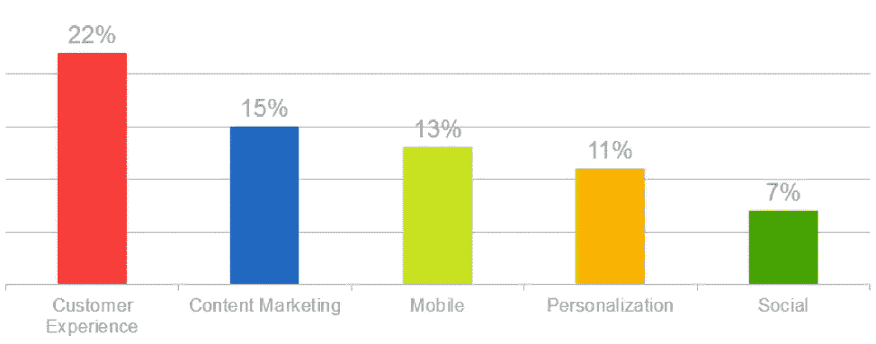
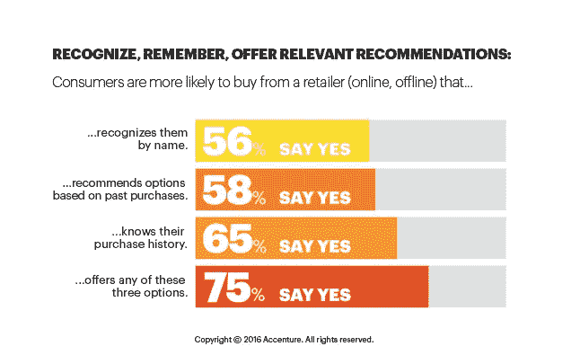

# 如何使用 Messenger 聊天机器人实现客户服务的数字化转型

> 原文：<https://medium.datadriveninvestor.com/how-to-digitally-transform-customer-service-with-messenger-chatbots-226c109f3146?source=collection_archive---------3----------------------->

[Via Unsplash](https://unsplash.com/photos/nrF_qiXNIdQ)

像脸书这样的信使平台上的 hatbots 有能力自动化客户支持。Gartner 预测，到 2020 年，超过 80%的客户互动将实现自动化。

> [22%的企业认为改善客户体验是增加收入的最重要机会。](https://www.superoffice.com/blog/customer-experience-statistics/)

[Via Econsultancy](https://www.superoffice.com/blog/customer-experience-statistics/)

数据支持聊天机器人将提供个性化的问题解决方案，并改变我们今天所知道的客户服务。

**聊天机器人将以三种方式数字化改变企业的客户服务。**

# 聊天机器人比人工呼叫支持更划算

ots 能够快速、无缝地回答重复的常见问题，如营业时间、联系信息和价格。允许企业降低劳动力成本并消除对传统呼叫中心的需求。对任何企业来说，员工的培训和入职都是一笔巨大的成本。因此，聊天机器人为企业客户体验运营提供了巨大的节约。

 [## 对话式人工智能的兴起将如何影响世界数据驱动的投资者

### 从不同的专业服务，保险，教育，金融，旅游，电信，到建筑，银行，和…

www.datadriveninvestor.com](https://www.datadriveninvestor.com/2019/02/07/how-the-rise-of-conversational-ai-will-impact-the-world/) 

# 聊天机器人通过个性化与客户的互动来改善客户服务

顾客提供个性化的建议，产品和服务更有可能保持对一个品牌的忠诚。

> [*75%的消费者更倾向于光顾能认出他们的名字、根据过去的购买情况推荐选择或了解他们的购买历史的商店(在线或线下)*](https://newsroom.accenture.com/news/consumers-welcome-personalized-offerings-but-businesses-are-struggling-to-deliver-finds-accenture-interactive-personalization-research.htm) *。*
> 
> *–埃森哲*

[Via Accenture](https://newsroom.accenture.com/news/consumers-welcome-personalized-offerings-but-businesses-are-struggling-to-deliver-finds-accenture-interactive-personalization-research.htm)

忠诚的顾客更频繁地光顾你的企业，每笔交易花费更多的钱，并向他们的朋友和家人推荐你的企业。

# 聊天机器人提高了重新订购的速度，同时预测未来的订购习惯

人类无法记住每位顾客的每一次购物。然而，聊天机器人能够记录和分析单个客户的购买行为。这有两个主要好处。

1.  聊天机器人记录客户的订单历史，允许更快的点击重新订购过程。
2.  聊天机器人可以向客户追加销售，并根据之前的订单历史推荐类似的商品。

> [79%的顾客承认，只有当报价个性化，反映出他们之前与该品牌的互动时，他们才有可能参与其中](https://www.prnewswire.com/news-releases/consumers-to-brands-the-louder-you-scream-the-less-we-care-300102426.html)。
> 
> *–Marketo*

聊天机器人为客户提供个性化产品和服务的重要能力是让他们回头客并让你的业务蓬勃发展的关键。

*原载于 2019 年 3 月 29 日*[*order bot . my*](https://orderbot.my/2019/03/29/how-to-digitally-transform-customer-service-with-messenger-chatbots)*。*