# 如何为办公室做 3D 渲染

> 原文：<https://medium.datadriveninvestor.com/how-to-do-3d-rendering-for-an-office-f5a9fe57be97?source=collection_archive---------3----------------------->

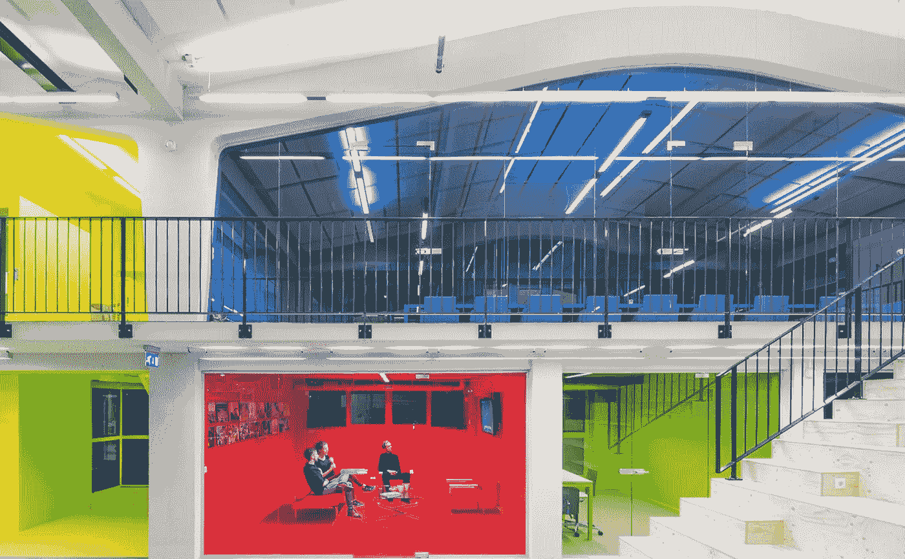

就在斯德哥尔摩市中心，在我们鹿特丹办公室的一个 3D 渲染服务设计中，我们通过 [RONENBEKERMAN](https://www.ronenbekerman.com/) 为设计、创新和工作空间迈出了一步。我们希望通过这个鹿特丹办公项目塑造未来，让我们的设计取得巨大成功。在这个特别的项目中，藏青色调色板是我们对传统和现代家具和墙壁的选择。无论我们做了什么，我们都愿意与读者分享我们的作品和项目观点。

以下是办公室的两个主要视图:

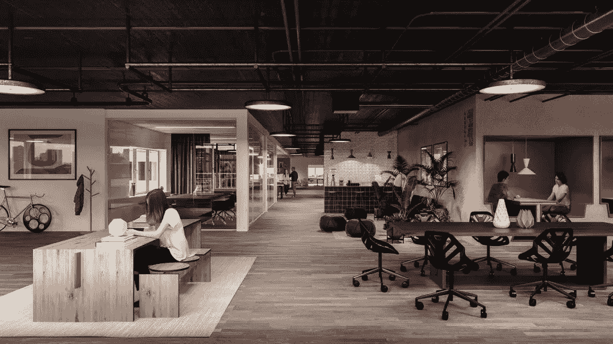

# 基本 3D 渲染设置

我们使用了 Corona 渲染软件，正如你所看到的，设置非常简单。几乎一切都是默认设置。

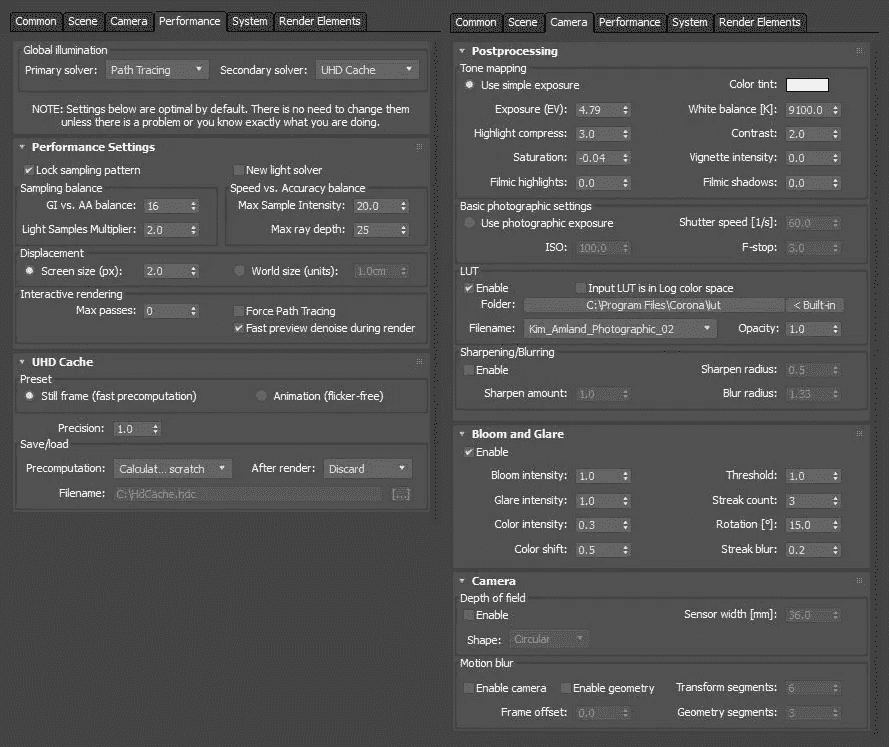

*Rotterdam Corona Render Settings*

LUT 是我们在这里的选择，因为它是一个伟大的 LUT 场景，提供了巨大的对比度和令人惊叹的增强环境光。

 [## 生活在算法社会——数据驱动的投资者

### 鉴于当今最新技术扩散到我们的日常生活中，毫不夸张地说…

www.datadriveninvestor.com](https://www.datadriveninvestor.com/2018/08/17/living-in-the-algorithmic-society/) 

# 室内开发

我们的工作流程遵循 6 步结构，

1.  我们从客户那里收集材料。根据收到的材料，我们估算了该项目的价格，并为客户制定了项目计划。我们粗略地问了我们的客户他们什么时候想要粗略的项目计划，以及我们什么时候能听到客户的反馈。
2.  据我们的主要架构师说，我们根据客户创建了一个粗略的内部规范。其中一个规格是情绪板，也咨询了客户。
3.  然后我们开始做 3D 渲染。当渲染时，我们的主要焦点是根据客户的简介创建合适的环境和感觉。创建 3D 图像最关键的部分显然是将合适的材料放在合适的位置，并营造出合适的氛围。如果做得正确，很容易建立客户的第一眼信任，并避免客户任何不必要的评论。
4.  完成初稿后，提交给客户，并收集客户反馈。
5.  客户需要在草稿的情绪上做一些改变，我们确立了这种改变。在这里，与客户直接对话是必须的。这将有助于客户理解我们的方法，如果我们根据客户做出任何改变，结果将是好是坏。
6.  第二稿已交给客户，并收集了反馈意见。在这个阶段，有一些小的变化，然后我们交付了最终结果。

# 三维建模

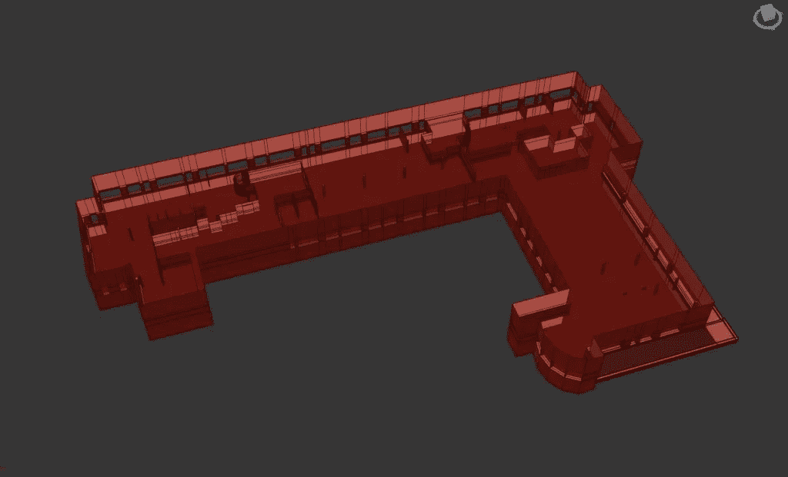

*3D Rendering of the meeting room and pods*

实际上，对于工作场所或环境，相比客户的要求，我们对会议室和 pod 没有太大的改变。一般来说，我们从 2D 平面图的结构中得到我们想要的信息。我们根据它重新排列模型。

# 豆荚、会议室和组合

我们认为展示我们的裸体渲染作品很重要。在这里，我们向您展示了为该项目的会议室设计的每一个单元。您可以清楚地看到，在图像的第一个平面中，地板上只有两个工作台，而在第二个平面图像中，您可以看到整个会议室，一些人正在桌子上用 pod 工作。

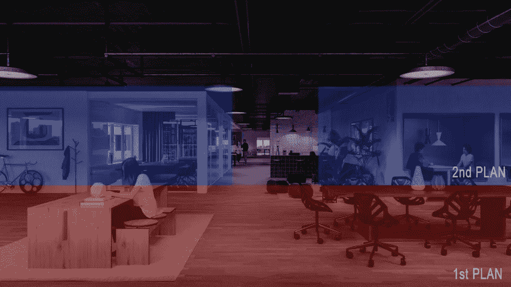

*Rotterdam meeting room composition areas*

# 纹理和材料

## 铺地板

理想情况下，我们制定平面图的计划是与我们过去的一些项目一起进行。我们确实用地板生成器插件做了地板。我们试图根据客户的需求，从 CG 源为地板计划带来木材纹理。

> 老实说，对于这个材质，我们不需要那么多贴图，最后，它应该看起来大部分是无光泽的，这肯定可以被简化。—[高级建筑师走房](https://www.walktheroom.com/)。

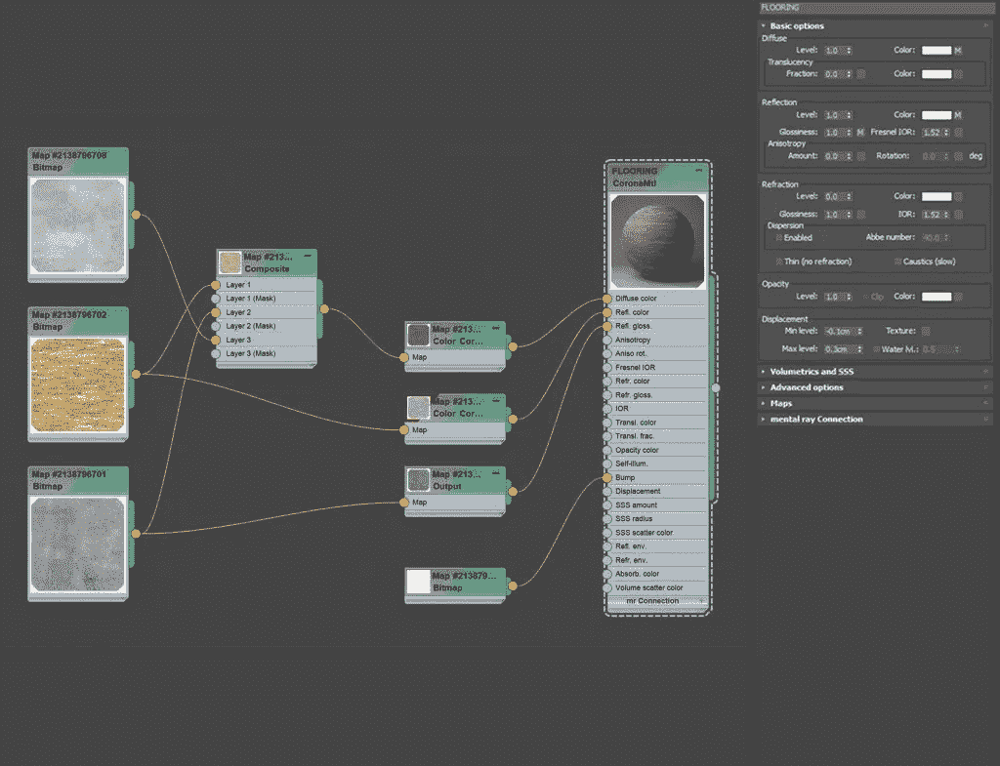

## 天花板

对于过去的项目来说，现有的天花板有点暗，所以我们必须让它更亮一些。我们使用电晕渲染器使天花板材质比前一个更亮。使用电晕射线开关材料，我们在全局构图镜头中添加了一些更亮的材料。否则场景会变得很暗。

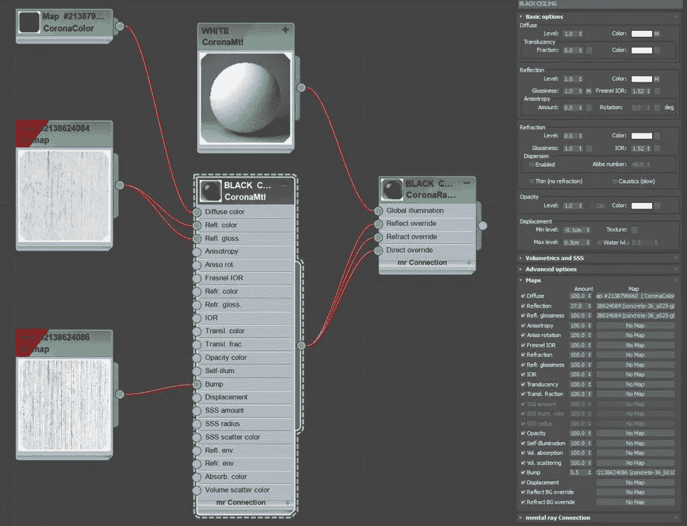

## 墙壁

对于墙壁，我们选择在漫射贴图上使用纯粹的柔和度。我们增加了一些光泽度，并在一些特定的区域增加了灯光。

## 轻牙线

对于牙线灯光系统，我们在材质上用晕渲染器环境遮挡做了一个很好的细节工作。

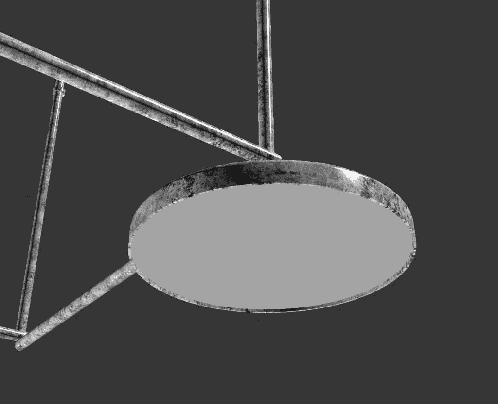

## 照明设备

对于灯光，我们将我们的作品分为三组，

*   人造光
*   环境光线
*   聚光灯

这样我们就有更大的机会为场景设置良好的照明，而不会让它过于沉闷或单调。将照明工作分成 3 组后，我们对照明情况有了更好的控制，也更清楚我们在做什么。我们可以更多地利用灯光的亮度和颜色。

我们将色温设置为来自环境的冷色调和人工照明以及聚光灯的暖色调。

## 环境

*Lighting-*[*HDRI*](https://www.pg-skies.net/)

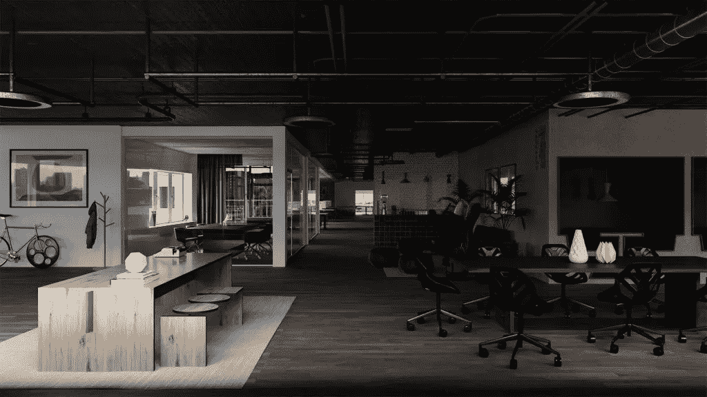

*Interior with* [*HDRI*](https://www.pg-skies.net/) *Lighting*

## 普通灯:

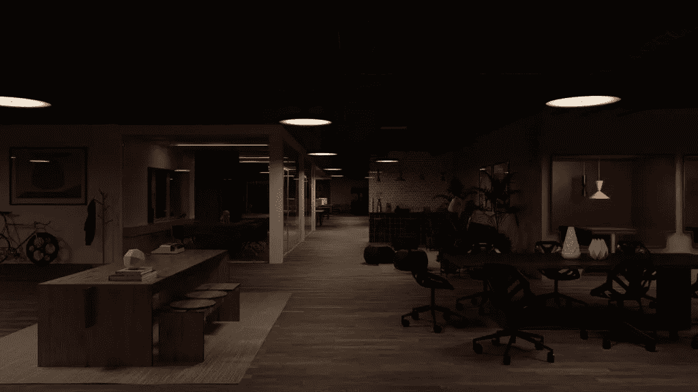

*Rotterdam General Lighting*

## 聚光灯:

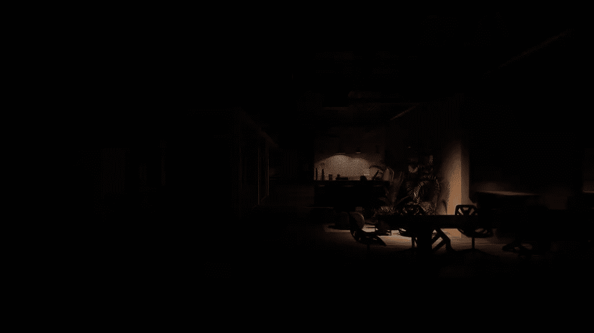

*Rotterdam Spotlights Lighting*

## 所有照明结果:

Rotterdam All Lighting Result

## 3D 渲染

这些图像完全由 Corona 渲染器渲染。对我们来说，这是任何 3D 渲染服务类型项目的[最佳选择。使用电晕渲染器 LightMix，可以更容易地更改一些特定的细节镜头，如一些强度和颜色，而无需设置另一种情绪，也无需重新渲染。](https://www.supremesupports.com.au/services/3d-rendering/)

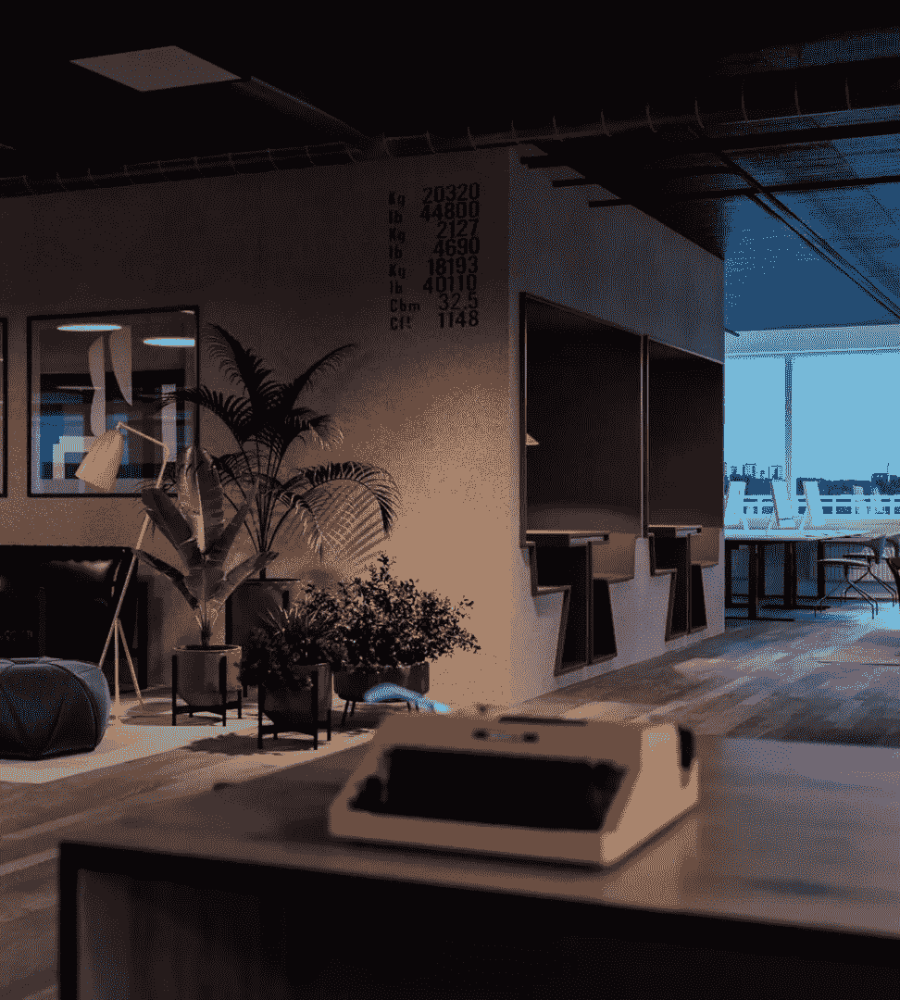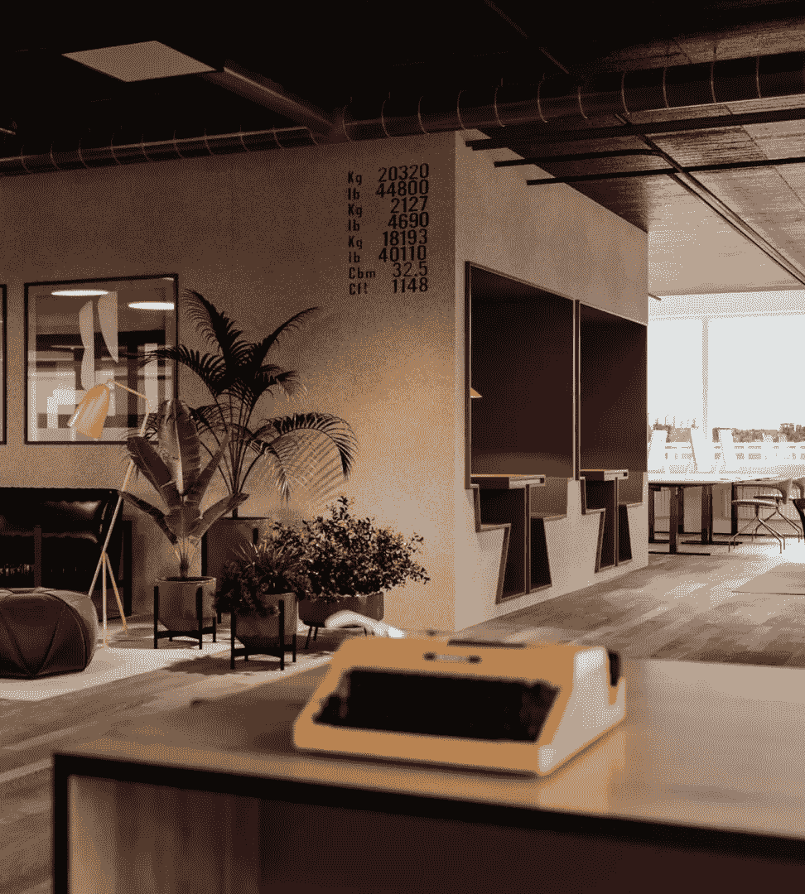

# 后期制作

最后加了一些人。但在渲染时，最重要的部分是找到合适的 2D 剪裁，符合人们的观看和照明角度。之后，在层次和颜色上的一些大的和小的调整总是必要的。就是这样！这是我们渲染的最终产品，

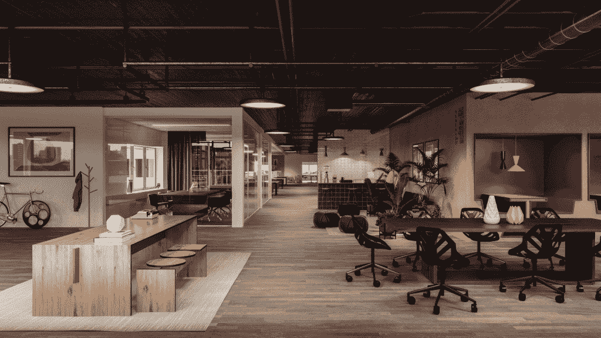

Rotterdam Post Production

内容版权归 [Supreme Supports Pty Ltd.](https://www.supremesupports.com.au/how-to-do-3d-rendering-for-office/)