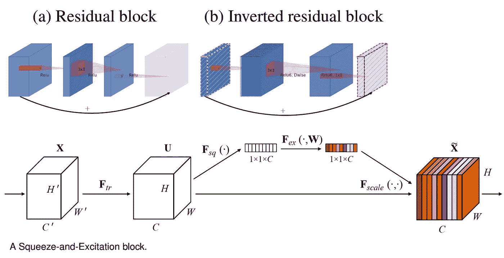
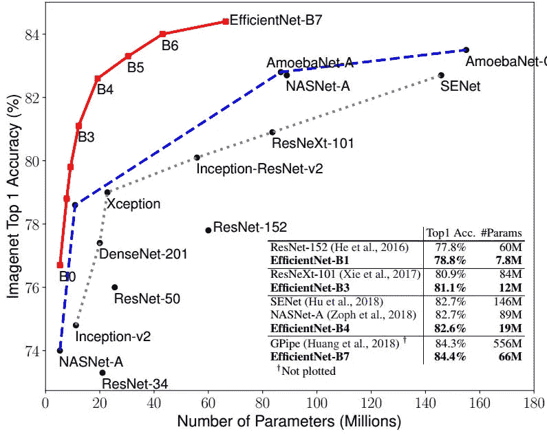
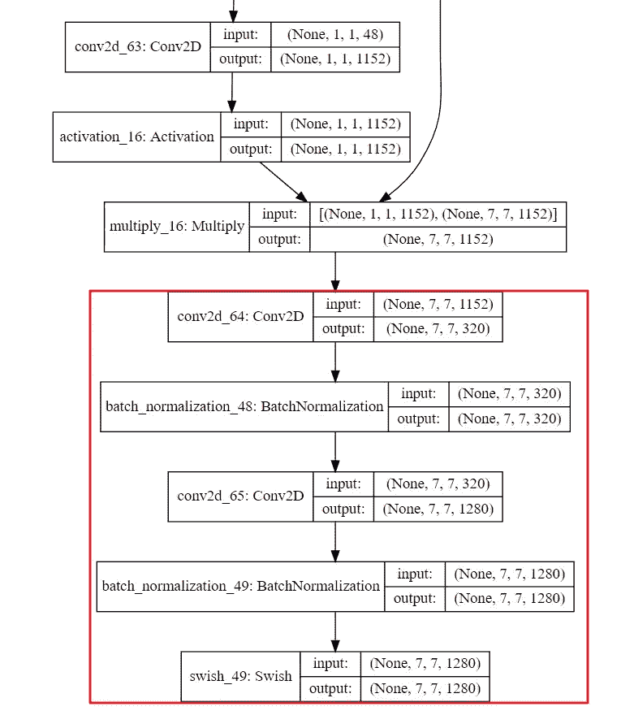

# 如何利用 Efficientnet 进行迁移学习

> 原文：<https://medium.datadriveninvestor.com/how-to-do-transfer-learning-with-efficientnet-5ad007fc1451?source=collection_archive---------0----------------------->

[](http://www.track.datadriveninvestor.com/1B9E)

在本教程中，您将学习如何创建图像分类神经网络来对您的自定义图像进行分类。该网络将基于最新的 EfficientNet，它在 ImageNet 上实现了最先进的精度，同时体积小 8.4 倍，速度快 6.1 倍。

# 为什么选择 EfficientNet？

与达到类似 ImageNet 精度的其他型号相比，EfficientNet 要小得多。例如，您在 Keras 应用程序中看到的 ResNet50 模型总共有 23，534，592 个参数，尽管如此，它的性能仍然低于最小的 EfficientNet，后者总共只需要 5，330，564 个参数。

[](https://www.datadriveninvestor.com/2019/01/23/deep-learning-explained-in-7-steps/) [## 深度学习用 7 个步骤解释-更新-数据驱动的投资者

### 在深度学习的帮助下，自动驾驶汽车、Alexa、医学成像-小工具正在我们周围变得超级智能…

www.datadriveninvestor.com](https://www.datadriveninvestor.com/2019/01/23/deep-learning-explained-in-7-steps/) 

为什么效率这么高？为了回答这个问题，我们将深入研究它的基本模型和构建模块。您可能听说过经典 ResNet 模型的构造块是恒等式和卷积块。

对于 EfficientNet 来说，它的主要构建块是移动的，结合了**倒瓶颈** MBConv，这是在 [MobileNetV2](https://arxiv.org/abs/1801.04381) 中首次引入的。通过直接在瓶颈之间使用快捷方式，与扩展层**相比，连接更少数量的信道，与传统层相比，深度方向可分离卷积**有效地将计算减少了几乎一个 k^2 因子。其中 k 代表内核大小，指定 2D 卷积窗口的高度和宽度。



作者还添加了[挤压和激励](https://arxiv.org/abs/1709.01507) (SE)优化，这有助于进一步提高性能。
efficient net 的第二个优势是，它通过仔细平衡网络深度、宽度和分辨率来提高扩展效率，从而带来更好的性能。



如您所见，从最小的高效净配置 B0 到最大的 B7，精度稳步提高，同时保持相对较小的尺寸。

# 使用 EfficientNet 迁移学习

如果你不完全确定我在上一节所讲的内容，那也没关系。用于图像分类的迁移学习或多或少是模型不可知的。如果您愿意，可以选择任何其他预先训练好的 ImageNet 模型，如 MobileNetV2 或 ResNet50 作为替代。

预先训练的网络只是先前在大型数据集(例如 ImageNet)上训练的保存的网络。学习到的特征可以证明对许多不同的计算机视觉问题是有用的，即使这些新问题可能涉及与原始任务完全不同的类别。例如，一个人可以在 ImageNet 上训练一个网络(其中的类主要是动物和日常物品)，然后将这个训练好的网络重新用于像识别图像中的[汽车型号](https://ai.stanford.edu/~jkrause/cars/car_dataset.html)这样的远程任务。对于本教程，我们希望该模型能够在样本数量相对较少的情况下，很好地解决猫和狗的分类问题。

最简单的方法是在 Colab 中打开这个笔记本,我会在这篇文章中解释更多的细节。

首先克隆我的存储库，它包含 EfficientNet 的 Tensorflow Keras 实现，然后将 cd 放入目录。

```
!git clone [https://github.com/Tony607/efficientnet_keras_transfer_learning](https://github.com/Tony607/efficientnet_keras_transfer_learning)
%cd efficientnet_keras_transfer_learning/
```

EfficientNet 是为包含 1000 个类别标签的 ImageNet 分类而构建的。对于我们的数据集，我们只有 2 个。这意味着分类的最后几层对我们没有用。通过将`include_top`参数指定为 False，可以在加载模型时排除它们，这也适用于在 [Keras 应用](https://keras.io/applications/)中可用的其他 ImageNet 模型。

```
# Options: EfficientNetB0, EfficientNetB1, EfficientNetB2, EfficientNetB3
# Higher the number, the more complex the model is.
**from** **efficientnet** **import** EfficientNetB0 **as** Net
**from** **efficientnet** **import** center_crop_and_resize, preprocess_input# loading pretrained conv base model
conv_base = Net(weights="imagenet", include_top=False, input_shape=input_shape)
```

在 EfficientNet 卷积基础模型之上创建我们自己的分类层堆栈。我们采用`GlobalMaxPooling2D`将`(batch_size, rows, cols, channels)`张量 4D 转换成形状为`(batch_size, channels)`的 2D 张量。与`Flatten`层相比，`GlobalMaxPooling2D`产生的特征数量要少得多，这有效地减少了参数的数量。

```
**from** **tensorflow.keras** **import** models
**from** **tensorflow.keras** **import** layersdropout_rate = **0.2**
model = models.Sequential()
model.add(conv_base)
model.add(layers.GlobalMaxPooling2D(name="gap"))
# model.add(layers.Flatten(name="flatten"))
**if** dropout_rate > **0**:
    model.add(layers.Dropout(dropout_rate, name="dropout_out"))
# model.add(layers.Dense(256, activation='relu', name="fc1"))
model.add(layers.Dense(**2**, activation="softmax", name="fc_out"))
```

为了保持卷积基的权重不变，我们将冻结它，否则，先前从 ImageNet 数据集学习的表示将被破坏。

```
conv_base.trainable = False
```

然后你可以从微软下载并解压`dog_vs_cat`数据。

```
!wget [https://download.microsoft.com/download/**3**/E/**1**/**3E1**C3F21-ECDB-**4869**-**8368**-**6**DEBA77B919F/kagglecatsanddogs_3367a.zip](https://download.microsoft.com/download/3/E/1/3E1C3F21-ECDB-4869-8368-6DEBA77B919F/kagglecatsanddogs_3367a.zip)
!unzip -qq kagglecatsanddogs_3367a.zip -d dog_vs_cat
```

笔记本[中有几个数据块](https://github.com/Tony607/efficientnet_keras_transfer_learning/blob/master/Keras_efficientnet_transfer_learning.ipynb)专用于从原始数据集中采样图像子集，以形成训练/验证/测试集，之后您将看到。

```
total training cat images: **1000**
total training dog images: **1000**
total validation cat images: **500**
total validation dog images: **500**
total test cat images: **500**
total test dog images: **500**
```

然后你可以用 Keras 的`ImageDataGenerator`对模型进行编译和训练，它在训练过程中增加了各种数据增广选项，以减少过拟合的机会。

```
**from** **tensorflow.keras.preprocessing.image** **import** ImageDataGeneratortrain_datagen = ImageDataGenerator(
    rescale=**1.0** / **255**,
    rotation_range=**40**,
    width_shift_range=**0.2**,
    height_shift_range=**0.2**,
    shear_range=**0.2**,
    zoom_range=**0.2**,
    horizontal_flip=True,
    fill_mode="nearest",
)# Note that the validation data should not be augmented!
test_datagen = ImageDataGenerator(rescale=**1.0** / **255**)train_generator = train_datagen.flow_from_directory(
    # This is the target directory
    train_dir,
    # All images will be resized to target height and width.
    target_size=(height, width),
    batch_size=batch_size,
    # Since we use categorical_crossentropy loss, we need categorical labels
    class_mode="categorical",
)validation_generator = test_datagen.flow_from_directory(
    validation_dir,
    target_size=(height, width),
    batch_size=batch_size,
    class_mode="categorical",
)
model.compile(
    loss="categorical_crossentropy",
    optimizer=optimizers.RMSprop(lr=**2e-5**),
    metrics=["acc"],
)
history = model.fit_generator(
    train_generator,
    steps_per_epoch=NUM_TRAIN // batch_size,
    epochs=epochs,
    validation_data=validation_generator,
    validation_steps=NUM_TEST // batch_size,
    verbose=**1**,
    use_multiprocessing=True,
    workers=**4**,
)
```

另一种使模型表示与当前问题更相关的技术叫做微调。那是基于下面的直觉。

卷积基础中的早期层编码更通用、可重用的特征，而较高层编码更专用的特征。

微调网络的步骤如下:

*   1)在已经训练好的基础网络上添加您的自定义网络。
*   2)冻结基础网络。
*   3)训练你加的部分。
*   4)解冻基础网络中的一些层。
*   5)联合训练这些层和你添加的部分。

我们已经完成了前三个步骤，为了找出要解冻的图层，绘制 Keras 模型很有帮助。

```
**from** **tensorflow.keras.utils** **import** plot_model
plot_model(conv_base, to_file='conv_base.png', show_shapes=True)
**from** **IPython.display** **import** Image
Image(filename='conv_base.png')
```

这是卷积基础模型中最后几层的放大视图。



设置`multiply_16`和可训练的连续层。

```
conv_base.trainable = Trueset_trainable = False
**for** layer **in** conv_base.layers:
    **if** layer.name == 'multiply_16':
        set_trainable = True
    **if** set_trainable:
        layer.trainable = True
    **else**:
        layer.trainable = False
```

然后，您可以为更多的时期再次编译和训练模型。最后，您将拥有一个经过微调的模型，验证准确性提高了 9%。

# 结论和进一步阅读

这篇文章首先简要介绍了 EfficientNet，以及为什么它比传统的 ResNet 模型更有效。Colab Notebook 上的 runnable 示例向您展示了如何构建一个模型来重用 EfficientNet 的卷积库，并对自定义数据集的最后几层进行微调。

完整的源代码可以在[我的 GitHub repo](https://github.com/Tony607/efficientnet_keras_transfer_learning) 上找到。

## 您可能会发现以下资源很有帮助。

[EfficientNet:反思卷积神经网络的模型缩放](https://arxiv.org/abs/1905.11946) [MobileNetV2:反向残差和线性瓶颈](https://arxiv.org/abs/1801.04381) [挤压和激励网络](https://arxiv.org/abs/1709.01507)[tensor flow efficient net 的实现](https://github.com/tensorflow/tpu/tree/master/models/official/efficientnet)

*原载于*[*https://www.dlology.com*](https://www.dlology.com/blog/transfer-learning-with-efficientnet/)*。*

[](https://github.com/Tony607/efficientnet_keras_transfer_learning) [## Tony 607/efficient net _ keras _ transfer _ learning

### 利用 Keras 中的 EfficientNet 进行迁移学习。通过…为 Tony 607/efficient net _ keras _ transfer _ learning 发展做出贡献

github.com](https://github.com/Tony607/efficientnet_keras_transfer_learning)