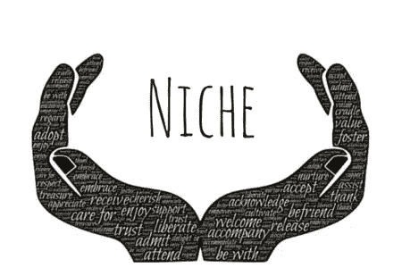
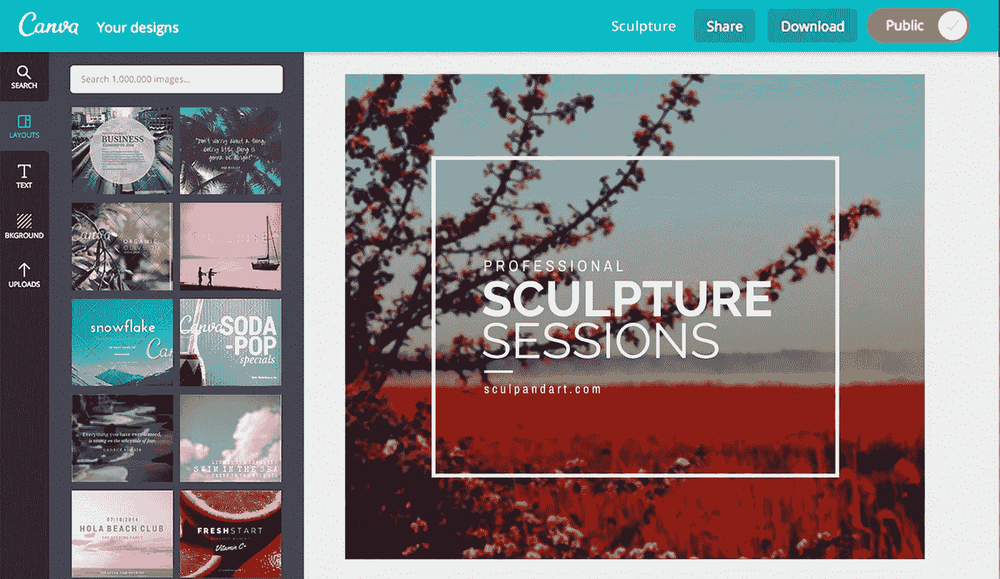
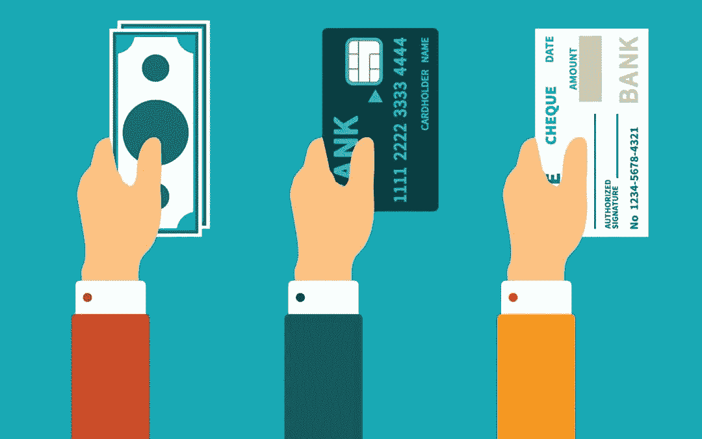
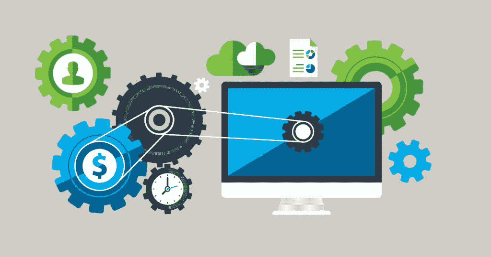
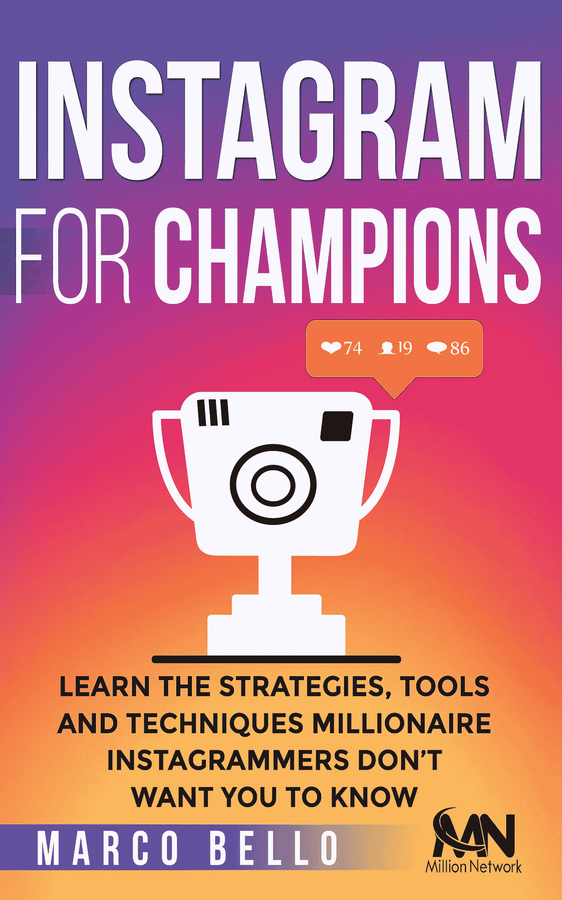

# 如何为 Instagram 创作内容，每周赚 100 美元

> 原文：<https://medium.datadriveninvestor.com/how-to-earn-100-per-week-creating-content-for-instagram-ec3dc47edf8b?source=collection_archive---------11----------------------->

这篇文章与成千上万的关注者和参与无关，它不会帮助你在关注者、喜欢者中建立你的 instagram 帐户，也不会告诉你如何找到投资者来货币化你的个人资料，相反，我会一步一步地告诉你如何为其他 instagram 帐户创建内容，为你的内容找到客户，并通过你可以在智能手机或电脑上经营的小企业获得每周被动收入。

这种方法实际上可以用于任何社交网络，但我将专注于 Instagram，因为它是我们每天都能找到潜在客户的地方。

我们到底要做什么？

简单地说，我们将联系中等规模的 instagram 页面(100，000 或更多的追随者)，并提供每周为他们创建内容，并向他们收取服务费用。你会惊讶于拥有+100，000 追随者的帐户数量，这些追随者正在将他们的个人资料货币化，并愿意为内容付费。

**第一步:找到一个利基市场。**

这不是新的，选择特定的利基是一种方式，进一步成功的在线业务，这里没有什么不同。内容创作最适合的领域是迷因、励志名言、奢侈品页面和宠物(猫和狗)。你可以尝试通过其他利基，但坚持与主题非常受欢迎，你最有可能找到许多网页相关。

我用来研究利基和产品的最好的工具之一是 Google Trends，它是免费的，会给你关于你的搜索词的详细信息，以便找到在 Google 服务中或者在整个互联网上最流行的东西。使用图表来做决定对各地的营销人员来说是一个非常有用的指标，这也是你在进入这个行业并找到对你最有利可图的利基之前想要做的事情。

**第二步:创造内容。**

我们假设你对设计一无所知，零！

你可以开始玩 Canvas，它是一个免费的应用程序和网络图像编辑器，有成千上万的模板和模型，你可以复制或跟随它来完成你的艺术作品。画布在业余爱好者和专业人士中很受欢迎；这是一个强大的收费，不需要任何技能或投资。你现在就可以开始创作任何东西，从 logos 到 instagram 图片，Canvas 都会有所帮助。

如果你已经有了设计技能，你可以选择其他工具，比如 Photoshop，或者任何你用来把你的作品放在一起的工具。

能够在这里设计您的内容非常重要；它包括发现应用于其中的创造力。你可以使用像谷歌这样的快捷方式在引用、图片和其他网站中寻找灵感，但最终的作品必须是你的。

当你创建自己的模板库时，你就开始优化你的工作。在你的矛时间里，每天收集 20 到 30 张图片，储存它们，并在你的客户开始到来时管理分发。

内容是你的产品，你需要有它来营销。

**第三步:寻找客户**

在这种情况下，你必须保持稳定，并一直玩数字游戏。这是一个不同的市场，意味着低竞争，但也意味着不同的方法。

从 Instagram 搜索本身开始，我们将锁定拥有+10 万粉丝的个人资料来联系和提供我们的服务，这些个人资料的所有者本身就是小企业家，他们最有可能将他们的个人资料和外包服务货币化，以发展他们的业务。

我们将提供的是每周 20 美元的 15 张图片，他们可以免费使用来充实他们的个人资料。给他们 3 或 4 个样品，这样他们可以评估你的工作，并愿意谈判。

如果你每天联系 25 到 30 个用户，不到一周，你可能会有 2 到 3 个客户每周为你的内容服务付费。

**第四步:接收付款**

今天有几十种选择来接收付款，最受欢迎的和绰绰有余的业务是贝宝。您可以在几分钟内开立账户，并立即开始接收付款，如果您在美国，您可能有资格使用 PayPal 借记卡，如果您在欧洲和其他一级国家，您可以在 2 个工作日内将资金提取到您的银行账户(如果他们不暂停您的交易)。

请记住，你可以使用你的贝宝基金支付网上几乎任何地方的东西；这个月我将在巴塞罗那庆祝我的生日，机票和酒店都是用贝宝支付预订的。这项服务并不完美，有时他们可能会在没有通知的情况下让你疯狂持有或阻止你的基金，最近他们证明了对商家和安全问题的旧政策，允许买家使用平台内的争议系统来欺骗商家，但它非常受欢迎，几乎在你可以在线购买的任何地方都被接受。

如果你正在寻找一种无压力的支付方式，你可以选择银行存款或在谷歌上搜索所有可用选项。

…

如果你遵循第 1 步到第 4 步，并在你的新业务中保持一致，你将获得被动收入，唯一的投资是你自己的时间。如果你能把好的设计放在一起，每天联系尽可能多的客户，你将建立一个经常性付款的客户名单，并为你的口袋带来一笔可观的额外收入。

作为一个人的公司，每天投入 2 到 3 个小时，你可以从 7 到 10 个客户那里赚到 600 到 1000 美元。

你将需要交付高质量的设计，以保持客户从你每周订购，所以要保持你的想法新鲜和醒目。

请记住，这是一种被动收入的方式，我希望你有一个源源不断的收入，这样你就不需要依赖你的小企业的钱，只需要享受每周额外收入的喜悦。

我能自动化和规模化这项业务吗？

当你开始外包服务时，你的内容创作业务就有可能实现自动化和规模化。如果你把服务外包出去，保持和你一个人的公司一样的水平，这意味着你的利润会减少，但是如果你把服务外包出去，你会得到提升。

你可以在 Fiverr 上雇佣自由职业者，以 5 美元的价格为你创作一套艺术品，甚至可以将寻找客户的工作外包出去，向你的助理提供费用+佣金。

当你外包时，你两者都在做；自动化你必须自己做的过程，并且缩放结果，因为你可以让两个或更多的人做同样的事情。

当你的企业发展到 2-3 人时，收入潜力上升到 4000-10.000 美元，考虑到现在你有一些账单要付，你可能仍然有+60%的利润。

**下一步是什么？**

现在一切都在你的掌握之中，取决于你有多积极。如果你喜欢设计，并想把它变成一种被动收入的方式，甚至是一个坚实的业务，这一步一步告诉你如何从零到英雄。

提示:聪明的企业家会利用脸书和 Instagram 广告来拓展业务，以获得新客户。一旦你有了活动的价格，就可以轻松快速地扩大 facebook 的广告组合，以增加广告效果。

**成为有影响力的人，从 Instagram 上创造 6 位数的收入**

如果你想跳过 Instagram 服务，直接进入社交网络的大生意，我的建议是你学习并成为一个有影响力的人。

来自 Millions Network 的 Marco Bello 先生分享了他的知识、技巧、工具和技术，以建立一个强大的 instagram 个人资料，并通过大喊和交叉内容将其货币化。任何人都可以成为 Instagram 的影响者，你只需要有一个 IG 账户，并知道如何正确使用它来快速增加粉丝和参与度，并将其转化为观众驱动力，并从赞助商那里获得高达 6 位数的月收入。

有影响力的人在 instagram 上花费的时间和普通用户一样多，收入轻松达到 6 位数。

在接下来的 15 天里，你不需要成为一名摄影师、顶级模特或名人来成为一名有影响力的人。

有影响力的人在世界任何地方都可以通过他们的智能手机建立自己的事业。他们是真正的数字游牧者。

你可以在这本特别的电子书里接触到他所有的知识。这是一个非常小的投资，但你将从这几页中获得惊人的价值。

[点击此处获取您的副本](http://bit.ly/Insta4Champions)

**我可以帮你吗？**

如果你对自由职业、数字营销或如何通过良好的风险管理启动自己的在线业务有疑问，请在社交网络上联系我，我很乐意帮助你。

www.facebook.com/wellyington
脸书:[www.instagram.com/wellyington](http://www.instagram.com/wellyington)

感谢您的阅读；我希望这篇文章能激励你对新的被动收入来源采取积极的行动。