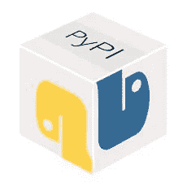

# 如何(轻松地)将 Python 代码上传到 PyPi

> 原文：<https://medium.datadriveninvestor.com/how-to-easily-upload-your-python-code-to-pypi-87b4ec2d2691?source=collection_archive---------24----------------------->



你一定使用过 [PyPi](https://pypi.org/) 包来安装 Python 中的新包。是这样的:`pip install some_library`。这是安装新库的一种简单而有效的方法。

有没有想过，如何让自己的代码像这样可用？嗯，没那么难。我们在这里展示了一个简单的方法来完成这个任务，之后你也可以使用`pip`来安装你的 Python 库。

有两种方法可以实现这一点:

1.  遵循这里列出的所有准则:【https://packaging.python.org/tutorials/packaging-projects/】T4。这需要一些时间来完成工作。
2.  使用库 [pypi-install](https://github.com/daroodar/Pypi-Install) 自动打包您的 Python 代码，并使其变得简单易行。

这里我们将关注第二个选项，即使用 [pypi-install](https://github.com/daroodar/Pypi-Install) 库。

# 步骤 1:先决条件

在继续之前，您必须执行以下 2 个步骤:

1.  在[https://pypi.org/](https://pypi.org/)上开户并记住其用户名和密码。
2.  上传 [GitHub](https://github.com/) 上的代码(你打算打包的代码)。将链接复制到你上传代码的 github 库。

# 步骤 2:配置和安装

首先，安装所需的库:

```
pip install pypi-install
```

安装库后，将其导入到您的会话中:

```
from from pypi_install import pypi_install as PI
```

之后，您需要设置一些参数，如下所述:

*   **pypirc_username** :您在步骤 1 中注册的 pypi 网站的用户名
*   **pypirc_password** :您在步骤中注册的 pypi 网站的密码
*   **directory _ of _ new _ folder**:新文件夹的路径，您希望将 python 代码打包所需的所有文件放在该文件夹中
*   **版本号**:你的 python 包的版本。比如 0.0.1，0.0.2，2.1.3 等等
*   作者姓名全称:作者的全名
*   **作者 _ 电子邮件**:作者的电子邮件
*   **简短描述**:您的包裹的简短描述
*   **github_url** :您在步骤 1 中保存的 GitHub URL
*   **python_version** :您机器上安装的 python 版本。例如 2 或 3。
*   **项目名称**:你希望 python 项目的名称是什么。这是您稍后将用作`pip install name_of_project`的名称
*   **目录 _of_python_files** :你想作为你的包的一部分上传的所有 python 文件的路径

您将如下设置所有这些参数(当然是在您的 python 会话中):

```
**pypirc_username**="my_pypi_username" # for e.g. "new_john"
**pypirc_password**= "my_pypi_password" # for e.g. "john123"
**directory_of_new_folder** = "path_new_directory" # for e.g. "/home/USER/New_Folder"**version_number**="your_project_version_no" # for e.g. "0.0.2"
**author_name_full**="full_author_name" # for e.g. "John Smith"
**author_email**="author_email" # for e.g. johnsmith123@hotmail.com**short_description**="short_description" # for e.g. "My first PyPi project"
**github_url**="your_code_github_url" # for e.g. https://github.com/USER/my_respistory
**python_version**="python_version_in_your_computer" for e.g. "3" or "2"
**name_of_project**="name_of_project" for e.g. "my_pypi_code"
**directory_of_python_files**=["PATH/my_python_file_1.py","PATH/my_python_file_2.py"] # Include all the python files here
```

设置这些参数后，您可以使用一行代码上传您的代码:

```
**PI**.make_pypi_folders(pypirc_username,pypirc_password,directory_of_new_folder,name_of_project,directory_of_python_files,version_number,author_name_full,author_email,short_description,github_url,python_version) *# There, your code is uploaded on pypi! It's that easy!*
```

# 检查

完成这些步骤后，您可以通过以下方式检查您的包裹:

```
pip install name_of_project
```

应该安装它。就这么简单！

GitHub 代码:[https://github.com/daroodar/Pypi-Install](https://github.com/daroodar/Pypi-Install)