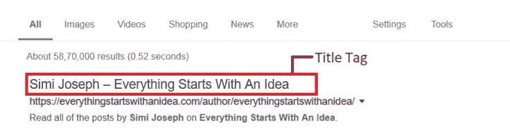

# 如何有效地为你的网站使用通用元标签？

> 原文：<https://medium.datadriveninvestor.com/how-to-efficiently-use-common-meta-tags-for-your-website-3b0621095a3f?source=collection_archive---------25----------------------->

[](http://www.track.datadriveninvestor.com/1B9E)

一段时间以来，我们一直在争论 **Meta 标签**是否与 SEO & [SERP](https://en.wikipedia.org/wiki/Web_crawler) 排名相关。但是什么是元标签呢？我们为什么要使用它们？如何将它们包含在你的网页中？使用它们的有效方法是什么？这对你的网页在 SERPs 中的高排名有帮助吗？


元标签确实是 SEO 的关键元素之一。它已经被用了很长时间来识别网页的内容。它们是那些隐藏的代码，你可能在你的网页上看不到，但是它们存在于你的网页的源代码中。

> "这是合法的方式隐藏你的网页中的搜索引擎的话."
> 
> -丹尼·沙利文——技术专家兼记者

Meta 标签是帮助[网络爬虫](https://en.wikipedia.org/wiki/Web_crawler)识别和总结网页内容的 HTML 元素。它是一个机器可读格式的网页摘要，对搜索引擎来说更方便。

# 哪些是常见的元标签？

1.  标题标签
2.  元字符集
3.  元视口
4.  元关键词
5.  元描述

# 标题标签

标题标签是网络爬虫对网页的第一印象。这是搜索引擎结果页面(SERP)上显示的网页标题。



## 标题标签的 HTML 代码

```
<head>  
<title>Simi Joseph - Everything Starts With An Idea</title>
</head>
```

## 有效标题标签的要点——

1.)确保每个网页只有一个标题标签。一个标题标签将帮助网络爬虫发现网页的独特性和价值。多个标题标签也可能影响网页的点击率。

2.)标题标签应限制在 60 个字符以内，以确保标题在 SERPs 上的完全可见性

3.)标题标签需要简短，并基于网页中的内容进行描述

4.)尝试在 title 标签中包含准确的关键字，但也要确保不会填充关键字

5.)如果你正在推广一个品牌，试着在标题标签中包含品牌名称

6.)以防你也在脸书、Instagram 等社交媒体平台上推广该页面..等等，确保你精确地设置了 ***Alt 标题*** ，因为搜索引擎有时会根据链接的 Alt 标签改变网页的标题。

虽然 title 标签并没有明确地作为 meta 标签的一部分，但是它的功能肯定是和 meta 标签相似的。

# 元字符集

**元字符集**用于定义网页的字符编码方案。

## 元字符集标记的 HTML 代码

```
<head>
<title>How to add Meta Description in your HTML code</title>
<meta charset="utf-8">
</head>
```

## 有效元字符集的要点——

1.)最常用的字符集是 [UTF-8](https://en.wikipedia.org/wiki/UTF-8) 和[ISO-8859–1](https://en.wikipedia.org/wiki/ISO/IEC_8859-1)

2.)还有很多可用的字符集，但并不是所有的搜索引擎都能识别或读取它们，所以最好还是使用最常用的字符集

# 元视口

**Meta Viewport** 是一个响应性的 Meta 标签，用于控制网页在浏览设备上的尺寸。

## 元视口标记的 HTML 代码

```
<head>
<title>How to add Meta Description in your HTML code</title>
<meta charset="utf-8">
<meta name="viewport" content="width=device-width, initial-scale=1"> 
</head>
```

## 有效元视口的要点——

1.)确保您没有使用非常大的固定宽度元素。

2.)最好在网站中包含一个 viewport 标签，这样无论使用什么设备，页面都可以实现响应性页面设计。


Source — [http://webdesignerwall.com/](http://webdesignerwall.com/)

# 元关键词

Meta keywords 标签是您可以提及网页所有关键字的地方。您只会在 HTML 源代码中找到这段代码，而不会在 SERPs 中找到。这是专为网络爬虫理解和验证网页的内容。

## 元关键字标签的 HTML 代码

```
<head>
<title>How to add Meta Description in your HTML code</title>
<meta name = "keywords" content = "HTML, Meta Tags, Metadata, Meta description, SEO"/></head>
```

## 一个有效的元关键词的要点–

1.)关键字应该与网页内容相匹配

2.)应避免垃圾邮件和关键字填充，因为这可能导致页面因操纵网页中的数据而受到处罚。

最好是忽略元关键词，就好像没有正确收录一样，可能弊大于利。

# 元描述

元描述是你为网络爬虫总结整个网页的地方。该信息用于 SERP 上的片段文本。它帮助网络用户通过在 SERP 上阅读来了解网页的内容。

## 元描述标记的 HTML 代码

```
<head>      
<title>How to add Meta Description in your HTMLcode</title>      <meta name = "description" content = "Add your description here."/></head>
```

## 有效元描述的要点——

1.)虽然谷歌目前正在试验元描述中包含的字符数，但过长的元描述会导致谷歌、必应、雅虎等搜索引擎..等等来缩短它自己的描述。太短的元描述会迫使你避开重要的关键词，减少搜索引擎提供的空间价值。首选字符限制是 155，这是所有搜索引擎的标准。

2.)元描述的内容应该精确到网页上可用的内容。尝试包含以下内容

*   您可以添加相关的关键字并加粗它们，以便它们从其余的单词中脱颖而出
*   包括任何需要的行动呼吁
*   如果是产品，请说明产品特性或规格

3.)尽可能包括 HTML 表格，因为像 Google 这样的搜索引擎更喜欢直接提供搜索查询答案的网站。

4.)确保不要重复元描述。尽管这样做没有什么大的害处，但是使用多个描述可能会导致 Google 选择任何随机描述作为要搜索的查询的摘录，这可能会使 web 用户感到困惑。

5.)尽量用主动语态写，这样句子才清晰、直接、简洁。

6.)确保元描述是网页上提到的数据的总结。相同内容的错误匹配可能不会导致搜索结果的任何差异，但最终可能会影响网页的点击率。

7.)描述应该是独特的，并且应该是专门为客户编写的。它应该是令人印象深刻的，可读的，并应回答被问及的问题。它应该让网络用户知道为什么他们需要点击这个链接，以及一旦他们点击后会发现什么。

# 元标签有多重要— 2018？

曾经有一段时间，元描述是影响网页排名的因素之一，但最近由于许多网站所有者提供的功能被滥用，搜索引擎不仅仅依赖于元描述中提到的数据。话虽如此，元描述在 SEO 方面仍有不少优势。

如果网页的[点击率(CTR)](https://en.wikipedia.org/wiki/Click-through_rate) 高，搜索引擎会提高该网页的排名。CTR 高度依赖于元描述中显示的数据。如果你的元描述回答了网络用户的问题，那么他们很可能会点击链接来了解更多。这也有助于吸引更多的受众，提高转化率。

即使 Google 和 Bing 已经排除了元描述和元关键字作为页面排名的主要因素，Yahoo 似乎仍然使用它们在 SERPs 中进行排名。优化的元标签仍然提供网页内容和网页质量的网络爬虫验证。

像脸书、LinkedIn、Twitter 这样的社交媒体平台仍然很好地利用[Open Graph Meta Tags](https://everythingstartswithanidea.com/2019/02/20/basic-html-meta-tags-and-open-graph-protocol-you-should-know-about/)&[Twitter Cards](https://everythingstartswithanidea.com/2019/02/20/basic-html-meta-tags-and-open-graph-protocol-you-should-know-about/)在他们的平台上分享广告或进行推广。

有了适当形式的 meta 标签，你就能增加在 SERPs 中获得更好排名的机会，让你的业务在搜索结果中更加突出。了解你的优势&有效地利用它们，你会在搜索引擎结果页面中一路攀升。

> “出色的执行力是最大的优势。”
> 
> 玛格丽特·莫洛伊

*原载于* [*一切始于一个想法*](https://everythingstartswithanidea.com/2019/02/20/how-important-are-meta-tags-for-your-online-business-know-now/) *。*