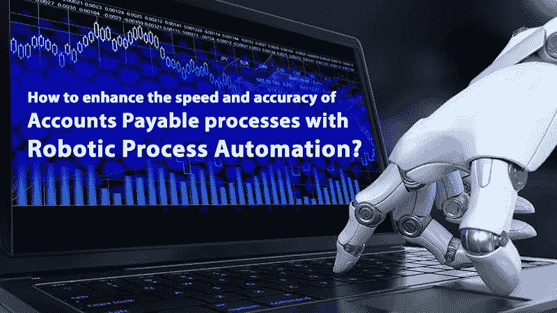

# 如何通过机器人流程自动化提高应付账款流程的速度和准确性？

> 原文：<https://medium.datadriveninvestor.com/how-to-enhance-the-speed-and-accuracy-of-accounts-payable-processes-with-robotic-process-30fc030743d8?source=collection_archive---------12----------------------->

虽然全世界都在为自动化在商业领域的实施而欢欣鼓舞，但是，仍然有一些怀疑者不愿意唱同一首歌，特别是在金融领域。**应付账款**或**应付账款**，因为它通常被认为是至关重要的部分之一，在这个领域，即使是一个微小的错误都可能导致主机的大混乱。

然而，这仅仅是少数人内心深处的恐惧，他们还没有准备好接受机器人模仿人类工作的潜力。

***RPA*** *is so carefully designed, to fulfill the demands of the user appropriately*

可以理解的是，会计和财务都是一个组织中最重要的领域；因此，必须以最稳妥的方式处理它们。

 [## 模式和机器人:复杂的现实|数据驱动的投资者

### 哈耶克的名著《复杂现象理论》(哈耶克，1964)深入探讨了复杂性的话题，并断言…

www.datadriveninvestor.com](https://www.datadriveninvestor.com/2019/03/04/patterns-and-robotics-a-complex-reality/) 

**# 1 RPA 如何从今天开始为明天铺路？**

我想到的问题是，爱国军实际上是如何铺平道路的？这个问题的答案可能会因人而异，取决于他们对相同事物的接触程度。然而，机器人流程自动化**还有更大的潜力有待实现**，然而目前的场景对使用它们的公司来说不亚于一个魔咒。

下面提到的几点将有助于清楚地了解各个领域，人们可以从中找出差异，从而看清未来的道路。

● **支出**

每个组织都在寻找削减成本的技术，而**实施 RPA** 是目前为止最好的技术之一。它不仅节省了大量存储容量，还节省了大量 fte。由于不再需要文书工作，而是以数字方式存储记录，因此消除了购买和维护大型登记册或文件的成本。

此外，**机器人**被认为**在做一个**全职**员工的**工作，而且效率更高**；因此，它降低了让低技能员工从事普通工作的成本。**

● **速度**

其次，在这个快速发展的世界里，没有人喜欢落后。而且，一个 **RPA** 根本不会让人掉队。应付账款被认为是一项繁琐的工作，但有了 RPA，似乎就不一样了。这项工作在几分之一秒内完成，绝对没有错误。

*可能，这就是为什么他们说，“您明天需要什么，RPA 今天就给你什么”。*

结果获得得如此之快，以至于一个人可以在一两个小时内完成他/她几个月的乏味任务，只要他们给机器人机器输入合适的指令。

● **精度**

**机器人工艺自动化**的另一个**重要方面**是**精度**的水平。虽然人类错误百出，但机器肯定不是这样。它很可能以最小到绝对没有错误的方式执行工作。用户可以以期望的方式对软件进行编程，并相应地为执行特定任务的**进行调度。**

**应付账款**目前与创新或创造力无关，因此最好留给机器人去做并获得结果。这些结果可以进一步用于制定更好的业务发展战略。此外，以**机器人自动化**在**计算**方面提供的**精度**水平，肯定是值得称道的。

这种想法是为了在最琐碎的问题上最大限度地减少人为干预，从而使熟练劳动力走向更广阔的道路。虽然重复的任务可能不会给人类带来任何成果，但另一方面，推动创新可能会带来新的成果。

总而言之，机器人自动化让企业有机会重新思考他们与 AP 的合作。

**#2 现在的真实画面是怎样的？**

嗯，真实的情况有点不同。应付账款或应付账款以及其他一些类似的工作大多是单调乏味的。他们肯定不会激发组织中的员工。它们本质上既没有回报，也不需要任何技能。然而，这些都需要做，因为它们是任何公司的基石，是最基本的成分。

在相当长的一段时间里，人类一直背负着做这些乏味工作的负担，直到自动化出现并从他们手中夺走这些工作。员工们不仅松了一口气，而且在客户互动和扩大投资领域方面，他们还将目光转向了业务的改善。

最终，这也导致了组织的整体增长，并在市场的相关参与者中以更好的方式展示了自己。因此，这也吸引了更多的客户和投资者对特定的公司，能够提出自己与最近的趋势。

**#3 我们正在走向完全自动化吗？**

对上述问题的简单回答是“不”。不过，如果什么都不用做，把所有事情都交给机器人去做，那就太令人欣慰了。然而，即使这样，几天后也会变得令人不安。

如上所述，RPA 在组织中的**应用最终有助于找出轻松完成日常任务的最佳方法。此外，所有这些都进一步推动了**业务战略**的改进，员工们也开始修改他们的技能并承担新的项目。**

然而，在决策和高级心理层面，人类的参与是最重要的。这些部分无法在机器人的监督下发挥作用，基本上需要人类的参与。

*机器人流程自动化应该只作为一种为组织获取利益的工具。*

因此，仍然有许多领域，人类大脑的心理方面引导着树根前进。在那里，整合机器人的概念仍然混乱。也许在未来，当人类自己也准备好做同样的事情时，它就会成形，成为一个真理。