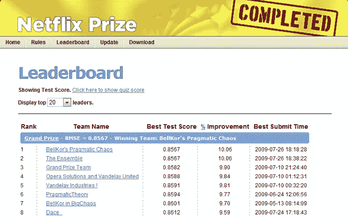
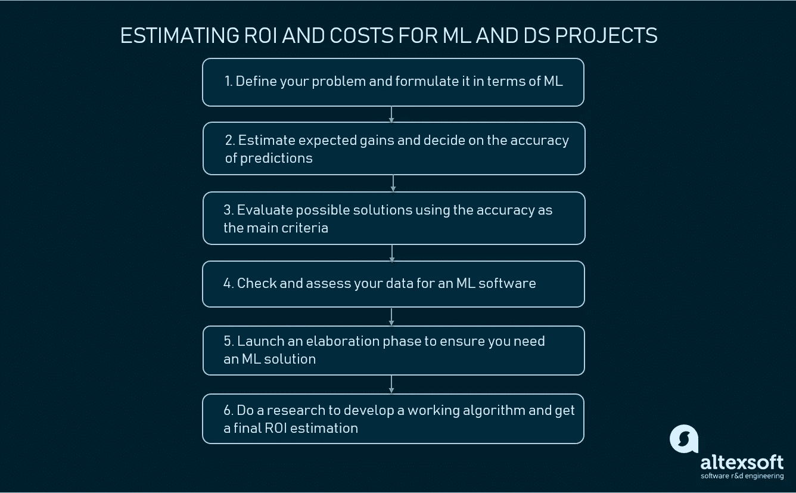
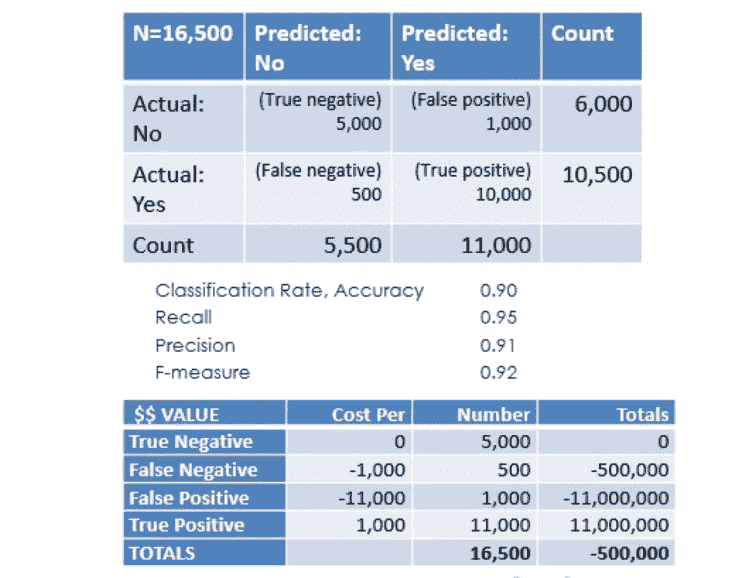
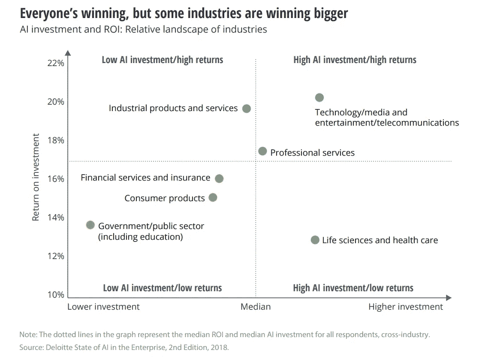

# 如何估算机器学习和数据科学项目的投资回报率和成本

> 原文：<https://medium.datadriveninvestor.com/how-to-estimate-roi-and-costs-for-machine-learning-and-data-science-projects-e68094d54aaa?source=collection_archive---------2----------------------->

在实施任何与技术相关的计划之前，专家们必须回答许多为什么和如何:这个解决方案的影响可能是什么？我们如何知道哪种技术组合最适合解决这个问题？我们负担得起这个实验吗？预计回收期是多少？对这些问题的回答有助于公司决定构建某种解决方案是否值得付出努力。

但事实并非总是如此。网飞花了 100 万美元改进它从未使用过的推荐引擎。

 [## 金融中的机器学习|数据驱动的投资者

### 在我们讲述一些机器学习金融应用之前，我们先来了解一下什么是机器学习。机器…

www.datadriveninvestor.com](https://www.datadriveninvestor.com/2019/02/08/machine-learning-in-finance/) 

2006 年，该公司宣布了 Netflix 奖，这是一项机器学习和数据挖掘竞赛，并向找到方法将他们的 CineMatch 电影推荐系统的准确性提高 10%的团队提供 100 万美元。在 2007 年，KorBell 开发团队取得了 8.43%准确性提高的中间结果。而两年后的 2009 年，大奖目标达成。BellKor 的《实用主义的混沌》( practical Chaos ),由 BellKor 在 BigChaos 和实用主义理论团队的研究人员组成，是第一个完成这项工作的。(是的，我们承认团队的名字和他们的编程技巧一样逻辑强大。)

*Final results of the ML competition. Source:* [*Netflix TechBlog*](https://medium.com/netflix-techblog/netflix-recommendations-beyond-the-5-stars-part-1-55838468f429)

网飞[决定](https://medium.com/netflix-techblog/netflix-recommendations-beyond-the-5-stars-part-1-55838468f429)不部署价值 100 万美元的算法，原因有两个:*“我们离线评估了一些新方法，但我们测量的额外精度增益似乎并不证明将它们引入生产环境所需的工程努力是合理的。”*除了不适当的成本和努力，不部署该算法的决定与该公司迈向个性化“下一个层次”有关。2007 年，网飞开始提供视频流媒体服务，而不是 DVD 租赁服务。因此，它必须调整其推荐方法以适应新的客户体验。

2016 年，网飞报告称，其新的内容推荐引擎减少了[客户流失](https://www.altexsoft.com/blog/business/customer-churn-prediction-for-subscription-businesses-using-machine-learning-main-approaches-and-models/?utm_source=MediumCom&utm_medium=referral)，每年为公司节省 10 亿美元。记住该公司的估计，推荐驱动了 80%的用户视频选择，准确的电影建议对于流媒体服务提供商的福祉至关重要。

了解了推出新产品或扩展工作系统的功能需要花费多少后，企业就可以专注于具有潜在财务回报的项目，以证明风险是合理的。任何项目的可行性研究都与投资回报(ROI)评估有关。

我们联系了我们的数据科学专家，以了解如何在估计机器学习项目的投资回报时降低风险。我们还讨论了从成本和收益(利润)的角度评估现成的、定制的非 ML 和基于 ML 的解决方案的方法。

# 什么是 ROI？估计和计算时要考虑的因素

投资回报是以比率或百分比表示的绩效衡量和评估指标。有几种方法可以计算投资回报率，但最常用的公式之一是将净收入(收益——投资成本)除以投资成本。

*ROI=(收益—投资成本)/投资成本*

该等式适用于各种行业，如下所示:

如果你知道这个公式的值，计算就容易了。实际上，要理解预测收益和实际收益是否相同或至少彼此接近，还需要一些时间。投资成本也是一个估计值。所以，它是关于尽可能准确地预测这些值。这就是脑力劳动开始的地方。

专家们必须考虑很多因素来决定投资一个项目是否是一个好主意。[查尔斯·施瓦布](http://schwab.com/)的高级执行副总裁 Jonathan Craig 列举了能够影响回报的[因素](https://www.investopedia.com/terms/r/returnoninvestment.asp):

**交易成本。**在经济学中，这些是在购买或销售商品或服务时发生的费用。应用于软件工程，交易成本可能意味着花费在构建、测试和部署解决方案上的时间。开发成本包括 IT 基础设施和员工薪酬、所需工时和维护成本。

**时间。确定一项投资将在什么时间段开始获得回报。当比较两个或更多项目时，时间因素是有用的，这些项目在相同的环境下具有相同的预期 ROI。**

**税收。**例如，如果你需要雇佣更多的人来开发内部产品，那么就要考虑增加的雇佣税。

**通胀。**你可以计算并比较[相对于通货膨胀的超额回报](https://www.investopedia.com/terms/e/excessreturn.asp)或实际回报与名义回报——未计入费用的回报。

**机会成本。**想一想如果你不把钱投资到一个项目中，你会如何使用这笔钱。

决定什么被认为是收益(收入)也很重要，这样这些价值，如果可以量化的话，就可以包含在 ROI 计算中。将收益视为在特定时间内获得的收入。有人也可以使用由于计算生产率提高而产生的收入。

*A roadmap to estimating ROI for ML and DS projects*

现在，让我们专注于将帮助您选择潜在解决方案、决定您是否甚至需要机器学习产品以及估计其投资回报的步骤。

# 1.定义你的问题，从机器学习的角度来考虑

项目路线图从定义问题开始。必须解决哪些运营效率低下的问题？你必须清楚你的最高目标和成功标准。

例如，你在全国经营一家多品牌运动服装连锁店，还管理着一个网站。不幸的是，40%的交易被证明是欺诈性的，你花了上个月收入的四分之一用于退款。您需要减少或消除这些损失，并防止可疑交易。100%人工交易检查(IP 地址、用户身份、订单详情等)的场景。)不被考虑，因为它是劳动密集型的，会减慢交易批准，并破坏客户满意度。识别欺诈活动的应用程序会有所帮助。

此时，您可能会开始考虑使用机器学习(或简称为 ML)的解决方案。也许，关于运行在 ML 上的任何系统，需要记住的主要事情是，这些系统解决的所有问题都可以被描述为 ***预测。*** 这些系统预测了什么？用最简单的话来说(在这个战略点上知道就够了)，他们可以预测三件主要的事情:

**类。**该商品属于哪个预定义的类别？在我们的示例中，商品是一个交易，它可以属于这两个类别中的任何一个:*欺诈性的*或*非欺诈性的*。可能会有很多课。例如，运行自动驾驶汽车的系统可能会使用数百个类来“预测”他们当前看到的东西:其他车辆、路标、行人、树木或跑过或飞过的动物。语音助手还可以通过了解你到底想从他们那里得到什么来预测班级:点一份披萨，播放一首歌，或者发现你最喜欢的棒球运动员的身高。

**号。**ML 系统的另一个主要工作是预测数值。例如，我们的客户 [Fareboom](https://www.altexsoft.com/case-studies/travel/altexsoft-creates-unique-data-science-and-analytics-based-fare-predictor-tool-to-forecast-price-movements/?utm_source=MediumCom&utm_medium=referral) 使用一个 ML 驱动的系统来预测航班票价。这趟航班一周要花多少钱？一个月后怎么样？可能有[价格预测](https://www.altexsoft.com/blog/business/price-forecasting-machine-learning-based-approaches-applied-to-electricity-flights-hotels-real-estate-and-stock-pricing/?utm_source=MediumCom&utm_medium=referral)，流失率预测，销量预测等。

**排名和推荐。**排名算法通过给项目分配不同的排名来排列项目。网飞使用的算法是排名算法的经典例子，因为它把你最有可能观看的电影放在第一位。类似地，排名也适用于脸书的新闻订阅，或者我们其他客户的系统，它可以预测用户可能对哪个房产感兴趣。排名和推荐系统通常被用作个性化工具。

还有……嗯，基本就是这样。有一些奇异的系统可以产生声音、图像或语音。他们有一些现实生活中的实现(例如，语音助手)，但这些用例在业务环境中很少见，它们的 ROI 估计本身就是一个完整的主题。

这个阶段的主要收获必须是你的问题符合这三类解决方案。如果你能把业务问题归入三者之一，你就在正确的轨道上。

***该阶段的关键交付成果:*** *问题陈述和符合三个类别之一的解决方案类型*

# 2.估计你的预期收益并推断预测的准确性

一旦你明确了问题和主要目标，你就可以开始考虑你的收获了。

在 ML 项目的 ROI 计算方面，将进一步帮助您的主要参数是您需要匹配预期收益的系统的。你看，任何最大似然算法都有精确度指标，它定义了*预测*(我们告诉你要记住这个术语)有多精确。您所寻求的精确度必须能够实现您所期望的收益。这种技术被称为 ***错误成本影响评估*** 。

例如，您需要从您的反欺诈解决方案中每年节省大约 140 万美元才能在市场上生存。假设您每月有 4，000 个采购订单，平均订单价值为 83 美元，那么您的平均收入为 332，000 美元。

以前，您必须为 40%的欺诈订单(1，600)支付退款。那花了你 132，800 美元。使用准确率为 95%的解决方案，您将补偿 4，000 笔交易的 5%(200)，即 16，600 美元。您的收益是退款方面的费用减少，它占 116，200 美元。这相当于每年节省 1，394，400 美元。因此，您需要一个解决方案来检测 100 个可疑交易中的 95 个(*准确性*)。能够达到该阈值的工具将获得绿灯。

*Calculating the impact of error cost. Image source: AWS*

您还可以考虑假阴性和假阳性是否有不同的影响，并考虑它们。

虽然在我们的例子中这听起来很容易，但在现实中并不总是这样，特别是如果您的问题是为现有产品提供一些附加值，例如，增加客户保留率。但是，这么早计算您的收益和所需的系统精度水平是获得良好 ROI 估计的唯一方法。

***该阶段的关键可交付成果:*** *具有所需系统精度水平的增益估计*

如果你已经设法解决了这个问题，那么是时候开始寻找有效的解决方案了。

# 3.考虑现成的和标准的替代品

任何 ML 产品的问题是，真的很难估计一个的成本。虽然您可以假设您需要的收益，但与任何产品一样，与其他类型的 IT 项目相比，成本估算变得相当挑剔。不为人知的事情太多了。因此，为了做到真正的忠诚，我们建议在开始你的 ML 计划之前首先考虑其他的选择。如果你知道只用 ML 就能解决问题，那就跳过这个阶段。

## 现成的软件

你可以做的第一件事是找出商业解决方案是否满足你的精度要求。将现成的软件集成到一个网站上比自己建立一个网站更快也更便宜。

让我们也坚持关于在线欺诈的例子。数十家提供商提供现成的工具来打击在线欺诈活动，其中许多解决方案以丰富的功能吸引客户。我们写了一篇关于如何选择[欺诈检测软件](https://www.altexsoft.com/blog/business/how-to-choose-fraud-detection-software-features-characteristics-key-providers/?utm_source=MediumCom&utm_medium=referral)的文章，所以请查看它，了解哪些功能和特征可以评估这些选项。

传统上，现成的工具都有试用版，因此您可以检查它们的工作速度和效率，了解它们的功能是否有限制，并将使用成本与预期收益进行比较。如果解决方案的准确性和价值不值得投资，请考虑其他工具或构建您自己的工具。

## 基于规则的自定义工具

您可以考虑构建一个内部解决方案，使用一组针对您的运营和业务需求定制的规则。这是传统的编程方式，从成本的角度来看，这种方式更容易估算。

ML 系统和基于规则的系统之间的主要区别在于，这些系统使用规则——基于领域专家知识的关于问题的事实。规则以 if-then 语句的形式表示。

软件开发项目的成本构成是可预测的，并且取决于工作范围。费用通常包括团队的薪水/工资、使用平台的 API 和 SDK(软件开发工具包)的费用或许可证，和/或其他分析、导入或存储数据的服务。虽然 tech stack 是特定于解决方案的，但人们可以估计基础架构和开发两方面的支出。通常，如果你有明确的需求和经验丰富的工程师，基于规则的系统的成本估计会非常精确。

让我们回到防欺诈的例子。您仍然可以构建一个工具来评估依赖于业务规则的用户操作——操作发生的条件和该操作的属性。

以下是欺诈检测系统可以用来做出决策的一些规则:

*   如果订单是使用同一设备的多个账户下的，拒绝订单
*   如果 ATM 取现尝试来自一个不寻常的位置，拒绝尝试
*   如果用户注册超过 X 天订购了一个项目，允许交易
*   如果提供相同的信用卡信息以每 7 分钟下 5 笔订单，则审核/拒绝交易。

收益取决于工具进行交易检查的准确性。

如果该工具在给定的准确度水平下检测到欺诈，并且有少量的误报或漏报，那么您的团队可以专注于它的维护。

然而，有许多问题是基于规则的传统编程无法解决的。它们通常要么需要考虑太多的因素及其错综复杂的依赖关系来编写规则，比如预测价格，要么不可能首先提取规则。例如，如果你想自动分拣苹果(烂的/好的)，你将很难向机器准确地表达一个烂苹果的样子。

机器学习允许企业实现更高水平的任务自动化和效率。想象一下，您必须将客户支持代表的数量从 100 个减少到 18 个，以便在不牺牲服务速度和质量的情况下削减工资开支。方法是建立一个聊天机器人，处理基本的和重复的请求，如果客户的问题更复杂，允许他们请求实时帮助。

***该阶段的关键交付物:*** *你确定你的问题不能解决否则*

在欺诈检测方面，提供商大多采用混合方法，提供由预测性机器学习模型支持的工具，同时还使用灵活的规则引擎。如果你决定开发一个定制的 ML 解决方案，你可以达到 95-98%的准确率。ML 项目需要什么资源，它是否会带来积极的投资回报是接下来要回答的问题。

因此，如果你必须考虑更大的画面，规则是不够的，你可以开始评估一个 ML 系统。

# 4.对您的数据进行简单评估，以考虑基于机器学习的软件

***阶段的关键交付物:*** *你有数据要处理*

你可能听说过，机器学习需要数据。这意味着算法通常根据数据进行训练，以进行分类、定义数字或排名。

如果你没有足够的数据科学专业知识，我们不建议你自己准备数据。在此阶段，您只需确保:

*   有一些数据考虑一个 ML 项目
*   拥有收集这些数据的手段(你的网站分析、CRM、[商业智能工具](https://www.altexsoft.com/blog/business/complete-guide-to-business-intelligence-and-analytics-strategy-steps-processes-and-tools/?utm_source=MediumCom&utm_medium=referral)等)。)

如果你很幸运，你的产品的数据不是特定于业务的，你不需要公司数据源，你可以使用[开放数据集](https://www.altexsoft.com/blog/datascience/best-public-machine-learning-datasets/?utm_source=MediumCom&utm_medium=referral)。

# 5.启动 ML 项目的精化阶段

需要细化阶段来确保机器学习能够以比其他方法更高的准确性来帮助解决问题。换句话说，专家必须根据你在第二阶段所考虑的准确度来定义 ML 项目的可行性。

此时，您需要外部或内部的数据科学家来完成您的研究。精化阶段通常持续 1-3 周，服务于许多目的:可行性研究、数据研究和假设检验(你的问题是否可以用机器学习系统解决)。

精化阶段发生了什么？

**明确洗钱项目的性质。**一份关于管理 ML 项目的 [AWS 白皮书](https://d1.awsstatic.com/whitepapers/aws-managing-ml-projects.pdf)建议决定这个计划是否是投机性的和以研究为导向的，或者使用众所周知的技术。在许多情况下，数据科学家无法使用以前项目的开发成果并根据当前项目对其进行定制，因为他们以前没有处理过类似的问题。首先要找到解决这个问题的技术方法。

Alexander Konduforov 强调说，投机性的数据科学和机器学习项目使预测成本变得更具挑战性:“*如果我们谈论成本，实现计算机视觉或 NLP* 【自然语言处理】*模型所需的准确性可能会非常具有挑战性，可能需要多次重复实验，引入高级架构，或收集额外的数据。”*

项目的性质也是通过探索参考研究和方法来定义的。

**数据质量探索。专家彻底研究数据，了解其主要特征并检查其质量。这意味着他们评估数据中有多少记录被丢弃，数据问题是什么(即，重复记录)等。**

**评估额外的数据收集和标记。**如果在这个阶段数据质量很差，机器学习工程师还必须估计收集数据的额外努力。例如，[房产服务公司 Homsters](https://homsters.com) 联系我们的团队开发了一个[推荐系统](https://www.altexsoft.com/case-studies/ecommerce_retail/homsters-and-altexsoft-building-machine-learning-based-recommender-system-for-real-estate-marketplace/?utm_source=MediumCom&utm_medium=referral)。该团队评估了现有数据，并建议收集额外类型的信息来驱动引擎。变量包括用户交互、元数据(位置、设备、浏览器等。)，以及其他分析。有时，数据需要标记，即定义必须预测的变量并将其分配给每个数据项。例如，如果模型必须使用交易数据，每个交易必须预先标记为*欺诈/非欺诈*。尽管数据集准备是劳动和时间密集型的(可能需要几个月才能完成)，但它是任何机器学习项目中不可替代的阶段。

**基础建模。**如果需要，团队会进行基本的数据集准备，然后将其输入到通常用于完成特定任务的算法中。这个实验(称为基本建模)让数据科学家*了解可以达到什么样的准确度水平*。例如，如果团队使用简单的算法成功实现了 60%的准确率，它可以假设将准确率提高到 70%或 80%是可能的。可能会出现这样的情况:使用更复杂的方法可以达到 60 %,而最初的目标是达到 95%的准确率。在这种情况下，团队得出结论，他们不会达到所需的精度，但可以估计哪个精度是现实的。例如，数据科学家也可能会寻找将准确率提高 90%的方法。

***该阶段的关键交付成果:*** *数据分析/可行性报告，提供足够的信息来进行初步的投资回报估计，因为您有收益和成本值*

**风险评估和缓解措施。**这一步必须包括数据科学家和利益相关方。团队评估风险并尝试降低风险，考虑四个主要方面:

*   商业、社会和监管风险
*   财务风险(错误收益/成本计算的影响)
*   数据质量风险(数据质量低于最初估计的可能性有多大？)
*   过程风险(可能需要的额外活动，但是在项目早期阶段容易监督)

**准备数据分析/可行性报告。**现在，在知道准确估计值的情况下，可以预测完成项目所需的工作量、时间和*成本*。

AltexSoft 数据科学部门的 Alexander Konduforov 说:“*在细化阶段之后，我们应该能够准备数据分析/可行性报告、工作范围、预算估计、团队组成、项目计划和提案。”。*

了解了可达到的准确性水平，团队就可以对解决方案可能带来的投资回报做出估计。

如果团队和领导都对结果感到满意，并且认为这个项目值得投入更多的时间和金钱，他们就可以进入下一阶段的最终研究。这项研究将使他们消除投资回报率和成本预测的不确定性。

***该阶段的关键交付成果:*** *最终 ROI 估算*

# 6.最终研究

精化阶段的优点是它提供了足够的信息来证明 ML 项目。换句话说，你得到了 ROI 估算，明白了项目到底是否可行。然而，你可以进一步减少任何不确定性。

*Return on investment on AI initiatives across industries. Source:* [*Deloitte*](https://www2.deloitte.com/content/dam/insights/us/articles/4780_State-of-AI-in-the-enterprise/DI_State-of-AI-in-the-enterprise-2nd-ed.pdf)

*“altex soft 研究阶段的主要目的是建立一个工作算法(训练一个模型)，以给定的精度和性能水平解决所请求的问题，”【Alexander 说。根据问题的复杂程度，研究可能需要几周到几个月的时间。*

在这个阶段，数据准备、模型训练和评估消耗了大部分时间。

一个将成为未来解决方案核心的算法必须用干净、格式一致的数据来训练。数据集的大小以及所需数据类型的数量因情况而异。如果需要，团队可以开始收集额外的数据。

“*在算法经过适当的测试(更好的 A/B 测试)后，它就可以用于产品开发以及与产品、系统或业务流程的集成，”*专家总结道。

如果研究结果不仅允许实施有效的解决方案，而且符合预算能力和预期投资回报，那么就可以开始开发或集成。

# 结论

与涉及传统软件工程的项目相比，机器学习项目本质上更具实验性。因此，对于数据科学团队来说，在解决方案实施并投入使用之前，估计工作范围、时间框架、实现必要准确度的成本以及结果变得更加困难。

尽管评估实施 ML 和 DS 项目的投资回报率存在挑战，但积极的回报是可能实现的。事实上，在德勤的[企业人工智能状况](https://www2.deloitte.com/content/dam/insights/us/articles/4780_State-of-AI-in-the-enterprise/DI_State-of-AI-in-the-enterprise-2nd-ed.pdf)调查中，82%的受访者表示，他们已经从人工智能投资中获得了财务回报。调查还发现，在参与者所代表的 10 个行业中，认知技术的投资回报率中值为 17%。

公司可能有自己的方式来降低获得不准确估计的风险。在 AltexSoft，我们进行细化和研究阶段。这些阶段使得对项目可行性、解决方案准确性、预算和可能收益的预测更加确定。在精化阶段所做的评估在研究阶段被澄清。利用这些见解，高管们可以做出合理的投资决策。

精化和研究阶段旨在为项目可行性、解决方案准确性、预算和可能的收益的预测带来更多的确定性。在精化阶段所做的评估在研究阶段被澄清。

*最初发表于* [*如何估算机器学习和数据科学项目的 ROI 和成本*](https://www.altexsoft.com/blog/business/how-to-estimate-roi-and-costs-for-machine-learning-and-data-science-projects/?utm_source=MediumCom&utm_medium=referral)