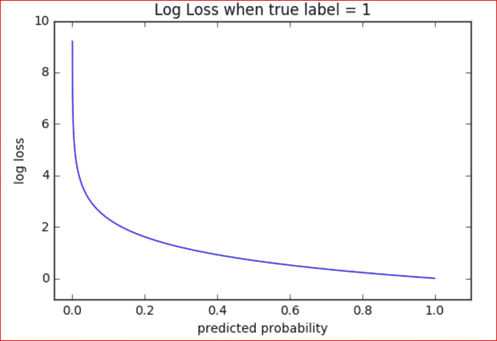
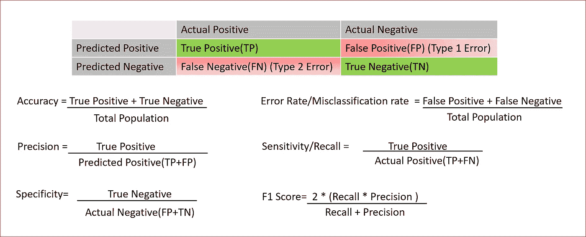
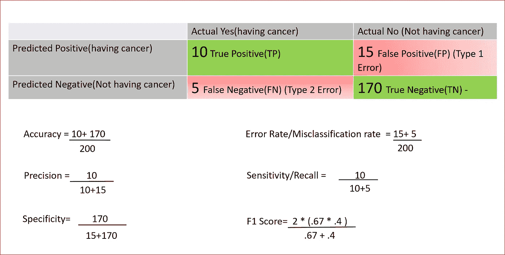
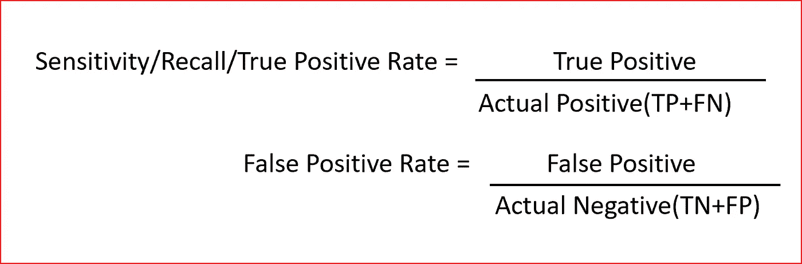
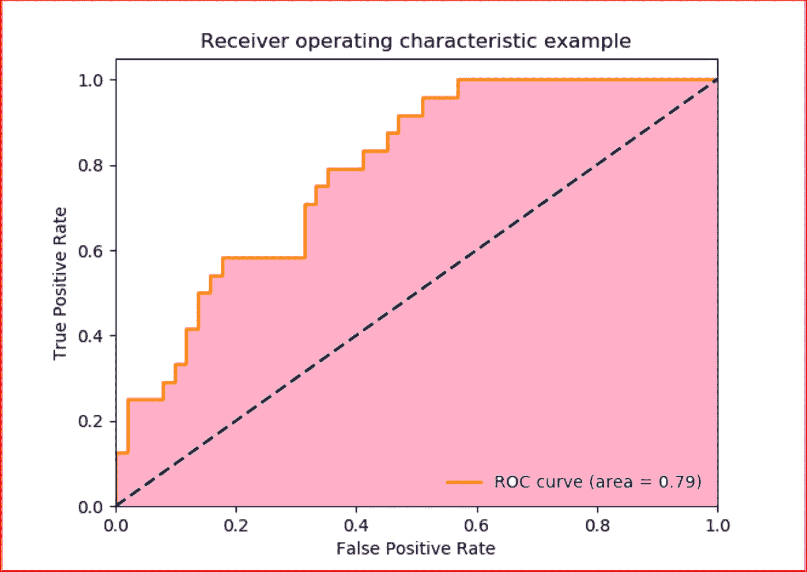

# 如何评估机器学习模型的性能

> 原文：<https://medium.datadriveninvestor.com/how-to-evaluate-the-performance-of-a-machine-learning-model-45063a7a38a7?source=collection_archive---------0----------------------->

我们将讨论用于评估回归和分类机器学习模型的不同指标。

先决条件:[机器学习基础知识](https://medium.com/datadriveninvestor/machine-learning-demystified-4b41c3a55c99)

*让我们先简单回顾一下几件事*

监督机器学习有两种类型

[**回归**](https://medium.com/datadriveninvestor/linear-regression-794f841adbcf) —输出为连续变量(如预测房价)。

**分类** —输出是一个离散变量(如猫对狗)。分类可以是二进制或多类分类。

***我如何衡量我的模型的性能？***

**一个好的拟合模型是所选模型的实际值或观察值与预测值之间的差异很小，并且对于训练、验证和测试数据集来说是无偏的**

***我如何衡量我的回归模型的性能？***

> 一些统计工具，如**决定系数(也称为 R)、调整后的** R **和均方根误差-RMSE，通常用于评估回归模型的性能。**

***什么是*** R ***？***

它也被称为决定系数。

R **为我们提供了模型或回归线**复制实际结果的程度。这是基于模型解释的预测的总变化。

r-square

r 总是介于 0 和 1 之间或介于 0%和 100%之间。

值为 1 表示模型解释了预测变量围绕其平均值的所有变化。

***误差平方和(SSE)或残差，我们预测的值与实际值相比有多远***

## SSE =实际值-预测值

***总和平方(SST)，实际值与平均值相比有多远***

## SST =实际值-平均值

***回归平方和(SSR)，实际值与平均值相比有多远***

## SSR =预测值-平均值

r-square

如果预测误差低，则 SSE 将低，R 将接近 1。

这里需要注意的是，当我们增加更多的自变量时，R 会得到更高的值。r 值随着更多独立变量的加入而不断增加，即使它们可能对预测没有真正的显著影响。这无助于我们建立一个好的模型。

为了克服这个问题，我们使用**调整 R** 。每增加一个无关紧要的自变量，调整后的 R 就惩罚模型。

R 接近 1 的值意味着很好的拟合。我们还可以计算出**均方根误差**，也称为 **RMSE** 。

## 均方根误差

RMSE 显示了预测值和实际值之间的差异。因为预测值和实际值之间的差异可以是正的或负的。为了抵消这种差异，我们取预测值和实际值之差平方。

第一步:找出每个观察值的预测值和实际值之间的差异，将它们平方并相加

所有观察值的总和(预测值-实际值)

第二步:将总和除以观察次数

所有观测值之和(预测值-实际值)/观测值数量

第三步:取第二步得到的值的平方根

Root Mean Square Error — RMSE

***如何衡量我的分类模型的性能？***

对于二进制分类，我们期望输出为 0 或 1。输出是预测分数，其传达输出为 0 或 1 的概率。通常，如果分数高于某个阈值，则我们将输出设置为 1，否则输出将为 0。该阈值通常选择为 0.5，但可以变化。

> 为了评估二元分类模型的性能，我们使用**对数损失/交叉熵、混淆矩阵或 AUC。**

# **对数损失或对数损失或交叉熵损失**

对于好的二进制分类模型，对数损失应该接近 0。随着预测值偏离实际值，测井损失增加。完美模型的对数损失为 0。

日志丢失对预测错误分类的分类器不利。稍微错一点总比大错特错好。它衡量模型对实际输出的概率的不确定性。

*我们可以通过这样的想法来记住这一点:如果我们撒了一个弥天大谎，那么与一个微不足道的谎言相比，对数损失函数将对我们进行更严厉的惩罚。*

如果我们预测输出的概率为 0.15，而实际值为 1，那么我们将偏离实际输出，因此我们将获得更高的对数损失，

source:[http://wiki.fast.ai](http://wiki.fast.ai)

Loss Loss or Cross Entropy equation for binary classification

在上面的等式中

y:是实际产量

p:预测值

在前面的示例中，预测值为 0.15，实际输出值为 1。

对数损失= -(1 对数(0.15)+(1–1)对数(1–0.15))

对数损失=-对数(0.15)+0 =-对数(0.15) = 0.82

这表明我们的预测受到了严重的惩罚，因为分类器做出了错误的预测

准确度是正类和负类的正确预测占观察总数的比例。这是评估模型性能最常用的方法，但我们需要注意准确性悖论或零错误率。

**零错误率或准确性悖论**告诉我们，当我们总是预测多数类时，我们出错的频率有多高。

例如，在 100 个数据点的样本中，98 名患者没有患癌症，那么没有患癌症就是我们的大多数类别。如果我们预测 100 个病人不会得癌症，那么我们的准确率是 98%，这就是准确率悖论。为了克服准确性悖论，我们必须使用不同的度量来评估模型的性能。

***让我们了解一下评估一个分类模型的其他指标***

# 混淆矩阵

混淆矩阵是一个表格，它告诉我们对于模型将要预测的不同类别，存在多少实际值和预测值。也称为**误差矩阵。**

Confusion Matrix or Error Matrix along with different metrics

解释关键术语

**真阳性**:当患者患有癌症且我们预测患者将会患有癌症时。

**真阴性**:患者未患癌症，我们预测患者不会患癌症

**假阴性**:患者患有癌症，但我们预测患者不会患有癌症。也称为类型 2 错误。

**假阳性**:患者未患癌症，但我们预测患者患了癌症。这是类型 1 错误

我们举个例子来解释一下这个。

我们希望根据某些特征预测一个人是否会患癌症，我们的样本量为 200 名患者，如下所示。我们将所有数字放入表格中，并计算不同的指标

F1 是精确度和召回率之间的调和平均值。F1 分数用于二元和多元分类评估。F1 值的范围在 0 到 1 之间，值越大，预测越好。

**受试者工作特征(ROC)和 ROC 曲线下面积(AUC)**

ROC 曲线是显示分类模型在不同分类阈值下的性能的图表。ROC 曲线是真阳性率(TPR)和假阳性率(FPR)之间的图。

*什么是真阳性率和假阳性率？*

**真阳性率(TPR)** 是正确预测的阳性数据点占所有实际阳性数据点的比例。它也被称为召回。更高的 TPR 意味着我们将有较少的正面数据点被错误分类。

**假阳性率(FPR)** 是假预测为阳性的阴性数据点占所有实际阴性数据点的比例。更高的 FPR 意味着更多的负面数据点被错误地分类。

ROC 是在不同分类阈值下 TPR 和 FPR 之间的图，因此不同的阈值导致不同的真阳性率和假阳性率

当我们将分类阈值从 0.5 降低到 0.3 时。在这种情况下，我们将更多的数据点归类为阳性，从而增加真阳性和假阳性。

为了计算 ROC 曲线中的点，我们可以在不同的分类阈值下评估模型，但这将是低效的，因此我们使用 **AUC 或 ROC 曲线下面积**

source:[http://scikit-learn.org/stable/auto_examples/model_selection/plot_roc.html](http://scikit-learn.org/stable/auto_examples/model_selection/plot_roc.html)

AUC 测量 ROC 曲线下的面积，即粉红色的面积。虚线是随机分类器，从中您可以预期假阳性和真阳性一样多。

我们可以认为 AUC 是模型对随机正例的排序高于随机负例的概率。

AUC 介于 0 和 1 之间。

值为 0 表示模型的 100%预测不正确。值为 1 表示模型的预测 100%正确。

# 如果你喜欢这篇文章，请鼓掌！