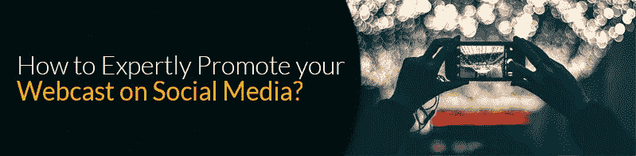

# 如何在社交媒体上专业地推广你的网络直播？

> 原文：<https://medium.datadriveninvestor.com/how-to-expertly-promote-your-webcast-on-social-media-53345d90bde1?source=collection_archive---------35----------------------->

Photo by [rawpixel](https://unsplash.com/@rawpixel?utm_source=medium&utm_medium=referral) on [Unsplash](https://unsplash.com?utm_source=medium&utm_medium=referral)

具有高转化率；网络广播被认为是最有效的内容类型之一。根据注册人数、实际参与者和潜在客户，您可以快速计算出网络广播的成功率。如今，社交媒体流被不同行业用于多种目的。他们中的一些人用它来推广产品/服务；而其他人用它来推出品牌或提供产品演示。永远记住一件事，人们不会因为你选择了任何热门话题就自动转向你的活动。你必须系统地做出一些重大努力，这样人们才会对参与你选择的网络直播服务感到兴奋。在众多方式中，社交媒体是我最喜欢的热门技巧，以前所未有的方式推动网络直播。以下是一些在社交媒体上推广网络直播的技巧:

**>制作一个优化的登陆页面-** 如果你打算鼓励[网络直播解决方案，登陆页面是最重要的要求。](http://24framesdigital.com/What-we-do/)一个好的登陆页面会给你带来很高的转化率。除此之外，你应该创建一个精确、简洁的登陆页面来优化它，以便在社交媒体上分享。如果你能让你的网络直播推广在社交媒体上传播开来，你的追随者将会与他们的朋友和追随者分享更新。最终你会获得更好的流量，最后，你也可以为活动获得积极的线索。

**>不要忽视分享按钮-** 这是优化你的登陆页面的另一个最佳方法。发现添加社交媒体的分享按钮，可以让你的分享量每页增加 7 倍。此外，添加社交媒体按钮是为您的活动创建社交证据的绝佳方式。当读者在你的登陆页面上发现这样的按钮时；他可能会访问该页面以了解更多信息。在社交媒体页面上，您可以添加预告视频、偷窥或帖子，为网络直播造势。这样，你就能让人们对事件产生渴望。不要添加太多的分享按钮。我建议你在主要的社交媒体平台上添加 2 到 4 个 pin，在那里你会定期发布更新。此外，如果你发现更多的流量来自某个特定的平台，就把注意力放在这个平台上。

**>一致性很重要-** 在实际会议前后宣传你的网上研讨会并不重要。经常记录下来供你参考。要么在你的网站上嵌入一个 URL，要么除了云存储之外，把它发布在视频分享网站上。网络广播结束后，您可以为公众创建免费的网络广播。利用视觉效果和吸引人的文本来引导观众，并生成预告、登录页面和实际网络广播视频的链接，以吸引流量。我建议您将网上直播的辅助资料上传到幻灯片共享上。是因为；在 SlideShare 上，你可以选择让你的演示保持私密、公开或通过密码访问。当您上传演示文稿时，请确保您与观众分享了该主题的完整故事。这样，他们会更好地理解它。此外，将您的网络广播幻灯片与社交媒体平台相链接，这样，观众无需退出网站即可观看您的网络广播。

**>联系影响者-** 这是[通过社交媒体推广提升网络直播的最佳方式之一](http://24framesdigital.com/Blogs/tips-to-promote-your-live-Webcast-on-social-media.php)。有影响力的人在众多社交媒体网站上拥有极佳的影响力和知名度。你可以让他们推广你的网络直播，这样他们就可以让它像病毒一样传播。确保向他们分享您的网络广播更新的过程舒适便捷。创建一条吸引人的社交媒体消息，并将其嵌入电子邮件草稿中的链接或分享按钮。如果营销影响者发现你的网络直播有利可图；他们可以为你提供多种接触潜在观众的技巧。在领先的社交媒体影响者的帮助下，产品或服务的品牌化如今变得更加重要。

**>社交化-** 确保你在社交媒体上的存在足以接触到你的受众。创建博客帖子或激动人心的电子邮件，让人们知道你的网上研讨会推广。你也可以创建 gif，视频，让人们了解你要讨论的话题。联系专业博主或有影响力的人，请他们提供与您的网络广播相关的客座文章。宣传视频、记录网络广播的最新动态、新闻提要是通过社交媒体推广业务的几种创新方式。在脸书上传你的宣传视频和一个脆脆的帖子，并将其链接到 YouTube 等其他视频频道。你可以在 Twitter、Google +、Pinterest 和 LinkedIn 上轻松分享你的 YouTube 链接。因此，你可以同时拥有自己的社交媒体。不要忘记通过邀请和提醒与你的潜在观众互动。

在社交媒体上推广你的网络直播是一个需要耐心和大量研究的过程。继续探索独特的方法来扩大您的活动的新闻，这将由[网络直播服务提供商来处理。请记住，伴随着精确文本的视觉效果是在线营销的要素。社交媒体工具和其他分享工具确实是你即将到来的网络直播的重要助推器；所以全力以赴吧！](http://24framesdigital.com/)