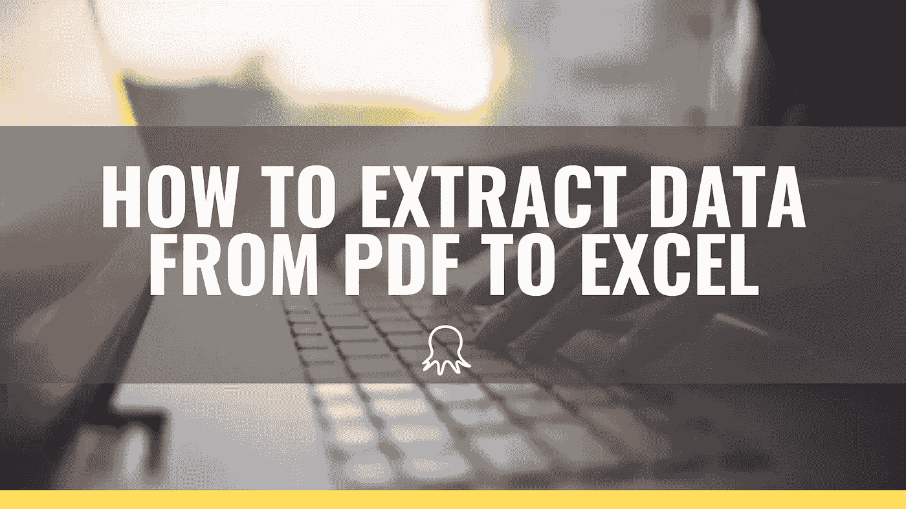

# 如何从 PDF 提取数据到 Excel

> 原文：<https://medium.datadriveninvestor.com/how-to-extract-data-from-pdf-to-excel-7fd730d1e01?source=collection_archive---------2----------------------->

**可移植文档格式** ( **PDF** )是由 [Adobe](https://en.wikipedia.org/wiki/Adobe_Systems) 开发的一种文件格式，用于以独立于应用软件、硬件和操作系统的方式呈现文档，包括文本格式和图像。(来自[维基百科](https://en.wikipedia.org/wiki/PDF))

如今，人们大量使用 PDF 进行阅读、演示和许多其他用途。而很多网站将数据存储在 PDF 文件中供浏览者下载，而不是发布在网页上，这给[网络抓取](https://www.octoparse.com/)带来了变化。您可以轻松查看、保存和打印 PDF 文件。但问题是，PDF 是为了保持文件的完整性而设计的。它更像是一种“电子纸”格式，以确保内容在任何时候在任何电脑上看起来都是一样的。因此很难编辑 PDF 文件并从中导出数据。

幸运的是，有一些解决方案可以帮助从 PDF 中提取数据到 Excel 中，我们将在这篇博文中介绍它们。

**1。复制&粘贴**

老实说，如果你只有少量的 PDF 文档可以提取数据，手动复制粘贴是一种快速的方法。只需打开每一个文件，选择你想要提取的文本，复制粘贴到 Excel 文件。

有时，当您需要复制表格时，您可能需要先将其粘贴到 Word 文档，然后从 Word 复制并粘贴到 Excel，以获得结构化的表格。

显然，当您有大量文件时，这种方法很乏味。让专用工具来自动化整个工作会好得多。

**2。PDF 到 Excel 转换器**

PDF 到 Excel 的转换器随处可见，有桌面的，基于网络的，甚至是移动的解决方案。转换器可以在几秒钟内将 PDF 文件转换为 Excel 文件，而且过程非常简单——打开 PDF 文件，单击转换按钮，然后导出 Excel 文件。转换后的文件不仅可以保留文本和图像，还可以保留格式、字体和颜色。

完成后，您可以编辑电子表格。许多 PDF 转换器甚至允许您直接编辑存储在 PDF 文档中的图像、文本和页面，并将它们导出到 Excel 电子表格中。

[Adobe Acrobat](https://acrobat.adobe.com/us/en/acrobat/how-to/pdf-to-excel-xlsx-converter.html) ，作为 PDF 格式的原始开发者，当然包含了转换功能。快速和无痛，你可以在任何设备上做这件事，包括你的手机。Acrobat 更多的是转换文件，您可以创建、编辑、导出、签署和审阅协作处理的文档。它甚至可以将扫描的文档转换成可编辑、可搜索的 pdf。

**3。PDF 表格提取工具**

PDF 转换器可以很容易地转换整个文件，但可能无法从中获得某些特定的数据。在许多情况下，您需要的唯一数据可能就是其中的表。转换整个文件后，您仍然需要从转换后的文件中选择表。

[Tabula](https://tabula.technology/) 是一款流行的解锁 PDF 文件中表格的工具。您只需要通过单击和拖动来选择表格，然后在表格周围画一个方框。Tabula 将尝试提取数据并显示预览。然后，您可以选择将表格导出到 excel 中。

有很多工具可以从 pdf 中提取数据。有了这些自动化工具，你就不再需要绞尽脑汁地研究如何从 PDF 文件中获取数据。结果可能会有所不同，因为每个工具都有自己的优点和缺点。试着找一个最适合你的！

**以下是其他一些顶级的 PDF 转 Excel 工具:**

*   [smallpdf](https://smallpdf.com/pdf-to-excel)
*   [PDFelement](https://pdf.wondershare.com/pdfelement.html)
*   [硝基 Pro](https://www.pdftoexcelonline.com/pro-a)
*   [cometdocs](https://www.cometdocs.com/)
*   [iSkysoft PDF Converter Pro](https://pdf.iskysoft.com/pdf-converter-pro-windows.html)

作者:程依娜

*原载于 2019 年 11 月 11 日 https://www.octoparse.com**T21*[。](https://www.octoparse.com/blog/how-to-extract-pdf-into-excel)