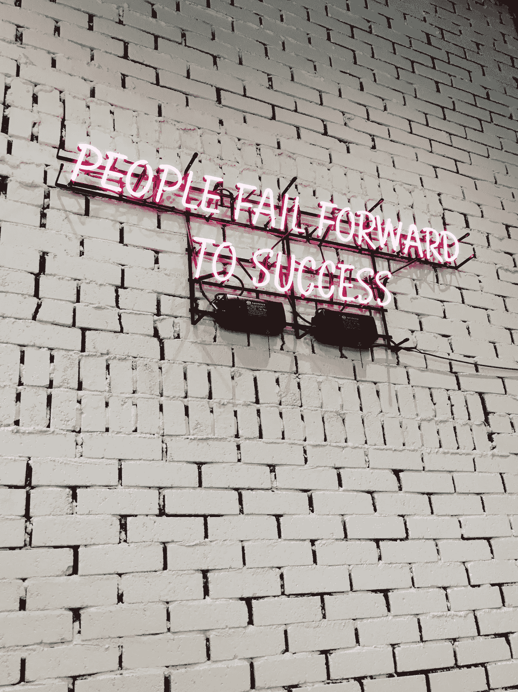

# 如何成功失败

> 原文：<https://medium.datadriveninvestor.com/how-to-fail-successfully-4c484b3fffd8?source=collection_archive---------29----------------------->

Photo by [Ian Kim](https://unsplash.com/photos/gKs6zNil_Ro?utm_source=unsplash&utm_medium=referral&utm_content=creditCopyText) on [Unsplash](https://unsplash.com/search/photos/failure?utm_source=unsplash&utm_medium=referral&utm_content=creditCopyText)

了解一个人的最好方法是看他失败。在成功的浪潮中，任何人都可以引人注目和乐观，但当一个人失败时，尤其是深深失败时，真正的雄心甚至个性就会显现出来。这就好比一个经典故事，故事中的人物在艰难时期挺身而出，力挽狂澜，而所谓的领导者却步履维艰。事实是糟糕的情况揭示了我们性格中隐藏的，有时是不受欢迎的一面。那么，我们如何处理这些失败，这些糟糕的情况，哪怕是一丝优雅和控制？允许我们自己接受失败，并在失败的基础上继续前进。让我用一个时间表来解释:

**24 小时后失效的时刻:感受一下**

你已经为某事全心全意地准备了 X 周、几个月甚至几年，却失败了。也许你对成功充满信心，当然，通过所有的努力和辛勤工作，你会成功的。但你却失败了。你会感到失望、沮丧、悲伤，甚至愤怒。允许自己去感受，但不要做出任何后悔的事情，比如抨击同事，或者在社交媒体上咆哮，让自己尴尬。相反，把这种能量转化成一些身体上的东西，比如跑步或跆拳道课。如果你除了生闷气什么都不想做，那就在电视机前吃点安慰性的食物，或者在家独自哭泣。

你在努力成功完成的事情上失败了。你会有白费力气的感觉，缺乏意志，甚至质疑你的技能。给自己一些时间整理你的感觉和想法，不管它们有多不合理。

**24–48 小时后:回到常规**

你只有 24 小时的可怜派对，然后回到现实。在工作中，关注那些你可能已经推迟的优先级较低的任务。在家里，吃一顿健康的饭，做运动，即使你只是去散步。花一些时间在一个爱好上，写日记，或者和一个好朋友喝咖啡。无论你需要什么来回到积极心态的轨道上。一天中周期性地，试着承认你失败了，但是要意识到一切都会好的。

**48–72 小时&之后:向前看**

你现在打算做什么？这一步是由你的失败塑造的。你需要分析你是如何跌跌撞撞的:哪里出了问题？你能修好它吗？调整目标，制定计划。例如，如果你失去了一个竞争对手的大客户，问问自己为什么。你的演讲或技能中缺少什么导致客户离开？错过升职机会也是一样。如果你没能坚持节食和锻炼，为什么？你是不是把计划定得太严格了，还是压力太大而无法集中注意力？如果你还有激情，那就让它发生。找到成功之路。

当你分析自己的失败时，你可能会发现自己对采取同样的行动不感兴趣。也许你想改变职业生涯，但一直没有成功。如果你意识到你的心并没有真正投入其中，不要因为放弃而感到难过——那不是失败，那是意识到有些事情并不是你的激情所在。

温斯顿·丘吉尔曾经说过，“成功不是最终的，失败也不是致命的:重要的是继续下去的勇气。”失败是痛苦的，但是当我们回顾我们的生活时，放弃更成为一种遗憾。成功的失败意味着从失败中获得一些东西，无论是一个教训，一个新的成功的计划，还是意识到你需要调整课程。祝你成功…和失败。