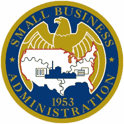
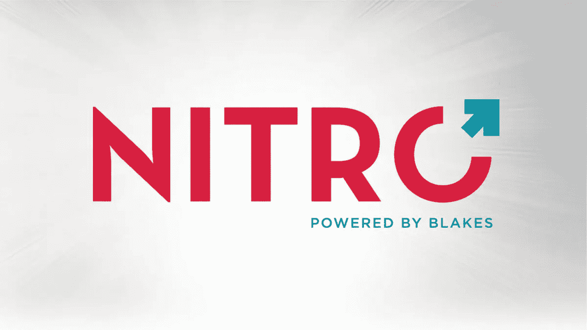

# 如何为小企业找到负担得起的法律服务

> 原文：<https://medium.datadriveninvestor.com/how-to-find-affordable-legal-services-for-small-businesses-1be673372ed5?source=collection_archive---------28----------------------->

无论你是跨国公司还是新兴的小企业；隐私保护法只是所有人都必须遵守的法律事务中最近流行的一个例子。随着最近涉及个人信息泄露的事件的发生，许多国家已经在这些问题上勒紧了裤腰带。法律法规遵从性领域瞬息万变，企业不断需要找到跟上时代的方法。

大公司有能力支付法律服务费用，但是小公司能做些什么来帮助确保合规性呢？大多数小企业，尤其是年轻的公司无法负担法律费用。

这里有一些方法可以帮助新公司和初创公司获得更多的司法救助。

在你开始寻求法律建议和服务之前，研究和熟悉法律法规总是一个好主意。在美国，美国小企业管理局(SBA)提供了指南和法规，可以用来正确地通知自己。有四个独立的链接可以作为小企业监管的指南。

i) [联邦法规代码](https://www.sba.gov/about-sba/sba-performance/policy-regulations/laws-regulations/code-federal-regulations-cfr)

ii) [管理小型企业管理局的法规](https://www.sba.gov/about-sba/sba-performance/policy-regulations/laws-regulations/statutes-governing-sba)

iii) [法律&法规资源](https://www.sba.gov/about-sba/sba-performance/policy-regulations/laws-regulations/laws-regulations-resources)

iv) [小型企业管理局重要指导文件](https://www.sba.gov/about-sba/sba-performance/policy-regulations/laws-regulations/sba-significant-guidance-documents)

请记住，这些资源可用于获得小型企业法律的基本知识。自学可以让你更好地了解你在法律服务方面需要什么，以及如何获得这种帮助。从长远来看，它将节省您在资源上花费的时间和金钱。

作为警示:我觉得有必要分享我遇到的每一位律师给我的建议。确保你从有执照和保险的律师那里寻求适当的法律建议。这是为了确保责任不在自己。下面给出的一些建议可以用来帮助减轻寻求法律服务的负担，但是(我强调)请确保你咨询了合适的律师。这是无可替代的。

## **1。法律技术公司**

近年来，法律技术公司大量涌入。他们的主要目标是:方便诉诸司法。许多这样的公司已经开始为无力支付法律费用的小公司简化程序。两个例子是[创办](https://www.founded.co/)和[蓝 J 法律](http://www.bluejlegal.com/)。

Founded 提供法律文档模板(这是法律起草中最耗时的方面之一)，它们也有助于公司的组建过程。他们将帮助您查找姓名，并帮助您提交公司文件。除此之外，他们还会为您存储所有文件和数据，并帮助您向政府提交公司申报表和任何更新。

蓝 J 法律深究远见。它们为用户提供税收和就业法律方面的预见，能够根据以前的数据预测法院将如何裁决的概率。

当然也有知名公司如[火箭律师](https://www.rocketlawyer.com/)和 [LegalZoom](https://www.legalzoom.com/) 。

这里，需要再次强调的是，法律技术公司通常不提供法律服务。这是不同的，他们不能像律师事务所的律师那样承担责任。因此，尽管寻求法律服务是明智的，但这些公司将有助于减少花费的时间和金钱。

考虑到在法律世界中，时间就是金钱，减少这些过程所花费的时间将会大大减少法律费用。随着科技的发展，这些服务触手可及。

## 2.法律援助诊所和公益服务

法律援助诊所通常为低收入客户服务。你经常会发现律师和法律专业的学生混合在一起，就不同的主题提供基本的法律建议。虽然您确实获得了免费或廉价的帮助，但等待时间很长。

也有一些组织，比如小型企业管理局，提供免费的法律帮助来创办和管理企业。

## 3.律师事务所项目

最近，法律领域本身也经历了一些变化。其中一个变化来自于聪明消费者的崛起。如今的消费者不太愿意支付过高的法律费用，因此一些律师事务所推出了低成本或固定费率的项目。许多公司也将初创企业和新的小企业视为有利可图的投资，或者希望找到一种方式来回报社区。布莱克、卡塞尔、格雷顿·LLP 等公司提供特殊的企业家项目。

## 4.孵化器和加速器

如果你正在经营一家初创公司，你很有可能正试图加入孵化器或加速器项目。如果你还没有考虑这个选项来帮助你的新企业成长，你绝对应该考虑一下。值得关注的几个大公司如下:DMZ、YCombinator 和 Techstars。

除了办公空间、便利设施和接触常驻企业家(EiR)之外，这些项目还在经营企业的各个方面提供帮助。EiR 可以在他们的专业领域提供帮助。这可以包括从融资到营销到法律帮助的任何领域。

同样，他们不会提供全面的法律服务，但他们可以帮助你了解需要什么，并帮助你找到正确的方向。这些项目中的大多数也隶属于不同的律师事务所，通常可以帮助初创公司寻求司法救助。

最近，小企业获得法律服务的方式发生了巨大的变化。如果你拥有并经营一家小型企业或初创公司，很可能你没有足够的资源使用传统的方法雇佣大公司并支付大笔的聘请费等。

许多替代品正在出现，通常结合了技术。律师事务所已经开始调整他们的定价模式，并开始开放项目来适应这些新企业。孵化器和加速器等项目继续提供新的资源和支持，帮助小企业发展。

现在有许多新的令人兴奋的方法来获得法律帮助，这些方法既负担得起又容易获得。随着行业的不断发展，毫无疑问，诉诸司法将很快成为全球所有小型企业的更大现实。