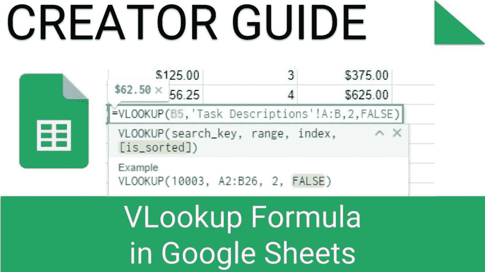
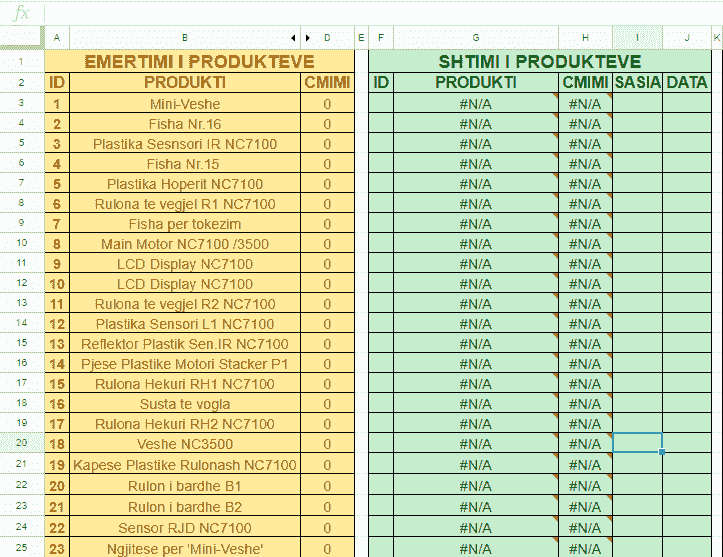
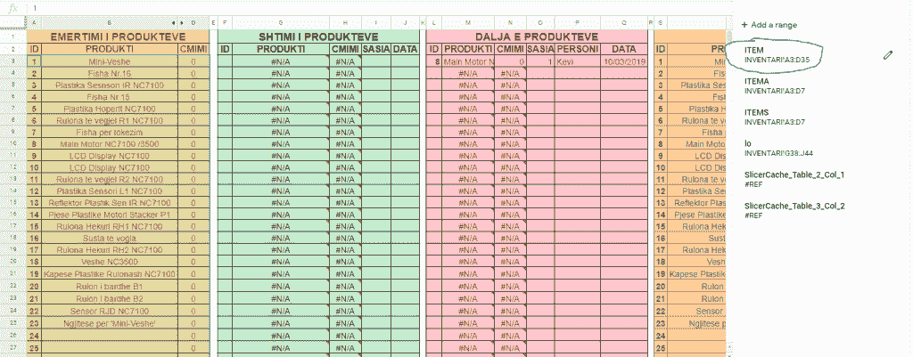
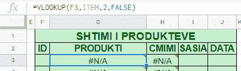
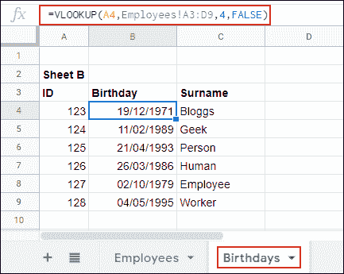
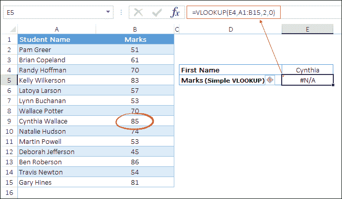
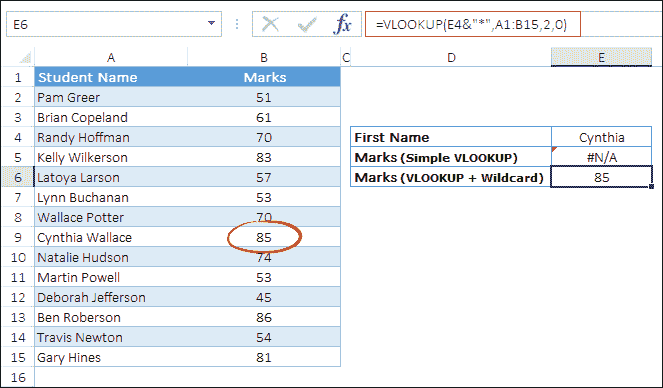

# 如何用 VLOOKUP 查找 Google Sheets 中的数据

> 原文：<https://medium.datadriveninvestor.com/how-to-find-data-in-google-sheets-with-vlookup-c348c665784c?source=collection_archive---------4----------------------->

谷歌电子表格是现在可以学习的最好的程序之一，凭借其强大的功能和工具，你可以制作任何你想要的东西。VLOOKUP 是 Google Sheets 中最容易被误解的功能之一。它允许您使用一个搜索值在电子表格中搜索并链接两组数据。以下是使用方法。

# VLOOKUP 如何在 Google Sheets 中工作

VLOOKUP 听起来可能令人害怕和困惑，但是一旦你理解了它是如何工作的，它就非常简单了。使用 VLOOKUP 函数的公式有四个参数。

第一个是要查找的搜索键值，第二个是要搜索的单元格区域(例如，A1 到 D10)。第三个参数是要搜索的区域中的列索引号，其中区域中的第一列是 1 号，第二列是 2 号，依此类推。第四个参数是搜索列是否已经排序。

最后一个参数只有在寻找与搜索键值最接近的匹配时才是重要的。如果您希望返回与搜索关键字完全匹配的结果，可以将该参数设置为 FALSE。

## 例子

如果你想最大限度地利用 VLOOKUP 并且不被弄糊涂，使用命名范围，例如在下面的图片中，黄色的表格是用于产品(ID，名称，成本)，而绿色的表格是用于在库存中添加产品。

在下面的图片中，你可以看到命名的数据范围，选定的区域有名称项目，现在是一个数据表，由 VLOOKUP 在搜索中使用。

现在看看公式有什么不同，现在第二个参数是“项目”而不是数据范围，这有助于初学者不会迷路。下面的公式搜索与单元格 F3 具有相同 ID 的区域，并返回第二列的值(因为第一列是 ID)。因此，如果您在单元格 F3 中输入一个数字，这里将给出产品名称。

正如你在下面看到的，当你输入数字后，公式会自动更新它的数据。你会得到想要的结果。

# 对多个工作表使用 VLOOKUP

上面的例子使用了一个工作表中的一组数据，但是您也可以使用 VLOOKUP 在一个电子表格中搜索多个工作表中的数据。在本例中，表 A 中的信息现在位于名为“雇员”的表上，而表 B 位于名为“生日”的表上。

您可以点击一个空单元格，然后输入:`=VLOOKUP(A4, Employees!A3:D9, 4, FALSE)`，而不是使用 A3: D9 这样的典型单元格区域。

当您将工作表的名称添加到单元格区域的开头时(Employees！A3: D9)，VLOOKUP 公式可以在搜索中使用单独工作表中的数据。

# 在 VLOOKUP 中使用通配符

我们上面的例子使用精确的搜索键值来定位匹配的数据。如果没有确切的搜索键值，也可以在 VLOOKUP 中使用通配符，比如问号或星号。

*   **星号(*):** 在文本后查找任意数量的字符。例如，您可以使用“Ex*”来匹配列表中的文本“Excel”。
*   **问号(？):**用问号替换成字符。比如可以用 P？inter 查找文本“Painter”或“Printer”。
*   **波浪号(~):** 可以抵消以上两个字符的影响。例如，如果您想查找值“PD*”，您可以使用“PD~*”。

这里有一个名字列表(名+姓),您必须查找只使用名的学生的分数。当你使用一个普通的 VLOOKUP 时，它会返回一个错误#N/A，这意味着这个值不在列表中，这是绝对正确的。

但是，当您将查找值与星号结合使用时，您将获得学生的分数，不会有任何错误。

在上面的公式中，您在名字后面使用了星号，这有助于 VLOOKUP 查找以您提到的名字开头的值，该值的其余部分可以是任何值。

# 用 VLOOKUP 搜索最接近的匹配

您可以使用 VLOOKUP 公式的最后一个参数来搜索与您的搜索关键字值完全匹配或最匹配的内容。在前面的例子中，我们搜索的是精确匹配，所以我们将这个值设置为 FALSE。

如果您想要找到与某个值最接近的匹配，请将 VLOOKUP 的最终参数更改为 TRUE。由于该参数指定了一个区域是否排序，请确保您的搜索列从 A-Z 排序，否则将无法正常工作。