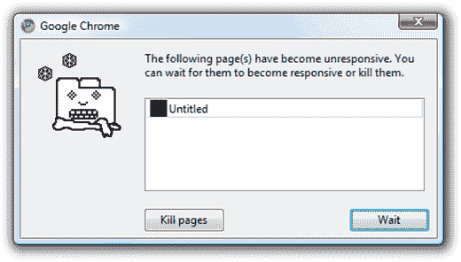
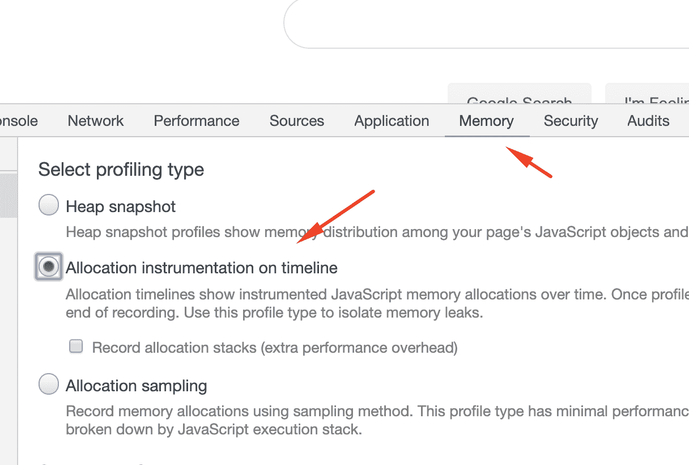
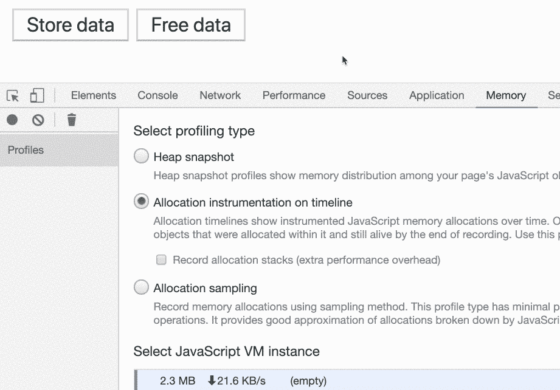
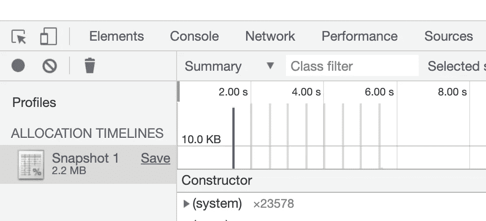
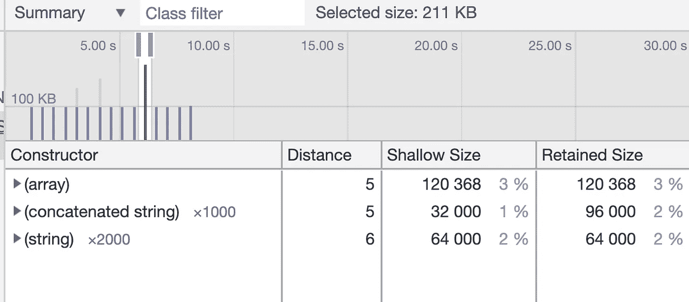
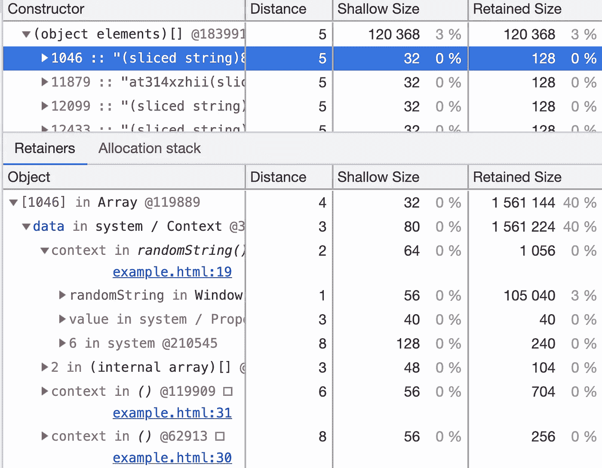
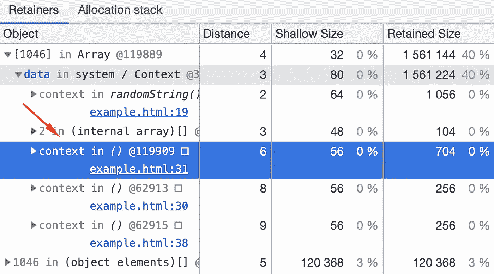
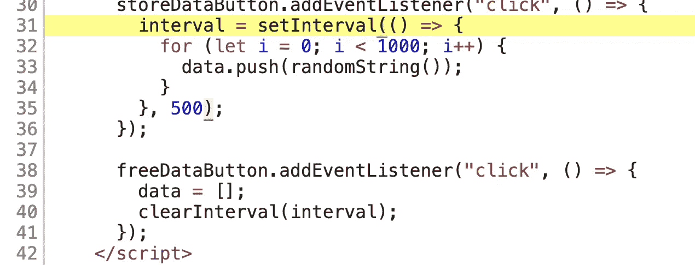
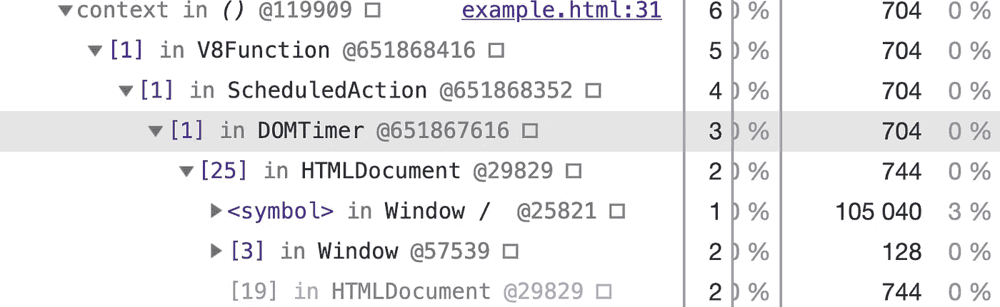
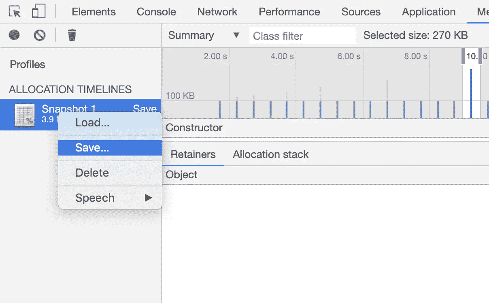

# 如何在 JavaScript 中发现内存泄漏

> 原文：<https://medium.datadriveninvestor.com/how-to-find-memory-leaks-in-javascript-b898c85995a3?source=collection_archive---------0----------------------->

如果您的应用程序在使用过程中变得越来越慢，或者突然在浏览器中出现“页面没有响应”的消息，这可能意味着您有“内存泄漏”。

那么什么是内存泄漏呢？

> 内存泄漏是一种资源泄漏，当计算机程序错误地管理内存分配，以致不再需要的内存没有被释放时，就会发生这种泄漏

 [## 2019 年最值得学习的编码语言|数据驱动的投资者

### 在我读大学的那几年，我跳过了很多次夜游去学习 Java，希望有一天它能帮助我在…

www.datadriveninvestor.com](https://www.datadriveninvestor.com/2019/02/21/best-coding-languages-to-learn-in-2019/) 

想象你是一个公共游泳池的主人。你为顾客提供储物柜来存放他们的物品。然而，你有一些顾客从来不回来拿他们的东西，或者归还他们的钥匙。随着时间的推移，你的储物柜明显减少，你需要做些什么。通常，这意味着你需要用备用钥匙打开储物柜，并尝试将物品归还给物主。

Do not forget your belongings :)

计算机内存也是如此。应用程序的某些部分可能会“锁定”其数据存储，并在不再需要存储时忘记解锁。这对于用户的电脑来说是一个大问题，因为他们没有“备用钥匙”，无法自己解锁存储。这意味着，它们最终会耗尽内存，您的应用程序将变得没有响应。

搜索应用程序中导致内存泄漏的部分可能会很复杂。JavaScript 是一种垃圾收集语言，这意味着当它在代码中没有被引用时，它会尝试删除未使用的数据并释放存储空间。当存储空间不能被释放时，这意味着在你的代码中的某个地方你保存了对它的引用(就像保存了锁的钥匙)。如果只是通读代码，查找这些引用可能需要几个小时甚至几天的时间。幸运的是，在 JavaScript 中很少有更好的方法来跟踪内存泄漏。

方法之一是使用谷歌 Chrome 的内存分配时间线。使用这个工具，您可以记录内存分配的堆栈跟踪。您可以可视化这些跟踪，比较它们，并确定内存在哪里被分配，以及后来在哪里没有被释放。

要使用这个功能，你需要打开 Chrome DevTools(Windows 上的 Ctrl+Shift+J 或者 Mac 上的 Ctrl+Option+J ),然后点击内存标签

让我们以内存泄漏为例，setInterval 函数一直分配内存，直到我们单击“释放数据”按钮:

点击“存储数据”按钮时，setTimeout 回调函数向`data`数组添加 1000 个字符串，该数组每 500 毫秒分配约 5-10kb 的内存，直到按下“自由数据”按钮。

为了看看你的记忆发生了什么，让我们做以下步骤:

*   从 DevTools 内存选项卡中选择“时间线上的分配工具”单选按钮
*   点击“记录”按钮
*   点击“存储数据”按钮
*   等待几秒钟以获得结果
*   点击“停止录制”按钮
*   点击“免费数据”按钮

Do not forget to free your data! Otherwise, your page will become unresponsive!

时间线上的蓝条代表已分配但尚未释放的内存。如果您按下“免费数据”按钮，蓝色条将变成灰色条。

Grey bars show that memory was freed by the garbage collector

灰色条显示垃圾收集器的工作。一旦不再需要，它就释放内存。

让我们更详细地检查一下快照。您可以将时间轴放大到单个蓝色条。这将限制底部的“构造函数”表显示缩放时间内添加的数据

You can zoom the timeline to a needed bar by clicking on it

从屏幕截图中，您可以看到 120kb 分配给了一个阵列。通过展开`(array)`行，我们可以看到添加了多个字符串:

此时，如果数据对您来说很熟悉，那么您已经可以猜到哪里发生了内存泄漏。但是在我们的例子中，我们有随机的字符串，所以我们需要继续挖掘。

让我们点击数组的第一个元素。这将在保持器表中打开关于该字符串的记录:

Shallow size is the size of memory that is held by the object itself

从这个表中，我们可以看到字符串存储在 example.html 文件第 19 行的`data`变量下。

通过检查第 19 行，我们可以看到这个函数为我们生成了一个随机字符串。这里没有危险信号。当进一步检查保持器表时，我们会发现第三行表示该字符串是从第 31 行引用的。

如果我们看一下 HTML 中的这一行，我们会发现 setTimeout 回调，其中我们将信息推送到`data`数组。

瞧啊。我们已经成功地找到了发生内存泄漏的地方！如果我们展开上下文行，我们甚至可以看到计时器是如何被 Chrome 浏览器中的 V8 JavaScript 引擎触发的:

您可以通过在快照选项卡中右键单击当前快照来保存它，并与您的同事共享它。

You can load, save and delete snapshots by right-clicking on them

在任何应用程序中，内存泄漏都会时有发生。因此，当发生这种情况时，您现在将做好准备，并能够使用分配时间表更快地跟踪和修复它们。