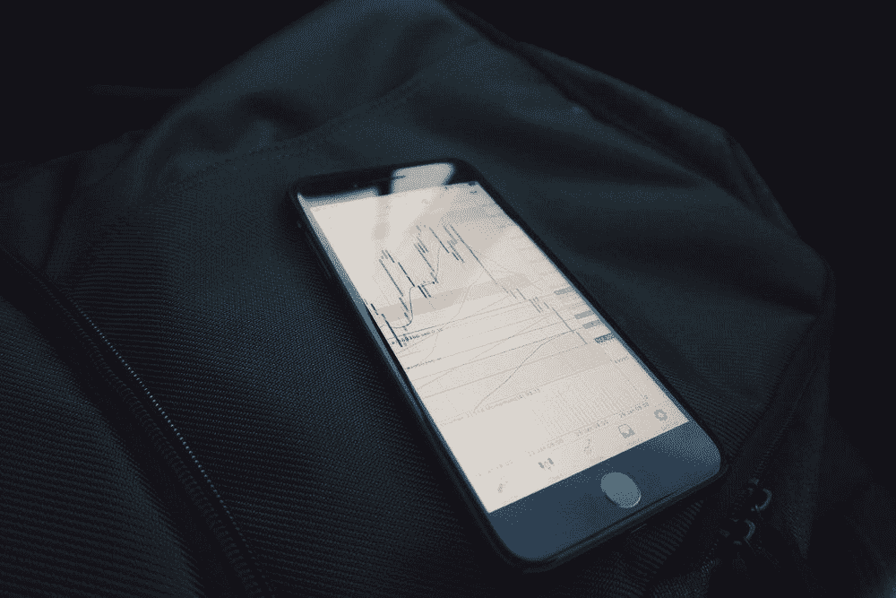
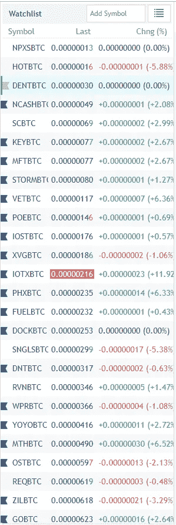
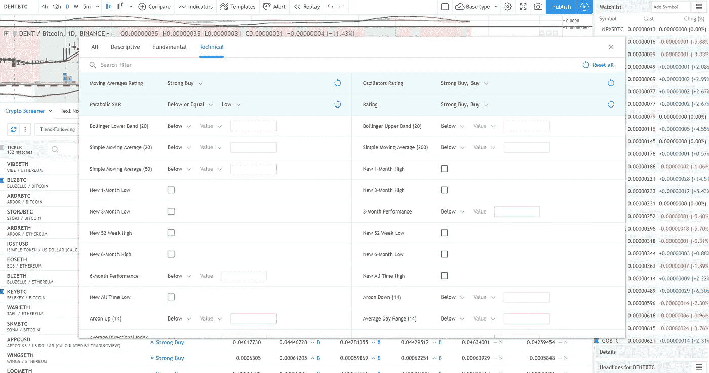
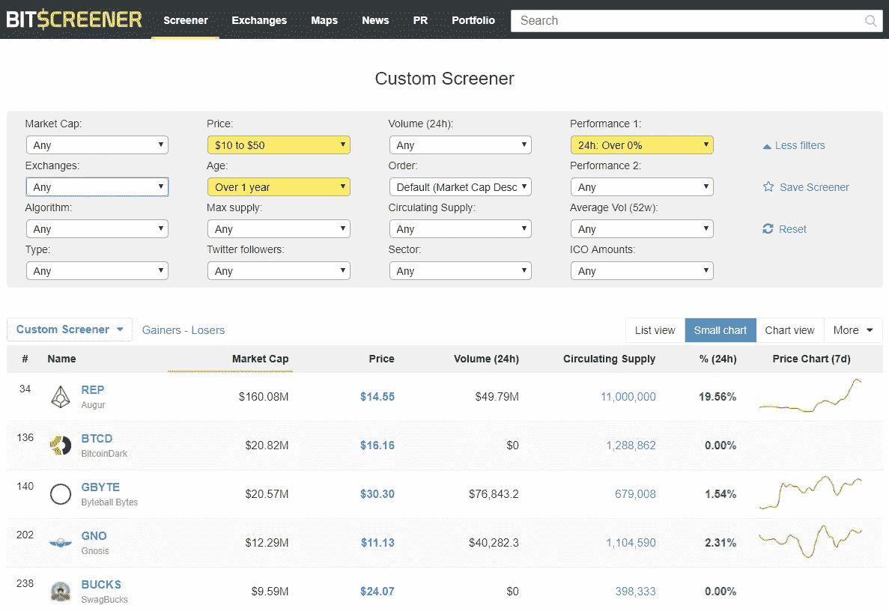
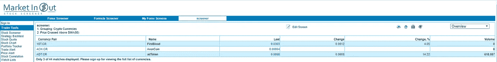

# 如何找到交易的密码

> 原文：<https://medium.datadriveninvestor.com/how-to-find-the-crypto-to-trade-4884460e2f49?source=collection_archive---------2----------------------->

[Credits: Mark](https://unsplash.com/photos/SgraLCyISWs)

如果你像我们一样，希望每天最多做 1 到 2 笔交易，并且有一份全职工作来专注于一天，那么这篇文章就是给你的。

仅在币安，就有 415 个密码可交易对。右边的 415 对在 1 号交易所。因为这个原因，1 交换是我的极限。由于这一点，我不得不手动保存我的交易视图中所有最高数量的硬币(接近 80 ),并手动逐一查看它们

One by one, gotta check them all!

更不用说我一天要检查不止一个，这让我在工作中有一段艰难的时间，并且不得不被我的妻子取笑，因为我嫁给了我的密码，或者给她买一些我赚了很多钱的东西。她一点也不知道，我正忙着后悔错过了这个可交易的硬币，我没有注意到，有时还会发呆 20%。

那么解决的办法是什么！老实说，我能想到的唯一解决方案叫做“筛选者”，准确地说是技术筛选者。

因此，哪些是可用的加密筛选和他们有任何好处。

筛选有很多种，基本上，screener 的意思是根据一组条件过滤并找到你要找的东西。

比这个大，比那个长，有这个，没有那个。所有这些条件造就了一个筛选者。

在加密的情况下，这就像找到一枚硬币…

*   最近 3 天 RSI 一直在上升，现在 RSI < 35.
*   Close price has crossed above SMA(open,18).
*   MACD(15,30,5) cross above the MACD signal in the last 3 days.
*   The present volume is 4 time the average volume.

Presently the crypto screener I found a bit useful is.

[**交易视图**](https://www.tradingview.com/markets/cryptocurrencies/prices-all/)

优点:他们有最好的密码审查者之一。其有价格、容量和技术指标筛选。

Tradingview screener

缺点:指标来源的值和长度不可更改，因此没有 MACD(10，20，5)筛选。缺少自定义指标筛选程序&没有筛选程序的移动应用程序。

[Bitscreener](https://www.coinwatch.com/cryptocurrency/screener)

优点:在简单易用，并有一个体面的价格和数量筛选。外加一个好看的手机应用。

Simple screening

缺点:价值仍然是刚性的，所以示例 u 可以筛选价格 8 美元到 20 美元，它必须是 10 美元到 50 美元。也没有技术筛选。

[**MarketInandOut**](https://www.marketinout.com/international/crypto-currency-screener.php)

优点:就灵活性而言，它是最好的之一。大量的指标和价格筛选。

缺点:没有手机应用。用户界面非常古老，它确实有独立的加密市场，例如币安和 Bittrex。

我想还有更多，但目前我使用最多的是交易视图。但我仍然认为，要制作一部出色的电影，还有很多工作要做。即使现在也没有使用以下筛选条件筛选硬币的筛选机。

*   RSI 在过去 3 天一直在上升，现在 RSI < 35.
*   Close price has crossed above SMA(open,18).
*   MACD(15,30,5) cross above the MACD signal in the last 3 days.
*   The present volume is 4 time the average volume.

Recently I launched a web app [Cryptohodl](http://www.cryptohodl.in) 作为一个起点，使之成为一个完整的加密应用程序，并致力于[贸易计划。IO](http://www.tradeplan.io) ，简易技术指标筛选仪。

 [## 进行加密价格比较的新方法

### 我们比较事物的方式总是围绕着两个事物中的一个:在一段时间内是不变的还是稳定的资产…

medium.com](https://medium.com/swlh/a-new-way-to-do-a-crypto-price-comparison-c2fcebbc2627) 

如果你有更好的网站，请随时告诉我你的想法。

你可以在推特@Shakks 上联系我

如果你喜欢这个帖子，欢迎 50 次鼓掌。