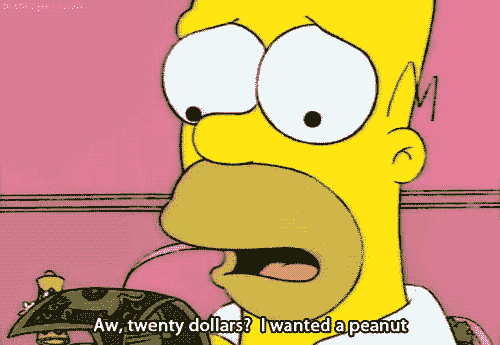

# 如何发现被低估的股息投资

> 原文：<https://medium.datadriveninvestor.com/how-to-find-undervalued-dividend-investments-e57e26eed2ed?source=collection_archive---------14----------------------->

你可能意识到，根据专家的意见或你的情绪购买股票是自找悲剧。你需要可行的方法，在晴天和暴风雨中都能奏效。让我们采取约翰·邓普顿策略。当每个人都对市场感到兴奋时卖出。趁每个人都为自己的生命担忧时买入。

## 价格收益比率

被低估的股票售价低于其内在价值。抛开内在价值，还可以用市盈率来评估被低估的股票。市盈率经常被用来计算这些机会。市盈率是公司股价与公司每股收益的比率。两只不同的股票可能每只 50 美元，但一只股票可能有更高的赚钱能力。

> 每股 50 美元/每股收益 5 美元= 10 市盈率

在两只同价位的股票之间，你可以通过计算市盈率来选择赚钱能力更强的那只。两只股票可能价格相同，但每股收益不同。市盈率确实有其局限性；它不能计算增长。要将增长因素考虑在内，使用 PEG 比率或股息调整后的 PEG 比率。

低市盈率通常表明你发现了一只被低估的股票。你可能会在恰好低于同行的股票中发现绝佳的机会。媒体巨头发布一份声明，在投资界引发冲击波，导致大规模抛售，这并不罕见。因为下午的新闻而开始抛售的恐慌的投资者可以将股价推低到被低估的程度。

对于一个给定的行业，什么是好的市盈率？要知道市盈率是低还是高，你需要计算和比较同行业类似公司的市盈率。例如，如果一家医疗公司的市盈率为 15，另一家为 12，你可以得出结论，后一家公司可能被低估，值得进一步研究。

# 高产

投资时知道自己的“为什么”将有助于指导你维护投资组合。也许你是一个重视收益高于一切的投资者。你可能会倾向于将一只股票列入候选名单，因为该公司一直回报高收益。如果高收益是你投资的首要原因，用股息率来寻找被低估的股票。如果股息支付率超过竞争对手，你可能发现了一只被低估的股票。

# 股票筛选员

在评估股票时，使用股票筛选工具会节省你很多时间。以下是投资者最常用的一些筛选工具:

*   谷歌股票筛选
*   Ameritrade 股票筛分机
*   雅虎股票筛选员
*   YCharts 股票筛选程序
*   芬维兹股票筛分机

# DARS 评级

DARS 评级旨在提供一个基于指标的股票是买入还是卖出的快速快照。为了节省您的时间，我们已经为您进行了计算。 [DARS 评级](http://www.dividend.com/dividend-education/what-is-dars-rating/)认为:

*   相对强度
*   股息可靠性
*   总收益吸引力
*   股息上升趋势
*   收益增长