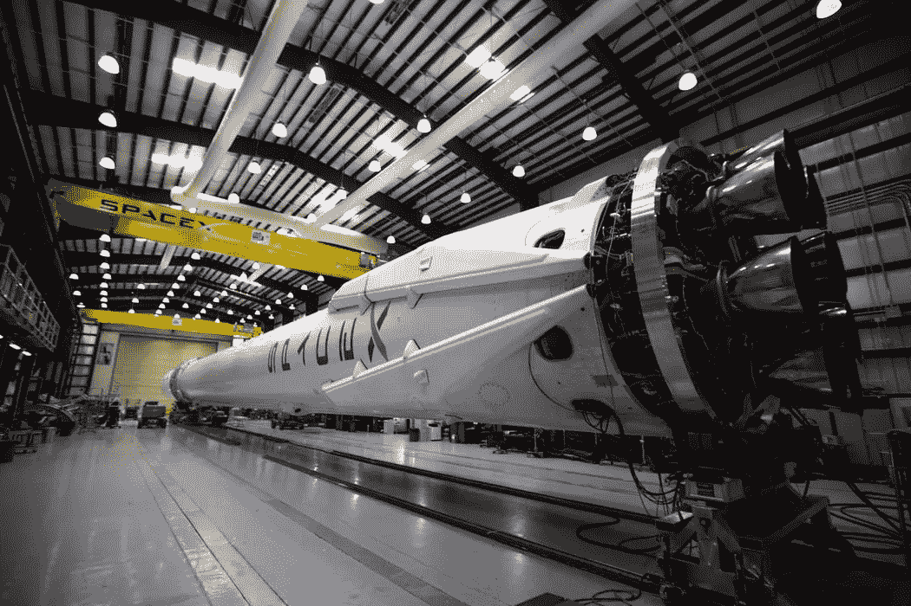
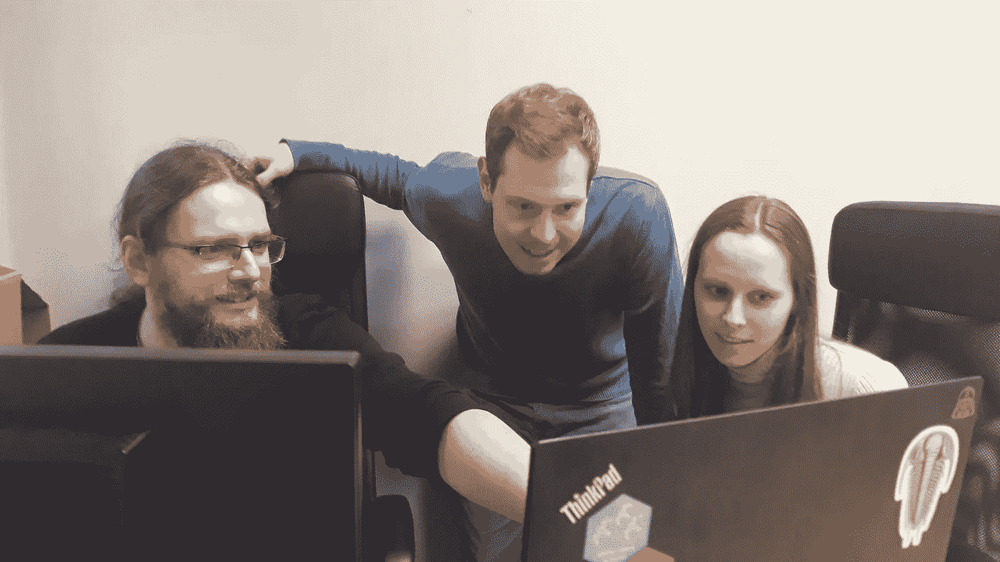

# 如何为您的业务生成 AI 和 DS 用例

> 原文：<https://medium.datadriveninvestor.com/how-to-generate-ai-and-ds-use-cases-for-your-business-23835d716f86?source=collection_archive---------4----------------------->

(如果你的公司名称不是谷歌、脸书、百度等。)

# TL；博士；医生

透过人工智能宣传来揭示你的组织的潜在价值。公司如何从数字化转型中受益，在哪里以及如何寻找用例，以及成功交付数据科学项目。通过为工作选择正确的工具，获得巨大的竞争优势并避免浪费。

# 头脑风暴用例

最近，我和世界上最大的电子产品制造商之一的销售人员进行了一次交谈。他告诉我，与他聊天的许多工厂主都对将数据科学、人工智能和物联网方法和工具添加到他们的运营中非常感兴趣，但他们不知道从哪里开始。我有点惊讶！这是一个迷人的挑战。对于非软件公司来说，为其运营的数字化转型生成用例的最佳方式是什么？在许多情况下，一个工厂或一些其他组织已经使用相同的方法成功地运作了相当长的时间。变化带来颠覆。但是，即使是一个拥抱变革和颠覆的组织，也可能难以找到利用当今众多数字转型工具改善运营的方法。

 [## 成为数据科学家所需的 8 项技能|数据驱动型投资者

### 数字吓不倒你？没有什么比一张漂亮的 excel 表更令人满意的了？你会说几种语言…

www.datadriveninvestor.com](https://www.datadriveninvestor.com/2019/02/07/8-skills-you-need-to-become-a-data-scientist/) 

*一个* ***如何开始*** *这样的任务？显然，一家公司需要生成用例，交给一个 AI 工具团队来构建概念证明(PoC)模型。只是* ***数字转换*** *。简单…对吗？*

*我们请教了 Marcin Dubel，这位华沙的杰出数据科学家，也是“* [*闪亮架构的超级解决方案*](https://www.r-bloggers.com/super-solutions-for-shiny-architecture-1-of-5-using-session-data/) *”系列和“* [*的作者，忘掉 Excel 吧，用这些 R 闪亮包代替*](https://www.r-bloggers.com/forget-about-excel-use-these-r-shiny-packages-instead/)*的文章吧*

*JC:你有没有以头脑风暴的形式帮助客户开发 ML、DS 或 AI 的用例？换句话说，你曾经和一家公司合作开发过用例吗？你如何着手这样一项任务？*

*MD:这是个有趣的问题，Joe。随着当前对图像识别、自动驾驶汽车和深度假视频等强大的机器学习实施的大肆宣传，许多客户都忽略了关键的一点:数字化转型对几乎所有公司和企业都有好处。这已经发生了很多年了！从数据或任务自动化中提取价值有着悠久的成功实现历史，我很自豪能成为其中的一员。*

**

*我基本上看到了我通常与同事一起工作的四个用例:(1) **任务自动化** , (2) **从数据中获取价值** , (3) **机器学习模型**,( 4)**决策支持系统**。分类并不严格，通常数据科学项目是它们的混合。通常的情况是，我们与客户一起就某个领域的改进进行头脑风暴，例如一些自动化，然后我们发现一些数据验证或实施复杂分析的潜力。如果不让数据科学团队与客户密切合作，就很难发现这样的机会。*

*也许我们可以看看每个领域的一些项目示例，这将使我们更容易直观地了解它如何对公司有益。任务自动化:这里常见的情况是，员工将数据输入到某个 Excel 文件，重新计算值，通过将图表复制粘贴到 PowerPoint 等方式生成报告，并作为每月更新发送给客户。我们可以将它转变成一个交互式仪表盘，自动获取最新数据，供客户随时直接访问。你可以从你的日程表中划掉这些重复的任务。*

*从数据中获取价值有两个方面:一是可以**监控数据**的正确性，二是在内部寻找答案**。我的同事告诉我一个关于数据验证如何帮助客户的很好的例子:一名新员工误解了一项任务，试图在数据库中为某些产品创建折扣，但是使用了错误的+/-符号。所以价格不会下降，而是上升！他们的数据验证工具发现了这个动作，并阻止了它的实现。***

*另一种情况是分析数据以获得一些见解。我曾经参加过一次众筹会议，会上一些门户网站的创建者正在展示增加项目成功筹集资金的概率的策略。演讲者意识到了他们的数据库的价值，但是，正如他们在演讲中所说的那样:“我们不知道如何分析数据来获得适当的、有证据支持的答案。”所以，演讲结束后，我走近他们，告诉他们我知道该怎么做。这个故事的结果是一个关于成功的众筹项目的驱动因素的很好的报告，他们能够与他们的用户分享以提高成功率。*

*典型的项目还包括客户细分、文本情感分析、趋势和时间模式检测或卫星图像分析等案例。*

**

*最近，机器学习有了很大的发展，主要与深度神经网络有关，但也与支持建模者的工具的发展有关，如使用云进行繁重的计算。很好，正如你所知，现代问题需要现代解决方案。比如转向可再生能源非常重要，但也带来了挑战——太阳能电池板和风力发电场的能源供应严重依赖于天气条件。然而，发电厂需要向电网输送稳定的能量来满足需求！在这种情况下，将天气预报与时间序列机器学习模型相结合是一个完美的解决方案，可以减少能源浪费和成本。这可能会改变绿色能源计划的游戏规则。*

*最后，我们到了决策支持系统。有[闪亮的仪表板](https://shiny.rstudio.com/)，这是一个流行的框架，因为它结合了网络界面交互性和 [R 语言的统计分析能力](https://www.r-project.org/about.html)。但是我和我的同事也使用 [Dash for Python](https://plot.ly/dash/) 和 [React.js](https://reactjs.org/) 创建了工具——对于每种情况都应该使用适当的工具。关键是，这种解决方案代表了[智能增强](https://medium.com/authority-magazine/my-message-is-that-ai-and-people-can-be-friends-with-author-alex-bates-chaya-weiner-4a173abde77c)的趋势——为决策者提供最新数据的支持、来自模型的一些见解、出色的可视化和直观的交互界面来触发行动。*

***吴恩达建议将两个重要的群体聚集到一个房间进行用例头脑风暴会议:了解你的业务的人，以及了解人工智能和数据科学的人。这样的会议是如何进行的？***

*是的，将业务视角融入任何数据项目都是至关重要的部分。甚至在数据科学家的定义中也有表述:分析思维、黑客技能和商业视角的结合。为了了解确切的业务需求，我们的专家需要与客户坐下来讨论细节。我们总是要求在客户方指定一个特定的人，他可以参加定期会议，有足够的商业知识和决策权。那么沟通和找出这种协同的丰硕成果就容易多了。*

*在这样的头脑风暴会议中，很好地设定项目优先级是一个有趣的挑战。业务人员通常希望提前了解大型项目的所有细节和成本，比如 ML 模型的准确性如何，或者我们如何将 LinkedIn 身份验证连接到仪表板。我们的工作是与客户一起找出我们的解决方案能够满足的真正的、基本的需求。在这部分之后，我们可以在细节和额外的功能上下功夫。我们为我们的项目使用两个众所周知的概念:**概念证明(PoC)** 和**最小可行产品(MVP)** 。PoC 给出的答案类似于“是的，这个问题可以使用……解决”或“是的，可以解决，但是我们需要收集更多数据……”因此，它就像一个快速检查，为一些解决方案开绿灯，对市场上已有的产品进行研究。它确实有助于最终解决方案的良好设计和深思熟虑。MVP 是一个快速交付的解决方案，它解决了问题的核心，但缺乏额外的特性，然而，即使我们不再开发它，它对客户来说也是有价值的。记住这些概念有助于商业人士和数据科学专家达成共识。*

**

*还有第三个经常被遗忘但对所有项目都至关重要的群体:****用户**。无论我们谈论的是某种机器学习模型、任务自动化还是决策支持仪表板，通常都会有一些真实的人在使用它，要么是通过触发代码、阅读输出报告，要么是点击应用程序。通常，决策者并不是真正使用最终产品的人，甚至可能是为外部客户构建的。我们总是对谁是我们解决方案的最终用户感兴趣，如果可能的话，要求进行测试并获得反馈。归根结底，用户体验是项目成功的关键部分。***

******

*****不开发 AI 能力的公司真的会被竞争对手“远远甩在后面”吗？*****

***这话有些道理，但我不会说得这么强烈。如果你的业务提供了良好的质量并满足了客户的需求，那么就没有必要仅仅因为它的成就出现在新闻中就实施一些人工智能。然而，正如我之前提到的，数据科学项目可以在许多方面帮助企业。通常，要么是一些与核心业务没有严格联系的重复性任务，要么是一些可以带来新见解的数据分析要做。因此，不使用人工智能或 DS 会限制公司的增长，而拥有数据科学咨询可以将业务提升到一个新的水平，使其获得一些竞争优势。***

*****麦肯锡** [**发布了一项研究**](https://www.mckinsey.com/featured-insights/artificial-intelligence/ai-adoption-advances-but-foundational-barriers-remain) **称，大多数公司从未走出人工智能试点项目阶段。采用人工智能解决方案是一个问题吗？如果是这样，如何补救？*****

***我想我知道问题在哪里了。AI 或 DS 项目的结果通常很难估计。有很多研究包括在内，测试假设，致力于改善。不能提前声明:“这个项目需要 65 个工作日，结果将是销售额增加 13%。”不会。但这就是数据科学的美妙之处:你会惊讶于它将如何推动你的业务。这就是为什么 PoC 和 MVP 概念对于项目的开始如此重要。我们采用敏捷并与客户密切合作，因此我们可以快速调整并首先交付最大价值。重点是以这样一种方式组织项目，即在每周的生产过程中都生产出有用的和有价值的东西。反过来工作可能是这种研究结果的原因:当几个月后，AI 仍然没有交付价值，那么项目可以被决定关闭。***

***实施人工智能解决方案还有第二个挑战。建立一个好的模型是一回事，但生产化，即让它对企业有用，是另一回事。整个工作流程必须设置正确。从输入和更新数据，到正确的、经过测试的、可靠的模型响应(有时响应的速度也是至关重要的！)到无 bug 的用户界面。通常情况是将许多已经存在的工具集成到平滑的管道中。可扩展性，即处理许多并发用户也可能是一个问题。然后是要实现的整个部署策略:内部服务器或云系统，什么机器，如何确保编程环境与本地使用的相同。必须注意设置访问权限、记录用户活动、保护数据和结果。更不用说维护代码库、修复错误、测试、发布更新和为开发人员设置公共环境的过程了。所有这些方面都是系统的关键部分，需要大量的知识和经验来正确地交付。***

***JC:我从面试中得到的启示是，有许多令人兴奋的可能性，但必须为工作选择正确的工具。在过程的早期让 AI 或 DS 团队参与进来，可以进行现实检查，从而节省组织的时间和金钱。与客户紧密合作意味着在生产过程中每周都要想办法构建有价值的特性。对于客户端的主题专家和 DS/AI 团队来说，这是一个学习的过程。他们相互交谈、相互教育，规划出一条通向理想目的地的道路。***

***感谢阅读！在推特上关注我 [@_joecha](https://twitter.com/_joecha_)***

***马尔辛·杜贝尔也在推特上***