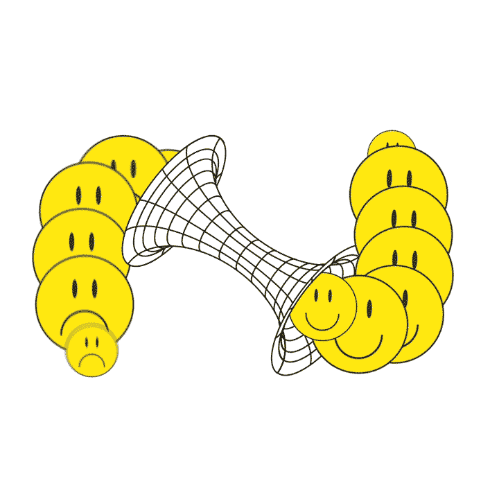
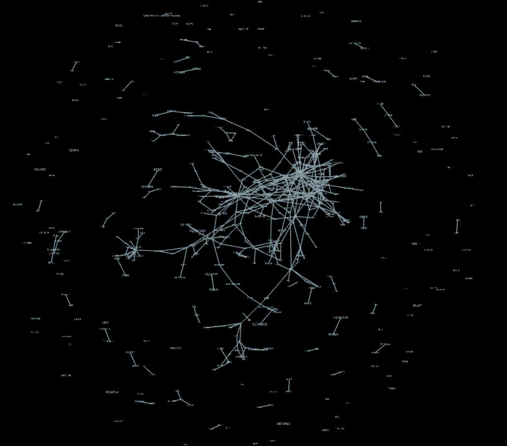
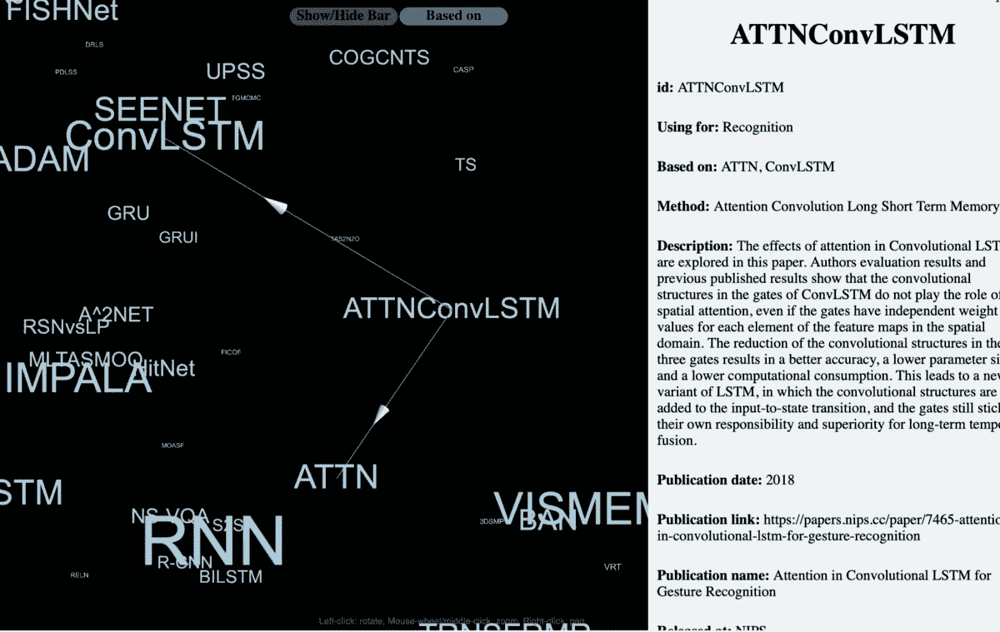
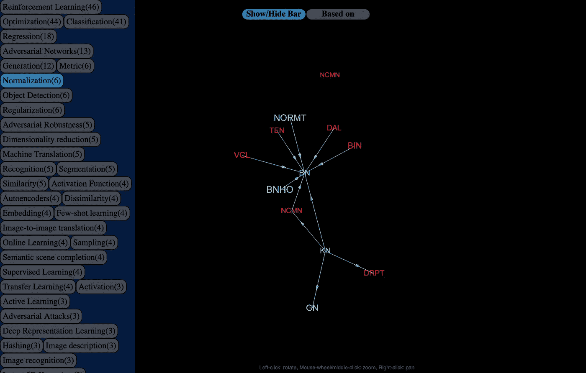

# 机器学习中如何产生想法？

> 原文：<https://medium.datadriveninvestor.com/how-to-generate-ideas-in-machine-learning-bdb9a7267392?source=collection_archive---------0----------------------->

## 关于[的小故事 https://www . inforno politan . XYZ](https://www.infornopolitan.xyz/backronym)

# 介绍

几个月前，我面临一个问题，我的机器学习模型根本不起作用。试图理解如何扩展我的架构，其他方法及其组件的各种名称浮现在我的记忆中。在某个时刻我意识到我的知识非常有限，想法也很贫乏。我知道几十个模型，这是对我非常有用的总量的很小一部分。

第一个想法是:如果我至少知道并理解上一届 NeurIPS 大会的所有论文，会怎么样？在我看来，如果我能理解更多的模型，我作为一名研究人员的素质肯定会提高。这个想法强烈地激励我开始仔细研究会议的文章。

 [## Google Sheets -免费在线创建和编辑电子表格。

### 创建一个新的电子表格，同时在你的电脑、手机或平板电脑上与其他人一起编辑。完成工作…

docs.google.com](https://docs.google.com/spreadsheets/d/1YJuHzAkzKHaFxvSw6650s5TvkMGcHZUA_mr_ALL1B7k/edit#gid=1648646185&range=C124) 

构造这种类型的信息是相当困难的，并且有必要写下方法之间的依赖和连接。我不想用表格或列表来表示依赖关系，我想要更自然的东西。稍加思考，我意识到有一个严格固定的图，在模型和它们的组件之间有边是很有趣的。

***例如甘[1]由生成器(GEN)、鉴别器(DIS)、对抗式自动编码器(AAE)[2]基于自动编码器(AE)[3]和 DIS，。每个组件都是图中的一个独立节点，所以对于 AAE，我们将有一个 AE 和 DIS 的边。***

我一步一步地分析论文，写出它们由什么方法组成，在什么学科领域应用，在什么数据上测试，并试图以图表的形式呈现出来。对于像我这样没有参加过会议的人来说，要整理出~1000 篇文章是非常困难的。经过几周的工作，我意识到机器学习社区是多么的分散。有很多模型正在开发中，通常新会议上的研究论文不会继承一年前提出的大部分改进…

## 相关著作

很自然，我做了研究，并试图找到与我所做的相似的东西。有许多令人惊讶的服务，让你可以监测该领域的新文章的出现。但是所有这些方法的主要目的是简化知识的获取，而不是帮助创造新的想法。创造力比经验更重要，能够帮助你更有创造力的工具应该是研究过程中不可或缺的一部分。

我们有工具可以很容易地进行实验，运行和评估模型，但我们没有方法可以让我们快速产生和评估想法。在机器学习和整个人工智能研究中，新鲜而优雅的想法起着关键作用。

其他科学领域也不能吹嘘产生想法的工具，但我绝对相信人工智能和解决困难问题的其他领域需要一种产生想法的非凡方法。考虑到这一点，之前作为个体开发的图形，成为了从思想产生的角度为机器智能研究开发工具的大思想的一部分。

## BACKRONYM

我分析这些文章的方式非常不理想。在短短的几个月里，我只从上一届 NeurIPS 大会上拿出了大约 250 篇文章和大约 250 篇其他的论文，而 new 正是基于这些论文。大部分地区对我来说是完全陌生的，理解它们花了几天时间。有时我找不到对一些方法的正确描述，文章的摘要就用于此。

基于此，第二个合乎逻辑的步骤是为作者创造一个机会来添加他们自己的方法，并对图中现有的方法进行更改。毕竟，除了文章作者之外，没有人知道如何以最佳方式拆解和描述他们的方法。

将来，在社区的支持下，我们可以升级 BACKRONYM，并建立一个系统来推荐我们如何扩展研究。对于这个场景，我们计划给用户可视化他们自己的知识的能力，公开地或私下地，不考虑主图。例如，用户可以建立一个他知道的所有方法的图表，甚至是一个模型组件的图表，系统将向他推荐最有用的论文或方法。

我们现在是这样做的，表格中有 10 列:
1)论文标题
2)论文链接
3)作者姓名
4)发布日期
5)出版地点
6)方法名称
7)主题区域(用于)
8)方法名称的首字母缩写词
9)方法的简要描述
10)该方法所基于的方法列表(表格中提供的首字母缩写词列表)。

***每一条可以是一个单独的方法，例如，Autoencoder (AE)，或者单独的，auto Encoder(AE)——>Encoder(ENCDR)，Decoder (DCDR)，也就是说，一个模型可以由几个可以单独使用的元素组成。***

The graph is rebuilt based on a column with a list of methods on which the method is based, sometimes this column is empty since it was difficult for me to determine on which method model was inherited from.

Clicking on the node opens a list with meta-information.

The “Subject area (Using For)” column allows creating subgraphs with inheritances inside the field, where the method is marked in red if it using in other areas.

现在，使用图表进行创意改进的最简单方法是跳过连接。例如，您在您的模型中使用 CNN[4]，在图表中，您可以看到继承自 CNN 的另一种方法。你可以做一点研究，试着用高级版本替换你的 CNN。

尽管如此，我相信图表能给出的主要东西是关联 ***。我很想知道伊恩·古德菲勒是如何想到甘这个主意的。在 Lex Fridman[5]的人工智能播客上，Ian 说它是由 Boltzmann 机器的“积极”和“消极”训练阶段激发的。当一个模型不直接继承另一个模型的属性，而是非常抽象地继承时，这是一个很好的例子。***

我非常希望在这个图表中看到这种类型的联系，这完全取决于论文的作者，他们是否愿意分享是什么促使他们创建这种类型的模型来解决一些问题。我认为这个故事不仅讲述了在他们的架构中具体使用了什么方法，而且还讲述了解决方案是基于什么概念和知识形成的，这可以让我们变得更加足智多谋。

## 结论

在我看来，即使是在今天，这个图表仍占有一席之地，因为它可能让人们产生联想，从而有助于创造一些新方法或扩展当前的应用。今天，它只是一个图表，但明天我们将拥有客观地获得机器建议的工具，并自动评估所提出的想法在通往通用人工智能的道路上的影响。

这个项目是由社区推动的。我们希望做得更好，并激励更多的人把他们的模型添加到图表中。更准确的方法信息和更好的可视化技术可以使它成为一个非常有用的工具。

正如我所说的，如果你将一些方法添加到图中，对这个项目的改进会有很大的帮助:【https://www.infornopolitan.xyz/add-research

除了 3D graph 之外，我们的网站上还有一个论坛，讨论所有由 BACKRONYM 创造的与机器智能[https://www.infornopolitan.xyz/discussion](https://www.infornopolitan.xyz/discussion)相关的想法

此外，许多项目正在开发中，您的贡献也将提高这些产品的质量。[https://www.infornopolitan.xyz/backronym](https://www.infornopolitan.xyz/backronym)

所有新闻:

邮箱:aripdotcom@mail.ru
推特:[https://twitter.com/postmachines](https://twitter.com/postmachines)insta gram:[https://www.instagram.com/postmachines](https://www.instagram.com/postmachines/)脸书:[https://www.facebook.com/postmachines](https://www.facebook.com/postmachines)Vkontakte:[https://vk.com/infornopolitan](https://vk.com/infornopolitan)

## **参考文献**

[1]生成性对抗性网络[https://papers . nips . cc/paper/5423-Generative-Adversarial-Nets . pdf](https://papers.nips.cc/paper/5423-generative-adversarial-nets.pdf)

[2]敌对自动编码器[https://arxiv.org/abs/1511.05644](https://arxiv.org/abs/1511.05644)

[3]自动编码器[https://www.aaai.org/Papers/AAAI/1987/AAAI87-050.pdf](https://www.aaai.org/Papers/AAAI/1987/AAAI87-050.pdf)

[4]卷积神经网络 [http://yann.le.../lecun-99.pdf](http://yann.lecun.com/exdb/publis/pdf/lecun-99.pdf)

[5]伊恩·古德菲勒:麻省理工学院的人工智能播客[https://www.youtube.com/watch?v=Z6rxFNMGdn0](https://www.youtube.com/watch?v=Z6rxFNMGdn0)