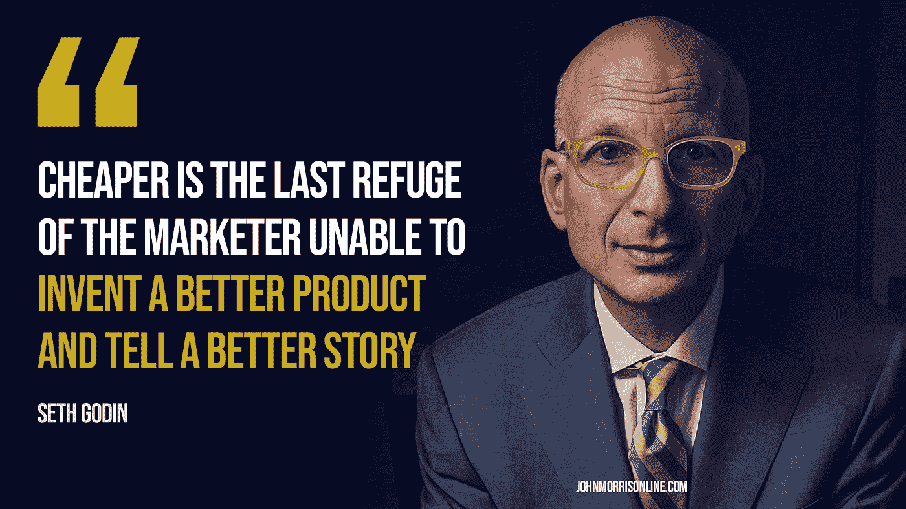

# 如何让自由职业客户付给你更多钱

> 原文：<https://medium.datadriveninvestor.com/how-to-get-freelance-clients-to-pay-you-more-b8eab2498767?source=collection_archive---------49----------------------->

我在我的一个视频中得到这个问题:

“那么，相对于愿意支付 300 英镑的人，你如何让他们支付更高的费用呢？”

我经常听到这样的话。

“低调者”问题。

所以，今天我想和你分享的是一个非常简单的方法，不仅可以对付低注玩家，还可以随意提高你的自由职业者费用…而且，不会让客户三思而行。

而且，它始于你如何思考的一个简单的改变。

为什么人们会买劳力士手表，而天美时却显示同样的时间？

当你的 Yugo 同样可以“带你从一个地方到另一个地方”时，为什么还要买一辆好车呢？

如果你需要一个机械师，你会选择最低的价格而不考虑质量吗？

人们总是花更多的钱买东西。你可能会定期为某些东西多付钱，甚至没有意识到。你是买可乐品牌的汽水……还是买通用的“可乐”。为什么？

人们不仅仅根据价格来购买。

定期。

你要做的是把自己树立成一个值得更多投资的“产品”。因为其他一切都一样(质量、服务等)…是的！潜在客户会以最低的价格购买。

你没有给他们一个不这么做的理由。

你的工作是给他们更多和你一起消费的理由。

这样想吧…

如果你需要一个医疗程序，你遇到了一个医生的办公室。在办公室的前面，有一个破旧的牌子，已经掉了一半。停车场都裂了，摇摇欲坠。前门上有一条裂缝。

而且，它看起来就像一个肮脏的地方…

但是，他们有最低的价格…

你能在那里办理手续吗？

为什么不呢？

这就是你的答案。

对潜在客户来说，你必须让你的“办公室”看起来干净整洁、焕然一新。

还有…

将你的竞争对手定位为前门破裂的“破旧办公室”。

作为自由职业者，这是你的工作。

你这样做…

而且，你做得很好…

客户会选择你，而不是“愿意出 300 美元做这件事的人”。

而且，当你提高价格时，他们会很乐意付给你更多的钱。

这就是我们要做的。

至于如何…嗯，这就是我在自由职业者入门课程中教给你的。这一切都是关于定位、营销和把你自己树立为你所在领域的权威，让客户把你视为他们可以信任的闪亮的新“办公室”。

你可以在 SkillShare 上免费学习这门课程。

所有的细节都在这里:【https://skl.sh/2pOiF5g】T2

后来，

约翰

*最初发布—*[*https://www . johnmorrisonline . com/how-to-get-freelance-clients-to-pay-you-more/*](https://www.johnmorrisonline.com/how-to-get-freelance-clients-to-pay-you-more/)