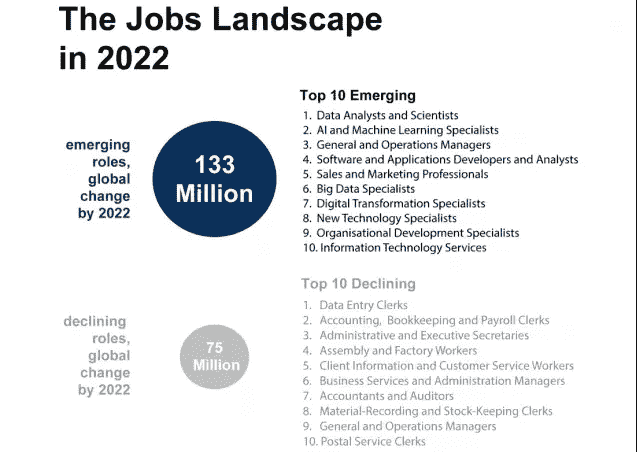

# 如何进入 AI 相关工作？？？

> 原文：<https://medium.datadriveninvestor.com/how-to-get-into-ai-related-jobs-cc1976bdc1fe?source=collection_archive---------4----------------------->

申请机器学习和 AI 相关工作之前需要采取的步骤。路线图、所需技能、材料也在下面链接。

这是最常见的问题之一，在这个领域有抱负的新人经常问我这个问题，所以让我们继续吧。

> **为什么是 AI 或机器学习相关的工作？**

因为**比其他传统的编码和非编码相关的工作**有趣得多，下一个原因是**世界经济论坛** ( [来源](https://gizmodo.com/emerging-tech-will-create-more-jobs-than-it-kills-by-20-1829111519))说的，那就是…

[source](https://gizmodo.com/emerging-tech-will-create-more-jobs-than-it-kills-by-20-1829111519)

未来几年排名前两位的工作都与这个领域有关。由于人工智能本身就是智能，你不必担心你的工作会被任何其他因素取代。

虽然如果创造人工智能的人工智能出现，那么我们所有人都将失业，这将是愚蠢的。

既然****为什么**既然原因都清楚了现在就让我们来谈谈**如何获得那些工作岗位。****

> ******如何获得 AI 和机器学习相关的工作******

******“准备好你的技能”——**现在由于**炒作**，有太多的竞争者在争夺这类工作，所以确保你通过了解这份工作所需的大部分技能而脱颖而出。****

******“找个实习岗位”——**那就是我通常对**说的“先把你的脚放在门里”**。如果你真的想脱颖而出，这是方法之一，走出大学环境。****

# ******申请工作或实习前需要采取的步骤******

1.  ******选择人工智能的子领域:**人工智能中有许多领域，选择一个你感兴趣的领域并追求它，其中一些包括
    - > NLP(自然语言处理)——处理文本数据
    - >计算机视觉——处理图像数据
    - >机器人学
    - >天网
    尽管你可以学习许多领域，但首先从一个领域开始，坚持下去，直到你可以在那个领域做两三个项目。****
2.  ******应用人工智能或人工智能研究:
    *应用人工智能:*** 利用技术和算法解决特定领域的问题。示例:癌症检测的诊断扫描。
    ***步骤:*** *- >机器学习算法是如何工作的？
    - >数据假设和收集
    - >特定数据上算法成功或失败的原因
    - >机器学习管道实现(sci-kit learn、Tensorflow、pytorch 等。)
    - >机器学习管道大规模实现(例如在 AWS 上)
    - >数据预处理* ***人工智能研究:*** 如果你想成为一名人工智能研究人员，那么你需要知道上面列出的东西以及那些算法的数学知识(顺便说一下，这是相当庞大的)。而且你必须不断地阅读和撰写研究论文，这样你才能保持更新，因为这个领域正在疯狂地发展。****
3.  ****活跃在 [**Twitter**](https://twitter.com/chethan1gn) **，**[**Linkedin**](https://www.linkedin.com/in/chethankumargn/)**，**[**Github**](https://github.com/chethangn)**(**如果你喜欢我的内容，在这些平台上关注我 **)** 也关注 facebook 群等。****
4.  ******制作人工智能内容:**因为这是人们注意你的唯一方式，也是**回馈社区的一种方式**。如果你是一名作家，就写博客；如果你对 youtube 上的相机帖子感到舒服，就写博客。****

# ****路标****

> ****如果你是新来的，就按这个顺序来。下面不要求你有技术知识，但你必须知道这些。****

****1. [**人工智能是真实存在的还是只是这十年的炒作？？**](https://becominghuman.ai/artificial-intelligence-real-or-is-it-just-an-hype-of-this-decade-fear-what-learn-history-go-game-ac4476badf1b)****

****2. [**人工智能:定义、类型、实例、技术**](https://becominghuman.ai/artificial-intelligence-definition-types-examples-technologies-962ea75c7b9b)****

****3. [**人工智能 vs 机器学习**](https://medium.com/@chethankumargn/artificial-intelligence-vs-machine-learning-3c599637ecdd)****

****4. [**机器学习为什么要实现人工智能？**](https://medium.com/@chethankumargn/why-machine-learning-for-achieving-artificial-intelligence-the-need-for-machine-learning-c69667b4a51f)****

******5. [**机器学习的类型和算法**](https://becominghuman.ai/machine-learning-types-and-algorithms-d8b79545a6ec)******

> ******编码从这里开始。******

****1. [**线性回归(第一部分):类型、例子、梯度下降例子**](https://towardsdatascience.com/linear-regression-part-1-types-examples-gradient-descent-example-2e8c22b05f61)****

****2. [**线性回归(下):用 python 实现，从头举例**](https://towardsdatascience.com/implementation-linear-regression-in-python-in-5-minutes-from-scratch-f111c8cc5c99)****

> ******NLP******

****1.**N**[**LP vs NLU vs NLG(知道自己要达到什么目的)NLP 引擎(Part-1)**](https://towardsdatascience.com/nlp-vs-nlu-vs-nlg-know-what-you-are-trying-to-achieve-nlp-engine-part-1-1487a2c8b696)****

****2. [**NLP 引擎(Part-2)——>自然语言处理的最佳文本处理工具或库**](https://towardsdatascience.com/nlp-engine-part-2-best-text-processing-tools-or-libraries-for-natural-language-processing-c7fd80f456e3)****

# ****我将继续以有序的方式向这个页面添加内容，所以请加入书签并继续访问它****

****你也可以在网上找到更多你感兴趣的人工智能领域的内容。关注我的 [**LinkedIn**](https://www.linkedin.com/in/chethankumargn) 和 [**Twitter**](https://twitter.com/chethan1gn) 了解更多关于人工智能的内容。
查看 Siraj Raval
[https://github . com/llSourcell/Learn _ Machine _ Learning _ in _ 3 _ Months](https://github.com/llSourcell/Learn_Machine_Learning_in_3_Months)****

****现在，如果你准备好了所有的东西，你可以在这里申请，或者在任何其他的求职网站申请。[https://intern.supply/](https://www.youtube.com/redirect?q=https%3A%2F%2Fintern.supply%2F&event=video_description&redir_token=Ydf9vYVlcoMtoBqSvP6MmDP8mnR8MTUzOTMxODc1OUAxNTM5MjMyMzU5&v=CGTn0ceOaOM)2
。【https://www.angel.co ****

****演职员表:[https://www.youtube.com/watch?v=CGTn0ceOaOM](https://www.youtube.com/watch?v=CGTn0ceOaOM)****

****请务必关注我的****[**LinkedIn**](http://www.linkedin.com/in/chethankumargn)**[**Twitter**](https://twitter.com/chethan1gn)**[**insta gram**](https://www.instagram.com/data_science_by_chethan/)**获取更多更新。如果你喜欢这篇文章，请鼓掌并分享它。**************

******在这里加入我们的 [**WhatsApp**](https://chat.whatsapp.com/LLwBIyYYcABEV31ZFI7QR3) 社区。******