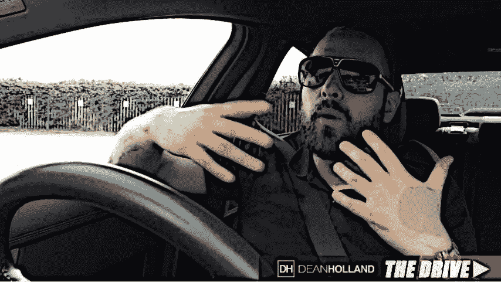

# 如何让人们打开并阅读你的邮件

> 原文：<https://medium.datadriveninvestor.com/how-to-get-people-to-open-and-read-your-emails-6aff39d5ab96?source=collection_archive---------25----------------------->

我们昨晚在办公室呆到很晚，又是很晚。我整个星期都在与我们的认证合作伙伴一起举办训练营，基本上是教他们并体验一种叫做 Fuel 的全新交通系统。

这基本上是一个完全革命性的方法来驱动流量和做在线广告，以获得潜在的线索和销售。

今天我想谈谈电子邮件。所以现在，当我走进办公室的时候，我今天最大的工作之一，可能至少是接下来的几天，就是为我们新的销售漏斗写邮件序列。

我主要关注的是客户序列。那么，当新客户订购了我们即将推出的名为 [The Perfect Offer](https://likesinternetmarketing.com/affiliate-marketing/free-the-perfect-offer-method/) 的新培训后，会发生什么，会向客户发送什么，会发生什么呢？

所以我想给你一些建议，因为我学了很多关于电子邮件、文案以及诸如此类的东西。因为最终，你让某人根据书面文字采取行动的能力可能是…

# 你能学到的最有价值的技能之一

有一句名言，“当你能学会销售时，你就永远不会挨饿。”很明显，你的电子邮件列表是一笔巨大的资产，或者说是任何成功的互联网业务中最有价值的途径之一。

因此，有能力与你的订户和客户建立融洽的关系，建立信任，发展关系，这是成功经营的关键之一。当你有顾客时，现金流为正。

所以我想在这里给你一个很好的建议，因为这是我在我所有的电子邮件或整个竞选活动中编织的东西之一，是这种特殊的战术——这种特殊的策略。

所以，我们在这里的全部目的是，当我们的业务中有了新客户，并且在我们的电子邮件列表中，我们希望与那个人接触。当我们第一次把他们放在我们的名单上时，我们几乎想设置场景，与他们接触，让他们基本上期待着收到我们的电子邮件。

很多人写电子邮件，它们非常普通，非常无聊，非常单调，你知道，它们几乎非常中性。你能为你的观众做的最好的事情之一就是变得极端，你知道——两极化。我不是在说—你有一种尺度—你有一方面很无聊，然后你有…

# 完全荒谬、难以置信和疯狂！

…然后你想处于中间的某个位置，在那里你会两极分化——你不害怕说出你的想法，你在做你自己，你在让你的观众真正了解你。

因此，我想分享我如何通过我的自动电子邮件跟进来获得人们的策略，或者我如何通过我的自动电子邮件跟进来获得我的观众和订户，我们正在将这些自动电子邮件跟进纳入我们的自动回复序列……[你如何让人们继续打开你的电子邮件](https://likesinternetmarketing.com/email-marketing/get-people-open-read-emails/)。你如何让人们真正地等待，兴奋，期待着你的名字出现在他们的电子邮件收件箱里。这是你现在能做的最重要的事情之一，因为你在争取收件箱的关注。

所以我们要做的是…

# 我称之为“扣人心弦的运动”

好吧。现在什么是扣人心弦的竞选活动——你知道，如果你曾经看过任何电视节目，任何肥皂剧，或任何种类的电视节目，比如说一周一次或一个月一次，你知道，每几天一次，一周两次。你会注意到这些电视节目在这方面绝对是最棒的。

让我们假设你正在看一个电视节目，它正接近广告时段，好的，所以商业信息片将在电视节目的中间点播出。

你会注意到总有一些事情发生，让你不想离开沙发。

所以它可能是这样的，你可能会说，“哦，我的天哪，看他在那里做什么！”然后像切到广告一样。

就像，你左边的观众在想，他在那里做什么？

# 大脑必须完成画面，对吗？

所以这就像你不能去任何地方，因为你害怕错过即将到来的事情，因为他们给你留下了这个悬念。他们给你留下了这种开放的循环。这实际上叫做——实际上叫做打开循环。

这就是我们处理电子邮件的方式。所以我们会说这样的话，所以我们会有这封电子邮件，我们会说我们在电子邮件中说的任何事情，但在整个电子邮件中，甚至有时在快结束时，我们会在那里放一个悬念。所以我们会说这样的话，“哦，天哪，你不会相信我昨天发生了什么！它包括一个摄像机，一个疯女人和一个邮递员。我会在明天的邮件中告诉你所有的事情。现在来看看这个…”

这可能不是世界上最伟大的例子，但你能明白我的意思吗？我打开了这个循环，我放下了这个悬念。这就像那个正在阅读这封邮件的人心中的好奇心——正在消耗你刚刚写的电子邮件——但现在他们也在等待下一封电子邮件，以便他们可以了解到底发生了什么。

然后下一封邮件来了，就像这样，“所以我提到要告诉你前几天发生的事情。事情是这样的:诸如此类。”然后我们再打开另一个循环。我们将落下另一个悬念…

# 我们不断打开这些循环

有时我们打开一个循环超过一天。因此，我们可以在一封电子邮件中这样写道，“我去商店的时候，发生了最疯狂的事情。我在排队的时候，有两个人在我前面，这简直太疯狂了。你不会相信他们对我做了什么！结束的时候我看起来一团糟。在接下来的几天里，我会告诉你更多的事情。但是现在我只想提一下 X Y Z "

所以我们在某种程度上打开了这些循环，就像，这个人总是急切地等待你打开的那个循环的答案。我称之为扣人心弦的运动。因此，我今天要写的是一系列扣人心弦的活动，当我们的新客户通过这一新的销售漏斗进入时，他们将开始收到—我在这里提供价值，让他们采取必要的行动，我给他们送东西，并指引他们去我希望他们去的地方，通过我的产品系列提升他们的销售漏斗。

但这样做也是为了让他们喜欢阅读我的电子邮件，这样他们就不会觉得我只是在向他们推销，因为那不是我的本意。我的目的是教育、建立信任、发展融洽关系，当然还有提升我的销售漏斗中的人。但是这样做的方式…

# 那很有趣，很吸引人，很有趣

…这让他们期待着我的电子邮件到达他们的收件箱。

所以我不仅仅是那些家伙中的另一个——相反，我是他们兴奋地收到信息的那个家伙，因为他们获得了如此多的价值。但他们也很喜欢读我的邮件，因为它们很有趣，很吸引人，而且他们用这种扣人心弦的方式迫不及待地想看看接下来会发生什么。

就像一部肥皂剧，一部电影，一部电视剧，你知道，你最喜欢的电视剧。如果你看电视的话，开始监控，每次在商业广告开始之前，广告插播开始，或者每次在节目结束时，当你知道在接下来的几天或下一周还有另一个节目时。开始注意吧，因为你学会的这些技巧会成为你电子邮件文案的杀手。

希望你喜欢这个建议。这是电子邮件扣人心弦的竞选方式。祝你愉快。