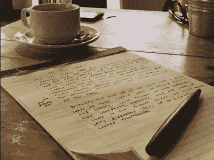

# 作为一名自由职业者，如何完成工作

> 原文：<https://medium.datadriveninvestor.com/how-to-get-sh-t-done-as-a-freelancer-fd739c325e2e?source=collection_archive---------37----------------------->

你不需要在互联网和社交媒体上寻找太多关于如何成为一名自由职业者、如何游说、如何推销、如何设定价格等等的建议。

毫无疑问，这很重要。但是如果你没有首先优化你的工作习惯，世界上所有的优化都不会对你有任何好处。

这里有几个小技巧，帮助我在在家工作和自己当老板这种令人分心的自由中完成任务。

# 把它当成一份工作

…因为确实如此。

自由职业者不仅仅是一份“真正的工作”，在这份工作中，公司(又名你公司)的生存取决于你个人的生产力。据此行动。

# 设定时间

如果你的时间无组织无纪律，你不太可能用它来做持续的工作。你需要一个常规和时间表。

自由职业的美妙之处在于，你的工作日和我的工作日没有任何相似之处。你的工作日不一定是周一到周五。

最近，我一直在尝试一周工作六天，周三休息。

# 拥有独立的工作空间

即使它只是你卧室的一个角落，或者是你以 *cortado* 的价格租的咖啡馆的一张桌子，你也需要一间与你的生活区分开的办公室。

留出你自己的空间，在你工作的时候不要让别人接触到你。对我来说，那就是耳塞、飞行模式和大量的自然光。对有些人来说，这是音乐和一面空白的墙。

如果你的客户要去看你工作的地方，你会想把它考虑进去，让它看起来像样。这包括视频通话。我喜欢在我的书架前打 Skype 电话。不止一次，在一位客户注意到我身后的一个书名后，这变成了一次读书聊天。

# 穿衣服

理论上，你可以一丝不挂地远程工作。人们开玩笑说，视频电话要从腰部以上穿西装打领带…

你应该利用这种自由，以一种让你觉得准备好完成工作的方式来穿着。对我来说，这意味着穿上鞋和我在这个世界上能穿的任何东西。有时候，当我需要动力的时候，我会稍微打扮一下(穿上有纽扣的衬衫。)

以我的经验来看，即使没人欣赏酱料，看起来精神也是有心理优势的。[研究表明，电话面试时的着装可以改变你的声音。](https://lifehacker.com/5272248/nail-your-next-phone-interview-by-dressing-up)

我穿着西装打着领带起草这篇文章只是为了好玩。它至少改善了我的姿势。

# 计划强制拨款

为自己工作的一个真正危险是模糊工作和休息时间之间的界限。要么即使你不想工作，你也要结束工作，要么你屈服于睡懒觉的诱惑，随便休息几天。

安排假期和休息日。真正地在你不工作的时候结账——这意味着没有电子邮件或与工作有关的电话——并且有一个固定的日期回去工作。

作家威尔·赛尔夫提供了一些关于休息时间和如何举办一场孤独的圣诞派对的建议:

> “把你自己当成一个小公司。参加团队建设练习(长距离散步)。每年举行一次圣诞聚会，你站在写作室的角落里，一边喝着一瓶白葡萄酒，一边大声对自己大喊。然后在桌下自慰。第二天，你会感到一种深深的、连贯的尴尬感。”
> ( [威尔赛尔对作家的规定](https://www.theguardian.com/books/2010/feb/22/will-self-rules-for-writers))

# 成为你自己的人力资源部门

没有人喜欢为一个混蛋工作…在精神上、身体上和(不要嘲笑)精神上照顾好自己。做冥想练习，做瑜伽，看心理医生。

# 寻找“同事”

一个人工作，不代表一定要孤独。与其他自由职业者联系，进入[休闲频道](https://digitalfreelancer.io/chat/)或者参加[在线课程](https://creativeclass.co/lessons/)。

在自由职业泡沫之外也交朋友。为自己工作的压力的一个简单的补救方法是在你的生活中有一些不是靠笔记本电脑谋生的人。

我的一个朋友是商业渔民。他在黎明前醒来，乘小船去北大西洋工作。当我缺乏动力的时候，我会让他的例子让我感到羞愧，把自己从床上拖起来，在一个气候可控的房间里打字。