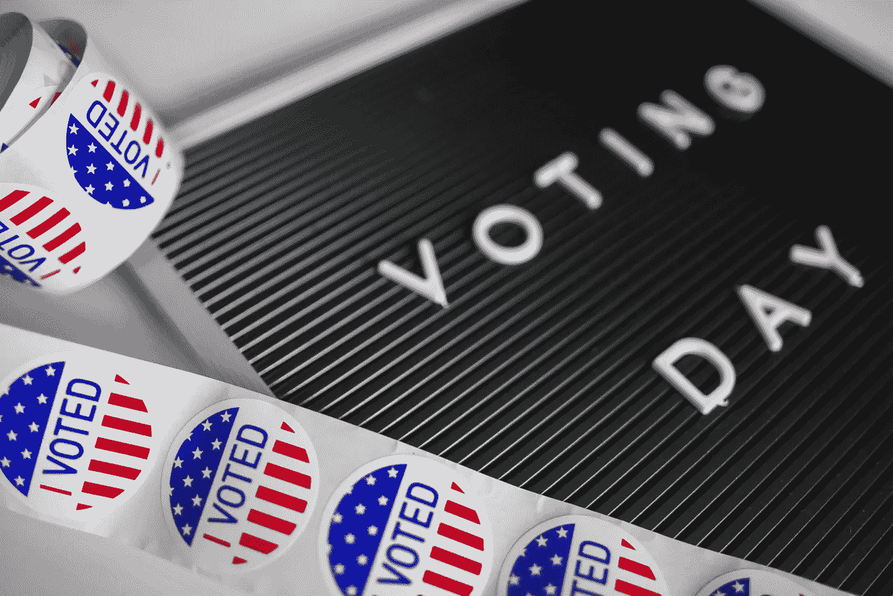

# 如何在没有人做的时候完成任务

> 原文：<https://medium.datadriveninvestor.com/how-to-get-stuff-done-when-no-one-else-will-dd56e0008d78?source=collection_archive---------30----------------------->

# 实用主义是顽固的理想主义的解药

美国是一个多世纪以来最分裂的国家。跨党派的政治争论是正常的，尽管我们正在目睹政党内部日益加剧的两极分化。随着温和派开始脱离进步派，民主党还没有找到自己的声音。在共和党内，我们看到一些政客支持总统，而其他人则保持距离。简而言之，根据政党对个人进行分类变得越来越困难。事实上，现在越来越难以认清美国政党的立场。

所有这些分歧使得定义美国的前进道路几乎不可能。美国不仅仅是一个没有方向的国家。这是一个没有称职领导的国家。我对讨论提议政策的优点不感兴趣。然而，我有兴趣了解当这种两极分化渗透到我们的政治中时，美国如何前进。当意识形态阻碍进步时，它会产生反作用。我们已经选举了一批政治理论家就职，所以我们应该预料到进展会停滞不前。然而，情况并不一定如此。务实的解决方案可以解决顽固的理想主义问题。

# 计划、实施和接受责任

当今政治中最大的问题之一是缺乏实质内容。新闻标题中不乏创意，但如果没有详细的计划，这些创意就无法实现。没有预先的计划，什么都做不了，这也是为什么我们的政治会变成现在这个样子。此外，详细说明想法如何执行的计划有助于我们更好地确定想法本身的强度。为了说明这一点，让我们以最近成为头条新闻的一个想法为例:[对富人征税 70%](http://fortune.com/2019/02/07/billionaires-hate-aoc-wealth-tax/) 。

我不反对将这种性质的想法注入我们的政治话语。这是不同的，这是挑衅性的，这导致了一些健康的辩论。然而，70%最高税率的拟议好处是理论上的。美国经济协会进行了一项 T2 研究，结论是对富人增税会让穷人受益。这可能是真的。这可能是不真实的。虽然我们永远无法确定，但实施这样的想法必须事先经过深思熟虑。应该进行进一步的研究，政治家应该更好地理解这种税的可行性。富人会把钱藏在海外以避税吗？有没有可以利用的税收漏洞？这种税收会抑制企业家精神吗？

伟大的想法可能会赢得选举，但周密的计划可以确保持续的成功。有了完善的计划，想法可以转化为行动。要完成任务，你需要一个计划。一个好的计划包括以下内容:

**实施风险:**

*   什么会影响一个想法的成功实施？有强烈的政治反对吗？是否存在需要克服的法律障碍？应对风险进行详细描述，并针对每种风险制定缓解计划。

**所有权和问责制:**

*   谁拥有计划的每个组成部分？谁对每个组件的成功或失败负责？一个想法的每一个实现，都要有一个“要掐的喉咙”。我们在当今政治中经常看到的指责和否认是不可原谅的。强有力的领导者会负起责任，竭尽全力把事情做好。

**时间表:**

*   没有时间表的计划注定会失败。通过真正了解实现一个想法需要多长时间，计划者可以预测成本、必要的资源以及影响实现成功的其他因素。没有一个明确的时间表，实施可能会变得过于昂贵，从而彻底毁灭这个想法。

**长期影响:**

*   今天的政治家没有考虑到他们的想法的长期影响。无情的减税伤害了国家的财政。无节制的污染毒害了环境。如果政客们继续考虑短期的连任竞选，而不是他们所管理的国家的长期实力，整个国家都会遭殃。

# 政治家能把事情做好吗？

我个人的哲学是做最坏的打算，同时抱最好的希望。我认为政治家有可能变得更加务实，但我不会屏息以待。上述规划建议不仅限于政治。我建议你在制定计划时结合这些建议。作为预备者，我们都是计划者。我们完成任务。我只希望我们选出的代表能像我们一样认识到计划和准备的重要性。

最初发布于:[https://bunkerbasics.com/get-stuff-done/](https://bunkerbasics.com/get-stuff-done/)