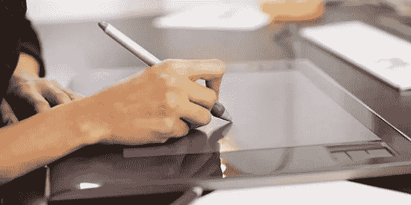

# 如何从你的设计中获得最大价值

> 原文：<https://medium.datadriveninvestor.com/how-to-get-the-most-value-out-of-your-designs-b8264f1da551?source=collection_archive---------9----------------------->

如果你不熟悉“畅销书”这个词，你可能是生活在特立尼达和多巴哥的 23%不喜欢阅读的人之一。幸运的是，畅销书一词不仅限于书籍。事实上，它被用来宣传任何正在出售的东西的受欢迎程度，最有效的方法之一是通过使用潜意识信息。

科学证明，潜意识暗示具有在潜意识层面吸引人的力量，设计师多年来一直利用这种心理鼓励买家做出特定决定，从而创造畅销书。因此，虽然我们可能会避免某些事情，如瘟疫，但我们都以各种方式遇到了广告的影响。

# 自然界中的广告

在巴西，有一种颜色鲜艳的鸟叫蓝侏儒鸟。它的身高约为 12 毫米，以开发一种精确的方式来吸引潜在的伴侣而闻名，方法是与另外三个没有被邀请参加表演高潮的人一起跳一场非常显眼的排练好的舞蹈。

在排练期间，一个年轻的男性会代替女性，直到舞蹈完全同步，并得到男主角的认可。一旦一切正常，一场令人震惊的示爱表演就开始了，等待雌性的交配许可。

# **靠人做广告**

人们一直在宣传他们是谁。这可以从他们的行动、他们说的话和他们穿的衣服中看出来。

当梅根·马克尔嫁给哈里王子时，她以前生活的一切都变了。作为一名成功的美国女演员，梅根习惯于给人签名，但在成为苏塞克斯公爵夫人后不久就停止了。她关闭了她的生活博客，扔掉了很多旧衣服，比如，穿太暴露或太短的裙子，不穿被认为是皇室成员的连裤袜。

所以广告无处不在，但它的目的是如果你有一些有意义的东西要说，就要创造意识。对于大多数本地小型服务企业来说，这是他们失败的地方，不是因为他们没有理由让客户关心，而是因为他们认为品牌就是颜色、字体和图像。

# **你在传送什么？**

如果你想在发布你的设计后进行转化，这不是一个可以肤浅回答的问题。让我们回溯到蓝马纳金，他对雌性做了什么广告？因为交配是他的想法，他必须宣传他的基因，炫耀他有多健康，因为良好的基因质量，以及你的健康，在动物王国里选择潜在的伴侣是至关重要的。

对于梅根·马克尔来说，遵守她新头衔的准则是必要的，以传达对王室、她的新家庭、她丈夫的地位以及她自己的尊敬，被视为王室的正式成员，并由此受到公众的尊重。

但是，像遗传、健康和护理这样的事情都是没有线索的无形信息，就像一只长着鲜艳羽毛的鸟表演非常详细的舞蹈，或者在我之前等我丈夫进入房间，或者合适的衣服长度使它们可见。正因为如此，在你为客户设计任何东西之前，你要先了解你试图传达的无形的东西。搞清楚这一点将有助于你象征性地确定，你需要关注什么，以从你的设计中获得最大价值。

# 曲线球在这里

大多数人在这样做时遇到的问题是，他们会陷入列出人们期望的事情的困境，并表现出陈词滥调，如表达“他们多么支持客户服务”、“他们真的在乎”或“他们有多透明”这些东西是已知的和缺乏想象力的，因此不应该被用来引诱任何人和你一起工作。

一旦我们到了这一步，一些人会默认为抄袭，原因有很多，从现在需要赚钱到不知道任何更好的东西，当你花时间真正理解你提供的东西时，这是完全没有必要的。如果你想开始了解这些事情，你可以点击下面的链接注册了解更多。

我是 [**、品牌桶**](http://bit.ly/TheBrandTUB) 的创始人和视觉品牌策略师