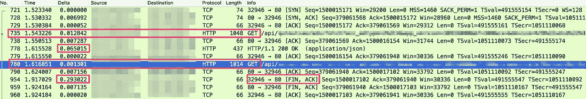
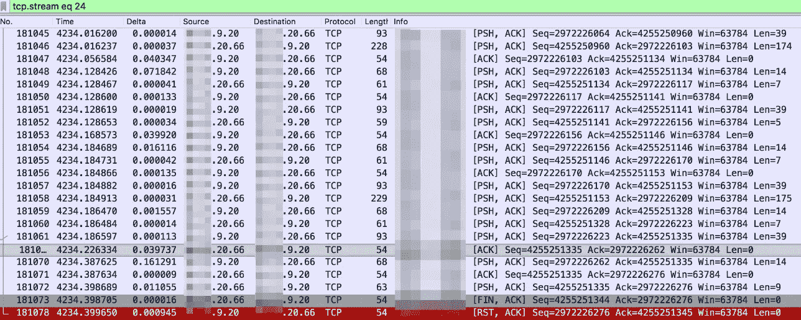
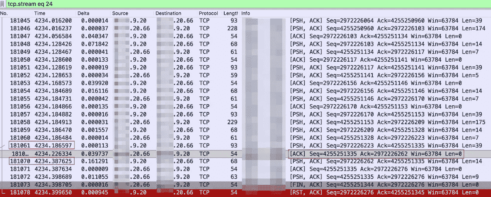

# 如何找到网络超时问题的根源

> 原文：<https://medium.datadriveninvestor.com/how-to-get-to-the-bottom-of-network-timeout-issues-8f854a20541f?source=collection_archive---------3----------------------->


对于那些使用云的人来说，服务日志中报告的超时问题通常很难处理，因为问题的症结可能在[云基础设施](https://www.datamation.com/cloud-computing/what-is-cloud-infrastructure.html?spm=a2c41.13397063.0.0)层或服务软件层，因此存在相对较大的故障排除范围。第二，这样的问题通常是不可重现的，因此很难确定到底发生了什么。这篇博客文章探讨了如何识别和解决服务日志中报告的超时问题的根本原因。具体来说，这篇博客将关注云基础设施层和服务软件层的服务超时。

# 理解超时意味着什么

超时通常很难理解和排除。这可能是因为存在不同的服务形式，或者不同的软件实现语言和框架，或者服务日志中打印的信息可能不同。关键字可以是几种不同形式中的一种。其中一些可能是:

“SocketTimeOut”、“读取超时”和“请求超时”。

[](https://www.datadriveninvestor.com/2019/02/21/best-coding-languages-to-learn-in-2019/) [## 2019 年最值得学习的编码语言|数据驱动的投资者

### 在我读大学的那几年，我跳过了很多次夜游去学习 Java，希望有一天它能帮助我在…

www.datadriveninvestor.com](https://www.datadriveninvestor.com/2019/02/21/best-coding-languages-to-learn-in-2019/) 

就形式而言，它们都属于网络超时的范畴，但谈到看待这些，有一个概念需要澄清。那个概念就是这种问题的发生是因为请求超过了设定的超时时间，而这个设定可能来自客户端、服务器或者中间网络节点，这是直接原因。网络[丢包](https://www.forcepoint.com/cyber-edu/packet-loss?spm=a2c41.13397063.0.0)可能导致超时，但不是充分条件。服务超时和网络分组丢失之间的关系可以总结如下:

网络丢包可能导致服务超时，但服务超时的原因不一定是丢包。

明确了这个因果关系之后，我们再来看如何分析服务超时。如果服务超时被任意等同于由于网络抖动导致的分组丢失，那么故障排除和分析过程完全忽略了原因可能是服务软件层本身。事实上，通常服务软件层是整个困境的开始。

鉴于这个问题，本博客将尝试从云基础设施层和服务软件层来关注服务超时。一般来说，基本设置层丢包的原因实际上相对容易排除。阿里云有完整的底层监控体系。因此，给定服务日志报告错误的相应时间段，监控数据可以提供必要的信息来确定基础设施网络中是否出现了问题。而服务层超时通常是软件层设置的结果，与软件实现和服务形式有关。这通常更难排除故障。

# 为什么网络丢包会导致服务超时？

网络抖动会导致服务超时。这主要是因为网络抖动会导致不同程度的延迟。以迄今为止在大多数互联网应用中使用的 TCP 为例。丢弃数据包不会影响数据传输的完整性，因为 [TCP 协议](https://searchnetworking.techtarget.com/definition/TCP?spm=a2c41.13397063.0.0)已经被设计用于处理数据包丢失、无序数据包异常和其他异常等问题。另外，所有的重传过程都是在内核 TCP 协议栈中完成的。操作系统的用户空间进程实际上并不知道这个进程。丢包的唯一副作用是延迟增加。如果延迟足够长，达到了应用程序进程设置的超时时间，则服务应用程序端会发生服务超时。

现在，丢包时是否超时取决于应用程序进程的超时设置。例如，如果在数据传输过程中只有一个 TCP 数据包被丢弃，则 200 ms 后会触发超时重传:

*   如果应用程序设置的超时为 100 毫秒，而 TCP 协议栈没有机会重新传输数据包，则应用程序认为超时并关闭连接；
*   如果应用程序设置的超时是 500 ms，TCP 协议栈将完成重传，这对于应用程序进程是透明的。对应用程序的唯一感知是，这个数据包交互的处理时间比基线处理时间长 200 ms，这对时间敏感度低的应用程序影响很小。

# 延误时间是多少？

在设置一个应用进程的超时时间时，可以参考的量化值有哪些？虽然 TCP 中的 RTT/RTO 是动态变化的，但是 TCP 丢包的影响是可以定量总结的。

数据包丢失导致的延迟主要分为以下两类:

*   TCP 连接建立超时。如果 TCP 的第一个连接建立的 SYN 包由于网络抖动而不幸丢失，客户端将在 1 秒钟后重新传输 SYN 包(在 RFC 2988bis-02 草案中定义),以再次启动连接，对于不太旧的内核版本。对于内部网环境来说，1 秒是非常高的。对于阿里云区域的数据中心，正常的 RTT 是个位数毫秒级。如果 1 秒内没有丢包，就可以完成上百个数据包的交互。
*   TCP 中间包被丢弃。TCP 通过两种机制处理中间丢包:快速重传和重传超时。快速重传通常相对较快，与 RTT 相关，并且没有量化值。重传超时(RTO)也和 RTT 有关，但是 Linux 中定义的最小 RTO 值是 TCP_RTO_MIN = 200 ms，所以在 RTT 比较小的网络环境中，即使 RTT 小于 1 ms，TCP 重传的最小 RTO 值也只能是 200 ms，这样丢包造成的延迟比较小。

除了数据包丢失，另一个常见的延迟是由 TCP 延迟确认引起的。这与协议设计有关，实际上与丢包无关。这里，它也可以在延迟量化部分进行总结。它很容易在交互式数据流和 Nagle 算法场景中触发。Linux 中定义的延迟 ACK 的最小值 TCP_DELACK_MIN 是 40 ms。

因此，综上所述，以下量化时间可供参考:

*   40 ms:在交互数据流中启用 TCP 延迟确认和 Nagle 算法的场景下的最小延迟值。
*   200 毫秒:在 RTT 值相对较小的正常网络环境中，当 TCP 数据包被丢弃时，这是 RTO 的最小值。
*   1s:对于较新的内核版本，这是第一个建立连接的 SYN TCP 数据包被丢弃时的重新传输时间，也是 RFC2988bis 中定义的初始 RTO 值 [TCP_TIMEOUT_INIT](https://elixir.bootlin.com/linux/v3.1/source/include/net/tcp.h#L125) 。
*   3s:对于早期内核版本，这是第一个建立连接的 SYN TCP 数据包被丢弃时的重新传输时间，也是 RFC 1122 中定义的初始 RTO 值 [TCP_TIMEOUT_INIT](https://elixir.bootlin.com/linux/v3.0/source/include/net/tcp.h#L125) 。

# 云基础设施层

基础设施网络中的分组丢失可能由多种原因引起，但是这些原因可以主要归纳为下面讨论的以下三类。

# 云基础设施网络抖动

网络链路、物理网络设备和 ECS/RDS 所在的主机虚拟化网络中可能会出现硬件和软件问题。有鉴于此，云基础设施已经完全冗余，以确保在出现问题时快速隔离、切换和恢复。

*   症状:有了网络冗余设备，就能保证快速恢复，所以这类问题通常表现为单个时间点的网络抖动，一般在秒量级。抖动的具体现象是在那个时间段内新的连接失败，已经建立的连接中断，在服务中可能表现为超时。
*   影响范围:一个网络设备通常有很多主机，所以网络抖动通常影响范围较大。例如，它可以同时影响多个 ECS 到 RDS 的连接。

# 为云产品设置速度限制

许多网络云产品，如 ECS、SLB 和 NAT 网关，都有规范和带宽选项，当云产品的流量或总连接数超过指定的规范或带宽限制时，就会发生数据包丢失。这种类型的丢包不是云厂商的失误造成的，而是实际服务流量规模与云产品规格或服务阈值的选择之间的偏差造成的。这个问题通常可以通过监控服务来识别，监控服务应该由特定的云产品本身或者相关的监控服务来提供。

*   症状:当流量或总连接数超过规格时，流量或连接被丢弃。该问题可能间歇出现，也可能连续出现，在网络流量高峰期间出现的概率更高。
*   影响范围:一般情况下，只有一个实例受到影响。但是，对于 NAT 网关执行 SNAT 操作的情况，多个实例可能会受到影响。

# 供应商网络的问题

在公共网络场景中，客户端和服务器之间的数据包交互通常要经过多个自治系统(ASs)。如果供应商的中间链路出现问题，可能会导致端到端的丢包。

*   症状:用[一个双向命令行工具 mtr](https://help.aliyun.com/knowledge_detail/40573.html) 可以看到丢包是从链路中间的一跳开始的。
*   影响范围:影响范围可能较大，通过 AS 链路的报文交互可能受到影响。但是，单个用户看到的影响通常只是针对特定的实例。

# 服务软件层

上一节分析了由于几种基础设施中的异常或速度限制而导致的数据包丢失所导致的应用程序超时。一般来说，只要能找出丢包的点，就能找到根本原因。但是，在某些情况下，网络监控显示没有数据包丢失的迹象。此时，我们需要继续从应用程序端进行故障排除。由于应用形式的多样性，下面给出两个典型的例子来说明为什么在没有网络丢包的情况下，超时也会在服务日志中报告。

# 示例访问超时 1

这是一个发生在 ECS 主机和第三方 API 之间的访问超时示例。

*   症状:云上的 ECS 服务器需要通过 HTTP 协议访问第三方服务器的 API，但是访问第三方 API 时服务日志中不时出现“请求超时”错误。必须找出这种情况的根本原因。
*   故障排除方法:

1.  您可以首先从监控中检查 ECS 实例和链路的数据包丢失情况。结果显示，没有发现与服务日志中的超时错误时间点相匹配的分组丢失。
2.  在这种情况下，您只能进一步使用问题重现期间捕获的数据包来阐明问题的原因。

## 分析捕获的数据包

数据包被捕获后，Wireshark 中的“分析—专家信息”或`tcp.analysis.retransmission`表达式可用于过滤是否存在重传。

结果没有任何丢包的迹象，证明这个问题不是丢包造成的。如果不是丢包造成的，那是为什么？此时，我们需要进一步分析捕获的数据包。

我们可以注意到关键字“请求超时”实际上出现在服务日志中，这意味着传出的 HTTP 请求超时了。就 HTTP 协议而言，可以理解为:“HTTP 请求已经发送到对等端，但该端没有在设定的时间内返回完整的响应”。沿着这个思路，我们可以检查数据包是否只有 HTTP 请求而没有 HTTP 响应。在 Wireshark 中，可以通过以下方法过滤没有 HTTP 响应的 HTTP 请求:

```
http.request.method == GET && !http.response_in
```

我们发现了一些这样的 HTTP 请求。对于这种方法，您可以选择一个 HTTP 请求，然后跟踪 TCP 流来查看数据包交互的整个过程，如下图所示:



根据捕获的数据包，以下是一些发现:

*   在 TCP 流中，我们可以看到一个 TCP 连接有两个 HTTP 请求，因此 ECS 使用一个持久连接来访问一个第三方 API。
*   对于第一个 HTTP GET 请求(数据包 735)，65 毫秒后返回一个响应(数据包 778)。
*   对于第二个 HTTP GET 请求(数据包 780)，没有返回相应的 HTTP 响应(我们使用这个条件来过滤数据包)。
*   在分组 954 中，客户端在接收到 HTTP 响应之前主动终止(FIN)TCP 连接。这是客户端发起的异常行为。仔细观察 FIN 和第二个 HTTP GET 请求之间的时间间隔，我们发现它大约是 300 ms。然后，我们检查没有响应的其他 HTTP 流。间隔大约为 300 毫秒

到目前为止，我们可以推断 ECS 服务器在向第三方 API 发送 HTTP 请求 300 ms 后主动终止(FIN)TCP 连接。这可能是客户端在应用程序中设置的超时时间。服务应用程序超时后，它可能有自己的重试逻辑。

用户最终确认服务软件中确实存在超时设置。

## 问题总结

一个问题是 300 毫秒的超时是否合理。好吧，来回答这个问题。从捕获的数据包中，我们可以看到 ECS 对等 API 服务器的 RTT 大约为 7 ms，并且假设它是在同一个城域内的访问。对于个位数毫秒级的 RTT，300 ms 的超时其实已经有余量，甚至可能允许超时重传(200 ms)。

接下来，我们需要分析的另一个问题是，问题的根源是什么。根据我们的分析，这似乎主要是由 API 服务器上不稳定的请求处理速度造成的。一些请求在几十毫秒内得到处理并返回，而一些请求在 300 毫秒内没有得到处理。这种不稳定性可能与资源使用和 API 服务器的压力有关，但它是一个黑盒，需要进行对等分析。

根据我们的分析，您可以考虑以下解决方案之一。要么你可以联系对等 API 服务器的所有者找到根本原因并根除它，这是最好的解决方案，因为这是一个更突出的解决方案。或者临时解决方案是调整和增加 ECS 上设置的客户端超时值。

# 示例访问超时 2

本节讨论了 ECS intranet 和 Redis 服务器或自托管 Redis 服务器之间的访问超时示例。从 ECS 到云服务 RDS/缓存或自托管数据库/缓存的访问超时是另一种类型的问题。下面，从 ECS 内部网到 byte Redis 的访问超时被用来说明这种类型的问题。

*   症状:在 ECS 上，当使用 Jedis Redis 客户端访问 ECS 上的自托管 Redis 服务器时，偶尔会出现以下错误:

```
redis.clients.jedis.exceptions.JedisConnectionException: java.Net.SocketTimeoutException: Read timed out
```

*   故障排除方法:

1.  这类问题的常见原因是 Redis 查询速度慢。用户已经检查了 large key 和 slow Redis 查询，没有发现任何时间特别长的查询。所以需要在网络层面进一步确认。
2.  基于这一基本思想，首先检查 ECS 实例和链路的数据包丢失情况。结果显示，没有发现与“读取超时”错误的报告时间相匹配的分组丢失。
3.  我们可以进一步使用问题重现期间捕获的数据包来阐明根本原因。该问题偶尔会出现，因此有必要在客户端使用 tcpdump-C-W 参数来部署数据包的循环捕获。当问题出现时，停止查看数据包的循环捕获。

## 分析捕获的数据包

在数据包被捕获后，类似地，系统检查是否发现否定确认(NACK ),结果是没有发现 NACK。与前面的例子不同，这个例子不能通过某些特征过滤数据包。所以我们只能根据 Jedis 日志中报错的时间来找到对应包的位置，看看是否能找到什么线索。

根据 Jedis 日志中报错的时间找到对应的数据包，并跟踪 TCP 流查看数据包交互的全过程，如下(Jedis 客户端为 9.20，Redis 服务器为 20.66):



根据捕获的数据包，以下是我们的一些发现:

*   我们可以看到没有发现重传，网络看起来正常。
*   客户端使用持久连接来访问服务器，在连接结束之前已经报告了许多 Redis 请求和响应。
*   在数据包 181073 中，服务器终止(FIN)连接。在数据包 181078 中，客户端发送 TCP 重置。

以上信息不足以解释为什么会报错“读取超时”。从客户端发起的最后一次 TCP 重置可能是一个干扰项。我们可以看到，当接收到来自服务器的 FIN 时，TCP 重置被发送。对于正常的 TCP 四路 Wavehand (FIN ACK)过程，客户端也应该在从服务器接收到 FIN 后向服务器发送 FIN 以终止连接。但是，TCP 有一个延迟选项来控制这种行为。设置了 Linger 选项后，客户端可以直接返回 Reset，这样双方就可以快速关闭这组套接字，从而避免这些套接字主动关闭，进入 60 秒的 TIME_WAIT 状态。看起来问题是由客户端的延迟设置引起的。在 [Jedis 代码](https://github.com/xetorthio/jedis/blob/master/src/main/java/redis/clients/jedis/Connection.java#L176)中搜索后，在 Connection.java 中发现了该设置(如下图所示)，这解释了为什么客户端执行 TCP 连接的 Reset 命令。这种行为是合乎逻辑的。

```
socket = new Socket();
socket.setReuseAddress(true);
socket.setKeepAlive(true); // Will monitor the TCP connection is valid
socket.setTcpNoDelay(true); // Socket buffer Whether closed, to ensure timely delivery of data
socket.setSoLinger(true, 0); // Control calls close () method, the underlying socket is closed immediately
```

接下来我们来看看数据包交互中的 Redis 命令是否正常。跟踪 TCP 流后，我们可以看到 ASCII 格式的数据，如下所示:


客户端发送 DEL 命令和 QUIT 命令，可以对照数据包进行检查。



1.  客户端在数据包 181061 中发送 DEL 命令。
2.  3.9 毫秒后，客户端从 Redis 服务器收到 ACK。请注意，这只是一个 ACK 包。数据包长度为 0，表示不包含有效载荷数据。
3.  客户端在数据包 181070 中发送退出命令。请注意，数据包和 DEL 命令数据包之间的间隔约为 200 毫秒。Quit 命令用于关闭与当前客户端和 Redis 服务器的连接。一旦所有等待的回复(如果有的话)都被写入客户端，连接将被关闭。
4.  在数据包 181072 中，也就是发出退出命令 161 ms 后，Redis 服务器回复“:1”和“+OK”。其中，“:1”响应 DEL 命令，“+OK”响应 QUIT 命令。
5.  在数据包 181073 中，Redis 使用 FIN 数据包终止 TCP 持久连接。

断开这个连接的关键是客户端向 Redis 服务器发送 QUIT 命令。至于为什么发送 QUIT，为什么在上一个命令发送 200 ms 后还没有响应返回，很可能是设置了超时。查了其他几个 TCP 流，发现基本上所有的 TCP 持久连接都是以类似的方式结束的，基本上可以得出这个结论。

这种情况与第一种情况相似。不同的是，在捕获的数据包中，超时时间过后，客户端并不直接终止(FIN)连接，而是发送 Redis QUIT 命令，直到执行了前面的命令，连接才会关闭。与第一种方法相比，这是一种更优雅的方法，前提是 Redis 有 QUIT 命令，Jedis 内部化了这个操作。这个案例更清楚地说明了特定服务对连接行为的影响。需要使用数据包来逆转 Redis 客户机和服务器之间的交互。

# 摘要

在这篇博客文章中，我们介绍了在处理服务日志中报告的超时问题时应该考虑的两个层:云基础设施层和服务软件层。基础设施中的网络数据包丢失可能会导致大量问题。通过网络监控和 CloudMonitor 网络产品确定数据包丢失点非常重要。不要将服务超时等同于数据包丢失。由服务软件层中的超时设置引起的另一种类型的超时发生的比例相对较小，但需要更广泛的故障排除。不要不小心忽略了这类原因造成的超时。

# 原始资料

[](https://www.alibabacloud.com/blog/how-to-get-to-the-bottom-of-network-timeout-issues_595248?spm=a2c41.13397063.0.0) [## 如何找到网络超时问题的根源

### William Pan 年 8 月 19 日 181 对于使用云的人来说，服务日志中报告的超时问题通常很难解决…

www.alibabacloud.com](https://www.alibabacloud.com/blog/how-to-get-to-the-bottom-of-network-timeout-issues_595248?spm=a2c41.13397063.0.0)