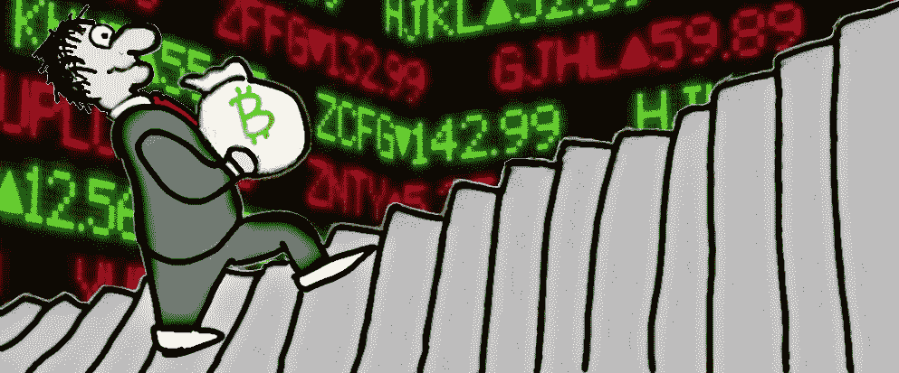

# 卡通日交易者的教训

> 原文：<https://medium.datadriveninvestor.com/how-to-grow-your-bankroll-day-trading-de461bf8f21c?source=collection_archive---------1----------------------->

## 如何增加交易风险资产的资金

解释股票、期权或加密货币交易的所有细微差别是多余的，因为每个交易者都有自己独特的风格。在下文中，我将强调我见过的那些声称自己是绿色的人的集体观点。

> *沃伦·巴菲特*是现代股票分析之父，他的成功来之不易，从 11 岁起，他就开始阅读百科全书。如果理解市场是一个游戏，他的名字肯定会出现在排行榜的首位。

巴菲特通过经常站在交易的赢家一边来积累财富。他是一个*算计*的人。

与比特币日间交易者相比，这是一种独特的交易者。不是每个人都喜欢自助餐。当他买进股票时，他希望长期持有，并改变他们的经营方式。

 [## 算法交易的机器学习|数据驱动的投资者

### 当你的一个朋友在脸书上传你的新海滩照，平台建议给你的脸加上标签，这是…

www.datadriveninvestor.com](https://www.datadriveninvestor.com/2019/01/30/machine-learning-for-stock-market-investing/) 

他的财务分析风格虽然很有价值，但不太适用于其他快节奏的交易风格，也不太关注公司本身的内在价值。

*日交易*只是持有一项资产几分钟，有时几天，而*摇摆交易*是持有投资组合的一部分几天到几个月。

市场最终会变成少数赢家和一大群输家，但因为人们在不同的时间框架内交易，所以只要你制定了策略，你就有机会。

> 你可以有比赢的交易更多的亏损交易，但仍然有利润。

## 不要使用太多的技术

有各种各样的工具可以用来交易，但事实是大多数工具告诉你已经发生的事情，而不是将要发生的事情。

你早期做出的这些推断将成为成为更聪明的交易者的基石。因此，不要去寻找成交量、均线、随机相对强弱指标、MACD、一目十行的神奇组合，或者识别艾略特波浪。

后退一步，先少做一点，因为交易者用来识别趋势的许多工具只是你面前数据的可视化。

所以交易的第一课是学习如何画趋势线，支撑线和阻力线。这只是你对价格行为的理解。

## 限制你的损失

当你开始交易时，你不要只是设置好，然后忘记一段时间，希望你回来时已经赚了钱。

你心里有一个时间框架，你觉得在这个时间框架内价格会做什么。如果没有，就在你认为可以接受的亏损处退出，以获得你期望的回报。

> 你不会在翻牌前将 80%的资金押在一对黑桃上，对吗？

每个人都有不同程度的可接受风险，尽早了解自己的风险是交易者成长的基础。只有非常喜欢冒险的人才能成功交易，这种观念是进入的障碍，事实上，大多数成功的交易者在他们进入的每一笔交易中都非常谨慎。

限价单和市价单的存在是有原因的。在交易开始和结束的时候，你不应该仅仅按照市场价格买入资产。如果你真的做了功课，你就会知道你想要的价格，然后等着买卖。

## 你的直觉可能是对的

如果你觉得交易太晚了，那就太晚了。

就这样吧，心血来潮的投资是人们停止交易的原因。当然，你可能见过或听说过非常幸运的人，但这些类型的交易通常是长期投资。他们并不像你想的那样经常冒险。

他们很可能是基于财务分析而不是技术分析做出这些决定的。所以要饿，不要傻。

## 开始纸上交易

这是非常合理的建议，新手通常不听。票据交易是使用假币交易股票或加密货币，许多平台都提供这种交易。

是的，学习一个新技巧并将其应用到你的策略中是令人兴奋的，但在你在真实市场中测试你的方法之前，它就像猜测一样。

另一种方法是简单地使用一个日志或者直接在像 [tradingview](https://tradingview.com) 这样的网站上输入你的想法，一旦你做出了你的分析，你可以在以后查看你的想法，看看它们是如何实现的。

Tradingview 也是一个和其他交易者交流的好地方，可以从他们的成功和错误中学习，但是要小心，因为你可以删除失败的想法。

这就是为什么建立自己的策略很重要。而不是为了从他们那里获得信号而加入付费社区。

虽然你可以加入这些类型的团体来学习，但是你不应该盲目跟随其他交易者。这是因为他们可能只是利用他们在社交媒体网络上的影响力来影响市场或更糟糕的虚假利润。

在交易中需要一剂健康的药剂。

## 记录你的损失

不言而喻，即使最好的人也会做不好的交易，但是如果你把它们写下来，并且跟踪你做的每一笔交易，即使 15 1%的损失也可以被对冲 15%的利润。

在一天结束的时候，如果你交易你一生的积蓄，你很可能会失去它，因为交易经常变成一种情绪体验。学会如何接受挫折，你将大大加快你走向成功的步伐。