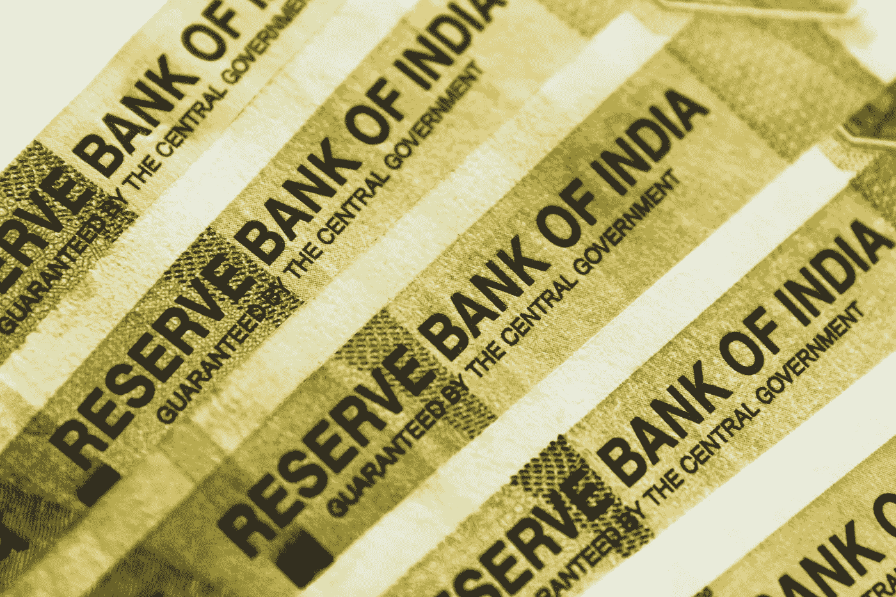
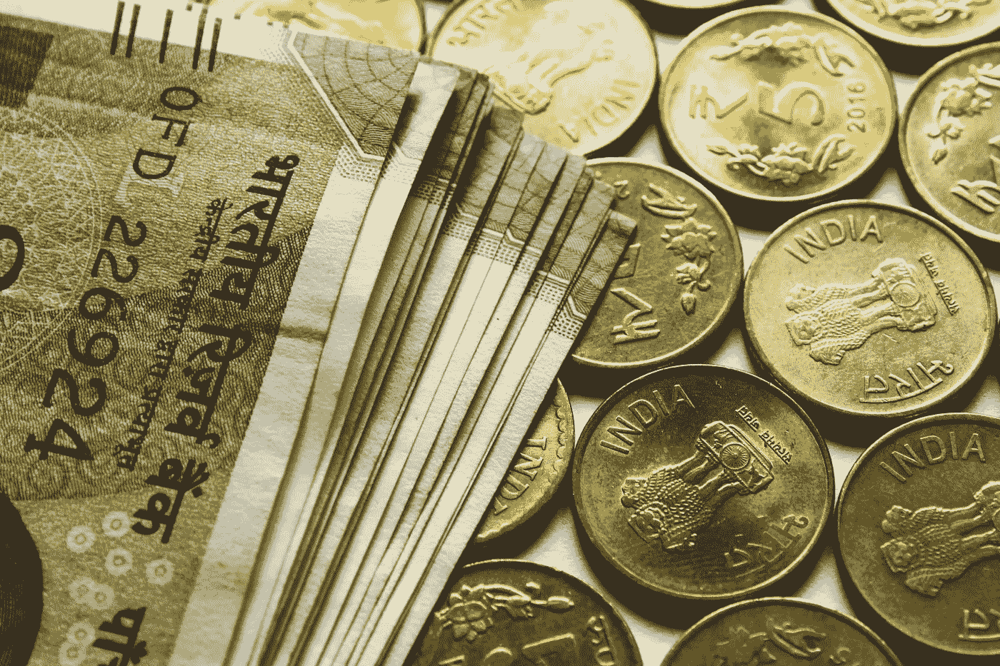

# 如何破解个人理财:改变成千上万人生活的实用技巧

> 原文：<https://medium.datadriveninvestor.com/how-to-hack-personal-finance-practical-tips-that-have-changed-thousands-of-lives-ab2b84426e4c?source=collection_archive---------10----------------------->

## 我们已经老了，累了，我们想休息，享受生活。怎么办？我给你带来了一些好消息。

## 很少有人想当一辈子佣兵。这是一个相当充分的愿望，因为身体每年都在老化，雇主不惜任何代价从我们身上挤出结果。

如果你知道如何表演，也没那么糟。但首先，你需要理解三个简单的想法:

*   迟早，我们都会死。(你不会永远活着，是吗？来吧，这很无聊。)
*   技能(收入、储蓄、投资)比金钱更重要。
*   富人的想法确实不同(是的，在这里 Infocygans 没有欺骗)。

记住这些谈话要点。如果你愿意，你甚至可以写下来。让我们从最有趣的开始。

# 谁是富人

如果一个人在一个工作月、一个季度或一年结束时拥有的钱大于零，他就已经被认为是富有的了。理想情况下，每个时期他都应该比前一个时期拥有更多。与此同时，一个人挣多少钱或从生意中赚多少钱并不重要——重要的是平衡的存在。

> 如果你在计算期间花的比赚的少，你就离财富更近了。这是一项非常重要的技能。

看看人们是如何赊购汽车、公寓和机器的。他们受到最多的信任，而且情况每年都在恶化。从这里开始,“贫穷”这一类别就可以撤销了。

Photo by [rupixen.com](https://unsplash.com/@rupixen?utm_source=unsplash&utm_medium=referral&utm_content=creditCopyText) on [Unsplash](https://unsplash.com/s/photos/finance?utm_source=unsplash&utm_medium=referral&utm_content=creditCopyText)

# 谁是穷人

> 穷人是在期末剩余的钱少于他们挣的钱的人。

T2:听说玛莎这个月有 3 万美元的薪水。在 joy 上，她给自己买了一件衣服，因为“你现在就想活下去。”然后她给了最烧钱的贷款，还给她的朋友 1000 美元，作为她第三个月的动力。我给孩子买了礼物，但是没有剩下食物，所以我不得不向我妈妈借。结果，在所有的贷款和借款中，玛莎在最糟糕的情况下结束了这个月。

 [## 外汇投资如何帮助偿还债务|数据驱动的投资者

### 外汇是对外汇市场的投资，不同国家的货币在外汇市场上进行兑换

www.datadriveninvestor.com](https://www.datadriveninvestor.com/2019/02/13/how-forex-investment-helps-to-repay-your-debts/) 

人人都爱清崎称这个过程为“老鼠赛跑”每个月的 5 号和 25 号人们来领工资，到了期末，就没有钱了。要么根本不剩，要么债务越来越多，那就更惨了。

“穷人”就是这样生活的。在此基础上，我们可以得出两个策略。

# “乞丐”策略

要改变目前的财务状况，你需要明白你现在用的是什么策略:“乞丐”还是“国王”？

**乞丐的第一个特点:花的比挣的多。**

这样的人永远不会富有，不管他挣多少钱。这些可能是令人印象深刻的数额。

例如，我个人认识一位女性，她通过出租公寓收入颇丰，仅在衣服上就花了 20 万美元。到了月底，她就零分或负分了。

令人惊讶的是，按照别人的标准，一个人可以拥有巨额收入，但同时却依然贫穷。

**乞丐的第二个特点是盲目的信仰。**

一个人认为，收入的多少与他给别人的结果无关，只与工作的多少有关。

许多人相信这样一个概念:“为了挣更多的钱，你需要更多的工作”——或者更糟糕的是——“花更多的时间在工作上。”

但实际上还有另一个原则:“为了赚更多的钱，你需要做更多的好事(满足最大需求/解决更多问题)。”

> 如果你花的比你挣的多，并且相信收入不取决于结果——你就处在乞丐的策略中。这两项需要尽快移除才能继续。

我想你脑子里已经有了一个问题:“嗯，作者写得很好，当然，他把乞丐描绘得很美，你不能否认。然后怎么办呢？“现在让我们来处理‘国王’策略/财富策略。

# 5 点财富策略

财富战略包括五个需要实施的要点。如果你至少在其中一个上得分，很可能会用“乞丐”策略中的一个物品来代替它。所以让我们从最重要的开始。

**严格的财务会计**
要想在体育运动中取得好成绩，他们需要固定资产。它和钱的原理是一样的。当你记录结果的时候，你可以看到你比昨天有多优越，你在哪里投入的资源最多。

从 Excel 或 Google 表格开始。但是你可以马上为自己选择合适的 app。例如，针对家庭会计的 oldskool 程序“1с:金钱”

然后你把每一张支票和所有的收入/支出都开到了那里。选择你打开招牌的那一天，分析资金流向。

**还有哪些财务会计项目:**

*   易金融。ru 是一个能够在云端保存记录的网站。它还有一个移动版本。
*   “Toshl Finance”是一款广受好评的理财规划应用。移动平台上最好的应用之一。但这还不确定。我们需要检查一下。
*   Coinkeeper 是一个相当古老的应用程序，但功能不断更新。有人设法将这些全部转移到“谷歌表格”，然而，不清楚为什么。
*   “Zen-mani”——一种财务会计服务，可以在银行卡上加载交易。
*   “松糕”是另一个名字很搞笑的 app。

> 重要！如果你用信用卡消费，所有的程序都需要把它标记为负关注。信用不是资产负债表，而是未来时期的资源。借贷不是一种平衡，如果你花掉它，它就是零或负的。那需要被记住。

Photo by [rupixen.com](https://unsplash.com/@rupixen?utm_source=unsplash&utm_medium=referral&utm_content=creditCopyText) on [Unsplash](https://unsplash.com/s/photos/rich?utm_source=unsplash&utm_medium=referral&utm_content=creditCopyText)

# 过去以金钱为代价的生活

也就是说，理想情况下，你在这个月花掉过去赚的钱。是的，开始的时候并不容易。我并不总是自己做。但是需要去寻找。

这项任务将有助于我上面提到的财务核算，以及节省 10%的收入和分配预算。

## 6 信封预算

你有收入来源。假设月薪是 50，000 美元。我们把那笔钱对半分了。25，000 美元是你赖以生存的钱，占总收入的 50%。这包括:食物、房租、社区、支付贷款等等——50%是你能在生活上花费的最大值，花得更少更好。

好吧，剩下的 50%花在生活上？剩余的 25，000 美元分配如下:

10% —储蓄:我们留出 5000 美元作为存款。今天，你会很容易发现银行存款的年利率为 5-7%。存款受国家保护，最高金额为 140 万美元。选择一种不去银行就不能在网上取款的存款方式。这将有助于避免鲁莽的投资和冲动的购买。

**10%——“玩具”要获得做某事的动力，你必须取悦自己。这就是为什么你把 10%的收入花在你喜欢的东西上。例如，在一个爱好上——钓鱼的新方法。旅行——巴厘岛之旅。送给亲人的礼物也包含在这一项中。**

**10% —投资。如果只是简单地保留储蓄，以后就需要投资来积累资本。这些是现金投资，旨在获取利润。最初，你将不得不研究投资工具，所以这需要时间和注意力。**

即使是小附件，工具也足够了。很自然的，所有的金字塔，“外汇”和“现金宝”立刻被扔进垃圾桶。首先，我建议在莫斯科交易所的网站(moex.com)上学习证券交易所。

10% —教育。年龄生活——年龄学习。优质教育对任何专家的成长都是必要的，因此 10%的收入被推迟到会议、书籍和培训产品上。

这是另一种类型的投资，只不过这次是投资本身。升级，向新的方向发展，如果你不知道从哪里开始，从英语开始。它是世界上回报最高的语言，也是“以后某一天”的领导者。

**10% —给予。许多人忘记了首先要给予，然后才是索取。不一定是钱。它可以是免费的表演或广播，在那里你造福人们。如果家庭需要，它可以帮助他们。**

你想知道它是如何工作的，开始把它送出去。花了时间和精力，用金钱来表示，产生了 10%收入。

为了方便预算，我在应用程序“Tinkoff Bank”中用名字开了累计账户:教育、投资、玩具等等。我把每笔收入的 10%放在里面。这很方便。在那里，我开了一个经纪账户，因为我自己刚刚开始研究投资。但是你可以在其他地方开户。比如 Sberbank 或者 Discovery。

> 也许在我们与你的交流中，会有一个问题:“如果我有很多贷款，但我还不能分配资源，怎么办？"

然后最好延期 10%，剩下的 90%用来生活和还债。目标是达到策略的第二点“靠过去的钱生活”

## 努力增加收入

这一条最重要的思想是“不要考虑如何赚更多，考虑如何给人们更多的价值。“当然，这些是你在工作中接触到的人。他们准备为更多的价值付出更多，所以有必要增加这个价值的成交量。

重要的是要知道一个人对你有什么价值，以及如何增加这种价值。你的项目或产品给你的客户带来了什么价值？如果你为一个组织工作，你能为它的发展做出什么贡献？你给管理者什么价值如何增加？

最重要的是，你如何确保人们看到并理解这个价值？只有到那时，他们才会开始付更多的钱。看似简单，但同时也很难。

## 致力于你的价值，而不是增加工作时间。仅仅理解这一原则就已经在收益方面产生了良好的效果。