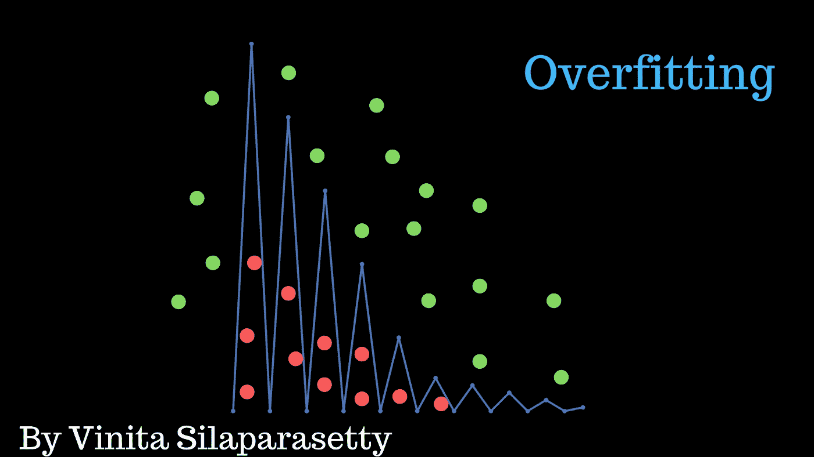
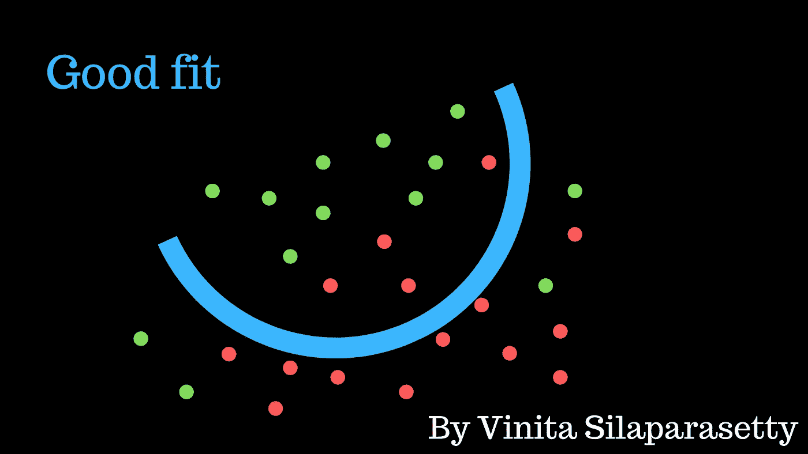
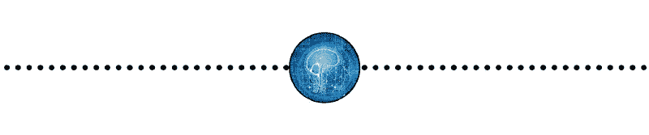

# 如何处理机器学习中的过拟合和欠拟合

> 原文：<https://medium.datadriveninvestor.com/how-to-handle-overfitting-and-underfitting-470a1f7389fe?source=collection_archive---------0----------------------->

## 训练机器学习模型时克服过拟合或欠拟合的技巧

## 偏差-方差权衡

偏差是我们模型的平均预测值和我们试图预测的正确值之间的差异。

方差是给定数据点或值的模型预测的可变性，它告诉我们数据的分布。

我们的目标是实现正确的偏差和方差，以获得最佳的预测。

## 什么是过度拟合？

> 过度拟合=低偏差+高方差

过度拟合是一种建模错误，当一个函数过于接近有限的数据点集时就会出现这种错误。这是具有过多训练点的过度复杂模型的结果。过度拟合的模型是不准确的，因为模型已经有效地记住了现有的数据点。

过度拟合模型的趋势线反映了它所训练的数据中的错误，而不是准确预测看不见的数据。

## 什么是不合身？

> 欠拟合=高偏差+低方差

欠拟合是一种建模错误，发生在函数与数据点拟合不够好时。这是一个简单模型的结果，其训练点数不足。拟合不足的模型是不准确的，因为趋势不能反映数据的真实情况。

欠拟合模型的图形没有覆盖足够的数据点。

> 适当拟合的模型显示平滑曲线或线性回归。

## 你如何解决过拟合和欠拟合的问题？

**处理过拟合:**

机器学习研究人员可以使用许多技术来减轻过度拟合。其中包括:

**交叉验证**

这是通过将数据集分为“测试”数据和“训练”数据来实现的。使用“train”集合构建模型。“测试”集用于及时验证。这样你就知道预期的输出是什么，你就可以很容易地判断你的模型的准确性。

**正规化**

这是一种回归形式，它将系数估计值调整或缩小到零。这种技术不鼓励学习更复杂的模型。

**提前停止**

当用迭代方法训练一个学习者时，你在最后一次迭代之前停止训练过程。这可以防止模型记忆数据集。

**修剪**

这种技术适用于决策树。

预修剪:在树完美地分类训练集之前，尽早停止“生长”树。

后期修剪:允许树“生长”，完美地分类训练集，然后后期修剪树。

**辍学**

这是一种在训练过程中忽略随机选择的神经元的技术。

**规则化权重。**

**处理欠配合:**

*   获取更多的训练数据。
*   增加模型中参数的大小或数量。
*   增加模型的复杂度。
*   增加训练时间，直到成本函数最小化。

使用这些技术，您应该能够改进您的模型，并纠正任何过度拟合或欠拟合的问题。

# 与我联系:

[脸书](https://www.facebook.com/VinitaSilaparasetty/)，[推特](https://twitter.com/officialvinita?lang=en)， [Quora](https://www.quora.com/profile/Vinita-Silaparasetty) ， [Youtube](https://www.youtube.com/channel/UCfEvToGFcbrPeWAQT8o6GUg) 和 [Linkedin](https://www.linkedin.com/in/vinita-silaparasetty/) 。 [#AI](http://www.trendwiseanalytics.com/)

点击此处订阅 DIntel [。](https://ddintel.datadriveninvestor.com/)

在这里加入我们的网络:[https://datadriveninvestor.com/collaborate](https://datadriveninvestor.com/collaborate)