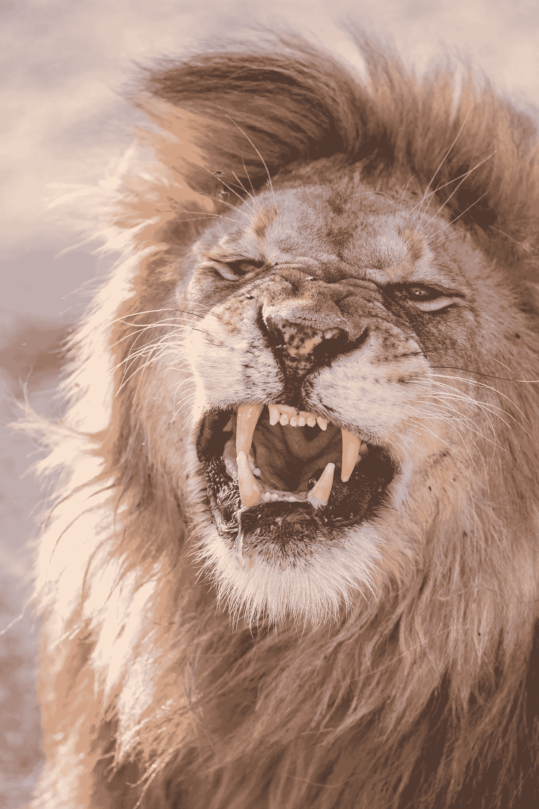

# 如何拥有狮子的姿态！

> 原文：<https://medium.datadriveninvestor.com/how-to-have-the-lion-attitude-121f7f96f85d?source=collection_archive---------0----------------------->

Photo by [jean wimmerlin](https://unsplash.com/photos/tmQn_4bmUHs?utm_source=unsplash&utm_medium=referral&utm_content=creditCopyText) on [Unsplash](https://unsplash.com/search/photos/roaring-lion-pictures?utm_source=unsplash&utm_medium=referral&utm_content=creditCopyText)

***勇气、力量、领导力、勇敢***

所有这些都是狮子态度的人的品质。

**狮子不怕做他想做的事。狮子不害怕走自己的方向，而其他人走不同的方向；狮子有足够的勇气去保卫自己的生命。他以自己喜欢的方式生活。**

> 你不想像狮子一样生活吗？难道你不想走自己的路，实现自己的目标吗？难道你不想去争取，去赢得你想要的吗？

> 然后改变你对生活的态度；改变你对自己的看法，因为你比你想象的要伟大得多！你有一颗狮子的心。每个人都可以有狮子的姿态。

或者你想和大多数人一样做一只绵羊。害怕突出的人；害怕追求梦想生活的人。一遇到障碍就放弃目标的人。

当通往梦想的道路变得艰难时，他们会找借口。

“这一定不是为了我”“如果不是他们告诉我的，如果他们没有嘲笑我，那我就成功了”

你精神脆弱，心软！告诉自己真相，因为在你这么做之前，你仍将是一个普通的抱怨者，就像你周围的大多数人一样。你的余生将会充满苦涩，因为你会后悔为什么你从未坚持自己的信仰。

> 非常成功的人知道后悔比失败更痛苦。即使第一次尝试成功的可能性很小，他们也愿意为他们想要实现的目标付出一切。他们宁愿尝试失败，也不愿根本不尝试。他们害怕后悔在有机会的时候没有做一些事情。

**羊跟着领导走。他们随波逐流，因为他们不知道自己要去哪里。可悲的是，很多时候他们被引入屠宰场，但仍然继续跟随，因为他们没有使用他们的头脑。**

这正是大多数人的情况。他们跟随大众而不是他们的内心。他们认为自己的思想不够好。他们害怕走不同的方向。你有祸了！你被带进了屠宰场！走自己的路，离开群体。

# **狮子姿态的人有勇气**

**态度是你所做的，你所想的，以及你对自己的感觉。态度就是生活中的一切，因为无论你是成功还是失败，一切都取决于态度。**

狮子态度的人很勇敢。他们有勇气坚持自己的信仰。当其他人都在走另一条路的时候，他们勇敢地走不同的方向。即使害怕，他们也愿意面对他们的对手和挑战。

他们不会逃跑。

> 如果你想拥有狮子的姿态，那么你必须相信自己。你必须改变你对自己的看法，从消极转为积极，因为你是自己最大的优势，也是自己最大的敌人。

## 有一句非洲谚语说:“如果你内心没有敌人，那么外部的对手就无法伤害你！”

拥有狮子的态度始于改变你对自己的看法。当你积极地看待自己时，它就会发展。当你不再相信别人告诉你的关于你的事情时，它会变得更强大。

使用肯定来让你积极地看待自己。

我对自己的自我概念也很差。我曾经相信别人对我的评价。有人说我是个蹩脚的作家。其他人告诉我，我永远不会成功，我相信他们。我开始认为我不够好，我的写作很糟糕。我想放弃有一天成为畅销书作家的梦想。

但是当我开始使用肯定的时候，我的写作有了很大的进步。我以更积极的方式看待自己。我现在有勇气写下我的想法，而不害怕失败，因为除非你尝试，否则你永远不会知道你有多好！

选择做狮子，因为你要做出选择！

如果你代表伟大，就选择做一头狮子。狮子态度的人得到他们想要的，因为他们足够勇敢去战斗。他们不怕承认他们的未来取决于他们今天所做的选择。

# **狮子姿态的人是领导力的象征**

狮子是领导其他动物的领袖。

> 狮子是领导者，因为他们展示了他们是谁。当它们追逐自己想要的东西时，它们不怕其他动物会做什么。他们不寻求尊重！他们需要尊重和权威，因为他们知道他们应该得到尊重。

一只羊跟随一个领导者，但是一只狮子领导。这是一个有勇气站起来为你的生活而战的问题。

**所有领导人的一个共同点是，他们都曾是追随者。唯一改变的是他们的态度。他们对生活的看法改变了。他们如何看待自己的改变。如果你想成为一名领导者，那么你必须改善你的自我形象。**

领导力始于自我发现。当你意识到你可以变得比现在更好时，它就开始了。当你有勇气捍卫自己的信念时，即使所有人都反对你，它也会成长。当你因为不喜欢你的朋友们正在做的事情而拒绝融入时，它就会上升！

> 跟着你的心走，因为只有你自己知道什么最适合你。当你是由不同的材料制成时，不要试图适应。用你的天赋让这个世界变得更美好。

狮子对他想要的东西很确定，在他的世界里没有“可能”。如果他决定为一个目标而努力，那么他会一直坚持下去，直到得到一个满意的结果。

不像绵羊，狮子不会等着被人摆布。他不会等待别人告诉他该做什么或不能做什么。他知道自己想要什么，并竭尽全力去追求。

如果你想拥有狮子的态度，那么你应该设定你的目标并努力实现它们。你不应该相信别人对你能力的评价，因为狮子会得到他想要的:你愿意做任何事情来实现你的梦想。

绵羊不确定自己想要什么，这就是为什么它跟着羊群走，却不知道它们要去哪里。

> 有绵羊心态的人没有方向，大部分时间都围着别人转。他们的自我信念建立在他们身边的人对他们的评价上。他们的能力有限。

拒绝像羊一样被拉着跋涉。拒绝从头剪到脚，直到一无所有。拒绝像大多数人一样，让世界和社会从头到脚地剪他们，直到他们失去独特的足迹！

如果你想像狮子一样引人注目，那么你必须拒绝像大多数人一样任人摆布。

# **总之**

狮子态度的人对自己有积极的想法。他相信他能完成他开始做的任何事情。他受到训练，即使障碍重重，也要坚持前进。

他不相信别人对他能力的评价，因为他知道他的潜能是无限的。

所以选择成为你现在这样的狮子吧！