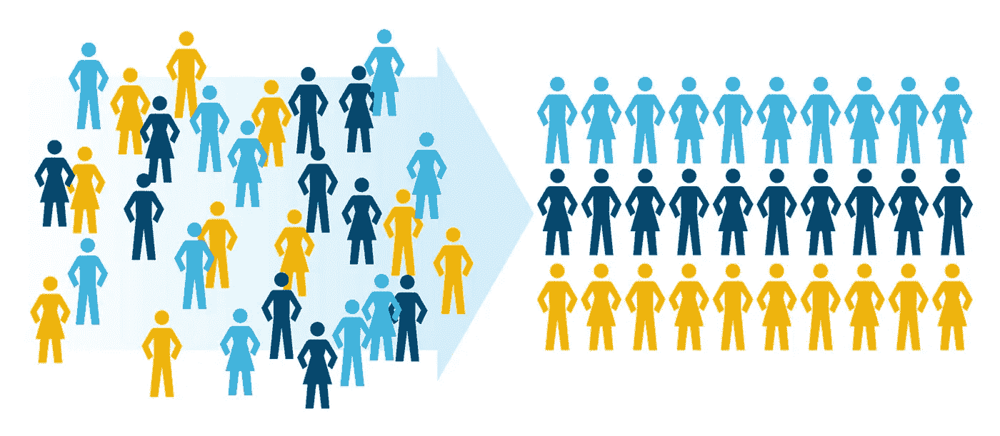
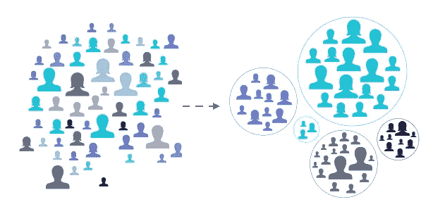

# 如何利用数据科学识别最佳客户？

> 原文：<https://medium.datadriveninvestor.com/how-to-identify-best-customers-using-data-science-6238d29214b0?source=collection_archive---------4----------------------->

让我们学习一下企业是如何找到他们的顶级客户的。

Business Analytics is important part of business strategy nowadays

商业分析是世界上许多企业最重要的部分。电子商务巨头、打车公司、基于产品或服务的公司正在广泛使用分析来为他们的业务生成 KPI。资源分配、供应/需求预测、功能的 A/B 测试等等，一切都是数据驱动的。

 [## 成为数据科学家所需的 8 项技能|数据驱动型投资者

### 数字吓不倒你？没有什么比一张漂亮的 excel 表更令人满意的了？你会说几种语言…

www.datadriveninvestor.com](https://www.datadriveninvestor.com/2019/02/07/8-skills-you-need-to-become-a-data-scientist/) 

客户分析也是商业分析的重要组成部分。在处理客户分析时，细分是其中的一个重要部分。公司正利用这一点来识别最好的、收入最高的、忠诚的和吸引人的客户。这样的客户对企业和他们的推广者来说绝对是一笔财富。这就是为什么商家要更好的为他们服务。

Customer Segmentation

客户细分是数据科学的常见用例之一。企业使用它来生成与客户相关的 KPI。

让我们深入了解一下。

因此，根据定义**客户细分**是:

*“将客户划分为适当的类别或细分市场的过程，这些类别或细分市场可用于向客户提供更好的服务，最终满足组织的业务目标”。*

# 谁是最好的客户？

为了更好地理解这一点，让我们调查一下谁可以成为企业的最佳客户。

Main target of Customer Segmentation is to divide people into different segments

做生意时，我们首先想到的是钱。因此，向企业支付更多费用的客户对他们来说更“亲”。在制定某些政策、给予促销或折扣等时，他们可能想把自己的利益放在心上。

第二类顾客是那家公司的常客。企业还需要与这些类型的客户保持一致。

第三个可以是最近开始与企业互动的客户。也许他们是新接触这种业务，因此，将他们转化为企业的忠实客户将是有益的。他们可能来自另一个竞争对手，对他们的服务不满意。所以，赢得顾客的心，并最终赢得他们的忠诚，这可能是一个加分点。

此外，那些更有可能推荐一家企业的客户对他们也很重要。

但是，在上面的讨论中有一点需要注意。

***那是什么意思？***

关键是，如果你为你的客户创造了“价值”，那么你就可以自动从你的客户那里获得上述所有类型的姿态。如果您的客户通过使用您的服务或产品获得价值，那么他们肯定会在您的服务或产品上花费更多。他们将成为更频繁的访问者。此外，他们会向你推荐更多的人，最终你的企业也会获得更多新客户的访问。

# 数据科学的使用:

Data Science helps us in analyzing the patterns in data which help us in segmentation

在数据科学中有很多方法可以找出最好的客户。让我们讨论一下其中最受欢迎的:

# i ) K 均值聚类:

通过 K-均值聚类，我们将客户分为不同的细分市场。这取决于数据集中存在的不同要素。您可以根据这些特征将客户从最忠诚到不太忠诚进行细分。

# ii ) RFM 矩阵法:

RFM 方法用于分析客户价值。在这种方法中，我们关注最近、频率和货币价值。新近意味着哪些客户最近加入，而频率意味着哪些客户是更频繁的访问者。货币价值指的是那些在给定业务的服务或产品上花费更多的顾客。

# iii ) CLV 分数:

客户终身价值是用于确定客户在整个业务或服务任期内将为您带来多少金钱利益的指标。一个简单的公式是:

***CLV =终生客户收入-终生客户成本***

# **四)NPS 评分:**

NPS 分数衡量客户体验并预测业务增长。它的完整形式是净推介值。实际上，这是一个从-100 到+100 的指数，衡量客户向他人推荐公司服务或产品的意愿。

# v)其他方法:

在工业中也有一些其他的方法被普遍采用。这些包括地理、人口、心理和情境细分。地理分割包括基于地理位置的分割。人口统计细分侧重于特定的年龄组、种族或具有特定背景的人。心理细分细分了那些喜欢创新的客户，以及描述他们对品牌或服务承诺的不同行为。情景细分侧重于根据不同的情况对客户进行细分。例如，在特定地区的季风季节，电子商务公司可以向居住在那里的人们展示雨衣、雨伞和其他相关物品。

# 结论:

在这篇文章中，我讨论了商业分析如何在公司工作的一些简短介绍。在接下来的文章中，我将讨论所有上述方法在 Python 中的实现。

因此，请继续关注，并在评论中告诉我你对客户分析的看法。