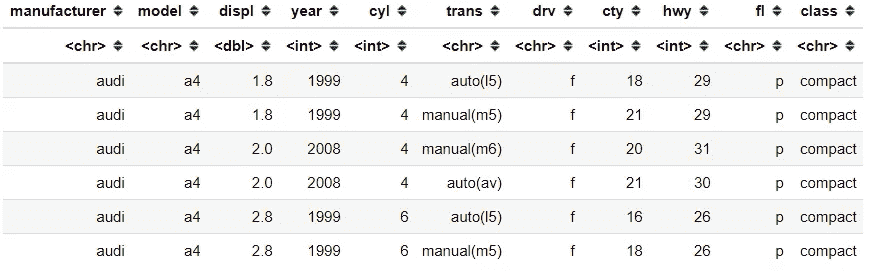
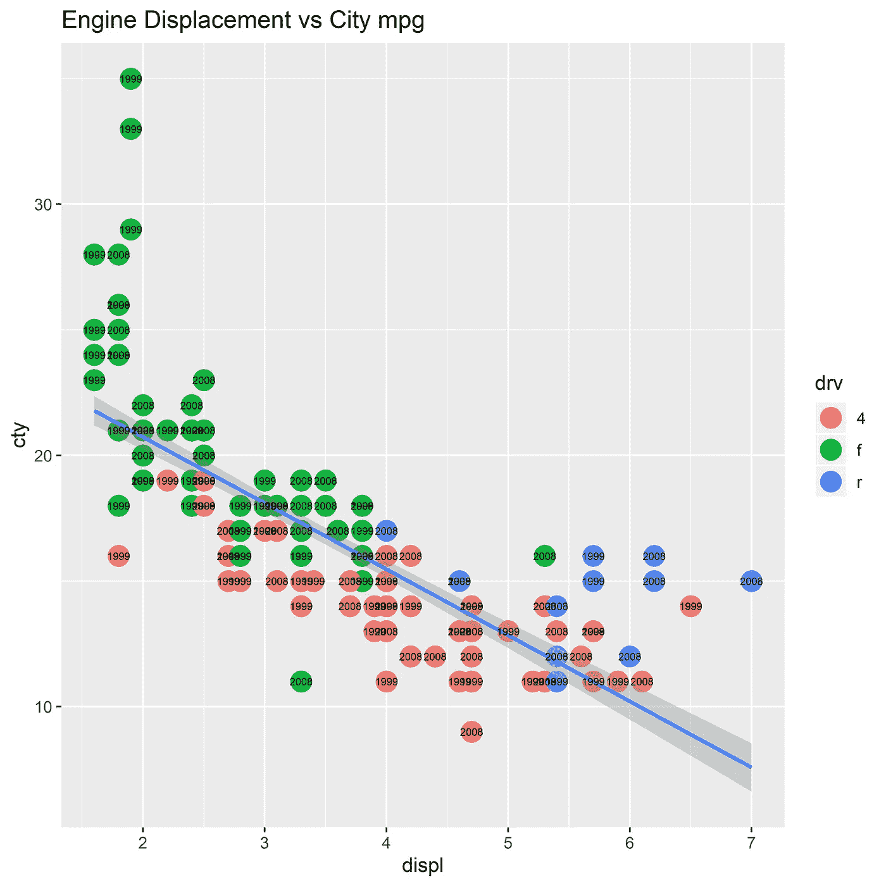
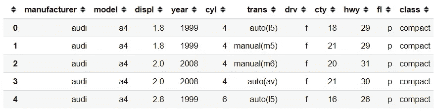
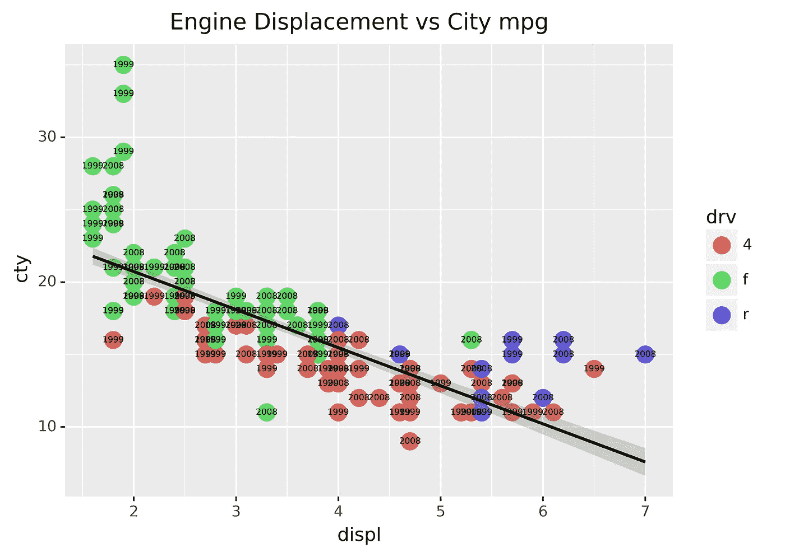

# 如何用 Python 实现 ggplot2

> 原文：<https://medium.datadriveninvestor.com/how-to-implement-ggplot2-in-python-82f2d0cec998?source=collection_archive---------3----------------------->

## 如果你想知道的话


Photo by [Kevin Ku](https://unsplash.com/@ikukevk?utm_source=medium&utm_medium=referral) on [Unsplash](https://unsplash.com?utm_source=medium&utm_medium=referral)

# R 中的可视化

在数据科学领域，我从来没有受到关于 Python vs R 的讨论的影响，为什么？因为我两个都用。就这么简单。

我喜欢 Python 的机器学习能力和它的多功能性，但如果它是关于可视化的；r 在我心中有着特殊的地位。

让我们举一个例子，使用 ggplot2 包创建一个简单但信息丰富的图。我会使用 ggplot2 包内部可用的 mpg 数据集。

```
#I would use the mpg dataset that available in the ggplot2 package
library(tidyverse)
mpg <- ggplot2::mpg
head(mpg)
```



从这个数据集中，假设我想要可视化 displ 特征(以升为单位的发动机排量)与 cty 特征(城市 mpg)之间的关系。然后我想通过 drv 特征(驱动轮)将它分开，每个点都将通过汽车年份进行注释。

```
#Creating the plotp1 <- ggplot(data = mpg) + 
geom_point(mapping = aes(x = displ, y = cty, color = drv), shape = 19, size = 5) + 
geom_smooth(mapping =aes(x = displ, y= cty), method = 'lm') + geom_text(mapping = aes(x =displ, y = cty, label = year), size = 2)+ ggtitle('Engine Displacement vs City mpg')p1
```



Example of plotting via ggplot2

这就是我喜欢在 r 中使用 ggplot2 包的原因。通过键入几行，我可以生成包含丰富信息的详细绘图层。

# Python 中的 ggplot2

然后我在想，Python 中有没有与 ggplot2 R 等效的包。我实际上得到了答案，有一个基于 ggplot2 包的用于可视化目的的模块包。它叫做 [plotnine](https://plotnine.readthedocs.io/en/stable/index.html) 。

[](https://www.datadriveninvestor.com/2019/02/07/8-skills-you-need-to-become-a-data-scientist/) [## 成为数据科学家所需的 8 项技能|数据驱动型投资者

### 数字吓不倒你？没有什么比一张漂亮的 excel 表更令人满意的了？你会说几种语言…

www.datadriveninvestor.com](https://www.datadriveninvestor.com/2019/02/07/8-skills-you-need-to-become-a-data-scientist/) 

使用 plotnine 类似于在 r 中使用 ggplot2。只需对这里和那里的线做一些调整，就会产生类似的图。让我举一个同样 mpg 数据集的例子。

```
#In case you have not install the package yetpip install plotnine#Importing the module and any function to be used.
import plotnine as pn
from plotnine import ggplot, geom_point, geom_smooth, geom_text, ggtitle, aes#similar to the ggplot2, plotnine also include few sample dataset. 
mpg = pn.data.mpg
mpg.head()
```



相同的数据集，这意味着我们可以通过 plotnine 生成类似的 ggplot2 图。

```
p1 = (ggplot(data = mpg) +
geom_point(mapping = aes(x = 'displ', y = 'cty', color = 'drv'), shape = 'o', size = 5) +
geom_smooth(mapping =aes(x = 'displ', y= 'cty'), method = 'lm') + 
geom_text(mapping = aes(x ='displ', y = 'cty', label = 'year'), size = 5)+ 
ggtitle('Engine Displacement vs City mpg'))
```



Example of plotting via plotnine

就像这样，如果我们通过 ggplot2 R 包进行生产，我们会获得几乎相同的绘图。我说几乎是因为默认参数有点不同，尽管如果我们需要的话可以很容易地改变它。

使用 plotnine，我们几乎不需要添加额外的细节。在 plotnine 中，我们需要在 ggplot 函数之前包含额外的括号，并在特性名称中包含额外的引号(如果您以前使用过 pandas，那就非常熟悉了)。

另一个区别只是 geom_point 形状需要遵循 matplotlib 包规则，而不是指定形状编号(之前在我的 R 行中，我用的是 shape = 19。在 Python 中，我使用 shape = 'o ')。

就是这样。如果你熟悉 R，想在 R 中带着同样的感觉学习 Pythonplotnine 是正确的选择。

希望有帮助！

# 如果你喜欢我的内容，并想获得更多关于数据或作为数据科学家的日常生活的深入知识，请考虑在这里订阅我的[时事通讯。](https://cornellius.substack.com/welcome)

> 如果您没有订阅为中等会员，请考虑通过[我的推荐](https://cornelliusyudhawijaya.medium.com/membership)订阅。