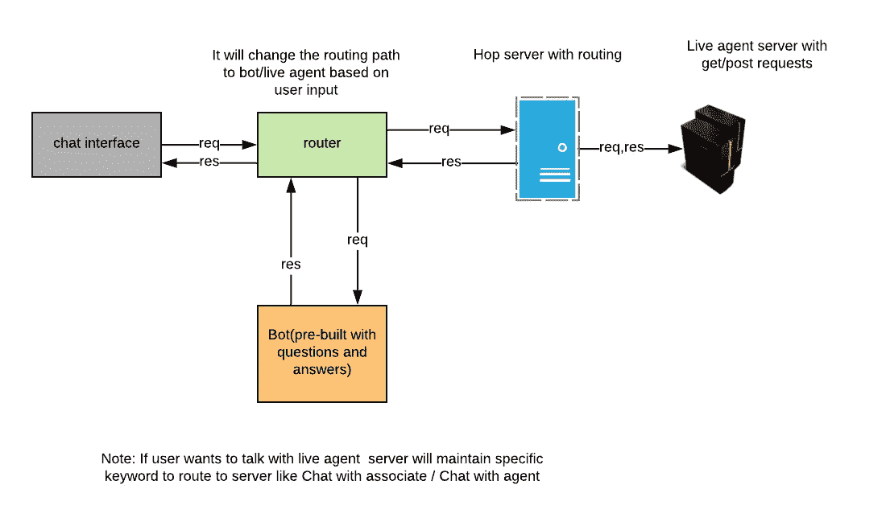

# 如何在客户支持聊天机器人中实现实时代理功能

> 原文：<https://medium.datadriveninvestor.com/how-to-implement-live-agent-feature-in-customer-support-chatbots-3b0b9a01ba19?source=collection_archive---------3----------------------->

聊天机器人是变革的创造者，他们定义了当今客户如何与品牌和组织建立联系。越来越多的公司已经将技术用于他们的重要客户。对于外行人来说，聊天机器人是一个通过聊天界面与客户互动的应用程序，并根据预编程的规则运行。

根据最近的研究，到 2020 年，80%的客户查询预计将由聊天机器人处理。

*来源:*[*https://www . IBM . com/blogs/Watson/2017/10/how-chatbots-reduce-customer-service-costs-by-30%/*](https://www.ibm.com/blogs/watson/2017/10/how-chatbots-reduce-customer-service-costs-by-30-percent/)

当与聊天机器人进行交互时，可能会出现客户提出问题，而这个问题超出了聊天机器人的知识范围或者不被聊天机器人理解的情况。在这种情况下，聊天机器人往往无法回答，导致客户对互动不满意。使用“实时代理”可以快速解决这些问题

**Live Agent:** 通常是一个与网站用户实时交流的人工代理。

实时聊天为客户提供了他们希望从支持团队获得的东西，即与真人实时互动。亚马逊是使用实时聊天作为客户支持方式的公司之一。

 [## 对话式营销是文字数据驱动的投资者

### 在购买之前，先谈一谈。这样做的营销人员将走在游戏的前面。这是保罗·因斯的前提…

www.datadriveninvestor.com](https://www.datadriveninvestor.com/2019/01/31/conversational-marketing-is-the-word/) 

Chatbot + Live Agent 对于那些支持团队规模有限，但希望从中获得最大回报和效率的人来说是一个极好的解决方案。当聊天机器人处理标准的查询时，一个实时代理会处理剩下的事情。

聊天机器人和实时代理之间的过渡必须是无缝的。如果用户不得不在屏幕之间转换，这将导致糟糕的用户体验。相反，对话必须在同一个聊天窗口中进行，并且控制应该从聊天机器人转移到实时代理，反之亦然。

**实时代理和聊天机器人的无缝集成**

下面是在同一个聊天窗口中无缝切换聊天机器人和实时代理的协议。

**聊天界面:**聊天界面是用户进行交互的渠道。

**路由器&触发:**简单来说，路由就是根据客户输入选择路径的过程。在上面的图中，路由器做同样的事情，如果一个客户键入一个词，像“与同事聊天”,它改变到跳跃服务器的路径，或者如果一个客户键入机器人可以回答的任何问题，它指向机器人。

**hop server:** 上图中，Hop Server(我们称之为 Hop Server 是因为服务器的主要工作只是将输入请求传递给 live agent server)在与 live agent 聊天时起着关键作用。因为这是一个双向服务，它从 chatbot 获取输入并发送到 live agent 服务器，以及从服务器发送到聊天界面。连接建立后，它不断地向 live agent 请求新消息发送到聊天界面。

**实时代理系统:**为了实现实时代理系统，我们有一些端点，比如 rest APIs。基于客户输入，hop 服务器向实时代理系统发送请求，以接收或发送代理消息到聊天界面。

当用户输入“与同事聊天”或“与代理聊天”(这是我们的触发器)时，路由器理解其意图，向 hop 服务器发送请求，处理请求(例如:get/post)，然后向 live agent 服务器发送请求。从现在开始，控制权从 bot 转移到了 live agent。

为了帮助理解这个概念，让我们看一下 Salesforce Service Cloud，其中有一个实时代理服务器。

Live Agent 服务器的行为是单向的。它不知道源的地址。源(在我们的例子中是 hop 服务器)必须 ping live 代理服务器以不断更新。

根据 Live Agent rest API，在 chatbot 和 Live Agent 服务器之间建立连接有四个调用。

1.  获取会话(系统/会话 Id)

2.聊天初始化(Chasitor/ChasitorInit)

3.新消息的 Ping Live 代理(系统/消息)

4.向实时代理发布消息(聊天者/聊天消息)

**获取会话:**与实时代理系统对话，这是建立会话以进一步接近的第一个呼叫。对于此调用，会传递类似“相似性”和“版本”的参数，Salesforce Live 代理服务器会返回“会话密钥”、“会话令牌”和“相似性令牌”作为响应。

网址:https://<salesforceliveagent>/chat/rest/System/session id</salesforceliveagent>

**Chat initialize:**Get session 调用的结果作为输入传递给该 API 调用，在执行 Get session 调用后，我们得到“key”、“token”和“affinity”参数作为响应。我们需要将这些参数传递给 Chat Initialise 方法，如果 Salesforce Live agent 服务器返回“OK ”,则用户和 Live agent 已连接并全部设置为开始聊天。

网址:https://<salesforceliveagent>/chat/rest/Chasitor/ChasitorInit</salesforceliveagent>

**Ping Live Agent for new messages:**要实现这个 API 调用，开发人员必须了解两个关键参数——“ack”和“pc”值，它们有多重要，以及在向 Live Agent 发送请求和从服务器接收响应时如何增加这些值。例如，连接建立后，对于第一个请求,' ack '和' pc '值分别为-1 和 0。

hop 服务器不断从实时代理中寻找新消息，直到会话过期，或者服务器遇到问题，或者客户明确停止对话。

网址:https://<salesforceliveagent>/聊天/休息/系统/消息</salesforceliveagent>

**向 live agent 发送消息:**该 API 调用将客户问题、序列、相似性令牌和会话密钥作为输入，向 Live agent 服务器发送消息。这里，sequence 是关键值，它必须为每个新的请求/消息递增。默认情况下，序列值为 1。

网址:https://<salesforceliveagent>/chat/rest/Chasitor/ChatMessage。</salesforceliveagent>

在开发过程中，应该了解整个实时代理交互协议规范。在 Salesforce live agent 的情况下，您应该知道“ack”和“pc”等术语以及何时增加值，还应该了解服务器响应。

**结论**

你一定注意到了，把 live agent 和 bot 合并成一个频道是一个复杂的过程。然而，这种努力是值得的，因为这个解决方案提供了出色的用户体验！

作者:Praveen Nagireddy， [SmartBots.ai](http://www.smartbots.ai) 的 AI 和应用程序开发人员

 [## Praveen Nagireddy -应用程序开发人员-智能机器人| LinkedIn

### 查看 Praveen Nagireddy 在全球最大的职业社区 LinkedIn 上的个人资料。Praveen 有一个工作列在…

www.linkedin.com](https://www.linkedin.com/in/praveen-nagireddy-744b80176/)