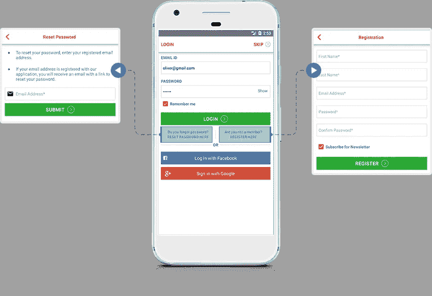
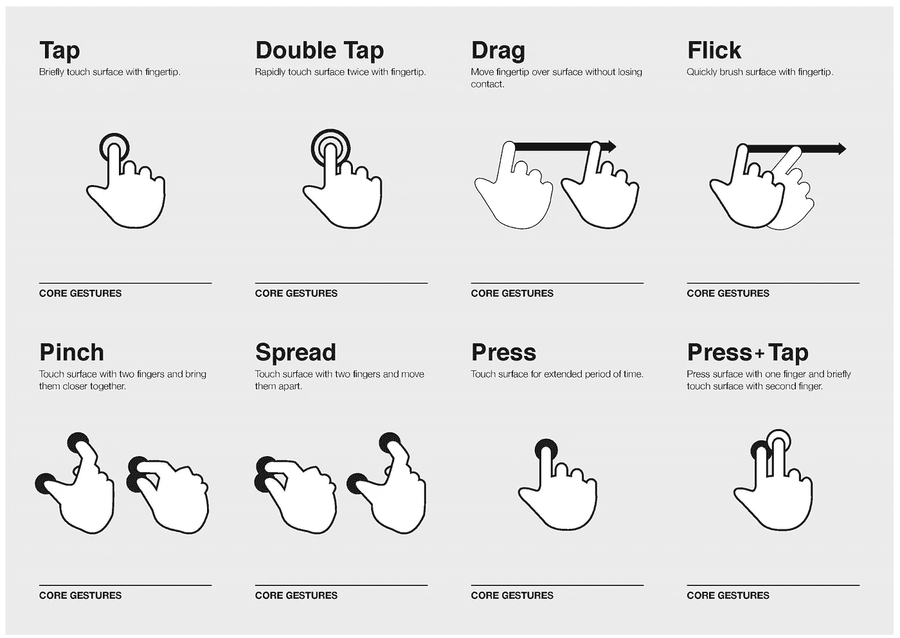
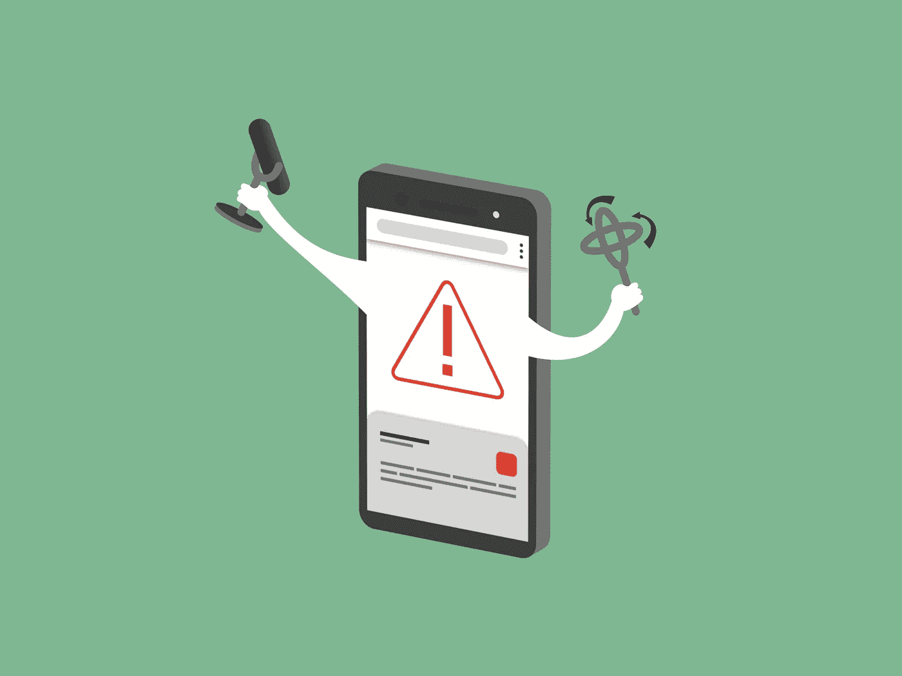

# 如何提高手机应用的 UX

> 原文：<https://medium.datadriveninvestor.com/how-to-improve-ux-for-your-mobile-app-1628731c3344?source=collection_archive---------1----------------------->

谷歌的一项早期研究显示，一个普通的手机用户安装了大约 36 个应用程序，但是每天只使用其中的 9 个。

为什么？

一个伟大的 UX 设计能给人留下长久的印象，这就是用户保留还是删除应用程序的区别。

 [## 2019 年移动应用开发之路——数据驱动投资者

### 任何在移动应用程序开发行业工作的人，无论他们是专注于在伦敦开发 iOS 应用程序还是…

www.datadriveninvestor.com](https://www.datadriveninvestor.com/2019/01/15/the-path-of-mobile-app-development-in-2019/) 

## 如何做出一个伟大的 UX 设计？

[UX 设计](https://www.interaction-design.org/literature/topics/ux-design)是一个动态的过程——尽可能为你的用户提供最好的体验，倾听他们对你的产品喜欢或不喜欢的反馈——这将帮助你继续迭代你的应用程序的每个发布版本。

你应该始终遵循[以用户为中心的设计](https://en.wikipedia.org/wiki/User-centered_design)，这样应用程序才能成长以适应用户的需求——记住，**一切都围绕最终用户**。

首先，[永远做一个简短的调查](http://zesium.com/how-to-choose-a-high-quality-mobile-app-company-to-increase-your-roi/)——探索类似的移动应用程序及其功能，但不要模仿，因为适用于一个移动应用程序的可能不适用于另一个。

相反，从你的竞争中学习，分析为什么某些趋势有效，而其他趋势无效。此外，将您的研究与您自己的品牌相结合，以服务于您的企业和您的用户的需求——重复、定制并从研究中学习，因为从长远来看，这将使您的 UX 更强大。

验证你的产品最常见的方法是和你的目标受众一起测试。首先开发一个[最小可行产品(MVP)](https://www.forbes.com/sites/quora/2018/02/27/what-is-a-minimum-viable-product-and-why-do-companies-need-them/#2eed92a9382c) 来弄清楚你的想法是否被核心用户所接受。

**提高移动应用 UX 的最佳方法是什么？**

## **适当的功能和速度**

[Google/SOASTA research](https://www.thinkwithgoogle.com/marketing-resources/data-measurement/mobile-page-speed-new-industry-benchmarks/) 指出，如果一个页面的加载时间超过 5 秒，那么反弹的概率会增加 90%！

如今众所周知的事实是[许多移动用户在使用一次后就放弃了一个应用程序](http://info.localytics.com/blog/25-of-users-abandon-apps-after-one-use),仅仅是因为它没有提供他们期望的用户体验。应用程序的功能必须帮助用户完成任务，这是下载你的应用程序的首要动机。

优先考虑对完成任务至关重要的核心功能，只提供相关功能，鼓励更多用户*使用你的手机应用。*

**

*Source: httpmobileapplicationdevelopment1.over-blog.com*

## ***高效入职和可用性***

*当用户试用你的移动应用程序，并在最初几个屏幕内遇到问题时，他们会不假思索地放弃该应用程序。*

*[Onboarding](https://uxplanet.org/5-classic-mobile-onboarding-examples-from-top-apps-of-2018-cdbeebcb2a38) 通过演示如何快速高效地做用户想做的事情，向用户展示你的应用的价值。提供良好的入职体验是吸引和留住用户的基石。我们已经知道[用户留存率在最初几周内下降](http://info.localytics.com/blog/mobile-apps-whats-a-good-retention-rate)，但是如果你包括高效入职，你可能会见证[应用用户留存率增加 50%](http://info.localytics.com/blog/mobile-apps-whats-a-good-retention-rate)。它不仅降低了放弃率，还可以帮助提高长期成功指标，如用户保留率和[用户终身价值](https://blog.hubspot.com/service/how-to-calculate-customer-lifetime-value)。*

*减少帐户创建/注册等步骤的数量。并包括多个注册选项(*脸书、谷歌、推特等*)。)因为用户看重简单。*

*你可以向用户展示哪些图标可以点击或滑动，考虑按钮和链接的大小，让用户轻松点击它们——只需在你的应用程序中保持与[手势一致，以优化可用性，并在按钮之间留出足够的空间，以防止任何选择错误。](https://www.justinmind.com/blog/tap-or-swipe-mobile-gestures-which-one-should-you-design-with/)*

## ***最小用户输入***

*尝试使用一些搜索策略，如条形码扫描或关键字搜索，来减少用户的搜索工作量。它直接引导用户找到他们想要的东西，这个过程的简单性可以显著提高转化率。*

*[用户输入](http://babich.biz/text-fields-in-mobile-app/) ( *输入信用卡号、注册数据、结账信息等*。)应该是最小的，因为用户可能会对较小的屏幕感到沮丧。为了避免高放弃率，请确保限制必填字段的数量，并且只包含必要的信息。*

*你也可以添加自动完成、快捷方式、拼写检查和[预测文本](https://en.wikipedia.org/wiki/Predictive_text)帮助来建立更好的用户体验。*

**

*Source: appjetty.com*

## ***怀孕调整***

*[手势化](http://static.lukew.com/TouchGestureGuide.pdf)包括用户在与你的应用程序交互时所做的动作，如滑动、点击、滚动或捏。了解用户的行为对手势化至关重要，因为这有助于理解他们熟悉的动作。*

*手势使用户能够通过触觉参与技术，一些[流行的手势](https://gauss-development.com/touch-gestures-mobile-apps/)是*点击、双击、滑动、拖动、挤压和按压*。*

*好的想法是让滑动手势远离难以触及的区域，提供足够的敲击空间等。，因为这些手势对智能手机用户来说只是 UX 蛋糕上的一颗樱桃。*

**

*Source: babich.com*

## ***简洁的战术 UI 设计***

*你的设计应该是简单易懂的——这意味着你的视觉设计能够简单快速地传达信息，一目了然。保持调色板、排版和其他元素的视觉一致性；从第一个元素到其他元素创建一个无缝的视觉流程，方便用户轻松完成他们的目标。*

*记住，与用户界面设计保持一致，保持简单——更少的动作、更深的颜色、更短的导航和有限的后台服务。*

*让不需要的功能远离用户，因为这可能会减慢他们实现目标的速度，从而导致他们放弃应用程序。*

> ***越简约越好**‘简约的手机应用程序设计永远是最好的选择。*

## ***安全和信任***

*一件令人讨厌的事情是，当用户下载应用程序，并在使用应用程序之前立即获得许可。*

*确保提供透明的[权限政策](https://www.nngroup.com/articles/permission-requests/)并允许你的用户控制他们的个人信息如何在移动应用程序中共享。*

*如果您清楚地概述了您的业务策略和实践，您的用户在接受权限时会更加安全。你可以包含你的[隐私条例](https://www.privacypolicies.com/blog/mobile-apps-privacy-policy/)的链接，或者展示[可信的安全徽章](https://monetizepros.com/ecommerce/5-trust-badges-that-can-increase-your-conversion-rate/)，尤其是如果你的用户信任你的应用程序来获取他们的个人和财务信息。*

**

*Source: [www.wired.com](http://www.wired.com)*

## ***清晰** [**CTA**](https://blog.hubspot.com/marketing/call-to-action-examples)*

*在为你的移动应用程序定义动作按钮时，你必须清楚地定义你的动作。操作按钮应该容易看到和接近，所以创建更大的按钮，并把它们放在适当的距离，以方便应用程序导航。*

*有时，简单的措辞也能起到一定的作用，例如，将*“请求出租车”*按钮替换为*“提交订单”*，这样可以更好地解释目的。*

## ***个性化 UX***

*个性化提供了独特的 UX。尽可能个性化，因为如果你让用户体验与用户偏好一致，他们就更有可能继续使用你的移动应用。*

*提醒一下，一定要将相关内容显示为无关内容，否则过多的[推送通知](https://buildfire.com/what-is-a-push-notification/)会产生反效果。*

*您可以使用[位置数据](https://www.nytimes.com/interactive/2018/12/10/business/location-data-privacy-apps.html)向某些用户建议特定的零售或电子商务交易，或者您可以在消息中包含用户的姓名——所有这些都是个性化的有效方式。*

**

## ***支持***

*用户通常需要帮助，以便为他们提供多种客户支持方式，如自助常见问题解答、实时支持、点击呼叫按钮或实时聊天。根据一项调查，[如今的客户更喜欢自助服务](https://www.zendesk.com/resources/searching-for-self-service/)而不是联系支持代理，因此为他们提供这样的功能是明智之举。*

*这将有助于用户快速达到他们的目标，作为回报，你会得到一个满意的客户，从而增加你的用户保留率。*

# ***最终想法***

*上述提示表明，你的应用程序必须对用户来说是直观的，具有视觉上令人愉悦的设计，并且可靠而不会耗尽电池。UX 设计本身应该是微妙的，自然的和整洁的——用户必须感受到明显的导航流程。*

> *简而言之，**必须**满足用户的需求，**不能**有缺陷。*

*失败的关键是试图取悦每个人，所以不要为任何人制作你的移动应用程序——为你的目标受众做研究，找到你的[独特价值主张](https://en.wikipedia.org/wiki/Unique_selling_proposition) (UVP)，因为这将帮助你建立一个忠实的用户群。*

*有效的 UX 是移动应用的基础——每个品牌都需要向其顾客、用户和客户提供积极的数字内容体验。*