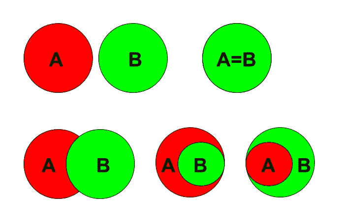

# 如何增加测试覆盖率

> 原文：<https://medium.datadriveninvestor.com/how-to-increase-test-coverage-46a41c75c010?source=collection_archive---------13----------------------->

Photo by [Krzysztof Niewolny](https://unsplash.com/photos/PVa4P_2iagM?utm_source=unsplash&utm_medium=referral&utm_content=creditCopyText) on [Unsplash](https://unsplash.com/collections/3518190/my-first-collection/04e68a7fe7e7fc2075c3f966aab0a64e?utm_source=unsplash&utm_medium=referral&utm_content=creditCopyText)

如今，大多数软件开发人员编写单元测试。一些人实践 TDD(测试驱动开发),一些人在实现功能后编写测试，一些人在代码失败后立即添加测试——有很多方法。然而，主要的问题仍然存在——如何增加测试覆盖率？

看起来在大多数情况下，你不能保证你的函数或方法在所有可能的情况下都被测试过，因为情况的数量是巨大的。然而，在某些情况下，您需要的实际测试数量并不像看起来那么多。

## 微不足道的例子

假设我们有一个函数，它有两个参数并返回一些东西。还假设该函数是纯函数(即，它没有副作用:它不改变任何状态，不打印任何东西，不在屏幕上画图，等等)。

你的任务是用单元测试覆盖它。如果我们不在功能描述中添加任何细节，这项任务将是不可能的。你必须知道这个函数要做什么。正确吗？还是有别的办法？

现在假设你的参数有类型。说它们是数字。现在你可以选择一些测试用例。你可能会遇到一些整数的情况，一些浮点数的情况，不要忘记 0 和 1(它们经常出现在拐角处)。然而，你的函数仍然可以在你的编程语言中对数字做任何可能做的事情，所以你必须理解它做什么才能测试它。

但是如果对类型的限制是关于参数*属性*，而不是它们的*内容*会怎么样呢？想象一下，关于你的函数参数，你唯一需要知道的就是它们必须是*可比的*(也就是说，对于每一对对象，应该清楚一个是小于、大于还是等于另一个)。一方面，有许多可比较的类型——数字、字符、字符串等。另一方面，没有多少可比较的项目，这使得测试我们的函数变得非常简单:您需要三对参数(a < b，a=b，a > b)，它们将保证任何具有这样一个签名的函数的 100%测试覆盖率。想一想——就**三种情况**！

## 更实际的例子

想象一下，你写一个交友 app。每个人都选择他或她喜欢的另一个人的个人资料，当人们选择对方时，他们会收到通知。现在，给定一个偏好列表，您需要获得一个匹配列表(即，选择彼此的人的配对)。有很多方法可以解决这个任务，但是无论你选择哪一种，很难确定如何正确地测试这样一个例程。让我们来看一个可能的解决方案:

1.  制作一个输入列表的副本，其中所有的偏好都是相反的(例如，如果一个输入列表包含一个有序对[Jane，Ben]，这意味着 Jane 喜欢 Ben，那么一个新列表将包含一个对[Ben，Jane])。
2.  查找两个列表的公共元素，或者两个集合的交集，包含相应列表的元素。
3.  将输出集或有序首选项转换为无序首选项集——对于一个匹配，两对([Jane，Ben]和[Ben，Jane])必须同时出现在两个列表中。

现在，这里的第一步是琐碎的，因为当您反转数据对时，您并不关心数据的类型。因此，应该只有两个测试:一个用于空列表(角落情况)，另一个用于有一些(2-3，你不需要很多)对的列表。

第三步也很简单，几乎不需要测试，因为您可能会使用语言库将一个集合转换为另一个集合(以及将列表和集合相互转换)。

这里唯一有意义的步骤是第二步(假设出于某种原因，您必须自己实现一个集合交集)。诀窍是一样的。您有两个带有一些(具体是什么并不重要)数据的集合作为输入(由于任务条件，元素是唯一的)，并得到一个新的集合作为输出。那么，这些集合关系的不同变体是什么呢？注意，我们甚至没有考虑函数的语义(交集)，我们只是分析参数。

两组的情况如下:

1.  两套都是空的。
2.  一套是空的，另一套不是。
3.  这些集合不是空的，并且没有公共元素。
4.  集合不是空的，并且是相同的。
5.  集合不是空的，一个集合是另一个集合的子集，并且集合的大小是不同的。
6.  这些集合具有非零数量的公共元素，并且不满足上述任何情况。

因此，两个集合有八个测试用例——不管期望函数做什么——加上第一步的两个用例，它只给我们**十个用例**来测试，以保证整个解决方案的测试覆盖率！

这种方法很酷的一点是，它还为相关方法编写了测试。比方说，接下来你需要得到一个偏好不是相互的人的列表。现在在第二步，你需要计算两个集合之间的对称差——测试用例已经准备好了！

## 结论

**你的函数越抽象，它的测试覆盖率就越好。**

果然，现实生活要复杂得多。你很难拥有没有副作用的漂亮功能。然而，在大多数情况下，上面描述的方法将帮助您处理大多数关键情况，并避免转储错误。