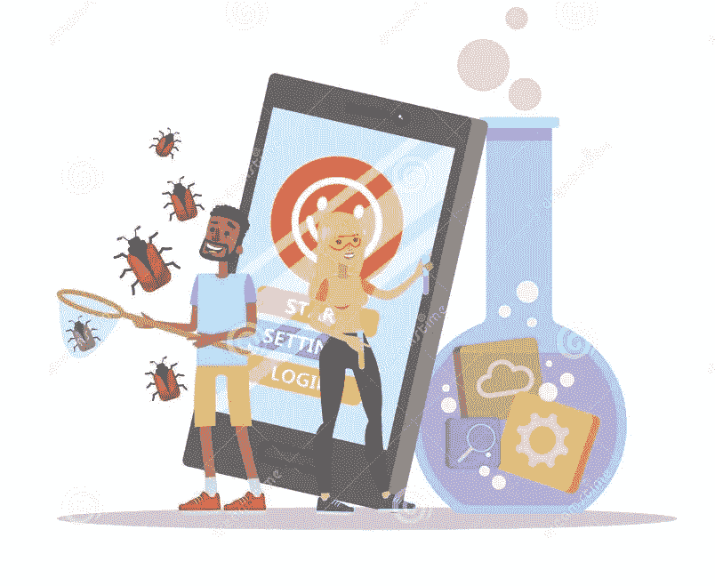
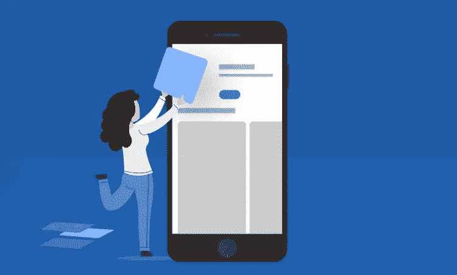

# 如何增加你的手机应用下载量

> 原文：<https://medium.datadriveninvestor.com/how-to-increase-your-mobile-app-downloads-4a9cb538efa2?source=collection_archive---------4----------------------->

Source: customercarebg.com

经过一个月又一个月的努力工作，紧张的最后期限和一路上无数次的修改，你的移动应用已经准备好上市了！

这太棒了，你在想:*耶，这是一个很好的开始！*

请注意，成功不会随着你的应用程序的发布而到来。

当你意识到你已经上传了你的移动应用程序，而你的下载率却没有你所希望的那么高时，真正的挑战就出现了。

你需要一些技巧来帮助你的应用程序变得更加可见，一些列出的技巧可能会帮助你提高应用程序的下载量。

## **麻生**

[ASO(应用商店优化)](https://www.rankmyapp.com/business/what-is-app-store-optimization-aso/)增加应用的可见性。怎么会？

ASO 使用应用标题、描述、关键词、截图等元素。，根据商店和当前趋势的最佳实践提高您的移动应用的可见性。

[改进你的 ASO](https://www.storemaven.com/aso-blog/) 可以让你获得更多的下载量，增加你的品牌曝光率，提高你的应用在应用商店的排名，甚至吸引更多的潜在用户试用你的应用。

让我们现实一点——当搜索一个特定的应用程序时，我们大多数人不会搜索超过第一页的内容。这就是你的目标——在 app store 中获得更高的排名，因为排名越高，越多的人能够找到你的应用。

如果你成功让用户下载你的应用，以下因素也会影响你的 ASO:

1.  应用下载数量
2.  正面评价
3.  流行关键词相关性
4.  [反向链接](https://moz.com/learn/seo/backlinks)
5.  App 开放号
6.  保留率
7.  收入记录

## **发布时的免费应用**

这是吸引新用户的有效策略，你的应用应该证明你保证的价值。

这一策略可以推动应用下载量的大幅增长。如果你的应用程序是在 App Store 上付费的，让它在一段时间内(一周或更长时间)免费，因为没有人喜欢为他们从未尝试过的东西付费。

此外，如果你有一个免费的应用程序，但带有付费的[应用程序内功能](https://www.techopedia.com/definition/27510/in-app-purchasing)，明智的做法是让你的应用程序在一段时间内“应用程序内功能免费”，直到用户使用你的应用程序并意识到其潜力。

Source: dreamstime.com

## **免崩溃应用**

如果你的用户下载了你的应用，并立即遇到问题，他们会留下不好的评论和意见，从而阻止未来的用户试用你的应用。

为了防止这种情况，你应该走主动路线，在发布应用程序之前对其进行严格的测试。

无论发生什么，记住你应该总是回应你的用户，无论是正面的还是负面的评论。

## **推荐和审核**

每当我想下载一个新的应用程序时，我首先会查看其他用户的评论，并试图了解应用程序可用性的整体情况。

如果你有大部分差评，或者根本没有差评或推荐，这是你转化率极低的一个即时信号。

推荐还可以展示你的应用程序的质量和可信度，这有助于增加你的下载量。如果你向他们提供某种激励，让他们把你的应用推荐给他们的朋友，你当前的用户就能成为你的[品牌大使](https://en.wikipedia.org/wiki/Brand_ambassador)。这些激励不一定是金钱上的，而是与应用相关的；例如，如果你有一个云存储应用程序，你可以提供免费存储，或者如果你有一个电子邮件查找工具，如果你的用户留下相关评论或将其推荐给他们的朋友，你可以提供额外的免费搜索次数。

## **在线内容**

品牌意识比你想象的要重要得多。

创建和维护强大的在线形象可以帮助你接触更多的人，并向新客户介绍你的应用。但是要注意将你的内容投放给正确的目标受众，因为不是所有的社交媒体渠道都被相同的年龄群体使用。此外，找时间回应你的追随者，请他们发表意见，因为这将向他们表明你关心他们的意见。

Source: storemaven.com

[内容](https://www.huffpost.com/entry/6-essential-ingredients-t_b_4919026)可能是有趣的博客、文章、赞助内容、视频、信息图表或网站或登录页面，您可以在其中放置最重要的核心内容——您的应用程序。展示关于你的应用程序的信息，以便用户可以了解更多信息并参与其中。在你的网络渠道上获得更多的访问者、关注者和参与度肯定会提高你的应用下载量。

围绕你的移动应用创造一种氛围，让人们谈论你的产品，因为这将吸引人们的注意力，并有望带来品牌知名度。

## **电子邮件营销**

这种很少使用的策略似乎在今天的社交媒体渠道中消失了。但是它可以和我上面提到的任何其他策略一样强大。随着 2018 年 38 亿人使用电子邮件，不抓住这种‘传统’营销方式的好处是不合理的。你可以成功地联系到你的潜在用户，根据目标受众的年龄，这种方法被证明是完全有效的。

您可以通过您的网站或其他渠道创建列表，并通过新鲜、时髦和可共享的内容赢得新的联系。

按照 DMA 的说法，[你在电子邮件营销上每花 1 美元，你就可以期望得到 32 美元的回报](https://dma.org.uk/uploads/misc/5a7c1de1ca4d7-marketer-email-tracking-report-2018_v2-final_5a7c1de1ca425.pdf)。一个精心策划的电子邮件营销策略可以让你赚钱，让你的业务稳步发展。

## **衡量、改进、再衡量**

为了能够完全掌握你的策略的有效性，你需要跟踪你的[指标](https://www.investopedia.com/terms/m/metrics.asp)。这些见解将帮助您改进未来的战略和活动。

我多次读到，要成为一名成功的成长型黑客，你需要利用你所拥有的，并不断衡量你的结果，以便调整你未来的尝试，确保更好的结果。你应该对你的移动应用程序应用同样的方法

如果你注意到你的用户放弃了你的应用，你应该试着找出原因。一旦你收集了像保留率，卸载率等信息。，您可以重新调整您的策略，专注于更主动的方法以获得最佳结果。

# **最终想法**

简单地启动你的移动应用不足以确保在当前市场上取得成功——无论它是否强大，是否提供独特的价值或工作是否完美。

今天，你需要更多来达到顶峰——你需要一些最佳的营销实践来让你的应用更接近用户，一旦你做到了这一点，请放心，你的移动应用将走向更大的下载量和更高的可见性。