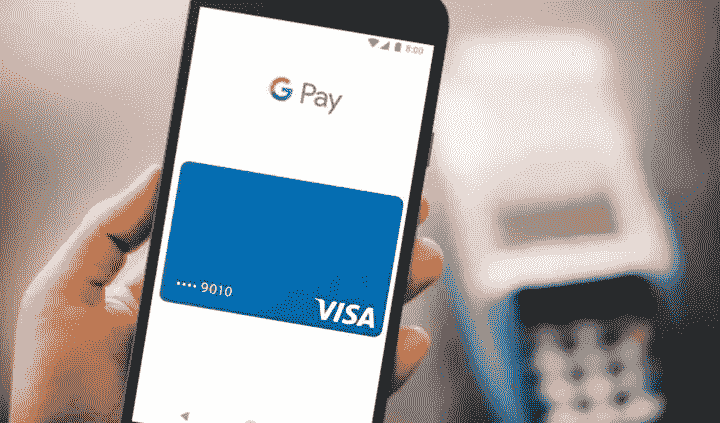
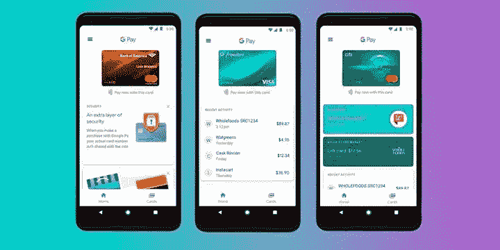

# 如何将 Google Pay 集成到您的 Android 应用程序中

> 原文：<https://medium.datadriveninvestor.com/how-to-integrate-google-pay-into-your-android-app-198285fac696?source=collection_archive---------6----------------------->

[](http://www.track.datadriveninvestor.com/1B9E)

越容易支付，就会有越多的人向你购买。这是任何数字业务的黄金法则。人们习惯于快速便捷的服务，而这正是 Google Pay 提供的

据 [*附云*](https://www.annexcloud.com/blog/31-shopping-cart-abandonment-statistics-for-2018/) 报道，一个企业因为不方便的付款程序，在结账时会失去所有潜在顾客的 80%。这是为什么呢？

[](https://www.datadriveninvestor.com/2019/01/15/the-path-of-mobile-app-development-in-2019/) [## 2019 年移动应用开发之路——数据驱动投资者

### 任何在移动应用程序开发行业工作的人，无论他们是专注于在伦敦开发 iOS 应用程序还是…

www.datadriveninvestor.com](https://www.datadriveninvestor.com/2019/01/15/the-path-of-mobile-app-development-in-2019/) 

*   顾客知道他们总能在别处找到类似的产品
*   客户不信任您的支付处理器，并担心暴露他们的个人数据
*   客户尚未使用您的首选支付方式，因此他们需要执行其他操作
*   不清晰的用户界面和糟糕的 UX 让用户在许多屏幕之间转换

这就是为什么在您将任何支付处理器集成到您的移动应用程序之前，您应该确保它是方便的，被您的目标受众使用，并且是安全的。Google Pay 是全球安卓用户的最佳选择之一，因为它可以在任何地方使用，而且安全可靠。



*Google Pay is one of the best payment processors for Android users*

谷歌在 2011 年的谷歌 I/O——一年一度的谷歌开发者大会上宣布推出自己的支付网关“谷歌钱包”。2015 年，谷歌为 Android 设备发布了一款名为 Android Pay 的独立应用。

Android Pay 的主要优势是能够在商店支付，并将所有积分卡保存在应用程序中。2018 年，谷歌将谷歌钱包和 Android Pay 合并为一款名为 Google Pay 的应用。

> *Airbnb 报告称，在将 Google Pay 整合到他们的移动应用程序后，在线支付增长了 11 倍*

在这篇文章中，我将讨论为什么 Google Pay 对你的业务有好处。然后我会给你提供一个将 Google Pay 集成到你的应用程序中的教程。

# 为什么 Google Pay 对企业有好处

使用 Google Pay，用户只需执行三个操作，就可以在你的移动应用中支付购物费用:

*   按下用谷歌支付按钮
*   选择支付卡
*   确认付款

此外，用户可以在他们的谷歌帐户中指定一种交付方式，以避免反复输入交付信息。

这种简单的支付方式在用户中非常受欢迎，截至 2018 年 9 月，该应用程序已经被下载了 1 亿次。Airbnb 报告称，在将 Google Pay 集成到他们的移动应用程序后，在线支付增加了 11 倍。



*Google Pay allows customers to keep all their cards in one place*

虽然 PayPal 和 Braintree 等许多其他支付服务对使用它们的服务收取费用，但 Google Pay 是免费的。这对企业来说非常好，因为他们每笔交易会损失 0.30 美元，再加上 PayPal 或 Braintree 交易总额的 3%。

在谷歌提供服务的国家，所有供应商都可以使用 Google Pay。你可以使用 Google Pay 在一个界面中连接几十个支付网关。集成起来也很容易:在我们的教程中自己看吧。

# Google Pay 集成教程

集成 Google Pay 需要做的第一件事是在项目中添加一个库。为此，请将此依赖项添加到 gradle 文件中:

```
implementation 'com.google.android.gms:play-services-wallet:$version'
```

这里，$version 是我们将要使用的库的版本。目前，16.0.1 是最新版本。如果需要更详细的设置库的说明，可以访问 Google 的开发者 [*文档*](https://developers.google.com/android/guides/setup) 。在那里，你还可以找到 Google Play 服务为程序员提供的库类型的信息。

让我们假设你已经有一个你想要出售的产品或服务。您现在需要做的就是设置购买流程。为此，让我们初始化一个支付客户端:

```
private PaymentsClient mPaymentsClient; mPaymentsClient = PaymentsUtil.createPaymentsClient(this); public static PaymentsClient createPaymentsClient(Activity activity) { Wallet.WalletOptions walletOptions =new Wallet.WalletOptions.Builder() .setEnvironment(Constants.PAYMENTS_ENVIRONMENT) .setTheme(WalletConstants.THEME_DARK) .build(); return Wallet.getPaymentsClient(activity, walletOptions); }
```

那么你应该选择一款 **WalletConstants。ENVIRONMENT_TEST** —你**支付的一种环境 _ENVIRONMENT** 。

下一步是检查你是否真的可以使用 Google Pay 购物。你可以这样做:

```
private void possiblyShowGooglePayButton() { final Optional isReadyToPayJson = PaymentsUtil.getIsReadyToPayRequest(); if (!isReadyToPayJson.isPresent()) { return; } IsReadyToPayRequest request = IsReadyToPayRequest .fromJson(isReadyToPayJson.get().toString()); if (request == null) { return; } Task task = mPaymentsClient.isReadyToPay(request); task.addOnCompleteListener(this,new OnCompleteListener() { @Override public void onComplete(@NonNull Task task) { if (task.isSuccessful()) { setGooglePayAvailable(task.getResult()); } else { Log.w("isReadyToPay failed", task.getException()); } } }); }
```

如果一切都处理正确，你就可以在你的结账屏幕上放一个**用谷歌支付**按钮。

```
private void setGooglePayButtonAvailable(boolean available) { if (available) { mGooglePayStatusText.setText("Payment status: Supported"); mGooglePayButton.setVisibility(View.VISIBLE); } else { mGooglePayStatusText.setText("Payment status: Not supported"); } }
```

设置其他支付网关和搜索可用的支付卡由一个名为**payments util . getisreadytopayrequest**的静态方法处理。要使其工作，您需要指定以下信息:

```
JSONObject().put("apiVersion", 2).put("apiVersionMinor", 0);
```

标记化的类型

```
JSONObject tokenizationSpecification = new JSONObject(); tokenizationSpecification.put("type", "PAYMENT_GATEWAY"); tokenizationSpecification.put( "parameters", new JSONObject() .put("gateway", "example") .put("gatewayMerchantId", "exampleMerchantId"));
```

您计划在应用中支持的支付网关

```
private static JSONArray getAllowedCardNetworks() { return new JSONArray() .put("AMEX") .put("DISCOVER") .put("JCB") .put("MASTERCARD") .put("VISA"); }
```

一种在 Google 档案中搜索支付卡和/或存储在用户设备上的令牌的方法

```
private static JSONArray getAllowedCardAuthMethods() { return new JSONArray() .put("PAN_ONLY") .put("CRYPTOGRAM_3DS"); }
```

支持的支付类型的标识符(目前，Google 只支持卡标识符。)

```
JSONObject cardPaymentMethod = new JSONObject(); cardPaymentMethod.put("type", "CARD");Payment processing
```

现在你已经完成了关于支付网关的所有设置，困难的部分就在前面:处理支付。

```
mGooglePayButton.setOnClickListener( new View.OnClickListener() { @Override public void onClick(View view) { requestPayment(view); } });
```

请记住，在处理支付时，Google Pay(像大多数其他支付网关一样)使用最小可能货币值。例如，如果您指定提取 **156358** ，这意味着您想要提取 **$1563.58** 。

下一步是从我们之前创建的实体构建一个 JSONObject:

```
public static Optional getPaymentDataRequest(String price) { try { JSONObject paymentDataRequest = PaymentsUtil.getBaseRequest(); paymentDataRequest.put( "allowedPaymentMethods", new JSONArray() .put(PaymentsUtil.getCardPaymentMethod())); paymentDataRequest.put( "transactionInfo", PaymentsUtil.getTransactionInfo(price)); paymentDataRequest.put( "merchantInfo", PaymentsUtil.getMerchantInfo()); paymentDataRequest.put( "shippingAddressParameters", shippingAddressParameters); return Optional.of(paymentDataRequest); } catch (JSONException e) { return Optional.empty(); } }
```

然后你需要设置交易。不要忘记指定货币:

```
private static JSONObject getTransactionInfo(String price) throws JSONException { JSONObject transactionInfo = new JSONObject(); transactionInfo.put("totalPrice", price); transactionInfo.put("totalPriceStatus", "FINAL"); transactionInfo.put("currencyCode", "USD"); return transactionInfo; }
```

在 **requestPayment** 方法中构建一个 **PaymentDataRequest** 对象。这个对象基本上是对所需支付信息的请求。要自动提出请求，请使用 **AutoResolveHelper** 。

```
public void requestPayment(View view) { mGooglePayButton.setClickable(false); String price = PaymentsUtil.microsToString(item.getPriceMicros()); Optional paymentDataRequestJson = PaymentsUtil.getPaymentDataRequest(15635); PaymentDataRequest request = PaymentDataRequest.fromJson(paymentDataRequestJson.get().toString()); AutoResolveHelper.resolveTask( mPaymentsClient.loadPaymentData(request), this, LOAD_PAYMENT_DATA_REQUEST_CODE); }
```

现在您已经形成了请求并发送了它。下一步是处理这个请求的结果:

```
public void onActivityResult(int requestCode, int resultCode, Intent data) { switch (requestCode) { case LOAD_PAYMENT_DATA_REQUEST_CODE: switch (resultCode) { case Activity.RESULT_OK: PaymentData paymentData = PaymentData.getFromIntent(data); handlePaymentSuccess(paymentData); break; case Activity.RESULT_CANCELED: break; case AutoResolveHelper.RESULT_ERROR: Status status = AutoResolveHelper.getStatusFromIntent(data); handleError(status.getStatusCode()); break; default: } mGooglePayButton.setClickable(true); break; } }
```

在这里，您可以将 Google Pay 与您的应用程序的业务逻辑联系起来。例如，您可以指定在屏幕上显示什么信息来感谢用户的购买或切换到下一个屏幕。

```
private void handlePaymentSuccess(PaymentData paymentData) { Toast.makeText(this, "Payment Success", Toast.LENGTH_LONG).show() } private void handleError(int statusCode) { Log.w("loadPaymentData failed", String.format("Error code: %d", statusCode)) }
```

就是这样！现在，您知道如何在 Google Pay 的帮助下从您的应用程序用户那里接收付款了。

# 最后的想法

Google Pay 是一种现代、安全、极其方便的支付服务，允许您一次集成许多支付处理器。它让你的用户支付更加方便，从而增加你的网上销售收入。

我们已经为您提供了将 Google Pay 集成到您的 Android 应用程序的详细说明。如果您对将此支付网关或任何其他支付网关集成到您的应用程序有任何疑问，请务必联系我们。

我们的工程师拥有为小型零售商开发企业级电子商务应用和移动应用的经验，并擅长将支付服务集成到销售的数字解决方案中。

*原载于 2019 年 5 月 31 日*[*【https://www.mobindustry.net】*](https://www.mobindustry.net/how-to-integrate-google-pay-into-your-android-app/)*。*