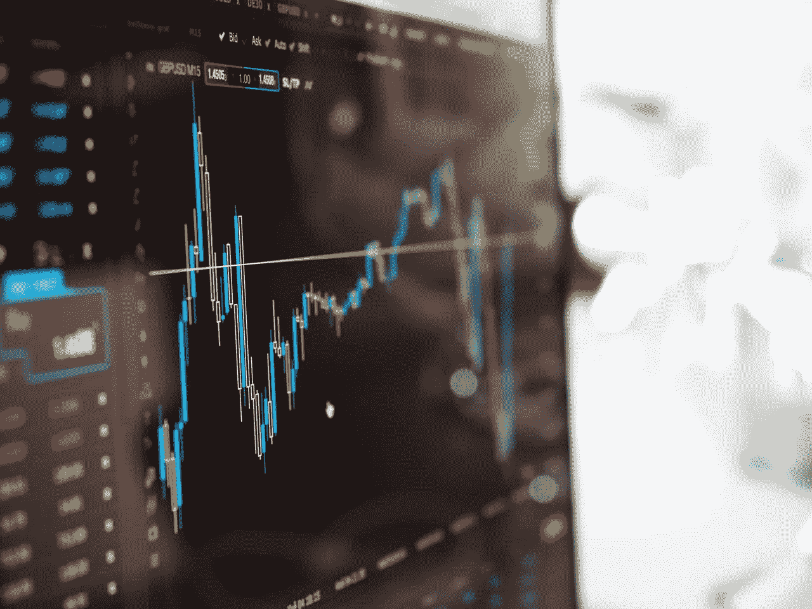

# 如何在动荡的市场中投资

> 原文：<https://medium.datadriveninvestor.com/how-to-invest-in-a-volatile-market-544cab171295?source=collection_archive---------26----------------------->

前一阵子我写了几篇文章，都是关于[长期投资](https://www.crgfinancialservices.com/blog/how-to-invest-for-the-long-term)和[承担太多风险](https://www.crgfinancialservices.com/blog/are-you-taking-on-too-much-investment-risk)。

也就是说，当前的环境让我思考。

处在我的位置上，我有一种独特的能力，可以看到每个人在人生的不同阶段是如何应对市场波动的。

我认为，许多年轻一代，那些自 2009 年以来一直在市场上参与牛市的人，将更难应对下一次大幅回调。

原因是他们只看到了上涨的市场。我认为最近的波动让他们担心，当这头牛不可避免地耗尽时，他们会在精神上和情感上挣扎。

我也见过中年人，在他们收入最好的时候，对最近的波动几乎没有反应。他们经历过两次或两次以上的严重下跌，知道下跌的东西总会反弹(考虑到市场的历史记录)。

出于同样的原因，我见过中年人在波动面前恐慌，因为他们见过两次或更多次大规模提款。这完全是视角和投资者心理的问题。

第三类人口是退休前年龄，通常在 55 岁到 65 岁之间。通常情况下，这些人需要更加保守。在游戏的这个阶段，你投资组合的首要目标应该是保本。

然而，如今人们的寿命更长了，所以如果你不介意变得更有侵略性，那也没什么。只要你知道风险。

这是我自己想弄明白的。在这个领域，有很多人比我聪明。尤其是在经济学方面。所以我试着做的是从不同的角度来看我们的发展方向，或者至少知道如何为不久的将来做计划。

我是以宏观经济学的形式来做这个的。我有一长串我在 Twitter 上关注的人，专门放在一边，这样我就可以看到他们在 Twitter 上发布的关于市场和经济的一切。我还订阅了几份关于宏观经济的电子邮件简讯，以获取更多观点。

这是我所看到的:

*   贸易吓坏了所有人——中美之间的贸易紧张局势吓坏了市场。人们不确定事情会如何发展，尤其是在那名中国高管在加拿大被捕之后。
*   利率是个问题——长期以来，美联储在利率活动方面一直非常透明。直到一周前，他们还认为 2019 年将加息四次，然后在 2020 年再加息几次。现在，有一个观望的方法，所以多少加息和加息的时间是未知的。
*   我们正处于牛市的第 10 年——从历史上看，我们每 6 到 8 年就会看到一次熊市。
*   住房市场已经连续几个季度放缓，这是用来衡量住房市场健康状况的指标(新建房屋、当前房屋销售等)。)放缓了。住房市场被视为经济的晴雨表。如果买房的人越来越少，通常意味着人们的支出越来越少。消费有利于经济增长。
*   波动性增加了——波动性有好有坏，取决于你问谁。无论你站在围栏的哪一边，都是正常的。然而，波动性之所以存在，是因为人们紧张，害怕退出他们的头寸，然后反向投资者/长期投资者/价值投资者趁“交易”可行时，突然出手买入。

结论

说了这么多，以下是我要说的。不管明天、下个月、明年市场如何，你都需要为你的目标做计划。如果你有时间，尽量不要担心每天的波动。

如果你有 20 年或更多的时间来投资，大多数情况下，你的投资轨迹会是向右上方。

弄清楚你的目标是什么，然后拼命去实现它。储蓄，投资，忽略噪音。

*如果您想了解更多关于设定和规划您的财务目标的信息，以及我们披露的信息，请访问*[*【www.crgfinancialservices.com】*](http://www.crgfinancialservices.com/)*。*