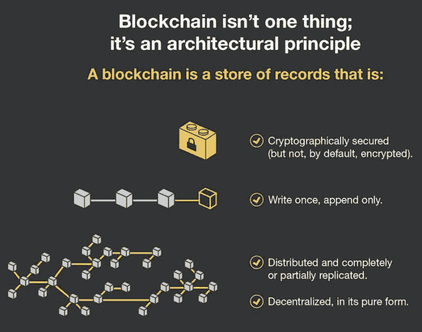

# 2018 年如何投资区块链技术创业公司

> 原文：<https://medium.datadriveninvestor.com/how-to-invest-in-blockchain-technology-startups-in-2018-a15d915d7c70?source=collection_archive---------0----------------------->

## ICO 的机遇、挑战和投资潜力

Photo by Christopher Machicoane-Hurtaud

作为区块链和加密货币领域的投资者和企业家，这是一个非常激动人心的时刻。投资者现在应该做好准备，迎接建立在区块链技术基础上的新一波独特创意。很少有投资机会比创业公司更令人兴奋。通过把你的钱投入到一个新的企业，你可以帮助一些新鲜和创新的东西出现在这个世界上。如果这种创新有回报，那么就有机会获得可观的利润。

随着区块链成为科技领域的一个更大部分，使用它的公司数量正在增长，投资区块链初创公司的机会也在增加。有许多不同的方法可以做到这一点。那么，你为什么想要投资区块链的初创企业呢？你如何着手去做呢？

# 什么是区块链

区块链是一个技术平台，其基本原则将去中心化的系统带到了互联网上，并改变了用户与数字世界的交互方式。这是一个分布式分类账系统，用于记录和验证数据。该描述的“分布式”部分是关键。区块链是在一个用户网络中运行的，而不是由单个中心点控制的。这加快了任何基于区块链的处理。区块链不是单一的技术。相反，它是一种架构，允许不同的用户进行交易，然后创建这些交易的不可更改的安全记录。

Forrester Research

# 为什么要投资区块链创业公司？

区块链是一项越来越重要的技术。从最初作为比特币的支柱开始，它已经适应了其他用途。从智能合同到产品跟踪再到照片编目，它正被各种各样的企业用于各种目的。因此，在区块链有更多的投资机会。

你可以轻松投资并不意味着你应该投资。毕竟，在次级抵押贷款公司倒闭之前，投资它们很容易。但是区块链的创业公司提供了那些银行无法提供的东西——一项日益重要的技术。

大企业刚刚开始关注区块链。随着这项技术进入日常使用，人们和组织将越来越依赖它。现在创建的创业公司可以看到巨大的增长，因为人们开始依靠他们。

投资初创企业总是高风险、高回报的。目前，区块链的潜在回报是巨大的。

# 做尽职调查

Photo by Bernard Hermant

如果你想投资区块链的初创企业，你该从哪里开始？

从尽职调查开始。你对你正在考虑的投资了解得越多，你就越能最小化风险和最大化回报。

要分析的最重要的一点是，一家初创公司是否为真正的需求提供了新的答案。它需要吸引顾客，如果其他人也提供同样的服务，那就不会发生。检查初创公司声称要解决的需求是否真的存在，并且它不仅仅是编造一个需求来证明它的工作。

研究产品的同时也要研究人。这些所谓的创新者创造了其他创业公司吗？怎么样了？他们有这个项目需要的经验证的技能和经验吗？他们学习过的地方和他们工作过的企业的声誉如何？

# 直接投资

投资区块链初创企业有多种方式。最直接的方法是购买许多提供的代币——它们的加密货币。

有两种不同类型的令牌，尽职调查包括识别这是哪一种。安全代币相当于传统股票，但更容易交易。公用事业代币让你获得创业公司特有的好处，通常是其商品或服务的折扣。只有当公用令牌的服务对你有价值时，你才能得到它们的全部好处，但是他可以让它们变得非常有用。例如，柯达硬币对那些储存照片并希望从照片中赚钱的人来说很好。安全令牌具有更普遍的价值。

除了做研究，你还需要在交易你想购买的货币的交易所建立一个加密货币钱包。有各种各样的交换，所以值得研究哪一个适合你。一旦你有了一个钱包，你就可以购买相关的货币，从而投资于这项业务。

# 交易所交易基金和间接投资

另一个选择是投资投资区块链初创企业的交易所交易基金(ETF)。有几只专注于区块链的基金，如 Reality Shares Nasdaq NEX gen Economy ETF，它们在传统交易所交易。

这是一种更传统、风险更低的投资方式，但如果你想专注于初创公司，这就不太好了。这些基金投资于整个区块链行业，从成熟的加密货币和计算公司以及新业务中赚钱。风险越低，意味着机会越少，对培育新业务的关注就越少。随着一些公司仅仅通过在名称中添加“区块链”一词来提升其股价，人们甚至不确定这些基金到底在区块链投资了多少。

# ICOs

投资区块链初创公司最令人兴奋的方式——风险和回报最高的方式——是首次公开募股(ico)。这是初创公司首次提供代币的地方，为早期投资者提供折扣价。这些折扣，以及在价格上涨前提前购买的机会意味着有更多的利润潜力。

这也是关于创业公司的信息最少的时候，因此投资失败的风险最大。彻底的研究更为重要。

与所有加密货币购买一样，你需要一个个人加密钱包和一个在交易所。其余程序将在 ICO 网站上解释。他们在找你的钱，所以会让投资变得尽可能容易。

# 最安全的投资方式

我们正在创造另一种投资区块链初创企业的方式。在我们的平台上，您可以投资风险降低的 ico。我们研究 ico，只支持最好的。其他投资人的研究和投资决策都体现在平台上。如果没有足够的人投资创业，那么投资就会被收回。高额利润的机会依然存在，投资新事物的确定性也依然存在。但是损失的危险降低了。

对区块链初创公司的投资是一个机会，既可以支持计算的未来，也可以从它的崛起中获利。但是，你投资了，这不是一个可以错过的机会。